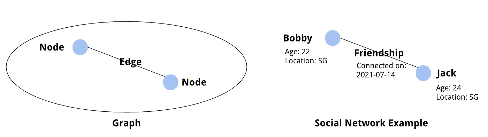
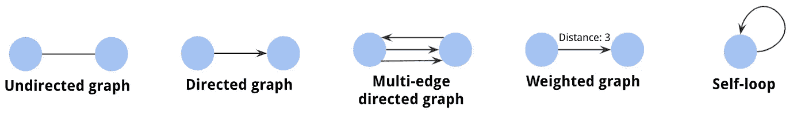

# 使用网络分析发现实体连接洞察(第 1 部分)

> 原文：<https://towardsdatascience.com/discovering-entity-connections-insights-using-network-analytics-e321e8b21318?source=collection_archive---------16----------------------->

[PCH . vector-www.freepik.com 创建的人向量](https://www.freepik.com/vectors/people)

## 了解网络分析以及如何最好地利用它

分析就是使用统计方法和计算工具来发现、解释和交流我们拥有的数据中的模式。大多数时候，您可以通过查看单个实体级别粒度的数据(例如，客户、采购、产品等)来获得洞察力。在其他一些时候，**当你以更高的视角**观察这些实体之间的相互联系(即客户 A 与哪些其他客户有联系)时，这可能会更有用。发现这种洞察力的一种常见技术是使用**网络或图形分析**。

# 网络分析简介

## 什么是网络分析？

引用 A.M. Chiesi 在《社会&行为科学国际百科全书[中的话，“网络分析(NA)是一套综合技术，用于**描述参与者之间的关系**并**分析这些关系循环出现的社会结构**。基本假设是，通过分析实体之间的关系，可以更好地解释社会现象。”](https://www.sciencedirect.com/referencework/9780080430768/international-encyclopedia-of-the-social-and-behavioral-sciences)

一些复杂的现象，如信息传播或社会互动，要求我们将问题作为一个系统来看待。网络允许我们**通过将它们表示为网络**来简化问题，然后使用某些工具来关注影响网络的某些关键实体。它可以用于多个不同领域的问题，从生物网络、交通网络、社会网络等等。

## 理论概念

在深入研究网络的使用和网络分析技术之前，我们需要首先理解网络的概念。

在数学中，网络通常被称为图。它是由 ***节点*** (或*顶点*或*点*)通过 ***边*** (也称*链接*)连接而成的数学结构。每个节点和边可以拥有描述其特征的特定属性。在一个社会网络中，节点可以是一个人，边可以是他们之间的关系(即友谊)。每个 person 节点可以有一些属性，比如人名、年龄或位置；而友谊边可以具有像第一次见面日期这样的属性。

示例图/网络(图片由作者提供)

为了进一步模拟真实世界的网络，几种图形可以丰富建模。

*   **无向图**。在上面的例子中，图表没有方向，因为鲍比和杰克之间的友谊关系是相互的。这种图叫做无向图。
*   **有向图**。我们也可以有一个图，其中的边有方向。这种图称为有向图或有向图。它可以用来建模节点之间的非交互，比如 Twitter 中的用户交互(A 跟随 B，但是 B 可能不跟随 A)。
*   **多边有向图**。在该图中，两个节点由具有特定方向的多条边连接。这可以用于对一个关系中的多个事务进行建模，比如公共汽车在 A 站和 B 站之间的行程。
*   **加权图**。图的边可以具有权重，可用于表示连接具有一些数字属性的结构，如从 A 点到 b 点的距离/成本/时间。
*   **自循环**。这些是连接到自身的节点。这可以用于社交媒体用户喜欢他/她的帖子的情况。

图表类型(图片由作者提供)

在现实世界的应用中，当图中的节点用于解释现实世界的主题和概念时，该图通常被称为网络。因此，在商业/产品分析领域，使用图表的分析通常被称为网络分析。

# 现实世界应用中的网络分析

## 为什么重要？

网络分析最适用于对实体之间的交互进行建模，并获得关注交互而非每个特定实体的见解。以下是网络分析的主要应用。

*   **中心性分析**。中心性用于标识网络或图形中的(最多)中心节点，表示该节点的**重要性级别**。为此，我们测量每个节点的[中心度](https://en.wikipedia.org/wiki/Centrality)(节点的总实际邻居与节点的总可能邻居的比率)并对它们进行排序。这对于需要找到关键实体的用例很有帮助，比如找出社交网络中有影响力的人，关键的交通枢纽等。
*   **连通性分析。**如果说在中心性分析中，我们关注的是找到关键节点，那么在连通性分析中，我们关注的是节点连接的具体特征，比如流入和流出边缘之间的比较。例如，在欺诈检测案例中，我们可以对用户帐户和交易进行建模，找到与已知欺诈用户相关的用户，并限制他们的交易以防止欺诈。
*   **社区分析**。使用图形，我们可以找到几个中心节点，并发现它们之间的组/社区。例如，在 Instagram 这样的社交网络中，除了他们的朋友或亲戚，人们还会关注那些引发他们兴趣的原因，如摄影、美食或时尚。映射这些联系可以提取它们之间的社区，这对于创建推荐很有用。
*   **路径分析。**路径分析主要用于加权图，可用于计算出在图的节点之间移动的所需路径。具体到获取最短路径，有一个专门的 [Djikstra 的算法](https://en.wikipedia.org/wiki/Dijkstra%27s_algorithm)来解决这个问题。路径分析可用于交通用例，如计算城市间的最短旅行时间，或用于供应链用例，如确定配送中心的位置。

## 它会有什么用呢？

网络分析中的上述分析技术可以应用于许多现实生活中的应用。下面是一些例子。

1.  **社交媒体营销**

随着社交媒体的使用越来越多，营销人员正在利用这个平台通过吸引社交媒体影响者来推广他们的品牌和产品。网络分析可以帮助有效地选择影响者。在网络分析中使用连接性和社区分析，我们可以找出影响者及其追随者，并随后找出其追随者与**的联系，确定具有影响力追随者的关键影响者**，以创造口碑连锁效应并获得对产品的更高印象。

**2。欺诈检测**

欺诈行为或产品滥用通常可以首先通过查看当前交易模式的**异常值**或与已知欺诈者的**接触**来识别。网络分析可以在这方面有所帮助，尤其是通过可视化实体的亲和力。例如，在电子商务产品上，我们可以通过可视化他们与已知欺诈用户的联系来识别欺诈用户(例如，使用相同的送货地址，使用相同的信用卡或银行账户)。利用这一点的另一种方法是查看商家与客户之间的互动，看他们之间是否有任何排他性(即一个商家仅由一个客户交易，而该客户仅在该商家交易多次)，他们利用电子商务平台的许多促销手段。

**3。建筑推荐系统**

通过网络中的社区分析，我们可以根据网络属性(即话题兴趣)识别用户群。假设紧密联系的用户具有相似的兴趣，用户喜欢的一个项目最有可能被紧密联系的用户喜欢，因此该项目可以被推荐给他们。这种方法被称为推荐引擎上的协同过滤。

# 结论

这概括了网络分析以及如何将其用于现实世界的应用。数学/计算概念可能已经有几个世纪的历史了，但它仍然**与现代实施相关，**从欺诈检测到营销改进和供应链建立。在一天结束的时候，这都是关于理解你的数据和**试验你如何将你的实体**映射成网络/图形格式。只有这种理解才能定义您使用网络分析进行分析的过程。