# 使用网络分析发现实体连接洞察(第 2 部分)

> 原文：<https://towardsdatascience.com/discovering-entity-connections-insights-using-network-analytics-part-2-d445751413b3?source=collection_archive---------20----------------------->

## 将关系数据转换为图形，使用 NetworkX 构建可视化

我在之前的文章中已经分享了网络分析的概念和可用性。这是一项用于**分析实体之间关系的伟大技术**，并且可以用于对欺诈检测、营销改进的社会影响和供应链设置等一些复杂问题进行建模。

在这篇文章中，我将关注如何**将这些概念**应用到实际的数据集，并从中发现洞见。我将分享将你的关系数据转换成图表格式的步骤，将它可视化，并最终探索它。具体到图形可视化，我将使用 [NetworkX](https://networkx.org/) ，这是一个 Python 包，专门用于创建、操作和研究复杂网络的结构、动态和功能。

这个分析中使用的代码可以在[这个 GitHub 库](https://github.com/oliviatan29/network_analysis)中找到。

# **1。预分析**

## 1.1 问题陈述

与任何类型的数据分析一样，您首先要定义分析目标，您想要回答什么问题，或者您想要解决什么问题。在这篇分析中，我将探索印尼菜肴中各种配料的联系。

在印度尼西亚众多的 T21 美食中，我很想知道:

> 印尼菜的关键配料/成分是什么？
> 
> 哪些配料组合在一起效果很好(在许多菜肴中一起使用)？


[拜克达令](https://unsplash.com/@baiqdaling?utm_source=medium&utm_medium=referral)在 [Unsplash](https://unsplash.com?utm_source=medium&utm_medium=referral) 上拍照

## 1.2 数据准备

一旦问题清楚了，我就继续进行数据收集过程。为了回答上面的问题，我需要一个印度尼西亚菜肴及其所有配料的数据集。原始数据集是从 [**维基数据**](https://www.wikidata.org/wiki/Wikidata:Main_Page) [**查询服务**](https://query.wikidata.org/) 中检索的，针对原产地为[印尼](https://commons.wikimedia.org/wiki/Category:Indonesia)的[食品](https://commons.wikimedia.org/wiki/Category:Food)的所有实例。

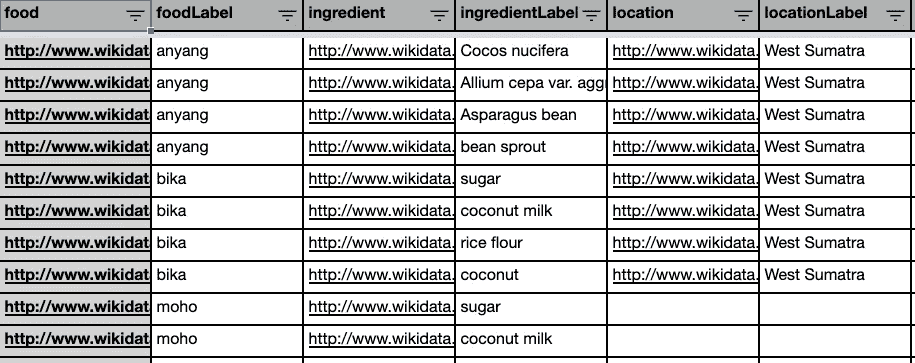

从维基数据中检索到的表格(图片来自作者)

我做了一些**数据清理**来(1)转换具有科学名称的成分，以及(2)规范化类似的项目名称，如【矿泉水、饮用水和水】，因为它们指的是同一项目。我还做了一些**数据丰富**来分类配料项目，如水果、蔬菜、调味料、香料、碳水化合物、坚果、奶制品和鸡蛋、动物和植物蛋白。

# 2.转换数据

现在来看这篇文章的重点，即将我们上面收集的关系数据转换成图形/网络格式。

## 2.1 确定要建模的连接

在进入转换代码之前，首先我们需要确定图中要建模的连接。

> 网络分析建模需要识别的关键点:(1)实体**,( 2)实体间的**连接**,( 3)图类型,( 4)连接的**属性**(如果有的话)。**

**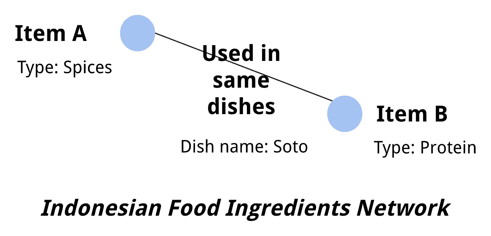**

**要建模的连接的图示(图片来自作者)**

**在本例中，**实体是一个项目配料**，要建模的**连接**是印尼菜肴中的**事件。这些实体具有 item 类型的属性，连接具有绑定它们的 dish 名称的属性。这里的图类型是一个 [**无向图**](https://mathinsight.org/definition/undirected_graph) ，因为 A 项和 B 项之间的关系是相互的，没有发生联系的方向。****

## **2.2 创建连接列表**

**现在，建模时间！**

**首先，我**列出了所有的连接**(菜名)和要连接的实体(配料项目)，每个都在一条记录下。配料项目在这里由空格字符分隔。**

**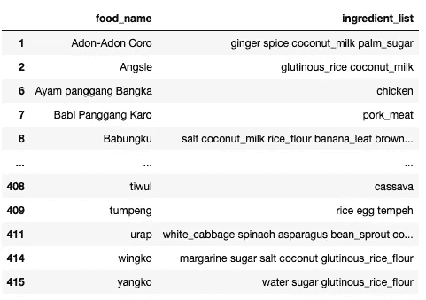**

**连接及其实体(图片来自作者)**

**然后，我收集了列表中所有项目之间的**共现，并以矩阵形式表示出来。它的工作方式是，对于每个`food_name`，我遍历相关的`ingredient_list`，并以矩阵格式列出它们的共现。****

**所以对于“阿顿-阿顿科罗”，我创建了{生姜和香料}、{生姜和椰奶}、{生姜和棕榈糖}、{香料和椰奶}、{香料和棕榈糖}、{椰奶和棕榈糖}之间的联系。对数据框中的所有食物/菜肴名称都这样做。对于现有项目之间的任何附加连接，该值将递增到矩阵中。**

**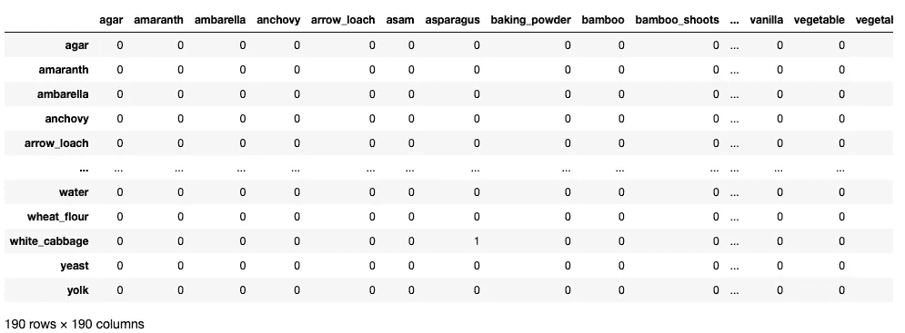**

**实体连接矩阵(图片来自作者)**

**之后我把矩阵总结成了更简单的表格格式。在该表中，**每一行代表我们拥有的每一条边**，而**代表相关的权重**，在本例中，权重是配料对同时出现的次数。该边填充了一个连接了的**节点元组，在本例中是项目配料。****

**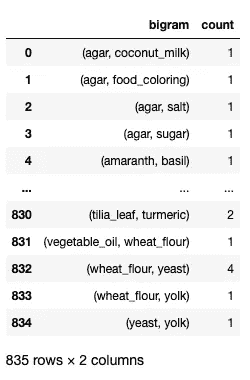**

**最终边缘列表和权重(图片来自作者)**

# **3.可视化和探索网络**

**网络分析的优势在于图形的可视化，可用于轻松发现项目之间的关系。在这个分析中，我使用了 [NetworkX](https://networkx.org/) 包来创建、可视化和分析网络。**

## **3.1 创建图表**

**与任何数据可视化一样，您需要仔细选择要可视化的数据点。*可视化中有太多的数据会让你难以专注于关键的洞察*。对于这个分析，我试图找到印度尼西亚菜肴的关键成分，因此我只关注上面的 100 个边缘。**

```
import networkx as nx# Create dictionary of edges and their weights
d = df_compiled.head(100).set_index(‘bigram’).T.to_dict(‘records’)# Create network plot 
G = nx.Graph()# Create connections between nodes
for k, v in d[0].items():
 G.add_edge(k[0], k[1], weight=(v * 10))
```

**下面是用来给网络添加边的字典`d`的截图。**

**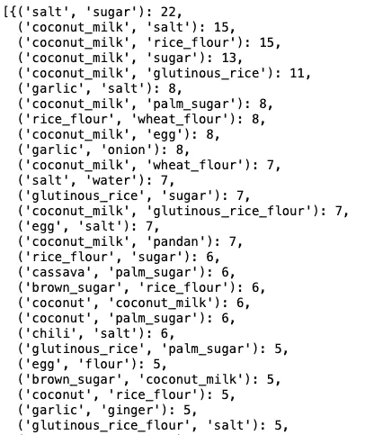**

**用于在 NetworkX 中向图中添加边的字典(图片来自作者)**

## **3.2 形象化图表**

**最后，可视化图表！**

**NetworkX 有多个[绘图功能](https://networkx.org/documentation/stable/reference/drawing.html)，可以根据分析需要使用。在这个分析中，我使用的是 NetworkX 的 [**弹簧布局**](https://networkx.org/documentation/stable/reference/generated/networkx.drawing.layout.spring_layout.html) 。spring 布局使用 [Fruchterman-Reingold 力定向算法](https://en.wikipedia.org/wiki/Force-directed_graph_drawing)在图中定位节点，通俗地说就是 ***排列节点，使边具有相似的长度和最小交叉边*** ，使其在视觉上更令人愉悦。**

**其他一些布局类型包括 ***随机布局*** (节点在单位正方形内随机均匀定位) ***圆形布局*** (节点在一个圆上) ***二分布局*** (节点在两条直线上) ***光谱布局*** (节点使用图的拉普拉斯特征向量定位)。其他绘图功能可以在这里[探索。](https://networkx.org/documentation/stable/reference/drawing.html)**

**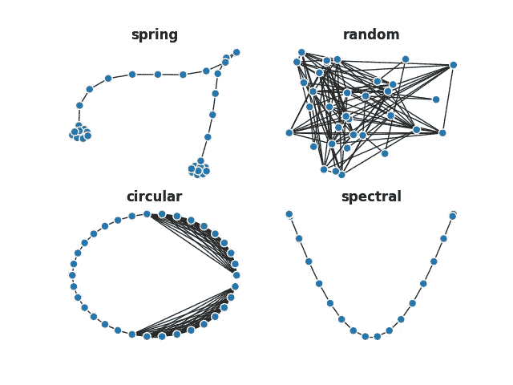**

**NetworkX 中的可视化布局示例(*来源:NetworkX 文档*[*https://networkx.org/grave/latest/gallery/plot_layout.html*](https://networkx.org/grave/latest/gallery/plot_layout.html))**

**底层的 NetworkX 可视化使用 Matplotlib，因此我们可以使用 Matplotlib 函数来定义图表的图形大小并显示可视化。下面是 NetworkX 简单可视化的示例代码。**

```
fig, ax = plt.subplots(figsize=(16, 12))pos = nx.spring_layout(G, k=2)# Plot networks
nx.draw_networkx(G, pos,
                 font_size=8,
                 width=3,
                 edge_color='grey',
                 node_color='#00b4d9',
                 with_labels = True,
                 ax=ax)plt.show()
```

**现在我们得到了我们的第一次可视化！**

**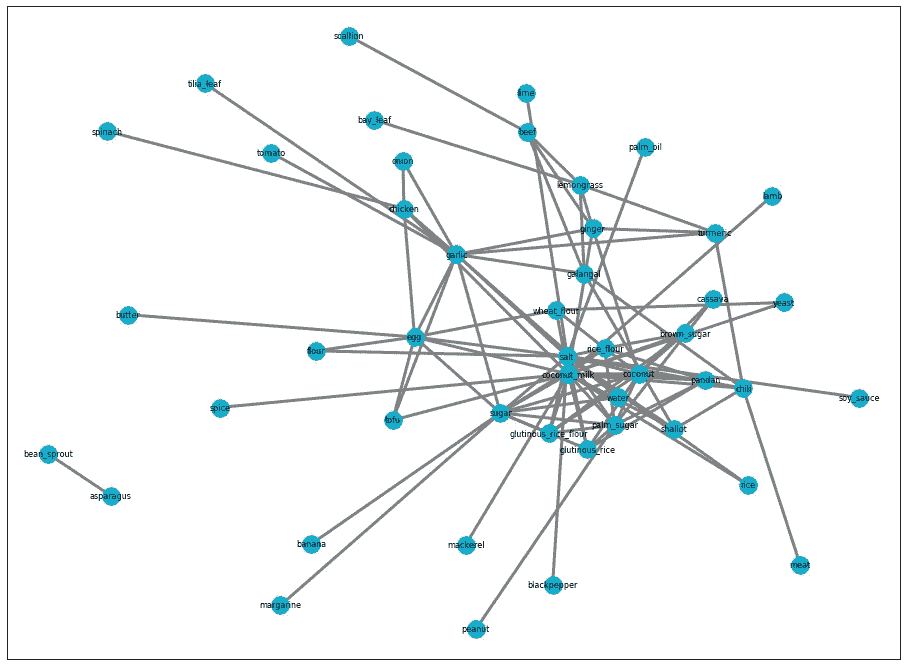**

**网络可视化——印尼菜肴的配料(图片来自作者)**

## **3.3 修改可视化效果**

**我们可以保留上面的可视化，但是我们为什么不把它做得更好，以便于分析呢？**

**可以在这里进行一些定制:**

*   **改变**节点尺寸**。我们可以根据节点度(它所连接的边的数量)来修改节点的大小。**
*   **改变**节点的颜色**。我们有一个配料类别(即碳水化合物、水果、蔬菜、香料等)，这是之前确定的。我们可以根据这个类别给节点着色，这样我们就可以很容易地检查来自同一个类别的项目是否紧密相连。**

```
import matplotlib# Create network plot 
G_mod = nx.Graph()# Create connections between nodes
for k, v in d[0].items():
    G_mod.add_edge(k[0], k[1], weight=(v * 10))# Get the dataframe of ingredient name and it's category    
carac = pd.DataFrame()
carac = total_ingredient[['ingredient_name','ingredient_category']]# Reindex the dataframe to align with graph's nodes
carac = carac.set_index('ingredient_name')
carac = carac.reindex(G_mod.nodes())carac['ingredient_category'] = pd.Categorical(carac['ingredient_category'])
carac['ingredient_category'].cat.codes# Specify colors, number of colors listed should align with the number of categories
cmap = matplotlib.colors.ListedColormap(['C0', 'darkorange', 'lightgreen', 'lightyellow', 'darkgreen', 'darkblue', 'purple', 'red', 'pink', 'brown'])# Get node degree in a dict for node size parameter
d = dict(G.degree)# Draw graph
fig, ax = plt.subplots(figsize=(16, 12))pos = nx.spring_layout(G, k=2)nx.draw(G, pos,
        font_size=10,
        width=1,
        edge_color='grey',
        node_color=carac['ingredient_category'].cat.codes, 
        cmap=cmap,
        with_labels = True, 
        nodelist=d.keys(), 
        node_size=[v * 12 for v in d.values()])
plt.show()
```

**瞧啊。我们的可视化在这里！**

**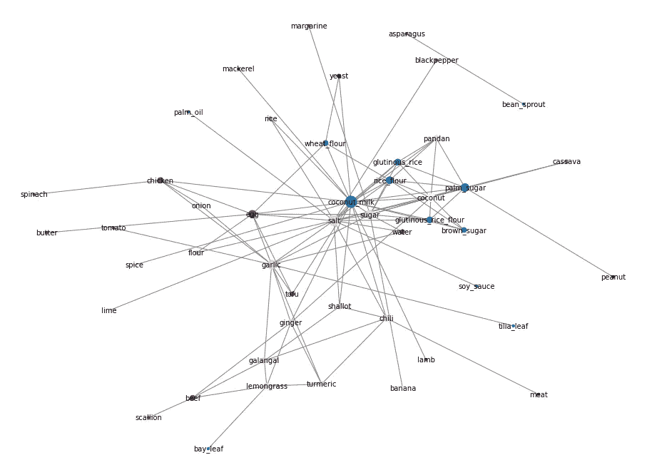**

**网络可视化——印尼菜肴的配料(图片来自作者)**

## **3.4 分析图表**

**从图中我们可以看到**椰奶**位于图 的 ***中心，具有相当大的节点大小和相当高的边连通数。但是是吗？*****

**NetworkX 也有一些分析功能来帮助我们获得每个节点的 ***中心度*** 值，我们可以用它来回答这个问题。**

```
# Compute the degree centralities of G: deg_cent
deg_cent = nx.degree_centrality(G)# Compute the maximum degree centrality: max_dc
max_dc = max(deg_cent.values())# Find the item(s) that have highest co-occurrence: prolific_collaborators
prolific_collaborators = [n for n, dc in deg_cent.items() if dc == max_dc]
```

**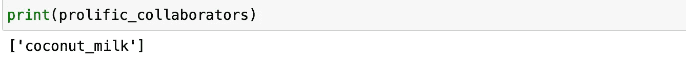**

**事实证明，是的，椰奶是同现率最高的项目！仔细想想，它在印尼菜肴中被广泛使用。从像 *Soto ayam* 这样的浓汤菜到像 *Nasi uduk* 这样的正餐以及像 B *ubur ketan hitam* 这样的甜点——它们的配料中都有椰奶！**

**我们还可以使用 NetworkX 来查找网络中的组。在这里，我们用 [***嫡系***](https://networkx.org/documentation/stable/reference/algorithms/clique.html) 函数来表示它。看起来很简单，我们可以使用下面的命令列出派系。**

**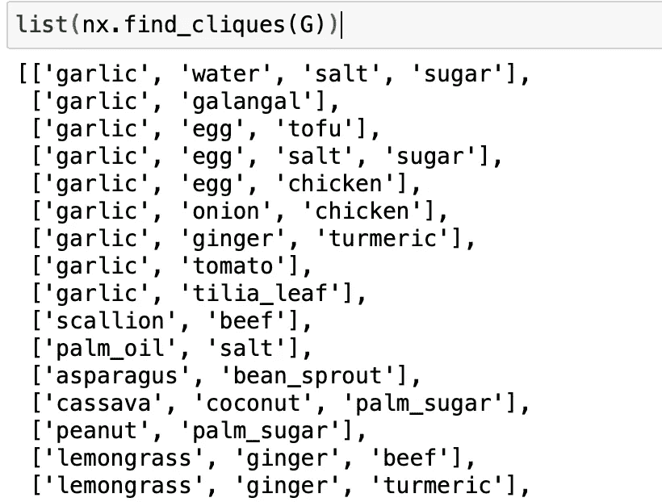**

**我们还可以识别一些感兴趣的项目，并具体放大它，找出该项目的联系。**

```
# Define get_nodes_and_nbrs()
def get_nodes_and_nbrs(G, nodes_of_interest):
    """
    Returns a subgraph of the graph `G` with only the `nodes_of_interest` and their neighbors.
    """
    nodes_to_draw = []# Iterate over the nodes of interest
    for n in nodes_of_interest:# Append the nodes of interest to nodes_to_draw
        nodes_to_draw.append(n)# Iterate over all the neighbors of node n
        for nbr in G.neighbors(n):# Append the neighbors of n to nodes_to_draw
            nodes_to_draw.append(nbr)return G.subgraph(nodes_to_draw)# Extract the subgraph with the nodes of interest: T_draw
T_draw = get_nodes_and_nbrs(G, ['coconut_milk'])# Draw the subgraph to the screen
nx.draw(T_draw, with_labels=True)
plt.show()
```

****

**子图可视化**

**查看上面的可视化和探索 NetworkX 函数，我们可以很容易地找到所定义的问题陈述的答案。**

**印度尼西亚菜肴的主要配料包括**椰奶**，盐和糖等调料，还有蒜、葱、姜和辣椒等香料。使用的顶级蛋白质包括**鸡蛋**、**豆腐**、**鸡肉**。**

**我们可以通过研究通常提到的派系来找到能够很好地协同工作的成分。在这种情况下，我们找到**盐和糖**(显然！);c **椰子奶，和米粉**(印尼 kuehs 常用)。**

**很有帮助，不是吗？**

# **结论**

**这就总结了网络分析在探索印度尼西亚菜肴中的配料方面的应用。正如我在[上一篇文章](/discovering-entity-connections-insights-using-network-analytics-e321e8b21318)中提到的，网络分析有许多方法可以用于其他用例，从欺诈检测到营销改进和供应链设置。**

**如果你渴望了解更多关于网络分析的知识，你可以探索这些资源——这也是我学习的地方:)**

*   **[NetworkX 教程](https://networkx.org/documentation/stable/tutorial.html)**
*   **[数据营课程](https://www.datacamp.com/courses/network-analysis-in-python-part-1)**
*   **[分析 Vidhya](https://www.analyticsvidhya.com/blog/2018/04/introduction-to-graph-theory-network-analysis-python-codes/)**

**快乐学习探索！**