# 使用神经网络发现系外行星

> 原文：<https://towardsdatascience.com/discovering-exoplanets-using-neural-networks-9345c8642638?source=collection_archive---------45----------------------->

## 利用美国航天局开普勒空间天文台的数据和 PyTorch 的神经网络

> 完成应用计算硕士项目中神经网络学科学分的项目。因为我必须展示一个实验和一篇文章，所以知识库将会有所有的实验代码，这个中间故事将会展示大部分关于我的工作的有价值的内容。

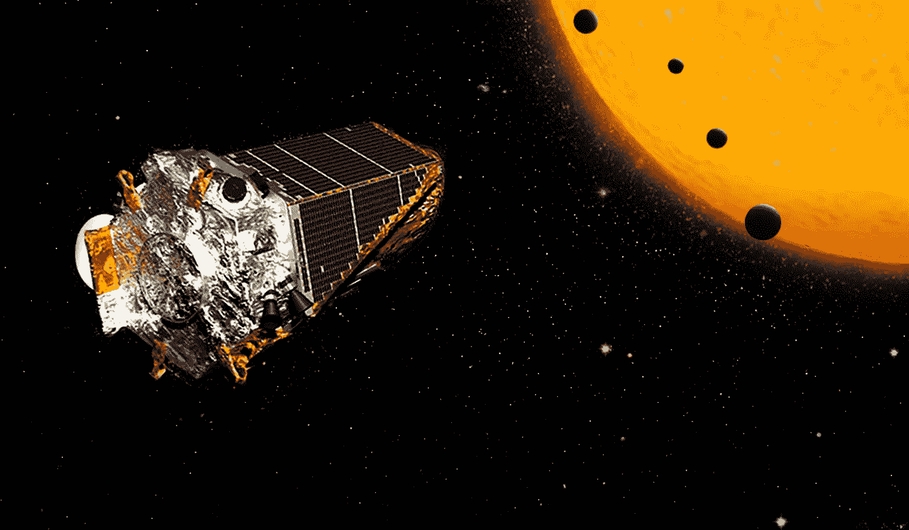

“艺术家概念。美国宇航局的开普勒太空望远镜发现了 100 多颗行星，其中包括四颗地球大小的行星，围绕着一颗矮星运行。正如我们所知，其中两个行星太热，无法支持生命，但其中两个位于恒星的“宜居”区，表面可能存在液态水。 [*演职员表:NASA/JPL*](https://www.nasa.gov/feature/ames/kepler/nasa-s-kepler-confirms-100-exoplanets-during-its-k2-mission)

## 开普勒空间天文台

2009 年，美国宇航局发射了开普勒太空天文台，旨在回答这个问题:

> [“我们银河系中的其他地球出现的频率如何？”](https://www.nasa.gov/mission_pages/kepler/overview/index.html)。

该天文台自 2014 年以来正在进行第二次任务，并已标记了超过 10，000 颗可能的系外行星。

开普勒在 2016 年扫描了 1284 颗新的系外行星。与 2017 年一样，总共确认了超过 3000 颗系外行星(使用所有探测方法，包括地基方法)。天文台仍在工作，并继续寻找其他系外行星。

我们这个项目的目标是使用开普勒太空天文台在 [Kaggle](https://www.kaggle.com/nasa/kepler-exoplanet-search-results) 收集的数据，建立一个神经网络模型解决方案，考虑到开普勒收集的特征，这是可行的，可以识别系外行星。我不会深入讨论数据清理或我正在使用的特征，那是为了一个未来的故事项目。

## 什么是系外行星？

我们的恒星是太阳，看着黑暗的天空，那是我们星系中的其他多颗恒星。这些恒星中的每一颗都可以或不可以有我们的行星绕着它们转，所以它们有自己的太阳系。那些行星是系外行星，我们也可以说**系外行星**是太阳系以外的行星。

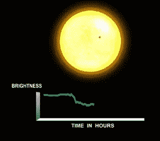

"当一颗行星从它的恒星前面穿过时，被观测者称为凌日。" [**演职员表:NASA 艾姆斯**](https://www.nasa.gov/mission_pages/kepler/overview/index.html)

美国宇航局这次任务的另一个重要目标是寻找“其他地球”。开普勒任务概述称，其目标之一是“*确定在各种恒星的可居住区或附近的类地行星和更大行星的百分比”。那些是体积是地球一半或两倍的行星。下面你可以找到适合居住的行星的例子。*

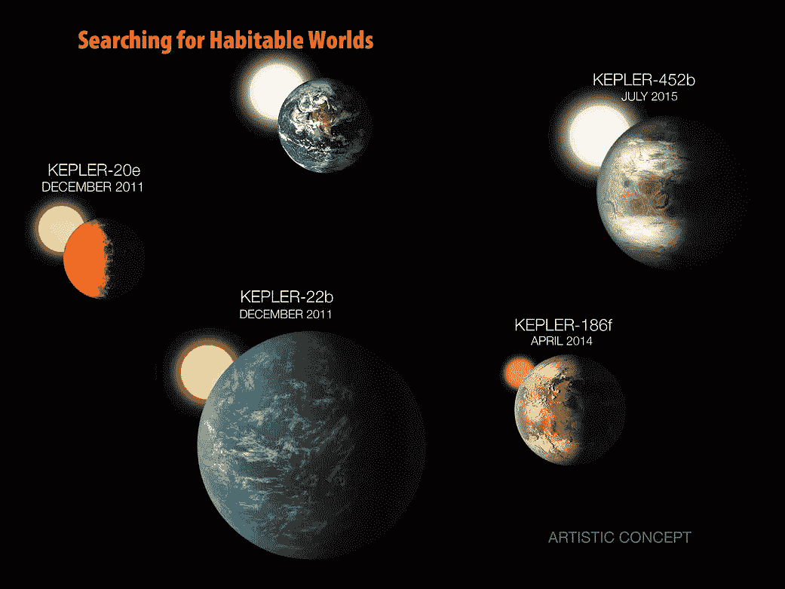

“在过去的九年中，美国宇航局开普勒任务对小型宜居行星的搜索。第一颗比地球小的行星是开普勒-20e，它于 2011 年 12 月被发现，每六天绕着一颗比我们的太阳稍微冷一点、小一点的类日恒星运行一周。但是它是灼热的，无法维持大气或液态水海洋。开普勒-22b 在同一个月宣布，作为第一颗位于类太阳恒星可居住区的行星，但它的大小是地球的两倍多，因此不太可能有固体表面。开普勒-186f 于 2014 年 4 月被发现，是第一颗在一颗小而冷的 M 矮星的可居住区发现的地球大小的行星，这颗矮星的大小和质量大约是我们太阳的一半。开普勒-452b 是与太阳非常相似的恒星的可居住区中的第一颗近地大小的行星。” [**鸣谢:NASA 艾姆斯/w·斯滕泽尔**](https://www.nasa.gov/ames/kepler/searching-for-habitable-worlds)

# 实验…

使用的机器是 MacBook Pro 2017，采用 Mac OS Mojave 操作系统，500Gb 固态硬盘，RAM 16Gb，处理器为 2.9 GHz 四核英特尔酷睿 i7。使用的编程语言是 **Python** 3.6，而 **PyTorch** 库用于构建神经网络。

## 数据库ˌ资料库

数据库是由 [Kaggle](https://www.kaggle.com/nasa/kepler-exoplanet-search-results) 平台拍摄的。而数据清理是基于 [Ismael Araujo](https://github.com/ismael-araujo/Finding-Exoplanet-Using-Machine-Learning) 的工作。7803 个样本有 38 个特征，其中一个是**外行星候选者**那一个将成为标签。最后，我有 37 个不同的特征用作输入和二进制输出。

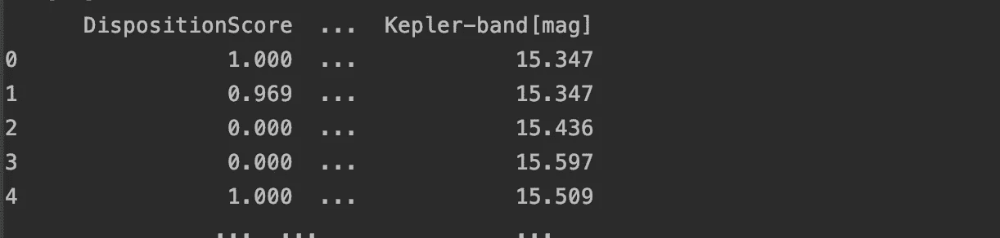

演职员表:*作者图片。*

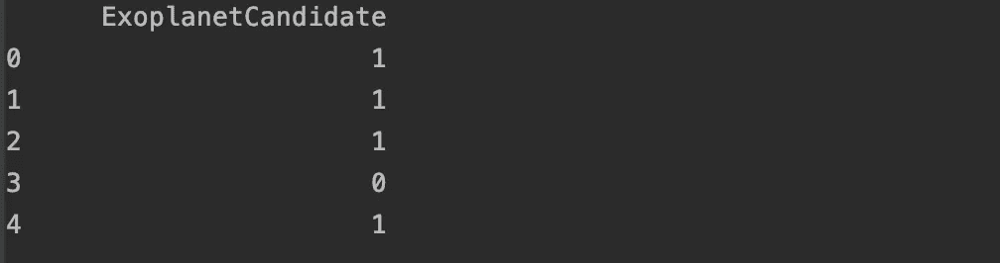

演职员表:*作者图片。*

数据分为三部分，其中 70%用于**培训**，15%用于**验证**，15%用于**测试**。使用最小-最大缩放对特征进行标准化，验证和训练转换为使用 PyTorch 的**数据加载器**。参见下面的代码:

## 神经网络

因为我相信媒体社区在解释机器学习主题方面非常丰富，所以我不会深入定义这个实验中使用的算法的理论部分。虽然这个[**aye bilge gündüz**post](/machine-learning-101-artificial-neural-networks-3-46ccb04cba30)如果你没有理论背景的话有非常好的数学基础。

我使用了三个不同的神经网络:一个更简单的**感知器**和两个**多层感知器**，一个有三个隐藏层，另一个有两个。它们的激活功能也各不相同。最后，构建了五个神经网络，下表是为了更好地理解其中的每一个:

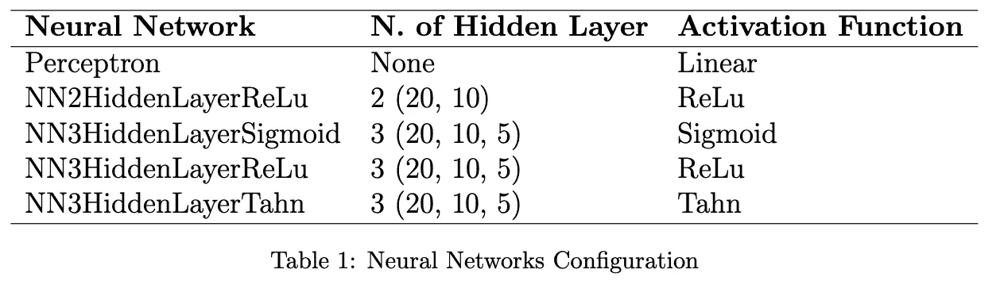

演职员表:*作者图片。*

所使用的所有神经网络在其输出层上具有 Sigmoid 函数，0.5 的阈值用于最终分类。下图显示了三种不同架构的代表:

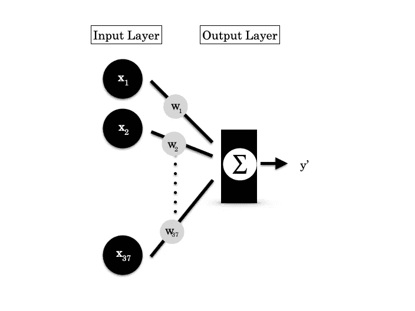

感知器。演职员表:*作者图片。*

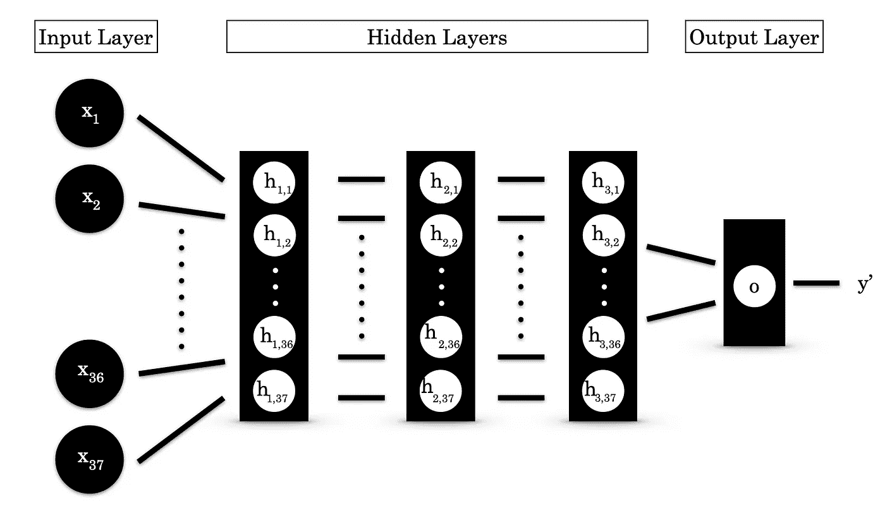

图 3:具有 3 个隐藏层拓扑的 MLP。演职员表:*作者图片。*

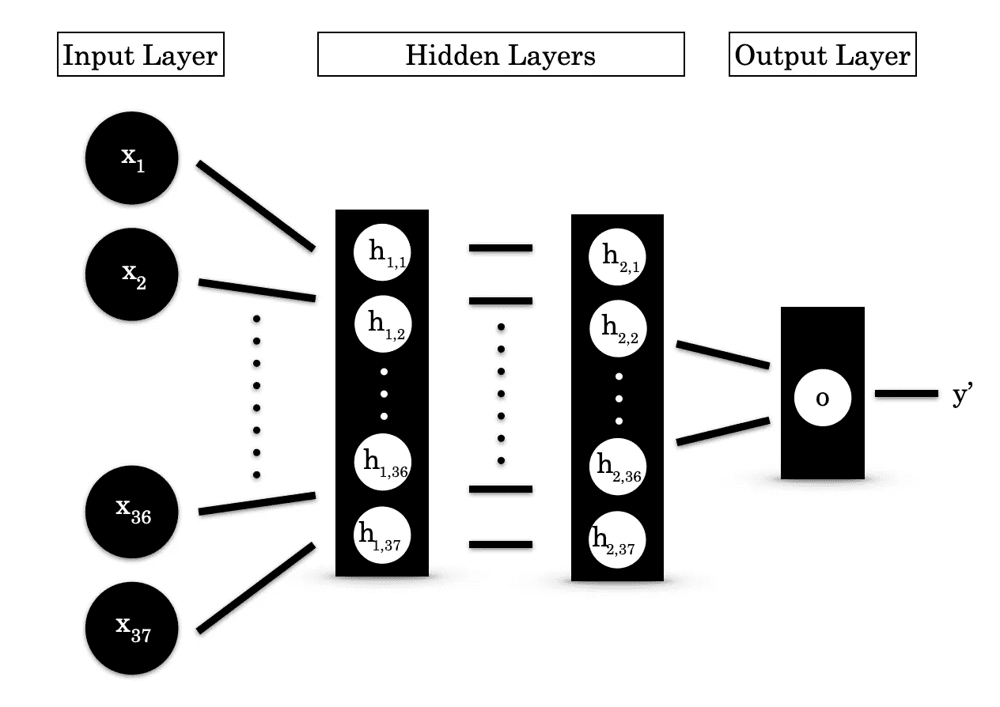

图 2:具有两个隐藏层拓扑的 MLP。演职员表:*作者图片。*

下面你还可以看到一个多层感知器的代码，有两个隐藏层，使用 PyTorch 构建。你可以注意到它的最后一层有 Sigmoid 函数。

## 培养

使用 **Adam** 作为优化器，使用 0.01 作为**学习率**，使用**均方误差**作为损失函数进行训练。**进行了两次不同的**训练，一次 100 个周期，另一次 50 个周期。培训的所有其他配置保持不变。这样总共做了 10 次实验。

两个实验的训练损失图:

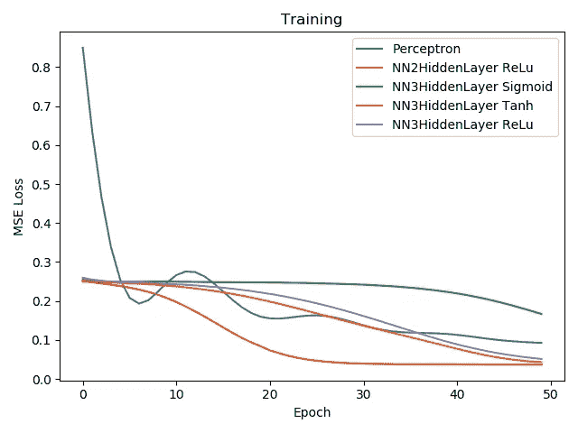

图 5:实验 b 过程中的训练损失.鸣谢:*图片由作者提供。*

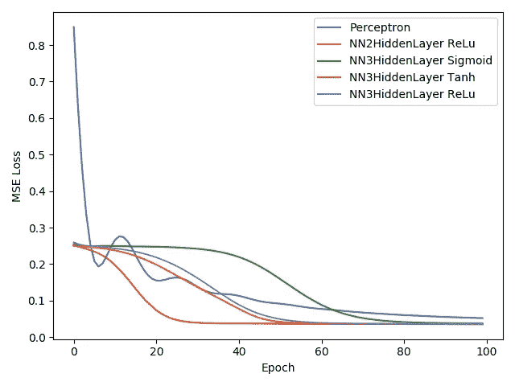

图 4:实验 a 过程中的训练损失.鸣谢:*图片由作者提供。*

你可以看到，使用 50 个历元的训练是使用 100 个历元的训练的简短版本，记住**种子在所有训练中保持不变**是很重要的。尝试 50 个时代的原因是为了了解是否有可能用更少的努力获得相同的结果。

## 结果

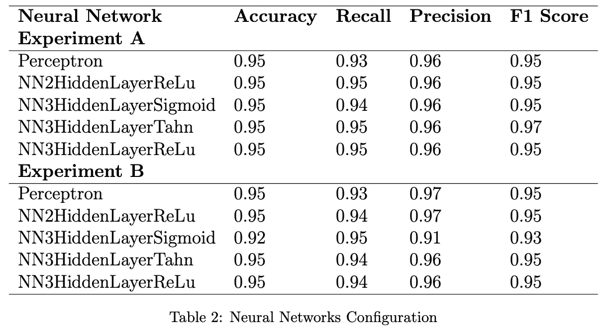

演职员表:*作者图片。*

上面的表格显示了使用所有 10 种不同网络配置的结果。这里我们将 **100 个历元的实验称为实验 A** ，50 个历元的实验称为实验 B 。

## 最后的想法

正如我们可以看到的，实验的结果都具有非常接近的性能值，作为结论，最不复杂的神经网络可以给我们带来与具有更多层的神经网络非常相似的结果。是什么让我们相信一个**感知器**会对我们的问题执行一个好的分析算法。

***所有的数据和代码都可以在***[***github***](https://github.com/blendaguedes/find-exoplanets)***库中找到。***

*原载于***。**