# 发现矩阵行列式

> 原文：<https://towardsdatascience.com/discovering-the-matrix-determinant-11b56616d99a?source=collection_archive---------13----------------------->

## 基本原则

## 解开特征分解的关键元素

由 [Ricardo Gomez Angel](https://unsplash.com/@rgaleria?utm_source=medium&utm_medium=referral) 在 [Unsplash](https://unsplash.com?utm_source=medium&utm_medium=referral) 拍摄的照片

线性代数中有一些概念，第一次出现时很容易理解。可能是因为它们的应用和用例相对来说比较明显，概念也比较明确。

然而,*矩阵行列式*的概念对我来说却完全相反——与其说是启发，不如说是困惑。我的困惑主要源于这样一个事实，我严重缺乏直觉——我无法想象行列式的意义和目的。

在接下来的几节中，我们将建立一些直觉，学习一些计算行列式的程序，并初步了解它的应用。

# 快速的事实和直觉

行列式描述了将矩阵映射到标量的函数。它是由所有特征值的乘积定义的，允许一个稍微不那么抽象的，更具几何意义的解释。

根据矩阵的维数，行列式也可以分别解释为*面积*或*体积*。粗略地说，它告诉我们乘以给定的矩阵会拉伸或收缩多少空间。

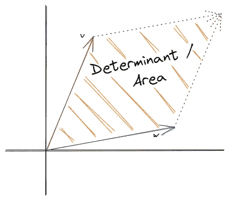

几何解释的一个例子[图片由作者提供]

假设我们有一个行列式为零的矩阵。乘以矩阵，会缩小空间，把所有东西都挤到一行上。因此，面积也将等于零。

现在，我们获得了一些基本的直觉，我们可以列出一些关于行列式的事实来进一步理解:

1.  行列式只为方阵(M×M)定义。
2.  一个矩阵只有一个行列式，因为它是一个标量，包含矩阵的信息。
3.  奇异矩阵的行列式等于零。或者换句话说——具有线性相关性的矩阵，秩`r < M`，具有零行列式。
4.  行列式通常被表示为下列之一:

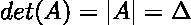

> **注**:要记住一件事——行列式在理论上很重要，但在实践中很难计算，因为计算“大”矩阵时会出现数值不稳定。

# 矩阵行列式怎么算？

在上一节中，我们学习了一些关于行列式的基本知识以及如何解释行列式。但是我们怎么计算呢？

计算行列式的过程相当繁琐。幸运的是，有一些快捷方式，只适用于小矩阵(2x2，3x3)。我们先谈捷径，再谈一般程序。

> **注意**:幸运的是，我们不必手动计算行列式，因为内置的 NumPy 函数 [numpy.linalg.det(a)](https://numpy.org/doc/stable/reference/generated/numpy.linalg.det.html) 会为我们完成这项工作。

## 2x2 快捷方式

2×2 矩阵的行列式相对容易计算。我们只需将主对角线上的每个元素相乘，然后减去非对角线元素的乘积。

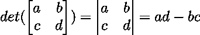

让我们来看一些数字示例:

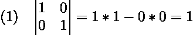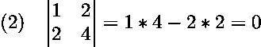

在第一个例子中，我们使用快捷方式来计算一个 2 乘 2 单位矩阵的行列式，等于 1。我们也可以把这个解想象成一个平面的面积，其中一边由单位向量 v=[1，0]定义，另一边由单位向量 w=[0，1]定义。

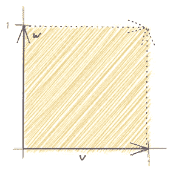

2x2 单位矩阵的行列式[图片由作者提供]

奇异矩阵的行列式为零，这正是我们在第二个例子中看到的。由于两列彼此线性相关，我们有一个秩亏矩阵，导致行列式为零。从几何学的角度考虑这个解决方案，我们必须想象两个向量形成一条面积为零的直线。

奇异 2x2 矩阵的行列式[图片由作者提供]

## 3x3 快捷方式

3 乘 3 矩阵的行列式的计算已经更加复杂，但是相对类似于 2 乘 2 的捷径。

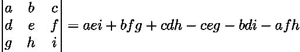

我们对从左上到右下的所有对角线元素的乘积求和，并减去从右上到左下的所有非对角线元素的乘积之和。我们可以用两种不同的方式来想象这个过程。

1.  一种方法是通过级联来扩充矩阵:

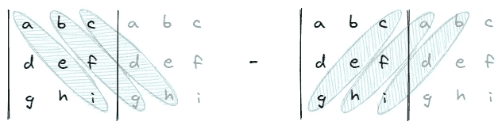

增强矩阵可视化[图片由作者提供]

2.另一种方法是想象沿着对角线“环绕”:

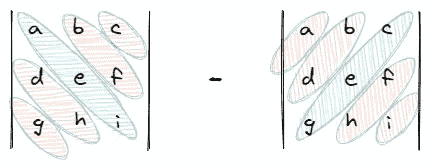

环绕矩阵可视化[图片由作者提供]

## 一般程序

现在，事情变得非常复杂。因此，以下示例将仅基于 4×4 矩阵。

通常，该过程是迭代第一行的每个元素，通过排除当前第一行元素的列来创建子矩阵(3x3)，计算子矩阵的行列式并乘以当前第一行元素。这将产生四个数字，我们将以交替模式[+，-，+，-]对它们进行加减运算。

我们应该把解开复杂描述的过程形象化:

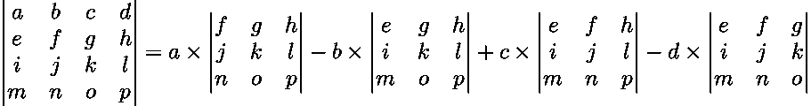

我们可以看到程序要复杂得多。对于相对较小的 4x 4 矩阵，我们必须计算 4 个子矩阵的 4 个行列式，其中我们还需要计算子矩阵的行列式，等等。因此，该算法可以递归应用，因此计算量很大。

然而，这个通用程序可以扩展到任何规模的矩阵——幸运的是，我们不必手工计算。

# 行列式的应用

我们现在知道行列式是什么，如何解释它，如何计算它，但有一个问题仍然没有答案——它是用来做什么的？

例如，它的一些应用提供了一种寻找给定矩阵的逆矩阵或特征值的方法。后者尤其重要，因为特征值和特征分解在主成分分析中起着中心作用。

 [## 从头开始实施 PCA

### 仅用 Python 和 NumPy 来提高您的线性代数技能

towardsdatascience.com](/implementing-pca-from-scratch-fb434f1acbaa) 

假设我们有一个 2 乘 2 的矩阵，并且我们已经知道了行列式。将矩阵元素放在等式的一边，将行列式放在等式的另一边，可以让我们求解矩阵的特定元素。

让我们考虑一个数字例子，让事情变得更加明显。

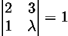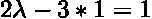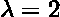

现在，如果我们基于这一想法，从主对角线上的实数中减去多个未知数，并推广该方程，我们将获得矩阵的*特征多项式*。

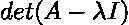

特征多项式是有用的，因为它不仅允许我们用多项式来表示矩阵，而且允许我们计算矩阵的特征值。如果特征多项式设置为零，λ——多项式的根——描述矩阵的特征值。

# 结论

在本文中，我们学习了矩阵行列式的概念。如何解读和计算，以及它的一些应用。

两个最重要的应用是矩阵求逆的计算，也许更有趣的是发现特征值。

正如我们前面简要提到的，矩阵行列式在理论上是一个很好的概念，但在实践中很难计算，特别是对于“大”矩阵，由于数值的不稳定性。为了避免这样的问题，例如当计算特征值时，存在一整族的[迭代算法](https://en.wikipedia.org/wiki/Eigenvalue_algorithm)(例如[幂法](https://en.wikipedia.org/wiki/Power_iteration))。

尽管有实际的问题，行列式仍然是一个需要了解和理解的重要而基本的概念。

> 感谢您的阅读！确保保持联系&在 [Medium](https://medium.com/@marvinlanhenke) 、 [Kaggle](https://www.kaggle.com/mlanhenke) 上关注我，或者在 [LinkedIn](https://www.linkedin.com/in/marvin-lanhenke-11b902211/) 上说“你好”

喜欢这篇文章吗？成为 [*中等会员*](https://medium.com/@marvinlanhenke/membership) *继续无限学习。如果你使用下面的链接，我会收到你的一部分会员费，不需要你额外付费。*

 [## 通过我的推荐链接加入 Medium-Marvin Lanhenke

### 作为一个媒体会员，你的会员费的一部分会给你阅读的作家，你可以完全接触到每一个故事…

medium.com](https://medium.com/@marvinlanhenke/membership) 

**参考资料/更多资料:**

*   深度学习(Ian J. Goodfellow，Yoshua Bengio 和 Aaron 库维尔)，第二章，麻省理工学院出版社，2016 年。
*   迈克·科恩博士。线性代数:理论，直觉，代码。
*   [3 蓝色 1 棕色—行列式](https://www.youtube.com/watch?v=Ip3X9LOh2dk&t=68s)