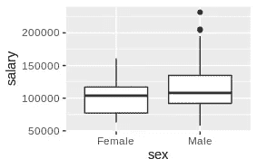
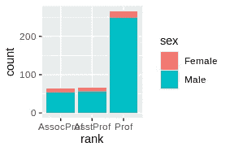
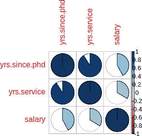
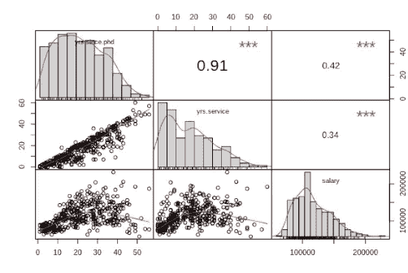
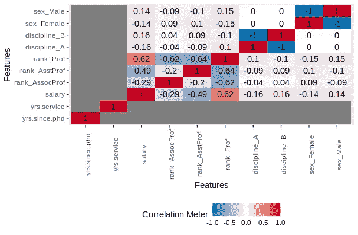
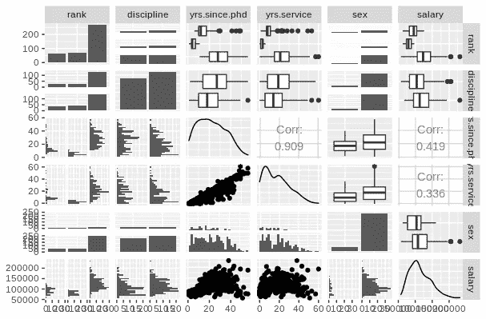
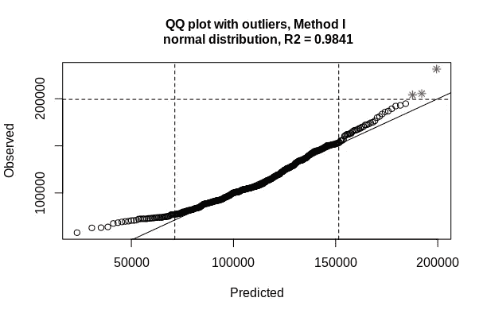
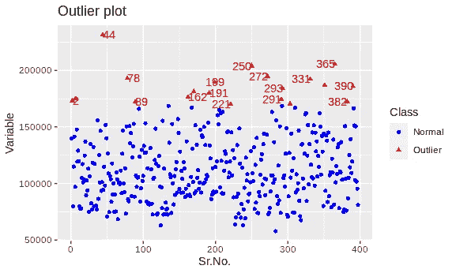
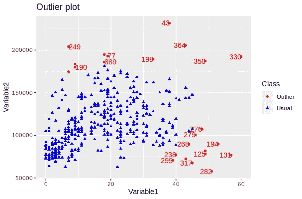

# 发现 22 R 探索性分析包的宝藏

> 原文：<https://towardsdatascience.com/discovering-the-treasures-of-22-r-exploratory-analysis-packages-9bb1c5b4e6f8?source=collection_archive---------13----------------------->

## 找出在 R 中进行 EDA 的最快和最有用的方法

@fergregory/AdobeStock

ython 如今在数据科学领域风靡一时；然而，R 多年来一直在悄悄地发展，并收集了目前包含在近 17K 包中的惊人功能(在撰写本文时)。所以可以毫不夸张地说，它已经在数据科学的许多领域积累了大量的软件包，其中之一就是探索性数据分析(ed a)。使用 EDA 这个词，我们封装了以下功能:

*   一般数据框架描述:维度、数据类型(连续/离散)、缺失情况。
*   单变量统计:均值、方差和其他变量统计，用表格或图表表示，如直方图和箱线图。
*   双变量统计:变量关系，用表格或图表形式的相关性、散点图等表示。
*   离群值，即与其他数据点显著不同的数据点。

正如您所预料的，许多 EDA 功能在各种 R 包中被复制，因此筛选共性是很重要的。在这篇文章中，我们将执行数据集的 EDA，并**获得 EDA 包，这样对于每个 EDA 步骤，我们都会给出一些最佳选项。**

# 1.EDA 包和我们的数据集

L 让我们先熟悉一下我们将要探索的包的名字。以下是按字母顺序排列的:**AEDA、化学计量学、corrplot、DataExplorer、dataMaid、ExPanDaR、extremevalues、funModeling、ggcorrplot、Hmisc、inspectdf、OutlierDetection、outlier、PerformanceAnalytics、ggcorplot、Ggally、mvoutlier、prettyR、psych、RtutorR、skimr、summarytools。**我们将使用的辅助包: **dplyr，ggplot2，guardian，plotly，gmodels。**

我们的数据集是 *professor-salaries.csv* (可在 Kaggle 上获得)。数据集的尺寸为 397 X6。这六栏分别是教授的*职级*(可以是助理教授、副教授、正教授)*学科*(可以是 A 或 B)、获得博士学位的年限(*yrs sinf . PhD .*)、服务年限(*yrs service*)、性别(*性别*)、工资*。最初，数据集没有缺失值，但是，因为我们希望在有缺失案例时检查各个包的行为，所以我们在 *yrs.since.phd* 列中引入了安娜，在 *yrs.service* 列中引入了安娜。*

# ***2。数据帧描述***

*在此之前，我们将获得关于数据集维度、变量数量/类型、唯一行、重复数据和缺失数据的信息。我们提出一个问题，每个问题之后都有代码和代码输出。在每个代码片段中，第一个命令*库(包)*显示了我们使用的包。如果没有包含库语句，那么使用的函数来自 base R 包。*

*问:我的数据集的维度是什么？*

*基础包中的 *dim()* 有答案，其中 *sal* 是我们数据集的名称。*

*问:我的数据集有多少个变量，它们的类型是什么？*

*来自基地的 str() 告诉我们。部分输出如下所示。*

*问:如果有的话，有多少重复的行？*

*这里我们使用基础包中的 *unique()* 函数。如下所示，有四个重复的行。*

*问:为了进一步探究，哪些是重复的行？*

*包*的看门人*有这个函数 *get_dupes()* 。部分输出如下所示。*

*问:是否有任何数据缺失？*

*函数*introduce()*from package*data explorer*给我们答案。如下所示，有两个值缺失。*

*问:为了进一步探究，哪些变量有缺失值？*

*来自 base R 的多功能 *apply()* 函数给了我们答案。我们看到变量*yers。因为. phd* 、*yers . service*各有一个缺失值。*

*问:这些丢失的值出现在哪些行中？*

*没有被 *complete.cases()* 选中的行就是答案。*

# ***3。单变量统计***

***3.1 单变量列统计***

*前面提到的 R 包中有很多函数，它们报告单变量统计数据。我发现以下内容最有用:*

*   ***对于基本的单变量统计信息**:来自基础包的 *summary()* 函数。此函数报告以下统计数据:连续变量的最小值、最大值、平均值、中值、第一/第三四分位数、NA 的数量以及分类变量的每个级别的观察数量。*
*   ***详细的单变量统计信息:**来自 *psych* 包的 *describe()* 函数。它的输出包括最小值、最大值、中值、平均值、修整平均值、范围、偏斜度、峰度。*
*   ***为了便于报告:***dataMaid*包中的 *makeDataReport()* 函数创建了一个方便的 *HTML* 文件，其中包含每个连续变量的以下信息:最小值、最大值、中值、第一/第三四分位数、缺失观测值的数量、唯一值的数量和直方图。对于分类变量，它提供了关于每个级别的观察次数的信息。*

*包 *summarytools、inspectdf、Hmisc、prettyR、funModeling、skim* r 的单变量描述函数可以在我的 *github* 目录下的 R 脚本中找到(路径在文末给出)。*

## ***3.2 单变量组统计***

*有时，我们想知道连续变量(如*薪水*)的统计数据如何受到分类变量(如*性别*)不同水平的影响。以下是实现这一点的两种方法:*

*   ***对于一些基本信息**:我们可以使用基础包中的 *tapply()* 函数。下面， *tapply()* 报道了男女教授的平均工资。*

*   ***更详细的群组信息**:来自 *psych* 包的 *describeBy()* 信息:*

*   ***对于复杂的分组和报告**:我们可以使用非常流行的 *dplyr* 函数 *filter()* 、 *group_by()* 和*summary()*。下面是一个例子，我们根据级别显示了专业 A 的男女平均工资:*

*   ***因为一张图胜过千言万语:**箱线图和条形图，用 *ggplot2* 函数创建。*

*下面的图 1 和图 2 提供了有价值的见解:*

*(a)一些男教师的工资非常高。*

*(b)女教师的工资被压向低端*

*(c)正教授比助理教授或副教授多得多*

*(d)在所有级别上，男性教员都多于女性教员。*

**

*图一。男性和女性工资的箱线图。*

**

*图二。等级条形图，颜色由教员的性别决定。*

# *4.二元统计*

***4.1 交互式散点图***

*查看两个变量之间关系的标准方法是散点图。如果我们把散点图做成交互式的，我们可以让它包含更多的信息。这可以通过*包装来实现*。要在 plotly.com 的*上查看您的图，*在 [*Chart studio*](https://plotly.com/chart-studio/) 上获得一个帐户，然后在您的 R 会话中存储您的认证凭证(用户名、API 密钥)，如下所示:*

*plotly.com*上的互动情节*，也可以嵌入到你的在线出版物中，如图 3 和图 4 所示。这是变量*年交互式散点图的代码。自. phd* 对*薪水，*与 *v* 变量*性别*用于给地块的点着色。*

*图 3。交互式散点图。*

## *4.2 交互式 3D 绘图*

*包 *plotly* 也允许创建交互式 3D 情节，我们可以放大，改变视角等。图 4 显示了*薪水*对*年数、自博士*和*年数、服务*的 3D 图，其中颜色由变量*性别*提供。*

*图 4。交互式 3D 绘图*

## *4.3 相关性*

*相关性是查看两个变量之间关系的另一种方式。R 中的几个软件包计算相关性，并以数字或图形方式显示它们。*

## *4.3.1 以数字显示的相关性*

**stats* 包有 *cor()* 函数，以表格形式显示数值变量的相关性:*

*为了确定相关性是否具有统计显著性，我们可以使用 *cor。test()*stats 包的方法。比如*工资*和*年数的相关性。服务*具有统计显著性，因为它产生了 *p 值=6.901e-12**

## *4.3.2 以图形显示的相关性*

*corrplot 是一个包，它提供了许多有见地的方法来查看数字相关性。你可以选择你的主要形状(圆形、方形、饼形、椭圆形等)，相关程度通过改变形状的大小和/或颜色来显示。在下面的图 5 中，我们使用了饼形。相关性越弱，饼形越不完整，颜色也越浅。*

**

*图 5。数字变量的相关性*

*包 *ggcorrplot* 产生数字和图形相关输出。它的数字输出非常类似于包 *stats* 产生的输出，它的图形输出类似于 *corrplo* t 产生的输出，所以我们不会在这里展示它。*

*包 *PerformanceAnalytics* 包含函数*图表。Correlation()，*它在上半部分面板中显示数值变量的相关性，在对角线中显示数值变量的直方图，在下半部分显示变量对的散点图(图 6)。*

**

*图 6。图表的输出。相关性()。*

*现在，我们将看看三个包( *DataExplorer、psych 和 GGally* )，它们与数值变量相关性一起，也包括分类变量信息。包 *DataExplorer* 包含函数 *plot_correlation()* 以彩色单元格显示相关性。有趣的是，它还显示了不同分类变量水平的相关性，如下图所示(图 7)。*

**

*图 7。plot_correlation()的输出。*

*包 *psych* 和 *Ggally* 提供函数*对。面板()*和 *ggpairs()* 分别显示相关性、直方图和散点图。我最喜欢的是 *ggpairs()* 的输出，它让您可以鸟瞰数据集的变量及其关系，也包括分类变量(图 8)。*

**

*图 8。ggpairs()函数的输出。*

## *4.4 独立性检验和统计显著性差异*

*虽然不是探索性分析的传统部分，但我个人从对列联表进行独立性测试中获得了许多有用的见解。这些表格至少有两行和两列，显示至少两个分类变量的多元频率计数。统计测试，如*卡方*测试和 *Fisher* 测试，可用于确定显示的分类变量是否独立。*

**卡方*和*费歇尔*检验产生相似的 *p 值* ( *卡方*检验 *p 值* =0.0140，*费歇尔*检验 *p 值* =0.0114)，表明等级和性别不独立(显著性水平为 0.05)。*

*关于连续变量，我们经常想知道连续变量是否在两组之间变化。例如，我们想知道男性教员的工资在统计上是否与女性教授的工资不同。如下图，一个 *t 型测试*可以帮助我们回答这个问题:*

*t 检验得出一个 *p 值* =0.002664(显著性水平=0.05)，这意味着男女教员的工资在统计上是不同的。更进一步，我们想知道这种差异是否是由于不同级别的男女人数不同造成的。所以为了消除*等级*的影响，让我们对男女正教授的工资做一个 *t 检验*(*等级* =' *教授*')。该测试表明，当变量*等级*固定时(p 值 *p 值* = 0.3098，显著性水平=0.05)，两组的工资在统计上没有差异*

# *5.极端值*

*极限是远离变量总体分布的点。它们可能是完全无用的，例如由测量误差引起的，或者在异常检测应用中是有用的。在这里，我们将讨论如何检测它们，而不是我们是否或如何删除它们。我们将区分单变量和多变量异常值检测。在单变量的情况下，我们要对抗单个变量的极值。在多变量的情况下，我们感兴趣的是发现多维离群值，例如，这在聚类应用中非常有用。*

## ***5.1 单变量异常值检测***

*在这里，我们将检查三种单一异常值检测方法，它们利用了:(a)箱线图(b)包*极值* (c)包*异常值检测*。*

*(a)箱线图:在箱线图中，离群值被确定为位于胡须下方或上方距离大于四分位数间距 1.5 倍的点。R 中的方框图标记了异常值，但是，它们没有显示它们的值。如前所述，我们可以使用 *plotly* 使它们交互，这样，用户可以点击离群值并查看它们的值:*

*图 9。交互式箱线图*

*通过点击图 9 中最大的男性异常值，我们看到它的值是$231，545.00。接下来的两个异常值(实际上重叠)的值分别为$205，500.00 和$204，000.00。*

*(b)软件包 *extremevalues* :它提供了一个函数，使用对数据子集的回归来发现异常值( *getOutliers()* )。在使用函数 *outlierPlot()，*创建的图 10 中，我们再次看到三个值被识别为异常值。*

**

*图 10。离群值的 QQ 图。*

*(c)包 *OutlierDetection* :它提供了*UnivariateOutlierDetection()*，这个函数的默认离群点检测方法是 bootstrapping。这种方法基于一个巧妙的观察，即异常值有时不包括在 bootstrap 估计中[1]。从下面的图 11 中可以看出，它确定了远不止 3 个异常值，但是位置 44、365、250 处的三个最远的异常值对应于直方图中确定的薪金值$231，545、$205，500、$204，000。*

**

*图 11。UnivariateOutlierDetection()的输出*

## ***5.2 多元异常值检测***

*这里我们将讨论 *OutlierDetection* 和 *chemometrics* 包中的方法。*

*(a)程序包 *OutlierDetection* 提供了一个同名函数，该函数给出了两个变量(在我们的示例中为 *salary* 和*yers。service* ，创建一个散点图，用红色表示异常值，如图 12 所示。关于下面代码的一些注意事项:(a)我们需要删除 *NAs* ，以便从 *OutlierDetection()* 获得正确的输出。如果你还记得，我们在变量*yers . service*中引入了一个 *NA* 。(b)在第四行中，我们颠倒了数据帧的列，以使变量 *salary* 在图上显示为变量 2，从而获得与上面图 11 中方向相同的图。(c)最后，因为 *NA* 移除从我们的数据框架中移除了一行，所以图 12 中所示的工资异常值的指数是图 11 中所示的工资异常值的指数的-1(43，249，364)。*

**

*图 12。OutlierDetection()的输出*

*(b)包*化学计量学*有一个函数 *Moutlier()* ，它使用测量两点之间距离的马氏距离来检测异常值。与欧几里德距离相比，马氏距离考虑了点值的相关性，并且距离是相对于质心来测量的。只有当这些点不相关时，马氏距离才等于欧氏距离。*

*如上所述，位置 43 处的点具有最高的 Mahalanobis 距离，其次是点 282、131、330 等。如果我们回头看图 12，我们可以看到这些数字对应于图上看到的一些最远的异常值，因此在确定异常值时，Mahalanobis 距离方法和 bootstrapping 方法之间总体上是一致的。最后，程序包*mv 离群值*也使用马氏距离来计算离群值，但是，它使用马氏距离的稳健估计。结果类似于常规的马氏距离，尽管排序不同。*

# ***6。自动 EDA***

*最后，让我们讨论一下自动 EDA，也就是说，用一个命令就能创建一个完整的(描述性的、单变量的、双变量的)EDA 报告。我们将讨论提供这一功能的四个包:*

*   **数据浏览器**
*   **AEDA* (可从[https://github.com/tuanle618/AEDA](https://github.com/tuanle618/AEDA)获得)*
*   **扩展器**
*   **RtutoR**

**DataExplorer* ，是一个流行的 EDA 包，其 EDA 报告(*report.html)*生成如下:*

*它很好地总结了缺失数据、单变量分布(直方图、QQ 图、条形图)、相关性分析、双变量分析(箱线图、散点图)，由目标变量指导。它还包括主成分分析。*

**AEDA*(*main report . rmd*)的 EDA 报告创建为:*

*通过加载*可以创建 HTML 格式的报告。rmd* 报告 *Rstudio* 并点击*针织*按钮。它的优点是数字变量的详细报告，包括偏度、峰度和高级分析，包括聚类摘要报告、主成分分析、多维标度报告和因子分析报告。*

*ExPanDaR 的 auto-EDA 的优点是它允许你启动一个闪亮的应用程序:*

*这个闪亮的应用程序允许交互指定多个变量，包括:*

*   *显示条形图的因子(包括在同一图表上选择附加因子)。*
*   *要显示直方图的数字变量(包括单元格编号的说明)。请注意，在显示每个直方图后，还会报告极端观察值。*
*   *要显示散点图的变量对。此外，它还允许指定反映在绘图颜色中的变量。*
*   *回归分析的目标变量和自变量。也是固定效应的分类变量的规范。*

*最后，包 *RtutorR* 提供了一个简洁、基本但方便的 *Powerpoint* EDA 报告:*

*其单变量分析包含数值变量的直方图(以及最小值、最大值、百分位信息)以及分类变量的条形图(以及每一水平的出现次数)。其双变量分析包含按分类变量分组的数值变量箱线图和数值变量散点图(以及相关系数)。*

*你可以在我的 *github* 目录[https://github.com/theomitsa/R-EDA](https://github.com/theomitsa/R-EDA)中找到我的 R 脚本和前述包的 *pdf* 版本的自动化 EDA 报告*

*auto-EDA 报告的 HTML 版本可在 [HTML 链接](https://drive.google.com/drive/folders/115FidocQ_QYPR1EbIG81kMZBVbLv3szq?usp=sharing)找到*

*感谢阅读！*

# *参考*

*[1] Singh，k .和 M. Xie，Bootlier 绘图-基于 Bootstrap 的异常值检测绘图，第 65 卷，第 3 部分，第 532–559 页，2003 年。*