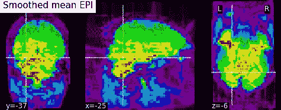
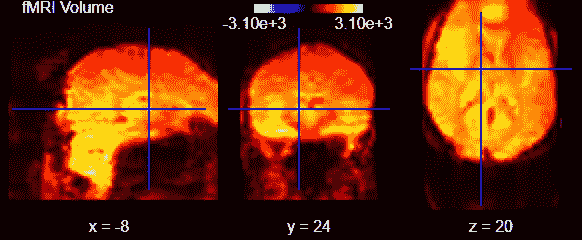
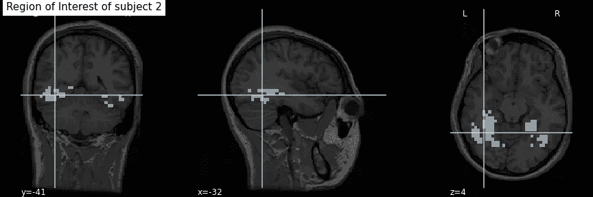
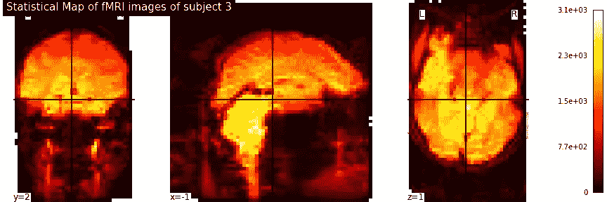
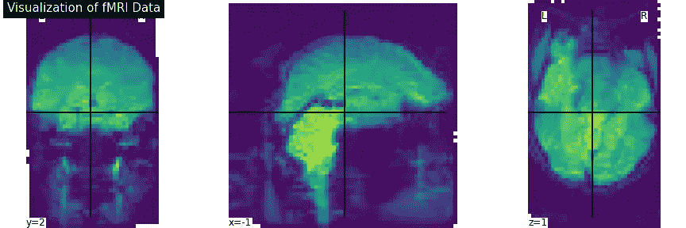
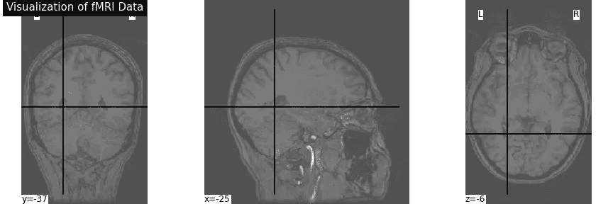
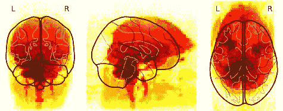
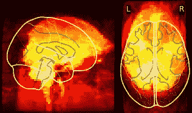

# 发现神经影像分析(第二部分)

> 原文：<https://towardsdatascience.com/discovery-neuroimaging-analysis-part-ii-b2cdbdc6e6c3?source=collection_archive---------35----------------------->

## 通过先进的可视化技术发现人脑

回波平面成像(图片由作者提供)

## 材料

这是该系列的第二篇文章，即“腹侧颞叶皮层时空功能磁共振成像的认知计算模型”。如果你想了解整个系列，请点击下面的链接。

<https://github.com/cankocagil/Cognitive-Computational-Modelling-for-Spatio-Temporal-fMRI-in-Ventral-Temporal-Cortex>  

我将介绍发现神经影像分析的主题，它们在大脑解码研究中的用例。让我们开始吧。

所有相关资料都放在我的 GitHub 页面上。别忘了去看看。如果你是一个纸质爱好者，你可以阅读这一系列文章的纸质版，也可以在我的回购中找到。

<https://github.com/cankocagil/Cognitive-Computational-Modelling-for-Spatio-Temporal-fMRI-in-Ventral-Temporal-Cortex>  

在本文中，我们利用最先进的解释性神经成像技术，如回波平面、感兴趣区域(RoI)、统计图、解剖学和玻璃脑方法，来可视化和预分析 fMRI 样本的视觉结构。

像在 ML 问题中一样，在处理之前理解、分析和可视化数据是至关重要的。

在这里，我们利用“Nilearn”框架，这是建立在“Scikit-Learn”之上的统计计算和神经成像平台，使研究人员能够管理、屏蔽、预处理和解码神经科学数据。在上一篇文章中，我展示了如何安装和导入 Nilearn framework。别担心。我将在本文中重复这个过程。让我们开始吧。

**通过神经成像发现功能磁共振成像分析**

我基于神经成像技术进行了预分析，以可视化数据集。为了实现这一点，我利用回波平面平均进行四维可视化，感兴趣区域(RoI)，统计地图，解剖，玻璃脑可视化工具嵌入在统计学习和神经成像框架中。

从现在开始，我将介绍不同的技术和可视化工具，以及它们在 Python 中简单而有效的实现。系好安全带！

但是，在此之前，如果您错过了上一篇文章(第一部分)，我提供如下安装指南。

安装代码

进口

正在获取哈克斯比数据

现在，我们可以开始实际的可视化过程。

**fMRI 体积和 EPI 的四维可视化**

回波平面成像是一种非常快速的磁共振(MR)成像技术，能够在几分之一秒内获得完整的 MR 图像[18]。在单次回波平面成像中，图像的所有空间编码数据都可以在单次射频激发后获得[18]。在这里，我们从额部、轴部和侧部区域的切面来可视化 Haxby 实验的受试者的 EPI。EPI 可视化提供了对大脑中激活区域的现实洞察，这在时空大脑解码中起着至关重要的作用。为了简单起见，我提供了与文章开头相同的图像。

功能磁共振成像体积(图片由作者提供)

回波平面成像(图片由作者提供)

**感兴趣区域分析**

分析 fMRI 数据的一种常见方法是执行感兴趣区域(RoI)分析，包括从特定区域提取信号。ROI 分析在理论上最不可知的用途是简单地探索全脑体素分析背后的潜在信号[17]。在提取统计上有意义的区域后，我们可以对多个统计测试而不是大脑中的大量体素执行校正的严重性。此外，大多数 ML 解码器是在对象的 RoI 上执行的，而不是在全脑介质上执行的。

RoI 可视化(作者图片)

**统计地图**

统计参数映射是指构建和评估空间扩展的统计过程，用于测试关于功能成像数据的假设[5]。一般来说，统计 fMRI 的前一步是创建一个阈值统计图，代表活跃的区域(高于阈值)[17]。因此，它在检查神经科学实验中记录的大脑活动差异方面是有用的。

统计地图计算

统计地图可视化(图片由作者提供)

**直接 fMRI 可视化**

fMRI 数据的简单和紧凑的可视化在神经成像的背景下是一个非常重要的课题，因为它使研究人员能够观察大脑皮层的活动。因此，我直接绘制了受试者 2 的时间平均 fMRI 数据，以便进一步可视化。

fMRI 数据的可视化(图片由作者提供)

**解剖可视化**

我将受试者 2 的时间平均 fMRI 数据获得的 fMRI 解剖结构可视化(默认为 3 个切面:正面、轴向和侧面),以在解码前产生洞察力。

解剖可视化(图片由作者提供)

**玻璃脑**

玻璃大脑是一种最先进的实时大脑可视化技术，创建于 Unity 3D 游戏引擎上，由英伟达的 GPU 计算提供支持[19]。它的输入包括从高分辨率 MRI-DTI 大脑扫描获得的个人大脑结构，包括组织和纤维束结构。使用高密度 EEG(脑电图)将实时大脑活动和网络间的功能交互叠加在大脑结构上[19]。这里，我投影了 5 号受试者的时间平均 fMRI 数据的正面、轴向和侧面。

玻璃脑视觉(图片由作者提供)

如果您想更进一步，以交互式 3D 方式可视化数据，下面是代码。

耶！本文到此为止。我深入讨论了最常见的 fMRI 数据可视化技术。

恭喜你！你完成了第二篇文章，并通过认知计算方法对人脑解码迈出了一步。

在下一篇文章中，我们将执行功能连接和相似性分析，以进一步捕捉人脑的统计特性。

## 文章链接

1.  **发表文章**

<https://cankocagil.medium.com/introduction-to-cognitive-computational-modelling-of-human-brain-part-i-90c61e0e24c9>  

2.

<https://cankocagil.medium.com/discovery-neuroimaging-analysis-part-ii-b2cdbdc6e6c3>  

3.

<https://cankocagil.medium.com/functional-connectivity-and-similarity-analysis-of-human-brain-part-iii-c427c88ca5bb>  

4.

<https://cankocagil.medium.com/unsupervised-representation-learning-on-distributed-regions-in-the-human-brain-part-iv-55fecf4e1b6f>  

2.**在路上(即将到来…)**

1.  第五部分的占位符

## 进一步阅读

*   【https://www.hindawi.com/journals/cmmm/2012/961257/ 

我在机器学习和神经科学方面的研究中使用了以下参考文献列表。我强烈建议复制粘贴参考资料，并简要回顾一下。

# 参考

[1]巴、基罗斯和辛顿。图层归一化，2016。

[2] L. Buitinck，G. Louppe，M. Blondel，F. Pedregosa，A. Mueller，O. Grisel，V. Niculae，P. Prettenhofer，A. Gramfort，J. Grobler，R. Layton，J. VanderPlas，a .乔利，B. Holt，10 和 G. Varoquaux。机器学习软件的 API 设计:scikit-learn 项目的经验。在 ECML PKDD 研讨会:数据挖掘和机器学习的语言，第 108–122 页，2013。

[3]褚，田，王，张，任，魏，夏，沈。双胞胎:重新审视《视觉变形金刚》中空间注意力的设计，2021。

[4] K .克拉默、o .德克、j .凯舍特、s .沙莱夫-施瓦兹和 y .辛格。在线被动攻击算法。2006.

[5] K. J .弗里斯顿。统计参数映射。1994.

[6]格罗斯、罗查-米兰达和本德。猕猴下颞皮质神经元的视觉特性。神经生理学杂志，35(1):96–111，1972。

[7] S. J .汉森、t .松坂和 J. V .哈克斯比。用于物体识别的腹侧颞叶组合编码。

[8]哈克斯比、戈比尼、富里、伊沙伊、斯豪滕和彼得里尼。《视觉物体识别》，2018。

[9]赫克曼、哈伊纳尔、贾巴尔、吕克特和哈默斯。结合标记传播和决策融合的自动解剖脑 mri 分割。神经影像，33(1):115–126，2006。

10d .亨德里克斯和 k .金佩尔。高斯误差线性单位(gelus)，2020。

[11]黄少华，邵文伟，王明林，张德庆.人脑活动视觉信息的功能解码:简要综述。国际自动化和计算杂志，第 1-15 页，2021。

[12] R. Koster、M. J. Chadwick、Y. Chen、D. Berron、A. Banino、E. Duzel、D. Hassabis 和 D. Kumaran。海马系统内的大循环复发支持跨发作的信息整合。神经元，99(6):1342–1354，2018。

[13]马奥尔。勾股定理:4000 年的历史。普林斯顿大学出版社，2019。

[14] K. A. Norman、S. M. Polyn、G. J. Detre 和 J. V. Haxby 超越读心术:功能磁共振成像数据的多体素模式分析。认知科学趋势，10(9):424–430，2006。

[15]奥图尔、江、阿卜迪和哈克斯比。腹侧颞叶皮层中物体和面孔的部分分布表征。认知神经科学杂志，17(4):580–590，2005。

[16] F .佩德雷戈萨、g .瓦洛夸、a .格拉姆福特、v .米歇尔、b .蒂里翁、o .格里塞尔、m .布隆德尔、p .普雷登霍弗、r .魏斯、v .杜伯格、j .范德普拉斯、a .帕索斯、d .库尔纳波、m .布鲁彻、m .佩罗特和 e .杜切斯内。sci kit-learn:Python 中的机器学习。机器学习研究杂志，12:2825–2830，2011。

17 r . a .波尔德拉克。功能磁共振成像的感兴趣区域分析。社会认知和情感神经科学，2(1):67–70，2007。

[18] M. Poustchi-Amin、S. A. Mirowitz、J. J. Brown、R. C. McKinstry 和 T. Li。回波平面成像的原理和应用:普通放射科医师回顾。放射学，21(3):767–779，2001。

[19] R. P. Reddy，A. R. Mathulla 和 J. Rajeswaran。心理健康专家的观点采择和情绪传染的初步研究:移情的玻璃脑观点。印度心理医学杂志，0253717620973380，2021 页。

[20]史密斯、米勒、萨利米-科尔希迪、韦伯斯特、贝克曼、尼科尔斯、拉姆齐和伍尔利奇。功能磁共振成像的网络建模方法。神经影像，54(2):875–891，2011。

21 田中先生。下颞叶皮层和物体视觉。神经科学年度评论，19(1):109–139，1996。

[22] M. S .特雷德。Mvpa-light:一个多维数据的分类和回归工具箱。神经科学前沿，14:289，2020。

[23] M. P .范登赫维尔和 H. E .波尔。探索大脑网络:静息态功能磁共振成像功能连接综述。欧洲神经精神药理学，20(8):519–534，2010。

[24] G. Varoquaux，A. Gramfort，J. B. Poline 和 B. Thirion。大脑协方差选择:使用群体先验的更好的个体功能连接模型。arXiv 预印本 arXiv:1008.5071，2010。

[25] Y. Wang，J. Kang，P. B. Kemmer 和 Y. Guo。一种利用偏相关估计大规模脑网络功能连接的有效可靠的统计方法。神经科学前沿，10:123，2016。

26s . Wold、K. Esbensen 和 P. Geladi。主成分分析。化学计量学和智能实验室系统，2(1–3):37–52，1987。

27s . Wold、K. Esbensen 和 P. Geladi。主成分分析。化学计量学和智能实验室系统，2(1–3):37–52，1987。