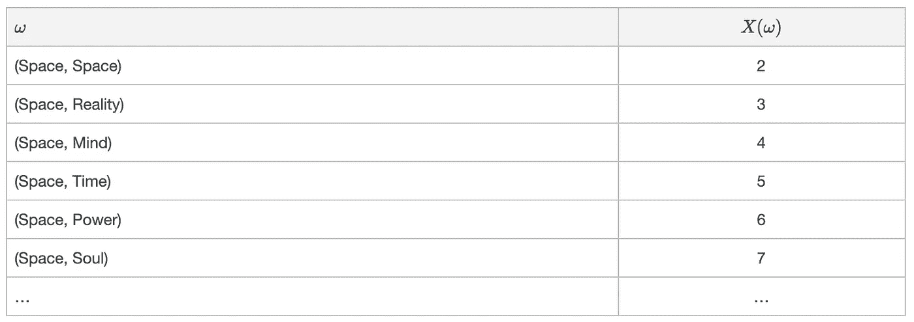
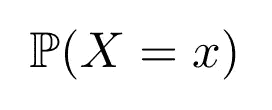
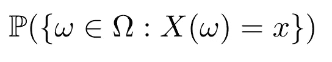
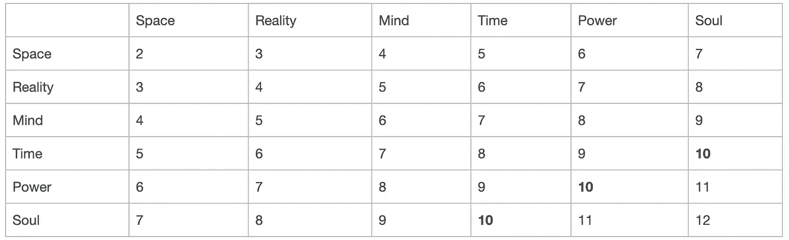
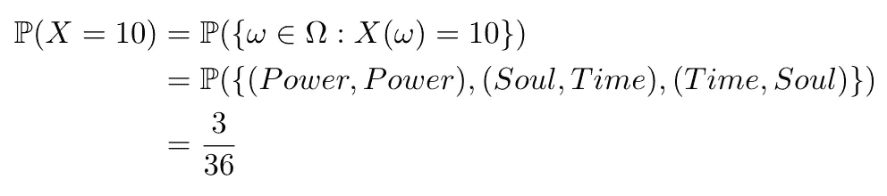
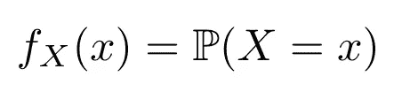
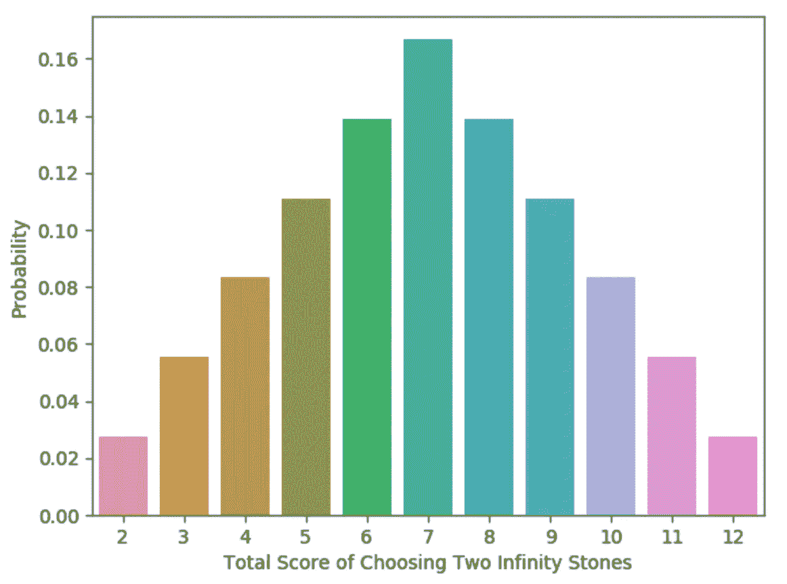
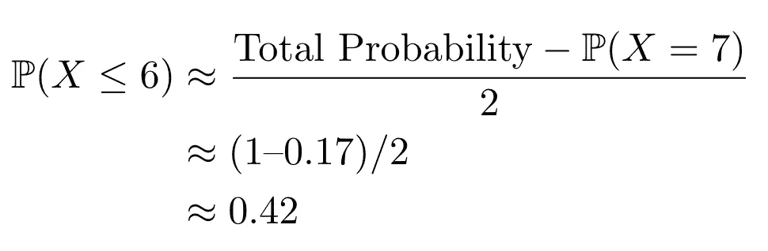

# 用 Python 解释离散随机变量和 PMF

> 原文：<https://towardsdatascience.com/discrete-random-variables-and-pmfs-explained-using-python-23b15948f9bc?source=collection_archive---------20----------------------->

## 学习如何掌握概率质量函数(PMF)

在 [Unsplash](https://unsplash.com?utm_source=medium&utm_medium=referral) 上由 [Max Duzij](https://unsplash.com/@max_duz?utm_source=medium&utm_medium=referral) 拍照

当我刚开始学习统计学的时候，我多次使用随机变量的概念，但并不真正知道随机变量是什么。我们在假设检验、模型拟合和无数其他领域使用它。在本帖中，我们将基于之前建立的概率基础来理解随机变量有多重要。

让我们从形式定义开始

**(数学定义)**随机变量是一个**映射**或**函数**x:ω→ℝ，它给每个结果ω分配一个实数 X(ω)。

ω和ω应该看起来很熟悉，因为我们在以前的帖子中已经详细讨论过它们。然而，由于几个原因，这个定义可能会令人困惑。首先，我们将每个结果分配给什么实数？还有，我们为什么要给实数赋值呢？为什么我们**需要**随机变量？

这些问题都会有答案，继续看下去就好。

让我们把这个概念和流行文化联系起来。在之前的[帖子](/infinity-stones-and-sample-spaces-ad890c9be950)中，我们讨论了漫威电影宇宙(MCU)中的无限宝石。这些宝石是贯穿 MCU“阶段”的故事的核心，也被称为“无限传奇”。

让我们从给每个代表其整体能力的无限宝石赋值开始。假设我分配了以下总分数:

1.  灵魂:6(最强大)
2.  功率:5
3.  时间:4
4.  头脑:3
5.  现实:2
6.  空间:1(最弱)

我想我选择这些值的原因是为了另一天。**我们让随机变量 X 是选择的两个无限宝石的分数之和**。我意识到每个宇宙只有六块石头，所以让我们也假设我们从一个使用量子领域的另一个现实中借用了六块相同的石头。我们知道在样本空间ω中有 36 种可能的样本结果:

所以，现在我们有了随机变量配方中的所有成分，首先，我们描述了实验(选择两个无限宝石)，其次，我们给每个样本结果赋予一个值。这组值 X 被认为是一个随机变量。请记住，随机变量不像代数中那样采用单一值，它可以采用给定集合中的任何值({2，3，4，5，6，7，… })。它随机假设这些值中的任何一个，因此被称为“随机”变量。这和概率有什么关系？让我们来看看下面的符号

这是以下内容的“简写”:

“ℙ(X = x”简单来说就是随机变量 x 取值 x 的概率是多少，所以让我们回到我们的例子来真正理解这个方程。假设我们在选择了两个无限大的石头后，构建了一个分数总和的矩阵:

力量值等于 10 的概率是多少？嗯，本质上这个问题是问ℙ(X = 10) =？。我们知道这一点

你有它！现在我们明白随机变量和概率的关系了！我们刚刚讨论的例子被认为是两种随机变量中的一种。它被称为**离散随机变量**，因为它可以假设有[可数](https://en.wikipedia.org/wiki/Countable_set)个值。第二种随机变量被称为**连续随机变量。**

现在，如果有一个函数来描述获得一个随机变量可以假设的所有不同值的概率之间的关系，那不是很好吗？正好有这样的功能！该函数被称为**概率函数**，对于离散随机变量
，我们将该函数称为**概率质量函数** (PMF)，定义如下:

那么，让我们用 python 这种奇妙的语言来更好地理解概率函数的威力吧！我们不会详细讨论代码，我们假设你们大多数人都具备 python 的工作知识。

正如你所看到的，PMF 允许我们可视化一个随机变量，并使我们能够轻松地回答问题，如ℙ(X ≤ 6)。这种说法本质上是在问:选择两块石头导致总分小于等于 6 的概率是多少？现在，如果我们看我们的 PMF 图形，我们可以看到它是对称的，以 7 为中心。我们也知道所有的概率需要加到 1。所以只要做以下事情:

我们使用强大的 PMF 来确定有 42%的机会选择 2 颗总分不超过 6 分的无限宝石。

在这篇文章中，我们定义了一个离散的随机变量，提供了一个例子，编码，并演示了如何使用 PMF 可视化和研究随机变量。