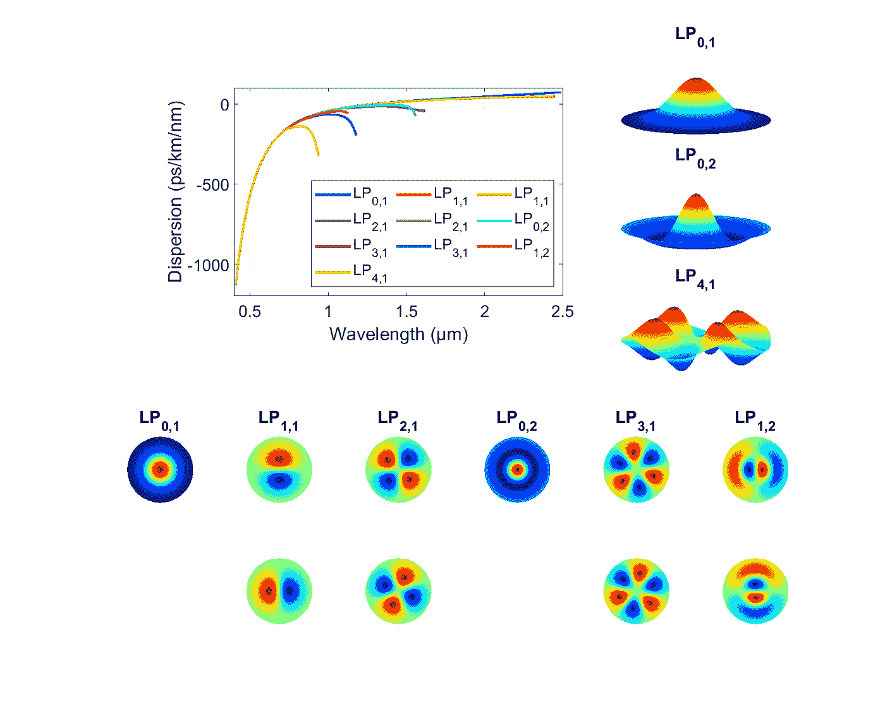
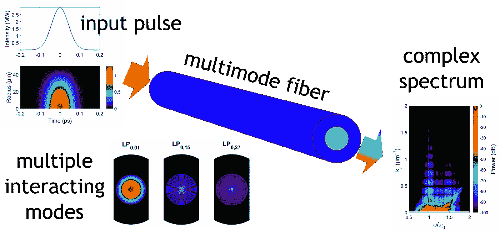
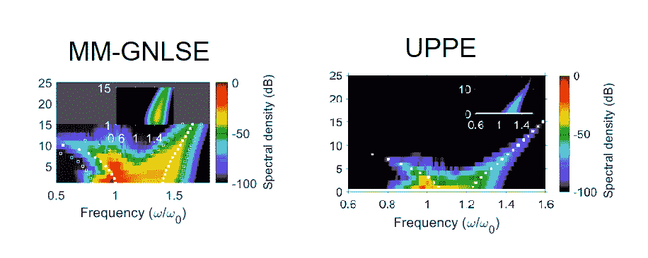

# 多模光纤中的离散锥形发射

> 原文：<https://towardsdatascience.com/discretized-conical-emission-in-multimode-optical-fibers-fd3e15dae151?source=collection_archive---------40----------------------->

## [思想和理论](https://towardsdatascience.com/tagged/thoughts-and-theory)

## *在这项工作中，我们介绍了导致离散锥形发射的多模光纤中非线性脉冲传播的数值模拟结果。*

照片由[约翰·亚当斯](https://unsplash.com/@johnladams?utm_source=medium&utm_medium=referral)在 [Unsplash](https://unsplash.com?utm_source=medium&utm_medium=referral) 拍摄

非线性光学是光学的一个分支，它研究的是由于光引起的物质光学性质的改变而产生的现象。光纤是研究非线性现象的一种非常有吸引力的介质。由于纤芯的小尺寸和光纤的几何形状允许光传播很长的距离，即使初始脉冲的功率相对较低，波导也会表现出非线性。

光纤中非线性现象研究的重要部分涉及单模光纤。由于它们的设计，对于给定的光频率，它们只允许一种模式传播。在实践中，它们被用于光纤网络传输信息。最近，对多模光纤的兴趣带来了关于时空非线性效应和模间频率转换的有趣结果[1–3]。**这种兴趣与多模光纤在电信网络中的潜在用途有关。**在这种类型的光纤中，对于给定的频率，存在许多被引导的光的空间分布。**以不同模式发送信息允许吞吐量的进一步倍增，尽管这需要开发以多种模式同时发送、重定向和接收信息的方法**【4】。

# 多模光纤

多模光纤可以支持给定波长的多种导模。它们的数量由所研究光纤的光频和折射率分布决定。**每种导模都以特定的方式传播，这可以表现为其电磁场分布。**线偏振(LP)模式的识别基于确定沿两个场横截面的极值数量:径向和横向。根据波长和折射率分布，相同模式的场分布可能略有不同。

*多模光纤中模式解的电磁场归一化分量示例。*图片作者。

同时，我们可以把多模光纤看作是块体材料和单模光纤之间的过渡材料。这使得它们成为探索这两种物质介质中发生的非线性现象之间的联系的理想选择。这种非线性现象之一是**圆锥形发射，大量观察到围绕中心光点的彩色环**【5，6】。此外，在我们最近的工作中，我们将体介质中描述的锥形波的概念推广到结构化介质，如多模光纤，其中只有离散和有限数量的模式可以传播[7，8]。

# 数值模拟

我们比较了模拟多模光纤中非线性传播的两种数值方法:广义多模非线性薛定谔方程(MM-GNLSE) [9]，它考虑了电场的模式分解和模间非线性耦合，以及单向脉冲传播方程(UPPE) [10，11]，它已被广泛用于研究大块透明介质和气体中的非线性光学。

在这两种方法中，我们可以区分色散项和非线性项。一般来说，作为一个严格的规则，色散部分决定了介质中的光速和一些电磁损耗，而非线性部分与光纤中观察到的非线性效应有关(特别是可以以一些频移的形式观察到)。通常使用分步傅里叶变换方法(SSFM)分离和描述色散和非线性，该方法在所有用于这类问题的比较数值方案中花费最少的计算时间。

数值工具为在多模光纤中发生的非线性现象的计算研究中深入检查光传播提供了极好的机会。此外，**获得的数值模拟结果支持实验工作**，并允许表明诱人的现象。通过数值模拟，人们可以获得关于光在整个传播距离上的所有信息(不仅仅在输出上测量)。**此外，可以打开和关闭求解方程的不同项(事实上不包括特定的现象)，以理解潜在的物理学。**

然而，大多数时候，导出的数值模型仅支持定性的实验结果，特别是当涉及的模式数量变得显著(即高于 10)并且超宽带频率转换过程(即超过一个倍频程)也发生时。迫切需要阐明数值模型的潜力和适用范围，以促进未来非线性和多模光纤器件的精确设计。

# 离散锥形发射

在我们的研究中，我们研究了超短脉冲在多模光纤中的传播(输入激光脉冲的持续时间为飞秒),其峰值功率在临界功率附近，临界功率被定义为可以施加到材料上而不破坏它的最高可能功率。我们观察到的形成，我们称之为离散锥形波，确切地说是离散 X 波。

*所考虑设置的示意图。*图片作者。

在色散非线性体介质中，特别是在成丝机制中，已经对锥形发射进行了深入研究[6]。对正常色散(群速度随光频增加而降低)中的光丝的解释通常呈现典型特征，如脉冲分裂和锥形发射，并且可以假设脉冲为自发出现的非线性 X 波来解释。更具体地说，离轴(圆锥形)尾出现在输入波长的蓝移侧和红移侧，形成圆锥形发射的通用清晰 X 形图案。发现输入脉冲可以向最终稳态演化，最终稳态具有正常色散范围内的 X 波或异常色散范围内的 O 波的形式(其中群速度随着光学频率的降低而降低)。非线性 X 波和 O 波因其明显的 X 形和 O 形而得名，它们分别出现在近场和远场中。

色散的符号决定了飞秒细丝的动力学，并因此决定了相关超连续谱的时间-频率内容(产生的白光由非常宽的频率范围组成)。已经证明，色散景观是准确模拟锥形发射的关键因素，因为它决定了锥形发射模式的具体形状:正常色散为 X 形，异常色散为 O 形，或者当泵浦接近零色散时为鱼形。在多模光纤的情况下，只有离散数量的导模可用，并且期望离散的锥形发射。每种模式中锥形波成分的光谱位置可以通过使用实验得出的相位匹配条件来预测[7]。

两种建模方法传播 2 厘米后的模式数分辨 X 波锥形发射光谱。白色方块表示每个空间模式中的中心相位匹配频率。在 MM-GNLSE 的情况下，我们只研究了 15 种模式，它们可以在所研究的光纤中传播。图片作者[8]。

当比较使用两种模型获得的结果时，我们看到关于与自聚焦相关的强光谱展宽以及来自基模 LP01 的高阶模中的能量扩散的定性一致。我们还指出了 X-模式形成的典型特征。然而，与 UPPE 方法相比，MM-GNLSE 显然高估了整体非线性响应，从而导致更大的频谱、时空域中更高的峰值功率以及高阶模式中更大的功率谱密度。

# 结论

在我们的实验中，我们通过比较两种众所周知的建模方法，数值研究了超短脉冲在多模阶跃折射率石英光纤中传播的高度非线性机制。

我们的主要结果显示了非线性响应的频率色散对飞秒范围内脉冲分裂和超连续谱动力学的强烈影响。从实验的角度来看，这种容易实现的泵浦方式似乎是揭示近似数值模型(如 MM-GNLSE)的一些局限性的良好起点。此外，我们表明，由此产生的时空动力学与锥形波的形成。

*波兰国家科学中心共同资助的项目(项目编号 2018/30/E/ST7/00862，索纳塔 BIS 8 计划)。*

*原载于 2021 年 8 月 18 日*[https://majsylw . netlify . app](https://majsylw.netlify.app/post/conical/)*。*

# 文学

[1] W. H .伦宁格和 F. W .怀斯。*渐变折射率多模光纤中的光孤子*。《自然通讯》, 4:1716–1719，2013。

[2] L. G. Wright、D. N. Christodoulides 和 Frank W. Wise*多模光纤中可控的时空非线性效应*。《自然光子学》, 2015 年 9:306–310。

[3] K .克鲁帕、a .托内洛、a .巴泰勒米、t .曼苏尔扬、v .库德尔茨、g .米洛特、p .格雷卢、d .莫托托、S. A .巴宾和 s .瓦布尼茨。*多模非线性光纤，时空大道*。APL 光子学，4(11):110901，2019。

[4] D.J .理查森、约翰·菲尼和林恩·纳尔逊。*光纤中的空分复用*。《自然光子学》, 7:354–362，2013 年 5 月。

[5]阿尔法诺和夏皮罗。*在玻璃中通过四光子耦合在 4000 到 7000 范围内发射。*物理评论快报，24:584–588，1970 年。

[6] D. Faccio，A. Couairon 和 P. Di Trapani。*锥形波、细丝和非线性成丝光学*。阿拉卡内，罗马，2007 年。

[7] B .基布勒和 p .贝约特。*多模光纤中的离散锥形波*。物理评论快报，126(2):023902，2021。

[8] K. Tarnowski、S. Majchrowska、P. Bejot 和 B. Kibler。*多模光纤中超短脉冲传播和锥形发射的数值模拟*。美国光学学会学报 B，38(3):732，2021。

[9]波莱蒂和霍拉克。*描述超短脉冲在多模光纤中的传播*。美国光学学会杂志 B，25:1645–1653，2008。

[10] M .科莱西克、J . V .莫洛尼和 M .姆莱涅克*单向光脉冲传播方程*。物理评论快报，89(28):283902，2002。

11j . Andreasen 和 M. Kolesik。*光在结构化介质中的非线性传播:广义单向脉冲传播方程*。物理评论 E —统计、非线性和软物质物理学，86(3):1–9，2012。

<https://www.osapublishing.org/josab/abstract.cfm?uri=josab-38-3-732> 