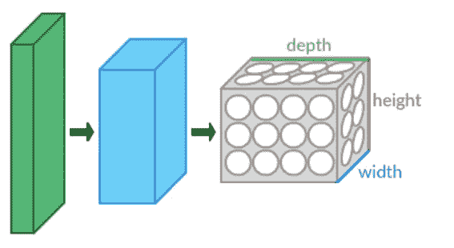
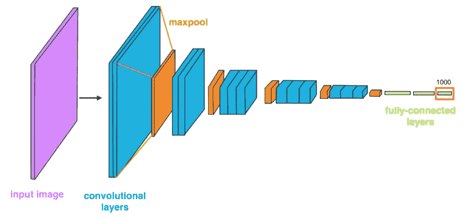
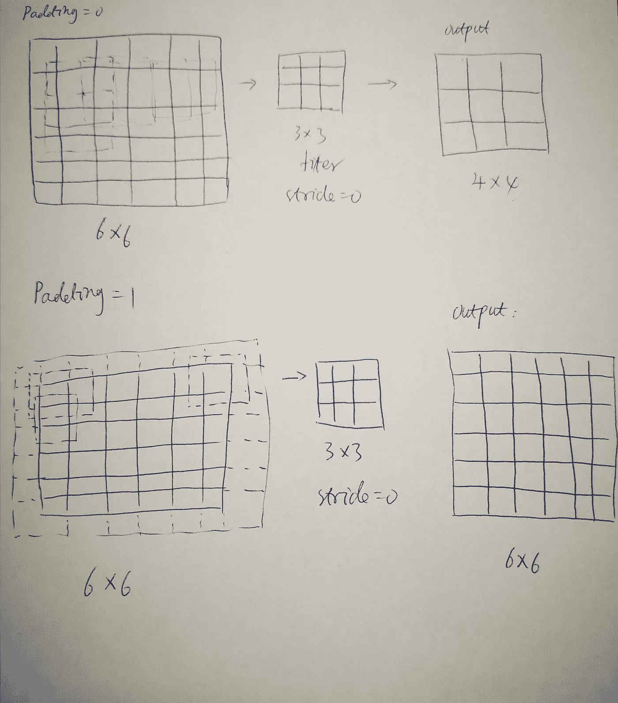

# 用公式表示简单 CNN 的形状和参数数量

> 原文：<https://towardsdatascience.com/discuss-the-dog-image-classification-project-with-cnn-bc5c90ee4fec?source=collection_archive---------19----------------------->

## 以及 CNN 项目的其他挑战



维基上的照片由 [Aphex34](https://commons.wikimedia.org/w/index.php?curid=45661858) 拍摄

今天我想展示一个例子，如何计算一个简单的卷积神经网络的形状和参数数量，还包括一些其他的经验。它以狗分类项目为例。这是入门级的，不精通技术，但欢迎您的专业意见，以帮助我更好地理解这个主题。

我们开始吧。

**问题 1:计算 CNN 模型的形状和参数个数**

假设您了解 CNN 的架构。一个 CNN 模型有五个卷积层，包括池层，三个全连接层，1000 个输出分类，如下图所示。



图片来自 Udacity DL ND

请提醒:

> **我们需要为全连接层 1 的空间维度计算 CNN 模型的形状，并且我们*不需要计算*模型的参数数目来构造 CNN 模型，但是必须*知道*卷积层中的参数数目。**

**CNN 模型中的参数:**

假设`__init__`函数中的卷积层使用以下格式:

```
self.conv = nn.Conv2d(in_channels, out_channels, kernel_size, stride, padding)
self.pool = nn.MaxPool2d(kernel_size,stride)
self.fc = nn.Linear(in_features, out_features)
```

将使用的参数有:

*   `in_channels` -输入的数量(深度)，例如 RGB 图像为 3。
*   `out_channels` -输出通道的数量，即构成卷积层的过滤“图像”的数量，或者将应用于输入的唯一卷积核的数量。
*   `kernel_size` -指定(平方)卷积内核和池内核的高度和宽度的数字。
*   `in_features` -每个输入样本的大小
*   `out_features` -每个输出样本的大小

**除了全连接第 1 层的 in_features(这是计算模型形状的目标)之外，所有参数都将给出(由您决定)。**

现在让我们检查给定的 CNN 模型。它包含卷积层、批量标准化层、激活函数、池层和完全连接层。

**计算卷积层的形状**

当我们说卷积层的形状时，它包括**空间维度和层的深度**。

*卷积层的* ***空间维度*** *(x，y)可以计算为:* `***(W_in−F+2P)/S+1*** *.*`

*卷积层的* ***深度*** *将始终等于滤波器的数量* `*K*` *。*

*   `K` -卷积层中的滤波器数量
*   `F` -卷积滤波器的高度和宽度
*   `S`——回旋的大步
*   `P` -填充
*   `W_in` -前一层的宽度/高度(平方)

同时:

*   `K` = `out_channels`
*   `F` = `kernel_size`
*   `S` = `stride`
*   `W_in`是`input_shape`元组的第一个和第二个值(比如 224*224，W_in=224)。

代码给出的参数:

`input_shape`元组:224* *224** 3(RGB)

`out_channels`从 conv1，2，3 是:32，64，128

`kernel_size` =F : 3x3，

`padding` =1 用于三个卷积层

`stride`在 conv1，2，3=1

`stride`在 maxpool=2

我们来计算一下:

Conv1 输入:W_in =224，F=3，P=1，S=1，in_channels=3，out_channels=32

Conv1 输出:conv1 输出的(x，y)大小:(224–3+2 x1)/1+1 = 224，depth_1=out_channels=32。

池化第 1 层输入:W_in=224，kernel_size=2，stride=2

池层 1 输出:
最大池层后输出的 x-y 大小:224/2(kernel_size)=112

Conv2 输入:W_in=112，内核大小=3，in_channels=32，out_channels=64

Conv2 输出:conv2 输出的 x-y 尺寸:(112–3+2 x1)/1+1 = 112，depth_2=64

池化第 2 层输入:W_in=112，kernel_size=2，stride=2

第 2 层输出池:112/2=56

Conv3 输入:W_in=56，内核大小=3，in_channels=64，out_channels=128

Conv3 输出:conv3 输出的 x-y 尺寸:(56–3+2 x1)/1+1 = 56，depth3=128

池化第 3 层输入:W_in=56，kernel_size=2，stride=2

池化第 3 层输出:56/2=28

**来自池层 3 的输出大小:28*28*128=100352，将作为全连接层的输入。**

FC1:尺寸变为 100352*1，输出 2500*1

FC2:尺寸从 2500*1 到 500*1

FC3:尺寸从 500*1 到 133*1

现在我们看看 128*28*28 是怎么来的。理论上，一旦我们得到了形状，模型的设计就完成了，但我们最好知道这个模型有多少参数，以便更清楚地了解这个过程。

**计算卷积层中的参数数量**

卷积层中参数的数量取决于所提供的`filters/out_channels`、`kernel_size`和`input_shape`的值。

*   `D_in` -前一层的深度
*   `F` -卷积滤波器的高度和宽度
*   `K` -卷积层中滤波器的数量

同时:

`K` = `out_channels`

`F` = `kernel_size`

`D_in`是`input_shape`元组中的最后一个值，通常为 1 或 3(分别为 RGB 和灰度)。

计算过程为:

*   每个过滤器都有`F*F*D_in`重量
*   卷积层由`K`滤波器组成
*   卷积层中权重的总数是`K*F*F*D_in`
*   每个滤波器有一个偏差项，卷积层有`K`偏差
*   *卷积层中的* ***参数数量*** *为* `***K*F*F*D_in + K***`

对于每一层:

**输入层:**输入层所做的就是读取输入图像，所以这里没有你可以学习的参数。

**池层**:该层没有需要学习的参数。

**卷积层:**

**conv1** :每个滤波器有 3*3*3 个权重，该层由 32 个滤波器组成，该层的权重数为 3*3*3*32，加上 32 个偏差，该层的参数数为 3*3*3*32+32=896

**conv2** : k=64，F=3，D_in=32，参数个数= 64*3*3*32+64=18496

**conv3** : k=128，F=3，D_in=64，参数个数=128*3*3*64+128=73856

**FC1** :在全连接层中，所有输入单元对每个输出单元都有单独的权重。对于 100352 个输入和 2500 个输出，权重数为 100352*2500=250880000。此外，该层对于每个输出节点都有一个偏差，因此有(100352+1)*2500=250882500 个参数。

**FC2**:(2500+1)* 500 = 1250500

**FC3** : (500+1)*133=66633

现在我们看看有多少参数将被模拟。

附加信息:

*   添加 BatchNorm2d 层有助于通过最小化内部协变量偏移来提高测试精度。
*   “放弃”设置为 0.2，以消除过度拟合效果。

我知道这个过程很长，可能会很无聊:-)，但这是基本的，如果一旦理解了这个案例，对理解类似的案例会有很大的帮助。

**问题 2:自己验证空间维度公式**`***(W_in−F+2P)/S+1***`

**如何验证空间维度公式？可以参考[cs 231n 课程链接](https://cs231n.github.io/convolutional-networks)查看理论。但对我来说，一个例子会帮助我牢牢记住它。**

****

**来源:图片由作者提供**

**情况 1: padding =0，stride=0，输入:6x6，滤波器:3x3，输出(x，y)大小怎么样？(6–3)/1+1=4**

**情况二:填充=1，步幅=0，输入:6x6，滤波器:3x3，输出(x，y)大小怎么样？(6–3+2)/1+1=6**

**没有公式，你有什么答案？以及你的答案是否符合公式(W_in-F+2p)/S+1 的结果？**

**我们可以看到，填充保持了目标与输入具有相同的大小，这将减少信息损失。**

****问题 3:图像转换器的一些隐含知识和规则****

****一些隐性知识**更好地了解:**

****OpenCV** 的检测器需要输入的图像是灰度的，但对大小没有要求。**

**VGG16、VGG19 和 ResNet 接受 224x224 的图像大小，而 Inception V3 和 Xception 接受 299×299 的图像大小。**

****使用 ImageNet 中的图像创建 CNN** 事实上，您可以选择自己的图像大小，不同于 VGG16: 240x240 或 256x256，但您必须确定大小，因为 ImageNet 中的图像大小是多种多样的。**

****图像数据集****

**CIFAR-10:包含 10 个固定大小的类图像:32x32x3，有 60000 个图像，每个类包括 6000 个。这十类是飞机、汽车、鸟、猫、鹿、狗、青蛙、马、船和卡车。**

**MNIST:包含 60，000 个 28×28 像素的灰度图像，手写的位数在 0 到 9 之间。**

**ImageNet:ImageNet 中的图像有各种尺寸，如 224×224、227×227、256×256 和 299×299 等。**

****一些规则:****

**图像预处理我没有找到确切的规则，只有一些零散的规则。有欢迎分享。下面的规则是我从[这个 StackOverflow 线程](https://stackoverflow.com/questions/61637447/validation-set-augmentations-pytorch-example/61637688#61637688)中搜索到的，很有帮助:**

1.  ***"* 随机数据扩充只允许在训练集上进行，您可以将数据扩充应用于验证集和测试集，前提是这些扩充都不是随机的"。**
2.  **“当您在验证和测试集上使用规范化时，您*必须*使用与您在训练集上使用的完全相同的因子。”**
3.  **需要调整大小然后居中裁剪是因为 val 集需要来自训练集的同一域，因此，如果前者被随机调整大小并裁剪为 224，则 val 集需要确定性地调整大小和裁剪。**

**在今天的故事中，我将重点讨论计算一个简单 CNN 模型的形状和参数数量，并包括一些其他挑战。**

**感谢您的阅读。**

**参考资料:**

1.  **【https://pytorch.org/docs/stable **
2.  **Udacity 深度学习纳米学位**
3.  **[https://cs231n.github.io/convolutional-networks](https://cs231n.github.io/convolutional-networks/)**