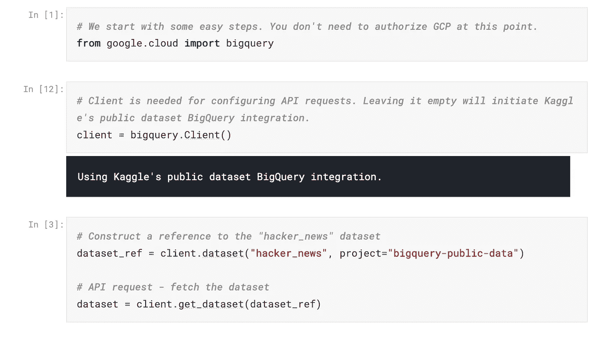
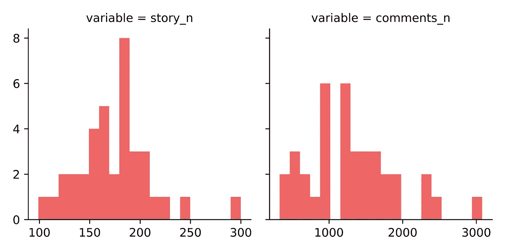
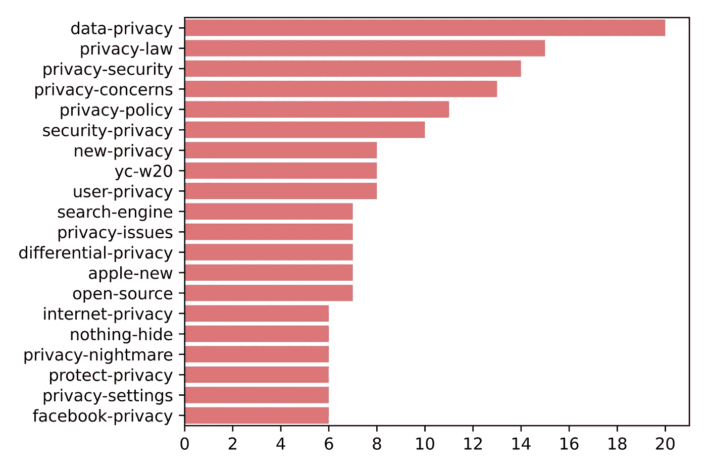
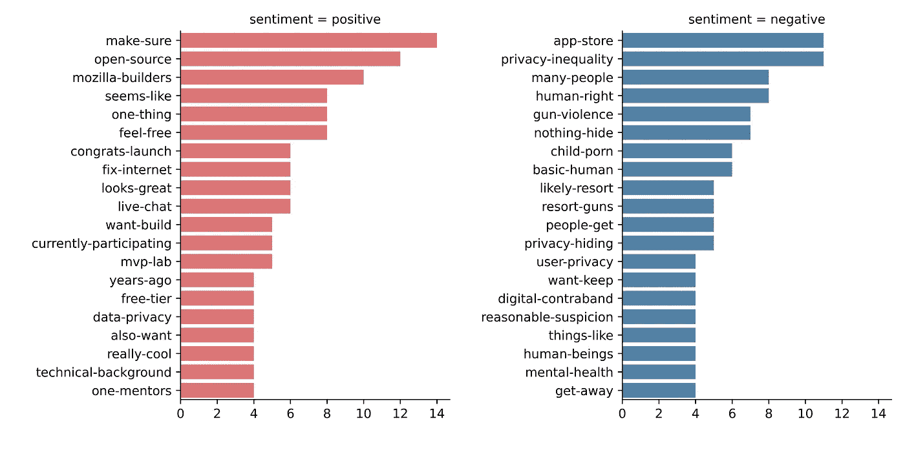
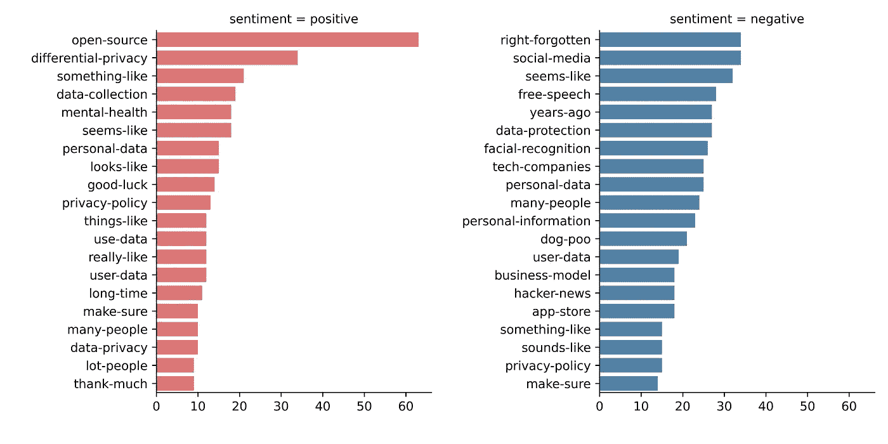

# 黑客新闻中的隐私讨论:探索性文本挖掘分析

> 原文：<https://towardsdatascience.com/discussing-privacy-at-hacker-news-an-explorative-text-mining-analysis-f94c62802df9?source=collection_archive---------32----------------------->

我们用 Google BigQuery 汇编了一个数据集，并用简单的文本挖掘方法分析了关于隐私的帖子。

凯文·Ku 在 Unsplash 上的照片

> 作为 [NGI 前进](https://research.ngi.eu)项目的一部分，[德拉布·UW](http://www.delab.uw.edu.pl)正在支持欧盟委员会的[下一代互联网](https://www.ngi.eu)计划，确定与互联网相关的新兴技术和社会问题。我们的团队一直在尝试各种自然语言处理方法，以发现不同类型的在线媒体中的趋势和隐藏模式。您可以在 [https://fwd.delabapps.eu](https://fwd.delabapps.eu) 找到我们的工具和演示。

# **简介**

近年来，隐私一直是科技讨论的关键话题之一。虽然自 GDPR 问世以来已经过去了近 3 年，但隐私争论仍未尘埃落定。事实上，新的发展每天都在出现:仅举几个最近几周的新闻，例如“ [cookie 启示录](https://www.ft.com/content/169079b2-3ba1-11ea-b84f-a62c46f39bc2)”、围绕新的热门社交媒体平台 Clubhouse 的[数据实践](https://www.wired.co.uk/article/clubhouse-app-privacy-security)的问题，或者 Whatsapp 隐私政策的[争议性更新](https://www.theverge.com/2021/1/12/22226792/whatsapp-privacy-policy-response-signal-telegram-controversy-clarification)。因此，鉴于这一领域发生了如此多的事情，我们想更深入地了解是什么推动了 infosec 社区中的对话。

在这个分析中，我们关注黑客新闻中的帖子和评论。使用谷歌的 BigQuery，我们收集了 2018 年 1 月至 2021 年 1 月期间所有带有“隐私”一词的帖子。要查看我们关于 BigQuery 和黑客新闻的教程(以及我们如何设法收集帖子的所有评论——这是一项需要一些 SQL 技巧的任务),请前往这个 [Kaggle 笔记本](https://www.kaggle.com/michapaliski/hackernews-analysis-with-bigquery)。

数据收集的分步指南在[这里](https://www.kaggle.com/michapaliski/hackernews-analysis-with-bigquery)

# 数据集

我们的数据集包含大约 65000 个故事(帖子),收到了近 50000 条评论。每个故事的平均评论数是 7.6，但是，它们的分布非常不均匀，因为 69%的故事没有收到任何评论。另一方面，评论最多的故事吸引了 626 条评论。

每月的故事和评论数量如图 1 所示。平均每月有 175 篇报道被发布，收到 1330 条评论。虽然随着时间的推移，这些价值观的演变并没有显示出强劲的趋势，但在 2018 年 4 月，就在 GDPR 被采纳前后，评论和帖子都出现了显著上升。

图一。每月故事/评论的分布

# **结果**

首先，让我们找出评论最多的故事:

*1.1.1:快速、隐私优先的消费者 DNS 服务*

*告诉 HN: Triplebyte 逆转，邮件道歉*

*告诉 Triplebyte 面试？您的个人资料即将公开*

问 HN:Gmail 的最佳替代品是什么？

*Zoom 需要清理其隐私法*

这些标题让我们知道是什么样的故事在推动参与:交流对隐私保护技术(如 DNS 解析器、电子邮件服务)的见解，并讨论有争议的数据处理实践。

为了更全面地了解热门报道，让我们关注评论数量最多的 20%的报道(最少 8 条评论)。在对标题进行标记并删除停用词之后，最常见的二元模型被识别出来，如图 2 所示。除了常见的疑点(如数据隐私、隐私安全等)，列表中还可以找到一些有趣的概念。这样的例子是 [*差分隐私*](https://desfontain.es/privacy/differential-privacy-awesomeness.html) ，这是一套[新兴的方法学](/a-high-level-introduction-to-differential-privacy-edd20e6adc3b)，在包含个人信息的数据库中保护个人用户的匿名性。

图二。标题中最常见的二元结构

我们可以更进一步，给我们的研究增加一个新的维度:情绪。使用 [VADER](https://github.com/cjhutto/vaderSentiment) 我们计算了每个评论的综合情感得分，并根据评论的平均情感得分对故事进行了排序。VADER 将社交媒体文本文档分为三类:正面(> 0.05 分)、中性(> -0.05 和< 0.05)和负面(< -0.05)。为了对这些故事有一个总体的了解，让我们来看看 10 个最积极和最消极的故事的标题:

**阳性(得分在 0.75 — 0.59 之间)**

问 HN:iPad 作为以 SSH 为中心的开发机器准备好了吗？

*向 HN 展示:米德——我是如何反击媒体的*

问 HN:我如何准备一份实施顾问的工作？

*我们是 Mozilla 新的创业孵化器。AMA*

*Windows 10 vs. Mac，什么更能避免遥测隐私问题？*

*启动 HN:测序生物(YC S19)——纽芬兰的药物发现遗传学*

*展示 HN:用于互联网透明和数据隐私的开源 Chrome 扩展*

*用 Tor？您的隐私可能被泄露*

*发布 HN: Papercups (YC S20) —开放核心内部通信替代方案*

*问 HN:生活在贫困线上，你如何省钱？*

**阴性(得分在-0.32 — -0.17 之间)**

*DuckDuckGo 的隐私滥用——当前、历史和代理*

是时候换一个隐私浏览器了

*第九巡回法庭更进一步，在边界设备搜索中保护隐私*

问 HN:科技人群——你对利用科技解决枪支暴力有什么想法？

隐私不平等:你所能想象的最残酷的不平等形式

谷歌和脸书在国会面前滔滔不绝地谈论隐私

*为什么隐私很重要，即使“你没什么好隐瞒的”*

*苹果在数据隐私上是个伪君子*

问 HN:为什么我们允许谷歌的滥用？

*《我没什么好隐瞒的》和其他对隐私的误解(2007)*

为了更深入，让我们也检查一下属于这些故事的评论中最常见的二元模型(图 3)。

图三。评论中的二元模型(10 个最积极/消极的帖子)

标题和评论的洞察力为我们提供了这些讨论的地图。黑客新闻是创业公司介绍自己的热门地点(例如*发布 HN* 系列)，因此一些关注隐私的新创企业和开源项目被捕获。该列表还包括精通技术的用户认可的工具(例如，用 iPad 连接到远程工作站或提供隐私信息的开源浏览器扩展)。

另一方面，负面评论的帖子不仅涉及隐私和常见嫌疑人(广告业务中的科技巨头)，还涉及关于用技术解决社会挑战的辩论，如枪支暴力。最负面的故事也包括意想不到的嫌疑人，如保护隐私的搜索引擎 Duckduckgo。然而，仔细研究后，似乎 Duckduckgo 上的[故事有最多的负面评论，因为用户对帖子中的论点提出了质疑。](https://news.ycombinator.com/item?id=23722063)

其余正面和负面故事中的评论如何？图 4。列出了前 50 个故事中的二元模型，不包括我们已经讨论过的前 10 个。

图 4。评论中的二元模型(前 11-50 个帖子)

虽然正面评论没有提供更多信息，但负面评论介绍了技术和政策方面的关键概念:*被遗忘的权利*，*言论自由，面部识别*(狗屎？可能没那么重要)。

# **结论**

在 Google BigQuery 的帮助下，我们在 Hacker News 上收集了一组涉及隐私的帖子。这个练习表明，即使是简单的探索性分析(频繁的二元模型和情感分析)也能为技术社区讨论的两极分化的话题提供有意义的见解。数据的潜力要大得多:首先，数据结构支持其他关系的分析，比如评论中的同现。第二，可以实现各种更高级的方法，例如从维度减少或网络分析空间。

请在 [Kaggle](https://www.kaggle.com/michapaliski/hackernews-analysis-with-bigquery) 随意探索数据集，如果有想法，请与我们联系！