# 在基于 web 的地图上显示网格化数据集

> 原文：<https://towardsdatascience.com/displaying-a-gridded-dataset-on-a-web-based-map-ad6bbe90247f?source=collection_archive---------10----------------------->

## [理解大数据](https://towardsdatascience.com/tagged/making-sense-of-big-data)

## 使用全息视图、散景和数据阴影显示大型地理差异的分步指南

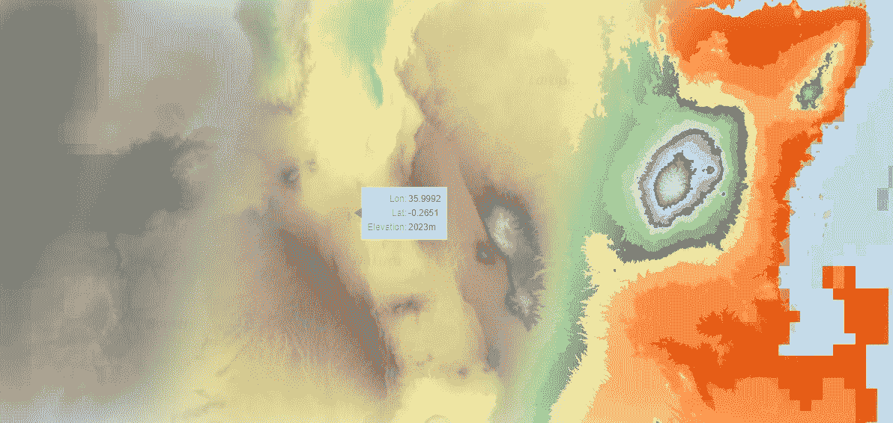

*(图片由作者提供，使用*[](https://www.openstreetmap.org/)**[*holo views*](https://holoviews.org)*[*SRTM 高程数据*](https://developers.google.com/earth-engine/datasets/catalog/CGIAR_SRTM90_V4) *)****

# **问题是**

**你的老板/客户刚刚给你安排了一项新任务。他们在 GeoTIFF 文件中有一些地理信息，你必须*“把它放在像谷歌地图这样的地图上，你知道，有街道，缩放和滚动”*然后在网上提供。可视化应该使数据第一眼看上去是一幅真实的彩色图像。此外，在鼠标悬停时，用户还应该看到该位置的实际数据值和精确坐标。此外，GeoTIFF 文件相当大(高达几百或几千兆字节)，因此将其全部加载到浏览器中并不是一个好选择。**

**你并不担心，尽管你从未尝试过这样的事情。这听起来像是一种很常见的情况，所以网络上应该充满了开箱即用的解决方案和工作示例。但事实并非如此。据我所知，没有一个例子或教程展示过类似的东西。现有的方法有很多种，我们将在本文的最后讨论它们。但是与上述规格相比，它们都有所不足。**

# **解决方案**

**我将向您展示如何使用 Rioxarray 读取数据文件，然后使用 Holoviews + Bokeh 将结果显示在覆盖在地图上的图像层上，并使用 Datashader 处理一些自动调整大小的魔术。本文的目标读者是除了 Python 的一些基本经验之外，不需要任何先验知识就可以从事这项工作的任何人。你们中的一些人可能有广泛的 GIS、web 开发和数据可视化背景，而其他人没有。如果您只想查找代码，请向下滚动到**“加载和理解数据”**部分。**

# **基础知识**

**任务是将 GeoTIFF 文件中的数据以某种方式放到基于图块的地图上。首先，我们来看看我们对这些东西本身了解多少。**

## **1.什么是 GeoTIFF 文件？**

**GeoTIFF 文件(如果非常简化的话)就像一个 excel 表，其中每个单元格(像素)包含一个数字，而行和列的名称是坐标。这些值可以是任何值:慕尼黑的人口密度地图、马来西亚的卫星夜灯地图、德克萨斯州的温度记录，或者出于本文的目的，肯尼亚的高程地图。**

**知道坐标意味着我们可以精确地知道这个数据网格在地图上的位置:不仅仅是角落，还包括其中的每个像素。需要注意的是，该文件仅包含原始数据；它没有任何颜色信息。因此，传统的图像文件(如 bmp、jpeg 或 png)将包含左上角像素的信息，即它是“红色的”，而 GeoTIFF 文件将包含一个数值(如它具有以米为单位的“123”高程)。由我们来告诉我们的可视化系统每个值对应什么颜色。**

**大多数图像查看器应用程序可以使用默认的色阶打开和显示 TIFF 文件，通常假设最低值应该是黑色，最高值应该是白色，以及介于各种灰色阴影之间的所有内容。但是，重要的是要记住 TIFFs 本身并不是彩色的，它们只包含数据，我们需要通过使用色彩映射表来给它们着色。**

**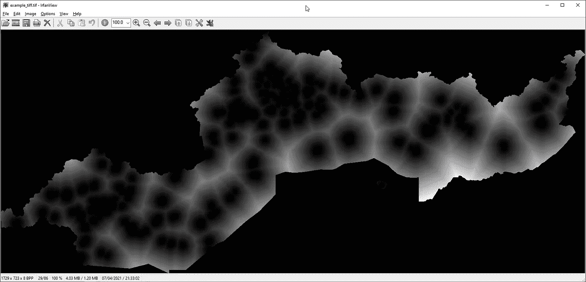**

***一个图像浏览器应用程序如何使用默认灰度色图显示 TIFF 文件的例子。(图片由作者提供)***

**另一个需要考虑的重要因素是文件的分辨率，也就是一个像素覆盖的区域大小。可以有两个类似的 GeoTIFF 文件，两者覆盖相同的总面积，一个具有 50x50 米像素，另一个具有 5000x5000 米像素。很容易理解，第一个需要比第二个多 100 * 100 = 10000 倍的像素才能覆盖同样的面积。因此，这将是更大的文件大小，但会给我们更多的细节。第二个文件要小得多，但是每 25 平方公里只有一个数据点。在本练习中，我们将使用这两种分辨率。我们从一个低分辨率的原型开始，一旦我们学会如何在不冻结一切的情况下使用它，我们就切换到高分辨率的数据集。**

**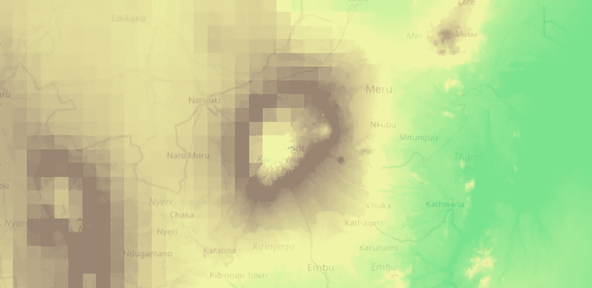**

***低分辨率和高分辨率数据的区别。(图片由作者使用*[](https://www.openstreetmap.org/)**[*holo views*](https://holoviews.org/)*[*SRTM 高程数据*](https://developers.google.com/earth-engine/datasets/catalog/CGIAR_SRTM90_V4) *)******

**事实上，在地理标志中会发生更多的奇迹。为了简单起见，我们假设我们的 GeoTIFF 包含一个“区带”(就像包含一个工作表的 excel 文件)。此外，我们并不关心它的云优化图像金字塔的内部细节或精确的坐标参考系统。然而，我强烈推荐阅读这些只是为了好玩。**

## **2.什么是 tilemap？**

**基于磁贴的地图是我们都熟悉的谷歌地图。用户有一个交互式视口，他们可以四处拖动、放大和缩小，地图提供商服务器向他们发送适当大小的地图切片，以查看该缩放级别的合理详细信息。虽然将谷歌地图集成到您的应用程序中需要开发者密钥和付费订阅，但我们可以使用许多免费的地图提供商。幸运的是，大多数图表库使它们易于导入。**

**这里重要的是不要将 tilemaps 与“绘制的地图”(根据上下文和格式，也称为 geo maps、geojsons、vector maps、shapefiles)混淆。后者主要是国家或其他地区的静态轮廓，没有这里提到的任何功能。**

**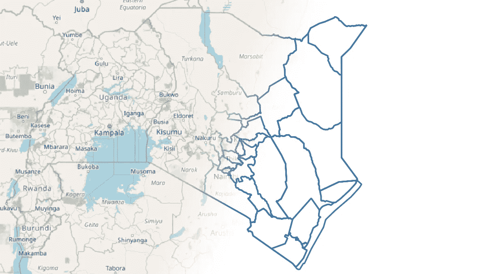**

**显示在平铺地图和矢量地图上的肯尼亚地区。(图片由作者使用[](https://openstreetmap.org/)**)****

## **3.使用的工具**

**[**Rioxarray**](https://github.com/corteva/rioxarray) (及其依赖项 [xarray](http://xarray.pydata.org/en/stable/) 和 [rasterio](https://rasterio.readthedocs.io/en/latest/index.html) )是一个相当强大的模块，可以像 GeoTIFF 一样处理网格地理数据集，因此我们将使用它来打开和转换我们的数据，但没有必要了解太多。**

**然而，Holoviz 生态系统(包含 Holoviews、Bokeh、Datashader 等等)是一个更加令人兴奋的实体。这是一套开源工具，由 Nvidia 和 Anaconda 等公司出资。**

**[**Bokeh**](https://bokeh.org/) 是一个制图工具:它让你用 Python 创建交互式 web 图表，并通过 JavaScript 中的 BokehJS 库自动在浏览器中显示它们。如果你熟悉的话，这有点类似于 Plotly。一个主要的区别是，Bokeh 本身有一个内置的 web 服务器，所以它可以创建深度交互的图表，其中浏览器中的用户交互(如拖动滑块)被发送到服务器，Bokeh 在服务器上修改数据并无缝地发回结果。(Plotly 用破折号也是为了同样的效果。)这也是将要在这个笔记本中发生的事情:每次我们创建一个交互式可视化，一个散景网络服务器将在后台旋转并为我们服务，而我们不必担心它。**

**[**Holoviews**](http://holoviews.org/) 在层级中的位置更高一些。在 Bokeh 中，你必须手动创建所有的图表(即使有许多合理的默认值和帮助函数)，而 Holoviews 希望给你一个工具，用你想要的可视化来描述你的数据，然后让绘图模块(如 Bokeh)做琐碎的工作。区别有点像烹饪，你必须处理过程中的每个细节，而去餐馆只是描述你想要的食物，让员工制作而不必处理细节。虽然有了 Holoviews，如果你想按照你需要的方式做一些步骤，你也可以进入厨房(绘图模块)。**

**Holoviews 还允许您使用各种绘图库。我们将让它在这里使用散景，因为我们将需要一些特定的功能。在许多其他情况下，只需将一个关键字转换为“plotly”或“matplotlib ”,就可以得到在这些系统中创建的完全相同的图表。**

**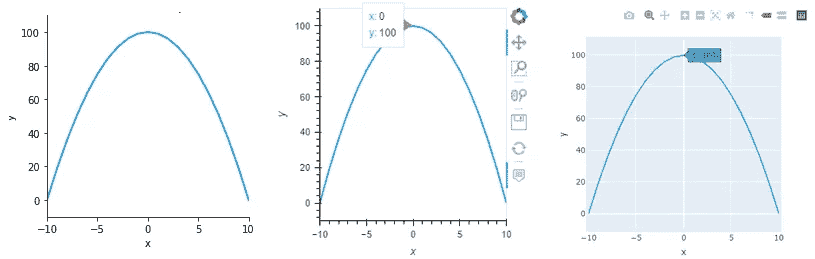**

***相同的代码以默认设置显示在 Matplotlib、Bokeh 和 Plotly 中。(图片由作者提供。)***

**正如我们将要看到的，Holoviews 擅长用几行代码创建真正的高级功能。**

**[**另一方面，Datashader**](https://datashader.org/) 只做很少的事情，但是实现得很好。也就是说，它可以根据数据以任何方式创建图像。通常基于大量的数据。比如数十亿个独特的点或数十亿字节的网格数据，否则这些数据是不可能显示的。**

**我与 Holoviz 生态系统没有任何关系，但我觉得它是一组被严重低估的工具，应该在数据科学社区中获得更大的关注。它没有得到它的一个可能的原因是，对于某些功能，文档落后于它的实际能力，特别是当一个人必须在没有先验知识的情况下理解正在发生的事情时。这就是为什么本教程会遍历可能的陷阱，并试图让一切工作方式变得透明，希望让这些工具更容易被更广泛的受众使用。**

# **数据源**

*   **[NASA/CGIAR 地球引擎的 SRTM 数字高程数据第 4 版](https://developers.google.com/earth-engine/datasets/catalog/CGIAR_SRTM90_V4)**
*   **肯尼亚国家边界从[到](http://openstreetmap.org/)OSM 边界的公开街道地图**
*   **由作者在[地球引擎](https://earthengine.google.com/)中截取到 OSM 国家边界并导出的数据。**

# **设置**

**我们将使用 Google Colabs，这是一个免费的 Jupyter 笔记本环境，可以很容易地进行实验和分享结果。[你可以通过 Colab 笔记本](https://colab.research.google.com/drive/15aG8Abyv6mWRkvk7IsR3J5WLGYOI2tj0?usp=sharing)跟随整篇文章，也可以在你看完这个之后用它来做实验。**

**它已经预装了许多模块，但我们还需要更多，而且我们想知道我们是否有我们需要的完全相同的版本。**

**我们可以通过在命令行前添加`!`来运行命令行命令，因此我们将使用它来运行 pip 并在 2021-04-16 为这些模块安装最新版本。我们可能会遇到一些底层依赖的不兼容错误，但是它们不会给这个练习带来任何问题。**

**接下来，我们用他们的短手导入所有必要的模块。我们会经常用到这些快捷键，所以如果您不确定我们使用的一些函数来自哪里，请随时回来。我们还展示了一些模块的版本，以确保一切正常。**

```
**Versions:  {'holoviews': '1.14.3', 'bokeh': '2.3.1', 'rioxarray': '0.3.1'}**
```

**我们还需要数据本身。我已经将肯尼亚的海拔地图作为云优化的 GeoTIFF 文件从 Earth Engine 导出到我的 Google Drive。(如果你对如何使用[各种可用数据集](https://developers.google.com/earth-engine/datasets/)完成这项工作的教程感兴趣，请在评论中告诉我。)**

**通过预装的`gdown`工具，谷歌可以将公开共享的文件从 Drive 下载到 Colab。**

> ***如果你想将自己的数据集导入 Google Colab，只需将你的 Google Drive 文件分享给“任何有链接的人”。你会得到这样一个链接:***
> 
> **[*https://drive.google.com/file/d/****16 dkulax 8 rkkuodqualrariwtg _ IBD msz****/查看？usp =共享*](https://drive.google.com/file/d/16dkulaX8RkkuODqualrarIWtG_iBDMSZ/view?usp=sharing)**
> 
> ***这不是直接下载链接。它会在 Google Drive 预览窗口中打开文件。要获得一个可以用来下载文件的链接，你需要复制你的原始链接的 ID 部分(在上面的例子中用粗体标出)并放入这个链接:* [*https://drive.google.com/u/0/uc?id=****idcomesere****&export = download*](https://drive.google.com/u/0/uc?id=IDCOMESHERE&export=download)**
> 
> ***你最终的结果会是这样:* [*https://drive.google.com/u/0/uc?id=****16 dkulax 8 rkkuodqualrariwtg _ IBD msz**&export = download***](https://drive.google.com/u/0/uc?id=16dkulaX8RkkuODqualrarIWtG_iBDMSZ&export=download)**
> 
> ***这是一个你的文件的直接下载链接，所以我们可以用下面的方式把这个作为* `*source_location*` *与*`*gdown*`*:***
> 
> **`*gdown -O local_destination source_location*`**

**由于 Google Colab 的默认工作目录是`/content`，我们首先创建一个名为`kenya`的目录，然后将我共享的两个示例文件下载到该目录中。**

**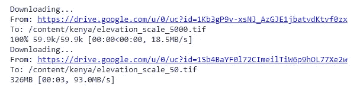**

**在下载日志中，你可以看到较小的文件是 60.3KB，较大的 329MB。这是一个巨大的差异，所以首先，我们从较小的一个开始。**

# **加载和理解数据**

**我们将使用 rioxarray 模块将文件中的数据加载到一个 xarray 数据结构中。**

***旁注:如果 Google Colab 单元格包含的最后一行只有一个变量，它将以一种有意义的方式显示它。从现在开始，我们将使用它来查看每一步的结果。***

**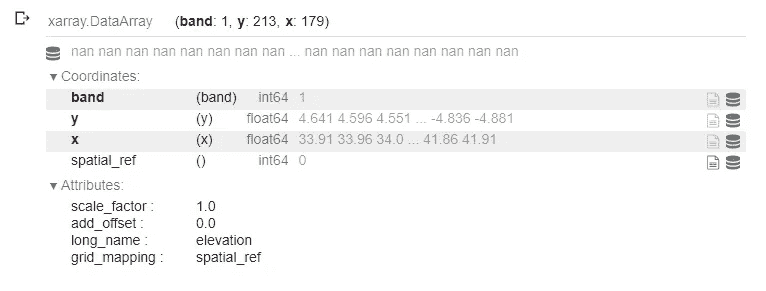**

**不用深入研究这种数据格式的细节，我们可以看到我们的数据有一个 218 乘 179 的维度，只有一个波段:高程数据本身。我们还可以看到，x 值大约在 30 到 42 之间，而 y 值大约在-5 到 5 之间，因此它们看起来像是合理的坐标值。**

**为了更熟悉我们的数据，我们可以很容易地将其转换成熊猫数据集并显示出来。我们可以看到它确实是一个网格数据集，坐标是行和列标题，以米为单位的高程数据是值。(当我将数据裁剪成肯尼亚的边界形状时，一个数字值显示缺少的值。)**

**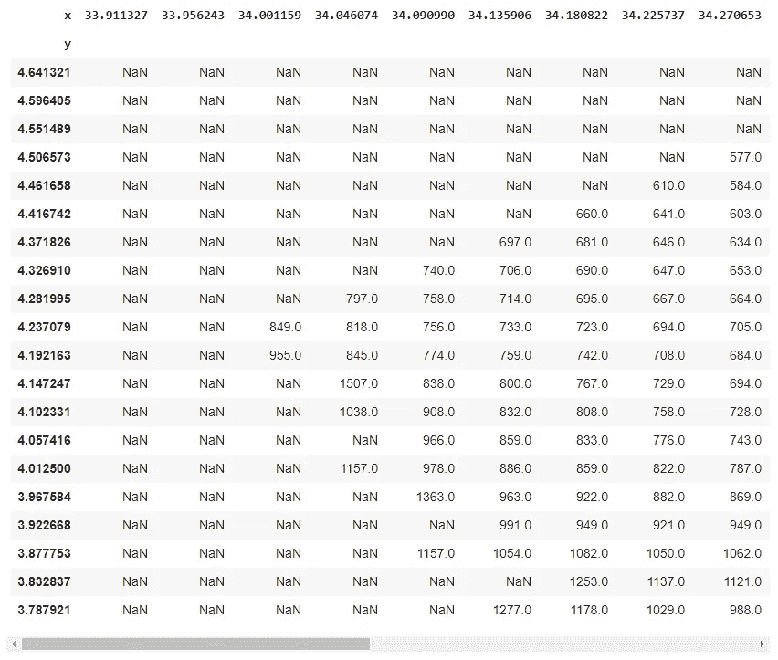**

**这完全没有必要，甚至毫无意义，但为了强调*“我们正在处理无色的网格数据，而不是实际的图像”*这一点，我们甚至可以将数据导出并下载为 CSV 文件，如果我们愿意，可以在 Excel 中打开它。**

**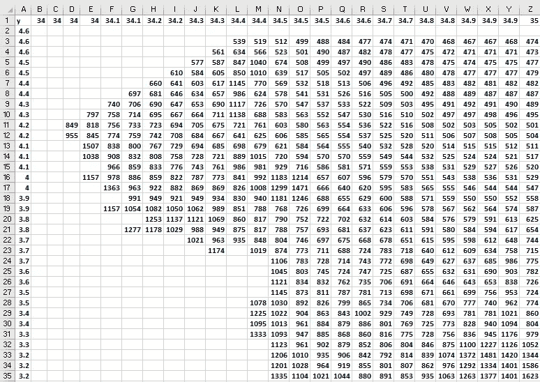**

***Excel 中显示的同一个数据集。(图片由作者提供。)***

# **配置**

**在继续之前，我们将设置一些配置值，从我们的色彩映射表开始。通常，我们可以给 Holoviews 一个颜色列表或一个现有颜色图的名称，但我喜欢为当前数据集使用颜色图的特定子集。我不打算在这里解释细节，因为您自己的数据不需要这个。只要知道我们取了`terrain`色图的 25%-100%部分，并得到了一个在该范围内分布有 192 种颜色的列表就足够了。**

**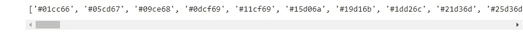**

**产生的颜色列表**

**下一步，我们设置所有 Holoviews 元素从现在开始将使用的默认选项。在这里和这里[见它们的文档](http://holoviews.org/user_guide/Customizing_Plots.html)。我们确保使用我们的颜色图和宽度/高度设置，显示颜色条。我们还打开了悬停工具提示，以及通过鼠标滚轮或触摸板滚动来放大和缩小的功能。**

**只有两件事需要多解释一下。**

1.  **我将在每个单元格的开头包含`hv.extension('bokeh', logo=False)`行。这让 Holoviews 知道我希望它显示带有散景的元素(但不是每次在输出中都显示散景标志)。如果你在本地运行你的脚本(不是在 Google Colab 上)，你只需要这样做一次。据说也有可能让 Colab 笔记本记住它而不重复，但事实证明这对我来说有点不可靠，所以我更喜欢这样使用它。**
2.  **该数据不包含肯尼亚边界以外的数值。默认情况下，它会显示为灰色区域，但我们不希望这样，所以用`clipping_colors`参数，我强制它不可见(`#00000000` RGBA 代码的最后两位数字表示 0 不透明度)。**

# **将数据显示为图像**

**现在我们已经做好了一切准备，让我们将数据加载到一个数据集中。变化不大，但 Holoviews 稍后将需要这种格式的数据。`dataarray[0]`指我们`dataarray`中的第一个波段。我们还让它知道要使用的值(`'elevation'`)和坐标(`['x', 'y']`)，就像我们在上面定义它们一样。**

**我们将立即看到为什么这是方便的，因为现在使用我们的默认配置，将这个数据集输入到 Holoviews 图像并让 Holoviews 自动显示它是非常容易的:**

**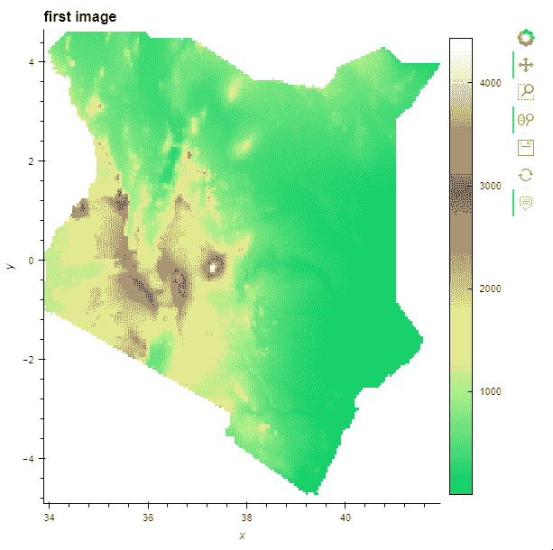**

**正如你所看到的，我们有一个很好的显示，有交互图标、缩放、颜色条等。我们可以在坐标轴上看到图像的坐标，y 轴以 0 为中心，肯尼亚在赤道上。我们甚至有一个自动悬停工具提示(上面用`tools=['hover']`配置创建的)，如果鼠标在图像上，它会显示精确的坐标和高度值。**

**现在，让我演示一下 TIFF 只包含原始数据而没有任何颜色信息的好处。**

**下面你可以看到我们用和上面完全相同的数据创建的完全相同的 Holoviews 图像。我刚刚给了他们另外两张彩色地图。第一种使用`inferno`连续色彩映射表，将较低值涂成黑色，较高值涂成紫色、橙色和黄色。第二个使用了用于分类可视化的`Dark2`颜色图:仅仅通过使用这个颜色方案，我们立即将我们的数据分类到 8 个不同的海拔高度，而不改变数据本身。**

**[你可以在这里阅读更多可用的色彩映射表。](http://holoviews.org/user_guide/Colormaps.html)**

**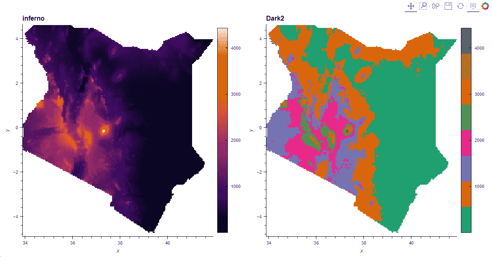**

**但是让我们回到手头的任务。这是一件好事，我们有我们的形象，但我们也需要一个 tilemap。幸运的是，很容易得到一个。你可以在 Holoviews 网站上看到所有不同的选项(黑暗、光线和地形)。**

**我们现在要选择开放的街道地图。**

**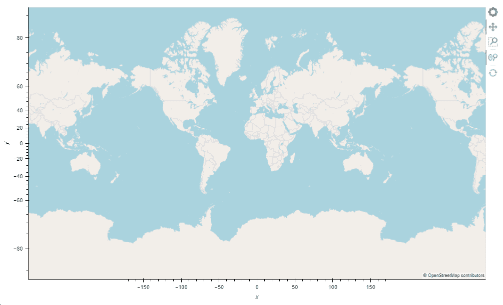**

# **将图像放到地图上**

**好的，那是一张地图，可以缩放，什么都有，但是它是空的。这就是 Holoviews 的“它只是工作”魔力发挥作用的地方:使用`*`操作符，我们只是将图像放在我们的地图上，并期待最好的结果:**

**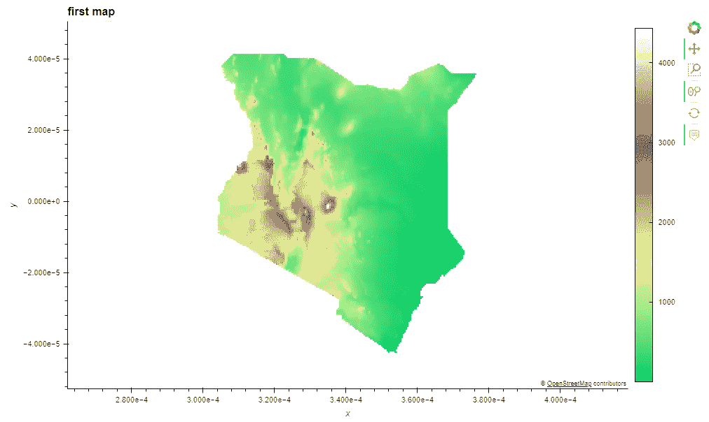**

**嗯，这是尴尬的…图像是可见的，但不是在地图上，而是在白色背景上，轴也显示一些奇怪的坐标…**

**为了理解这种现象(这导致了 StackOverflow 上绝大多数*“地图上的图像很奇怪”*的问题，不管使用什么工具)，我们需要了解一点关于坐标系的知识，这通常过于简单。**

**我们的图像使用一个平面坐标系，其中的值通常在-180 到 180 度之间。它很棒，因为它让我们可以使用像地球这样的球形物体上的位置。另一方面，每个可用的 tilemap 引擎都使用 Web 墨卡托坐标系，该坐标系以米为单位测量所有事物。墨卡托经过优化，可以在平面上显示地图，也就是我们的屏幕。这可能非常令人困惑，因为这些墨卡托地图确实向我们显示了轴上的平面坐标(因为这些数字是每个人都熟悉的)。但那只是一个显示功能；内部都是用米。因此，当你给他们一个平面坐标约为-4.2151 或 32.14 的数据集时，这些值应该被理解为-4.2151 度和 32.14 度。同时，tilemap 会将它们解释为距离原点-4.2151 米和 32.14 米。虽然 360 度足够绕地球一周，但 360 米是一个非常非常小的距离。**

**结果是，我们的图像确实显示在地图上，就在 0，0 点周围，向每个方向延伸几米。因为 Holoviews 元素自动放大地图以显示完整的数百米图像，所以地图被放大到甚至不能显示海洋中部的任何分辨率的地图切片。如果你开始缩小，你就能看到这种情况发生，就像这张 g if 上看到的那样:**

**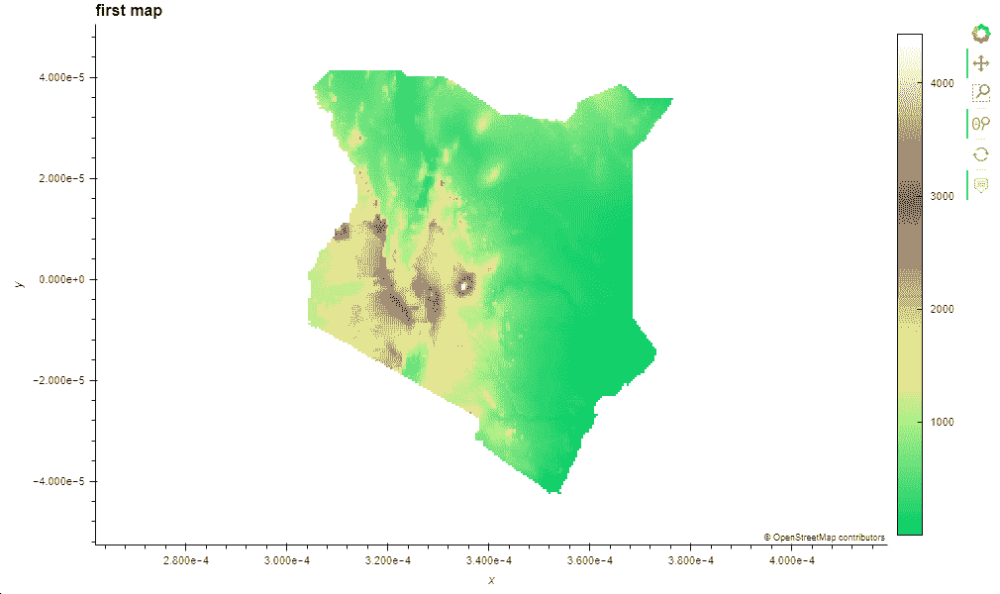**

# **重新投影数据**

**现在我们明白了为什么会发生这种情况，让我们做点什么吧。我们需要将数据转换到适当的坐标系。平面坐标和墨卡托坐标之间的转换不是我们应该手动完成的。不仅仅是因为试图找出如何将一个或多或少呈球形的对象转换为 2D 是一件非常痛苦的事情，而且在现实中，数据集可能会使用许多略有不同的平面坐标系，我们绝对不想处理这些坐标系。*(编程 101:永远不要试图重新实现处理日期、时区、翻译或坐标系统细节的功能。)***

**我们只是碰巧运气好，因为我们用来读取 GeoTIFF 的`rioxarray`模块有一个处理这种确切情况的函数。我们只需要给它所需投影的代码(在这种情况下，墨卡托的代码是`'EPSG:3857'`)。让我们重新开始，这次用正确的投影。**

***注意:重新投影一个巨大的文件会消耗大量资源，所以在生产环境中，我建议将结果保存在一个 Parquet 文件中，然后在显示数据时用 Dask 加载，但是这已经超出了我们的范围。***

**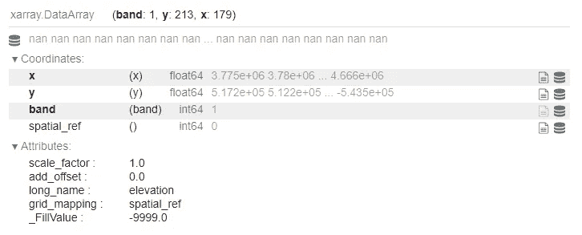**

**这次我们已经可以在 x 值中看到(使用科学记数法，`3.775e+06`意为`3.775 * 10^6`)它们在 3775000 到 4666000 之间。这些数字肯定比以前大得多，正如我们现在用米来计量时所预期的那样。让我们运行与之前完全相同的步骤(没有仍然有效和可用的配置部分):**

**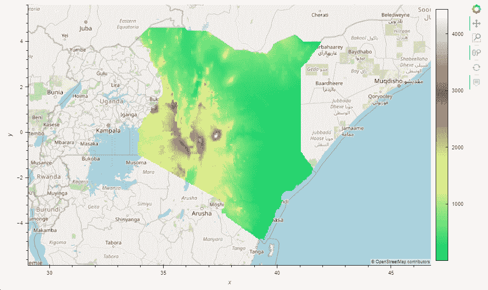**

**万岁，成功了！有点…**

**我们有地图，我们在正确的位置上有它上面的图像，我们可以缩放和拖动，我们甚至有一个悬停工具提示…现在坏了:**

**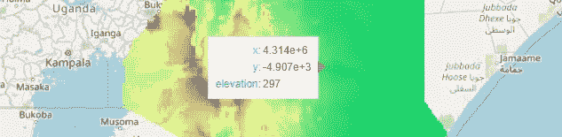**

**叹气。这是有道理的:这一次，我们给了系统墨卡托坐标来显示，所以地图也不能在工具提示中显示熟悉的平面坐标。相反，我们得到的所有东西都是以米为单位的，尽管如此，这对于我们的大多数用户来说毫无用处。**

**因此，当我们显示悬停工具提示时，我们必须动态地将墨卡托坐标转换回平面坐标。为此，我们需要使用一些 JavaScript。如果你不熟悉它，不要害怕，你可以把它作为一个复制粘贴解决方案，然后忘掉它。**

# **创建自定义悬停工具提示**

**如果你还记得，我提到过全息视图可以使用多个绘图库，在这个例子中，我们使用的是散景。它是一个 python 模块，让你编写 Python 代码，然后它将代码翻译成 JavaScript，并在浏览器中用 BokehJS 库显示。幸运的是它有一个专门的工具可以将墨卡托坐标转换回平面坐标。虽然到目前为止，我们甚至没有直接使用 python Bokeh 模块，但是这个设置让我们可以直接向 BokehJS 提供一些关于如何显示悬停工具提示的信息。**

**让我们再试一次，这次使用新创建的定制工具。**

**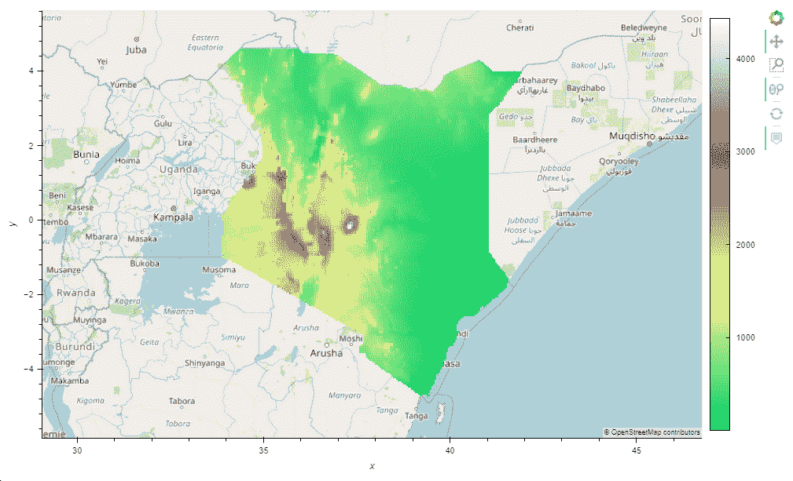**

**完美！**

**Pfew。那是一次旅行…**

# **但是巨大的像素呢？**

**房间里有一头大象:到目前为止，我们只使用了每个像素覆盖 5 公里* 5 公里的小数据集。由于这一点，整个压缩文件的大小是 60KB，所以我们可以很容易地在服务器上解压缩数据，并将整个内容发送到浏览器。我们为此付出的代价是，我们的图像非常像素化，尤其是放大后。**

**这在某些情况下可能行得通，但是我们理论上的老板/客户有他们想要使用的非常详细的地图。该地图上的每个像素覆盖 50 米* 50 米，因此整个数据集约为 22，000 像素高，18，000 像素宽。这将让我们显示更多的详细信息，如果我们的用户需要特定位置的值，这可能是至关重要的。问题是，对于高分辨率数据，即使是压缩的 GeoTIFF 也超过 300MB。如果我们试图一次显示整个数据集，解压缩后的数据将以千兆字节计算，这会导致巨大的下载时间，并保证浏览器中的内存冻结。**

**这样做似乎也有点不必要。想想看，当用户在默认缩放级别下看到整个图像时，他们会看到所有的 22k*18k 像素。他们的屏幕分辨率低得多，所以分辨率低得多的快照就足够了。更高分辨率的图像只有在越来越放大时才有意义。但是当这种情况发生时，他们只能看到图像越来越小的部分，所以把不可见的部分也发给他们是没有用的。**

**这意味着我们需要一个解决方案**

1.  **它可以捕捉当前的视窗和缩放级别，**
2.  **向浏览器发送仅覆盖可见区域的图像**
3.  **并以合理的分辨率完成。**

**这听起来像是一个企业级的功能，我们将花费余生来开发。除了 Holoviews 与 Datashader 模块集成，它们一起可以精确地完成这一点。**

***(快速补充说明:Datashader 是一个不可思议的工具，可以从不可显示的大数据集生成可显示的图像。它可以让您显示数十亿个独立的坐标，或者在我们的例子中，显示否则无法使用的网格数据集。如果你打算使用全息视图，你绝对应该* [*查看数据。)*](https://datashader.org/)**

# **集成 Datashader 以动态显示高分辨率图像**

**让我们再重复一遍我们上面所做的，但最后是大数据集。**

**请注意，这一次我没有显示结果图像。原因在于，根据具体的数据集，要么 Colab 内核会完全崩溃，要么整个进程会一直挂起，直到您的浏览器因内存不足而崩溃。**

**我们没有将这个`hv.Image()`直接与地图结合，而是首先基于它创建一个动态图像。我们只需将它放入 Holoviews 提供的 Datashader 函数中，并将其导入为 hd.regrid。然后，我们将这个新创建的动态图像与地图结合起来。**

**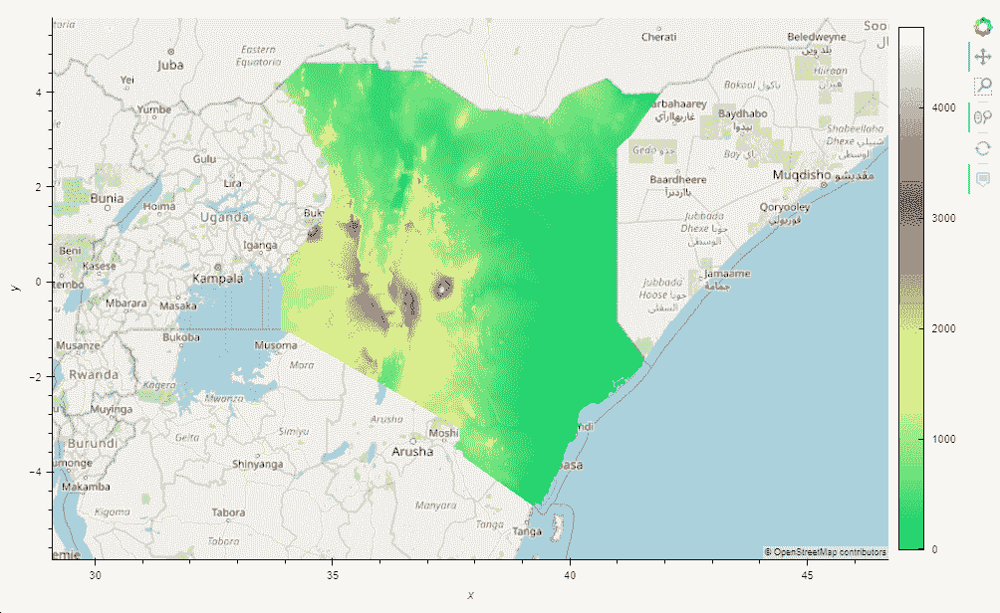**

**如果我们缩放和平移，我们可以看到令人惊叹的事情正在发生，我们自动获得更高分辨率的图像。但与此同时，图片会被奇怪地重新着色，而且颜色条每次都在变化。这些事情以前没有发生过。**

**对此的解释是，之前，我们的小部件使用了整个低分辨率数据集，因此它知道最低值和最高值。由此，它可以创建一个强大的色标，覆盖从大约 0 到大约 5000 米的整个数据光谱。这意味着无论我们在哪里缩放，相同的值总是得到相同的颜色。**

**然而，我们新的动态系统的显示部分只接收数据集的可见部分。每次用户交互时，小部件都必须使用当前可见的最低和最高值来拉伸它们之间的色阶。如果我们放大到最高值只有几百米的平坦区域，该区域现在将被着色为保留给最高值的颜色(白色)，棕色、黄色和绿色覆盖其下的值。相反，如果我们放大到一个山顶，即使是最低的可见点也在 2000 米以上，那么从这个高度开始，它将被染成绿色、黄色、棕色和白色。这就是为什么图像每次都被重新着色，为什么颜色条显示新的值。这实际上在很多情况下可能是一个有价值的功能，因为它使我们关注的任何小细节突出出来，真正突出了微小的差异，但如果你想有一个一致的图像，这真的很糟糕。**

# **修复彩条**

**为了解决这个问题，我们将查询数据集并获得整个数据集的实际最小值/最大值。**

```
**(-20.0, 5035.0)**
```

**接下来，我们将颜色范围限制更新为这些值。我们不更新默认选项，因为此信息与此数据密切相关。如果我们想在它旁边显示一些其他的数据集，使用这些限制也是不合理的。相反，我们将它们直接应用于我们的组合元素。**

**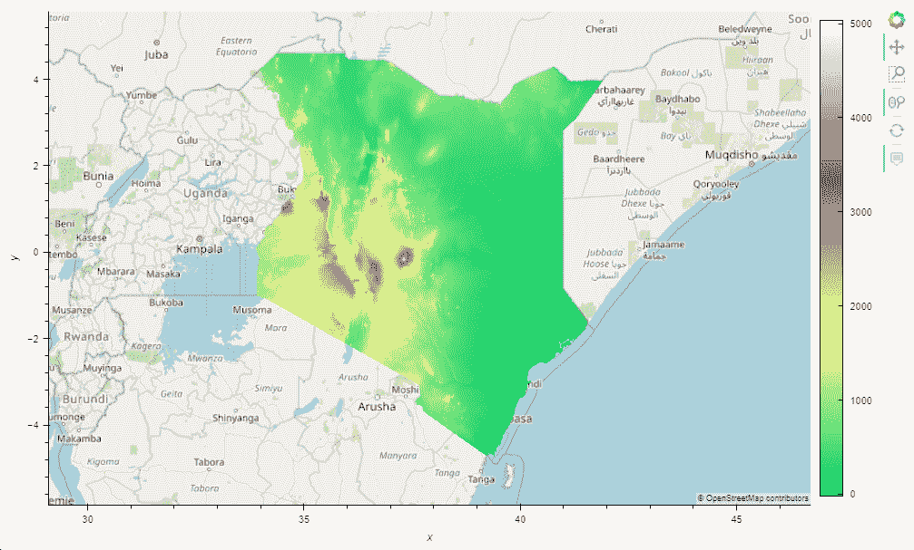**

# **从这里去哪里？**

**希望你的客户/老板接受 Colab 笔记本作为最终结果。否则，您将需要一种更专业的方式来发布您的小部件。我们将在未来可能的文章中探讨这个主题。**

**现在，让我举一个简单的例子，说明我们已经发现的一些特性是如何在一个交互式小部件中呈现的。**

**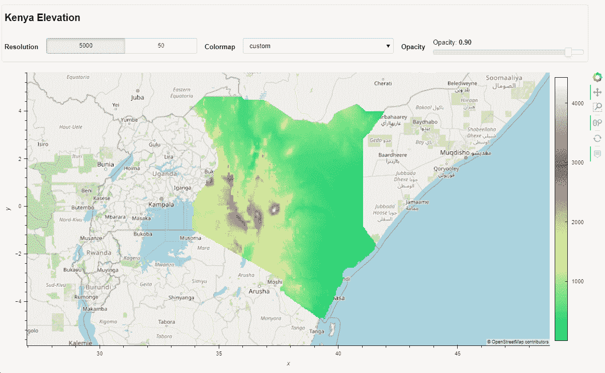**

**您可以查看 Colab 笔记本中的实例:**

**[https://colab . research . Google . com/drive/15 ag 8 abyv 6 mwrkvk 7 is R3 j 5 wlgyo i2t j 0？usp =共享](https://colab.research.google.com/drive/15aG8Abyv6mWRkvk7IsR3J5WLGYOI2tj0?usp=sharing)**

# **可能的替代方案**

**无论你不想或不能使用上述解决方案的原因是什么，我知道有一些替代方案，它们都有一些警告。**

## **地理视图**

**在同一个 Holoviz 生态系统中，有一个模块专门用于处理这类任务: [Geoviews](https://geoviews.org/) 。假设`hv.element.tiles.OSM() * hd.regrid(gv.util.load_tiff('your/file.tif'))`行本身给你的结果与上面的整个代码相同(尽管我没有测试它)，所以选择它看起来是显而易见的。**

**然而，它有两个问题。一个是严重缺乏该特性的文档，因为甚至他们自己的网站也只在一个发布说明中提到过一次“load_function”字符串。另一个是 Geoviews 能够在后台做许多令人惊叹的 GIS 魔术，因为它严重依赖于许多科学 GIS 模块。其中一些需要手动安装，这需要花费大量的时间、精力和经验。喜欢，很多。我做过几次，都获得了不同程度的成功，但这真的很痛苦。例如，基于论坛，我甚至不确定是否有可能在 Google Colabs 上设置它。如果你有一个轻松的 Linux 服务器，你只需要设置一次，并且你可以长时间使用同一个环境，那么它可能是你最好的解决方案。如果你像我一样，通过本地 Windows 开发从 Colab 跳到任何 Linux 服务器或无服务器产品，你最好不要依赖于你不确定下次还能不能安装的东西。**

**开发者知道这个问题。希望他们能够重构和重写模块，只需要较少麻烦的依赖，因为它是一个非常天才的工具。但目前来看，事实就是如此。**

## **破折号+情节**

**[破折号](https://dash.plotly.com/)和[情节上](https://plotly.com/python/)有点类似于商业领域，就像 Holoviz 生态系统对于科学领域一样。可以说，他们的学习曲线不太陡峭，文档也更全面。**

**然而，他们没有像我们一样将网格数据集放到地图上的方法，至少在写这篇文章的时候没有。这是一个遗憾，因为他们有各种网格表示的图表(如 px.imshow，go.image，go.heatmap)，他们对基于图块的地图有很好的支持，但没有办法将它们结合起来。这是可悲的，因为他们甚至有全息视图和数据阴影集成。因此，你可以做的最好的事情是遵循他们的 Plotly+Datashader 教程之一，这将允许你把一个视觉图像(即使是由 Datashader 创建的)放到地图上，但你不会访问数据本身，所以没有悬停工具提示。如果您不需要访问数据，而您需要将您的项目集成到 Dash 应用程序中，这可能是一个合理的折衷方案。**

**顺便说一下:如果在任何时候 Plotly 将能够在地图上显示网格数据，由于 Holoviews-Plotly 的集成，我们上面的整个练习只需要一个改变:`hv.extension('plotly', logo=False)`，然后一切都应该显示在 Plotly 中，准备在 Dash 中显示。手指交叉。**

## **dash-传单+陶土(或任何其他方式来创建和展示瓷砖)**

**你可以做的另一件事是将你的 GeoTIFF 转换成这些地图已经使用的相似 tileset，并将那个 tileset 放在原始地图的上面。[Mapbox.com 切片服务](https://www.mapbox.com/mts)是实现这一点的一种方式，但还有一个名为 [Terracotta](https://github.com/DHI-GRAS/terracotta) 的 python 模块，它可以获取您的地理信息，创建地图切片，并按需作为服务器提供服务。从那里你只需要一张可以使用它们的地图。**

**有很多选择，但[Dash-leaf](https://dash-leaflet.herokuapp.com/)是最好的选择之一。这是流行的 LeafletJS 映射库的 Python 实现，移植它的人甚至有一个[terra cotta-Dash-Leaflet demo](https://github.com/thedirtyfew/terracotta-dash-example)来展示完全相同的东西，所以很容易安装和运行。它与 Plotly+Dash 解决方案具有相同的缺点。由于浏览器只接收来自服务器的可视图像，所以它没有办法在悬停工具提示上显示数据。然而，它有一个聪明的解决办法，在鼠标点击时，它可以向服务器发送请求，并在该位置获得准确的数据。它不像工具提示那样无缝，但是如果您只需要在很少的情况下查看数据，这可能是一个很好的解决方案。此外，如果您有任何问题，Dash 传单库的创建者 Emil 在 Dash 论坛上提供了一些企业级支持[。](https://community.plotly.com/t/show-and-tell-dash-leaflet/34924)**

**但是正如我提到的，有多种方法可以创建和提供 tilesets，如果你有，你可以使用几乎任何图表库，可以显示基于 tile 的地图，所以你这样做。**

**你知道其他方法吗？请在评论中告诉我！**

# **承认**

**感谢[菲利普·鲁迪格](https://github.com/philippjfr)、[布莱恩·范·德·Ven](https://github.com/bryevdv)、[詹姆斯·a·贝德纳尔](https://github.com/jbednar)和[马克·斯科夫·麦德森](https://github.com/MarcSkovMadsen)，不仅仅是因为他们对 Holoviz 生态系统的贡献，也因为他们回答了我不断提出的问题。**

**还要感谢谷歌的@blois 立即调查了 Colab 和 Holoviews 在交互功能方面的一些[不兼容问题](https://github.com/googlecolab/colabtools/issues/623)。**