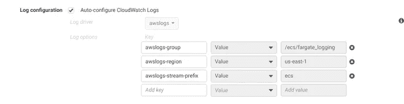
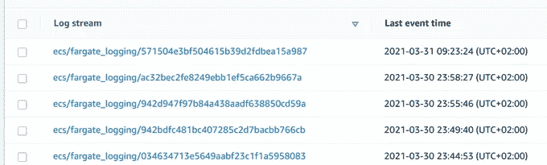

# 在 Airflow UI 中显示 AWS ECS Fargate 日志

> 原文：<https://towardsdatascience.com/displaying-aws-ecs-fargate-logs-in-airflow-ui-7b302321fd09?source=collection_archive---------34----------------------->

## 在气流任务中正确设置 Cloudwatch 日志组和流前缀


照片由 [Unsplash](https://unsplash.com?utm_source=medium&utm_medium=referral) 上的 [Aditya Saxena](https://unsplash.com/@adityaries?utm_source=medium&utm_medium=referral) 拍摄

在我从事的一个项目中，我使用 AWS 弹性容器服务来运行 Fargate 任务。为什么？我有需要运行的作业，所以很容易打包到 Docker 容器中，并部署在 Fargate 上，只需为使用的资源付费。我用气流来安排这些任务。因为 Airflow 在 Fargate 上运行任务，所以所有的作业日志都是在 Fargate 任务(Docker 容器)中创建的。幸运的是，Fargate 支持将日志流式传输到 CloudWatch，但如果您有十几行日志，在 CloudWatch 中浏览就不是超级友好的了(例如在线阅读和分页)。幸运的是，Airflow ECS Operator 支持在 Airflow UI 中显示来自 Fargate 任务的日志，这对我来说更好也更有用，因为我把所有东西都放在一个地方，我不必去 CloudWatch 调查。

我在配置 Airflow/Fargate 来显示日志时遇到了问题，所以我想描述一下我的方法和我的理解。通常，当显示来自 CloudWatch 的日志出现问题时，气流日志中会出现异常:

```
An error occurred (ResourceNotFoundException) when calling the GetLogEvents operation: The specified log group does not exist.
```

并且气流任务被标记为失败。我的问题是正确设置日志配置，以便 Airflow 可以读取它(这可能是由于缺乏 CloudWatch 日志如何工作的知识造成的)

## 1.设置 Fargate 任务

当设置 Fargate 任务和容器部分时，有日志配置选项，我选中“自动配置 CloudWatch 日志”,然后一切都是预定义的，当然，也可以设置自定义值。



使用这些设置，云观察中的日志组会随后自动创建。

在我的例子中，容器名和 Fargate 任务名都是“fargate_logging”。

## 2.设置气流任务。

在 Airflow ECSOperator 中，我用这些值设置日志:

**awslogs_group** 是 **"/ecs/fargate_logging"**

**awslogs_stream** 为**“ECS/fargate _ logging”**(开头不带“/”)。

任务可能如下所示(非完整配置):

```
task = ECSOperator(
    dag=dag,
    task_id=task_id,
    task_definition=task_definition,
    cluster=cluster,
    region_name=region_name,
    launch_type=launch_type,
    overrides = {},
    awslogs_group='/ecs/fargate_logging',
    awslogs_stream_prefix='ecs/fargate_logging'
)
```

## 3.工作原理(引擎盖下):

在 CloudWatch 中检查是否创建了日志组，以及那里是否确实有日志:



我们看到日志流(名称)由“ECS/fargate _ logging”+某个数字组成

Fargate 任务执行后，Airflow ECS 操作员正在读取 CluodWatch 日志和流作为 Airflow 日志，这是核心部分。我们看到它正在解析 **task_id** ，并与 **awslogs_stream_prefix** 一起将 **stream_name** 放在一起。Task_id 是执行的 Fargate 任务的 id。

```
self.log.info('ECS Task logs output:')
task_id = self.arn.split("/")[-1]
stream_name = "{}/{}".format(self.awslogs_stream_prefix, task_id)
self.log.info("aws log group {}".format(self.awslogs_group))
self.log.info("stream name: {}".format(stream_name))
self.log.info("task_id: {}".format(task_id))
for event in self.get_logs_hook().get_log_events(self.awslogs_group, stream_name):
    dt = datetime.fromtimestamp(event['timestamp'] / 1000.0)
    self.log.info("[{}] {}".format(dt.isoformat(), event['message']))
```

我添加了日志行，以查看在我设置值后什么会作为 stream_name。这是我在气流日志界面上看到的:

```
[2021-03-31 07:23:53,773] {ecs_operator.py:172} INFO - ECS Task logs output:
[2021-03-31 07:23:53,774] {ecs_operator.py:175} INFO - aws log group /ecs/fargate_logging
[2021-03-31 07:23:53,774] {ecs_operator.py:176} INFO - stream name: ecs/fargate_logging/571504e3bf504615b39d2fdbea15a987
[2021-03-31 07:23:53,774] {ecs_operator.py:177} INFO - task_id: 571504e3bf504615b39d2fdbea15a987
```

重点是 **awslog_group** 和 **stream_name** 和 Cloud Watch 里的相匹配。

例如，在 CloudWatch 中，我们有一个名为 ecs/fargate_logging/571504 E3 BF 504615 b 39 D2 FD bea 15 a 987 的日志流， **awslogs_stream_prefix** 是“ECS/fargate _ logging”。

我在调试时使用了下面的代码片段来直接读取日志:

```
import boto3
client = boto3.client('logs')
response = client.get_log_events(
    logGroupName='/ecs/fargate_logging',
    logStreamName='ecs/fargate_logging/571504e3bf504615b39d2fdbea15a987'

)
print(response)
```

**同样，在配置 Airflow 时，ECS Operator awslog_group 和 awslogs_stream_prefix 必须与 CloudWatch 中的内容相匹配(而不是相反)！！！**

在 Airflow 中，您不需要设置您想要的值，而是在 CloudWatch 中设置它们，以便您可以正确读取它们。当我最初设置气流(对 ECS 没有太多经验)时，我认为我是在为日志设置它应该如何配置(它们将如何编写)，但正如我已经强调的那样，情况正好相反。

我希望这将帮助那些有类似问题的人。