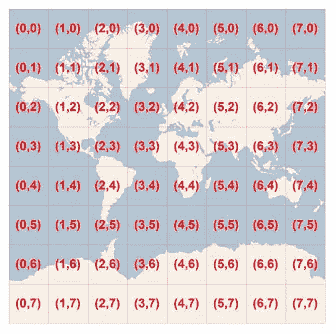
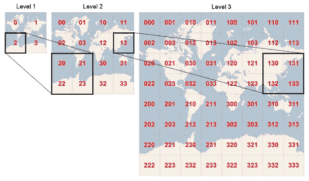
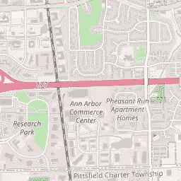
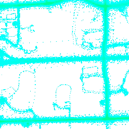
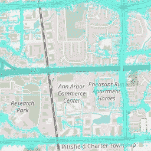
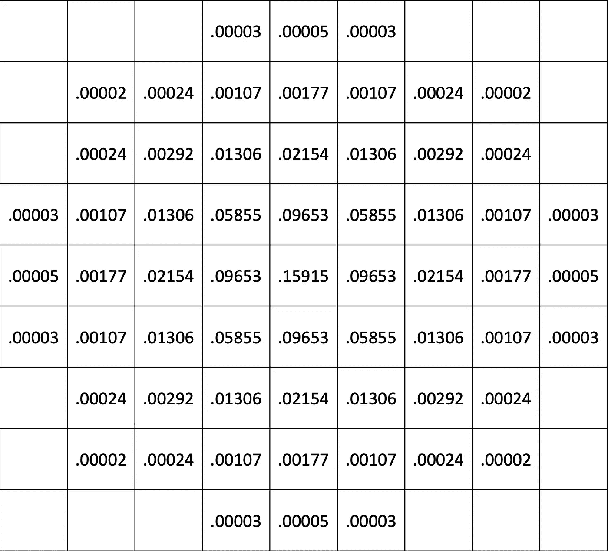

# 使用自定义地图切片显示地理信息

> 原文：<https://towardsdatascience.com/displaying-geographic-information-using-custom-map-tiles-c0e3344909a4?source=collection_archive---------14----------------------->

## [实践教程](https://towardsdatascience.com/tagged/hands-on-tutorials)

## 了解如何为交互式地图创建自定义切片

由[卡尔文·汉森](https://unsplash.com/@calvinhanson?utm_source=medium&utm_medium=referral)在 [Unsplash](https://unsplash.com?utm_source=medium&utm_medium=referral) 拍摄的照片

交互式地图现在是我们日常数字生活的主要部分。我们用它们来了解我们的行踪，计划下一次旅行，或者回顾我们过去的旅行。在专业环境中，地图成为各种商业规划、运营和分析的无价工具。

一个交互式地图显示了一个拼凑的方块，每个方块包含完整图像的一小部分。基于云的服务通过从缓存中检索或动态生成来提供这些切片。地图软件管理显示，就像显示连续的位图，但是在后台以图块为基础操作。无论何时需要，地图软件都会向服务请求新的切片，并在不再需要时将其丢弃。当用户更改缩放级别或向任何方向平移地图时，会出现这种情况。

放大或缩小时，地图软件会在检索新级别的图块时拉伸或压缩当前显示。然后，它将新的瓷砖覆盖在旧的瓷砖上，提供了令人愉快的视觉连续性。

没有什么比一个[现场地图示例](https://deck.gl/examples/tile-layer/)更能帮助你建立对幕后发生的事情的直觉。请点击前面的链接并选择“显示磁贴边框”选项。浏览地图，查看软件如何处理切片，如何拉伸切片，以及如何替换和刷新内容。将光标悬停在每个单幅图块上时，软件会显示该单幅图块的坐标。

# 平铺坐标

我们可以将整个 tileset 设想为一个二维空间，其中每个 tile 接收一组唯一的整数坐标，用于任何缩放级别。第一个缩放级别包含整个可绘制的地球表面，并将其放入一个单幅图块。每个后续缩放级别将前一个级别的平铺分割为四个，从而使细节和整数坐标的范围加倍。在第一级缩放时， *x* 和 *y* 坐标的范围在 0 到 1 之间，而在第二级缩放时，它们在 0 到 3 之间变化。此过程重复进行，直到达到支持的最大缩放级别，通常在 18 到 23 之间。我们可以说元组( *x* ， *y* ， *zoom* )唯一地标识一个图块。

上图显示了缩放级别 3 的单幅图块坐标范围。(图片来源:微软— [必应地图磁贴系统](https://docs.microsoft.com/en-us/bingmaps/articles/bing-maps-tile-system))

像[传单](https://leafletjs.com/)和它的 Python 包装器[叶子](https://python-visualization.github.io/folium/)这样的交互式地图软件在发布服务器请求时使用这种类型的图块寻址。服务器将这些坐标转换成图块的地理空间形状，即纬度和经度空间中的正方形，并使用这些来查询底层数据。通过这些数据，服务器渲染切片的图形内容，并将其发送回地图软件客户端。

# 四键重访

我们也可以通过其对应的[四键](/geospatial-indexing-with-quadkeys-d933dff01496)来寻址每个图块。四键将图块唯一编码为单个字符串或数字，便于缓存或字典键。根据整数编码方案，我们可以包含缩放级别或将其作为上下文信息。四键非常方便，因为我们可以很容易地从瓷砖坐标计算它们。我们将在这里使用它们来编码本地切片缓存的文件名，作为数据库关键字，并作为代数的基础，这将减轻大量的计算。

上图说明了如何根据位置和细节层次导出四键代码。请注意第 3 级图块坐标如何映射到其对应的四键。(图片来源:微软— [必应地图磁贴系统](https://docs.microsoft.com/en-us/bingmaps/articles/bing-maps-tile-system))

我们可以使用字符串或 64 位整数对四键进行编码。字符串编码在每个缩放级别使用一个字符，可以是零个、一个、两个或三个字符，并且具有将缩放级别保持为字符串长度的优点。它最大的缺点是存储每个四键所需的存储空间。

幸运的是，很容易将字符串编码压缩成更易于管理的东西，一个 64 位整数。一旦我们认识到四键的字符串表示只不过是一个基数为 4 的数，转换就相对容易了。最直接的转换是将字符串编码成整数，但会丢失缩放级别信息。我们必须以某种方式，隐式或显式地将缩放级别信息存储在其他地方。或者，我们可以使用整个 64 位来编码键和缩放级别信息，但是这个解决方案只将我们限制在 23 个级别。在本文中，我使用前一种编码，因为缩放级别总是可以从上下文中获得，并且它支持对所需的 26 个缩放级别进行编码。

上述函数在字符串和整数表示之间转换四键编码。注意，到字符串的转换需要期望的缩放级别，并且整数表示不包括缩放级别。(图片来源:作者)

以上图为例，右下角图块的字符串编码“333”对整数 63 进行编码。但是四键编码并不像看上去那么简单。使用字符串或整数编码，我们可以立即导出封闭缩放级别的平铺键。对于字符串编码，我们删除最右边的字符，而对于整数编码，我们执行整数除以 4。当处理代表图块的 256x256 位图时，该属性具有令人兴奋的含义——每个图块像素是另一个向下缩放八个级别的图块，这将为我们创造奇迹。

# 地图覆盖

交互式地图通过叠加地理信息来实现其用途。交互式地图软件通常允许叠加两种不同类型的数据:矢量和位图。在这里，我们关注一种特殊的位图数据，平铺覆盖。切片叠加的工作方式与底图切片相同，为每个底图切片提供一个地理内容切片。

每个拼贴是一个正方形位图，与地图拼贴具有相同的尺寸，并使用 [alpha 合成](https://en.wikipedia.org/wiki/Alpha_compositing)来显示底层地图信息。这样，叠加图创建者可以只绘制要在正确的地理位置显示的数据，而不关心底层地图是如何显示的，这就是我们在本文中遵循的方法。

为了说明这种技术，让我们从 OpenStreetMap 服务器中挑选一个与我们的研究区域(美国密歇根州的安阿伯市)相匹配的图块。

上图显示了坐标为 4381，6067，14 的 OpenStreetMap 图块。这就是前面提到的底图。(图片来源:OpenStreetMap)

使用基础切片的坐标，我们现在可以提取相应的地理数据并生成覆盖切片。在这种情况下，我们计算每个采样位置的二元正态分布，并将其添加到地图中。密度较高的区域将以绿色显示。

上面的图块覆盖对应于之前的底图图块。白色区域是透明的。每个点代表一次 GPS 观测，绿色区域对应更高的密度。(图片来源:作者)

通过使用 alpha 合成合成上面的两幅图像，我们得到了最终的位图(见下图)。请注意，地图软件会自动处理这一过程。

通过组合前面的两个图块，我们得到了上面的图像。(图片来源:作者)

您在覆盖图块中看到的每个点实际上是一个使用二元正态分布生成的圆。分布的中点是位置，我们考虑一个单像素标准差的对角协方差矩阵。因此，位置扩展到以下强度矩阵。最终图像是所有位置相加的总和。

上面的矩阵显示了如何使用二元正态分布将单个位置转换为“密度圆”。将所有位置加在一起后，呈现代码将根据缩放级别范围为每个单元格分配一种颜色。(图片来源:作者)

为了避免二元正态分布固有的无限大小，当每个单元格的值低于 0.00001 时，我决定切断表示。空单元格反映了这种情况。

# 瓦片生成

切片生成是一个分三步的过程。第一步包括数据收集和转换成适合快速查询和检索的格式。服务器使用准备好的数据绘制图块位图，并将其存储在文件缓存中，以便在第二步中重用。本文展示了第二步的一个惰性版本，其中服务器软件按需生成并缓存切片。如果切片存在于缓存中，服务器会立即将其传送给客户端。在此过程中，服务器代码可以将缓存的切片生成日期与当前日期进行比较，并确定是否需要刷新。该过程将保持图块数据是最新的。流程的最后一步是将瓷砖交付给客户。在这里，我用一个简单的基于 Flask 的 API 来说明这个过程。

在我们开始探索瓷砖一代的三步流程之前，我们必须了解最终产品。正如您在上面看到的，我们的目标是显示一组道路的交通密度信息，因此我将每个位置转换为正态二元分布，并将它们相加以生成一个颜色编码的密度图。

# 图块数据收集

我们的图块的源数据是一长串地理空间位置，编码为纬度和经度对。对于本文，我使用的是我已经在[探索](/geographic-clustering-with-hdbscan-ef8cb0ed6051)一段时间的[车辆能源数据集](https://arxiv.org/abs/1905.02081v1)数据。

正如我之前所说的，交互式地图软件一次请求一个图块，然后将它们粘贴在一起以创建最终的地图或覆盖图。服务软件在检索图块数据时需要速度很快，以改善用户体验。根据缩放级别，可能需要收集大量信息，因为缩放级别越低，切片包含的信息越多。我解决这一挑战的方法是预先计算所有图块，并存储每个支持的缩放级别的数据。四键在这里是救命稻草。

正如我们之前看到的，每个瓷砖都可以通过一个四键代码进行唯一寻址。每个拼贴由一个 256x256 像素的位图组成，这意味着我们可以将每个像素作为另一个四键代码进行寻址，更深入八个缩放级别(256 = 2⁸).这种洞察力允许对切片数据进行高效编码，以便在生成阶段进行检索。

我对这个问题的解决方案是使用一个 SQLite 数据库，通过每个缩放级别使用一个表，将所有图块数据按像素聚合。每个表的结构都很简单，只有三列。下面我展示了最低缩放级别的 SQL 表创建脚本。请注意，通过在缩放级别 26 聚合地理数据，我们只能绘制最高级别 18 的切片。

上面的 SQL 脚本创建了包含最详细缩放级别数据的表。所有其他缩放级别都是通过简单的聚合从这个缩放级别派生出来的。(图片来源:作者)

第一列包含缩放级别为 26 的单个像素的 64 位编码四键代码。因此，我们可以非常快速地将该值转换为图块中的像素坐标，并根据计算的亮度值(表的第三列)绘制像素。

第二列对封闭图块进行编码，也是 64 位四键代码。我们为该列创建了一个非唯一索引，以使图块数据检索非常快，并将其计算为像素四键代码除以 256，即 2⁸.

当整个第 26 级计算完成后，我们可以通过简单的聚合立即得到第 25 级，如下面的 SQL 脚本所示。

上面的脚本通过将像素和平铺四键代码除以 4 并对强度值求和，从 26 级数据生成 25 级数据。请注意，它假设 25 级表与 26 级表具有相同的结构。(图片来源:作者)

为了计算所有的缩放级别，我们需要对最高级别重复这个过程，在我们的例子中是 8 级。

上面的代码基于级别 26 生成从 25 到 8 的所有级别。(图片来源:作者)

我们现在可以执行数据准备的最后一步，即计算每个缩放级别的亮度范围。此信息对于绘制平铺位图时的着色过程至关重要，因为值范围映射到预定义的颜色渐变。

上面的函数遍历缩放级别来计算每个级别的范围。它将结果存储在一个表中，以便将来渲染图块。缩放级别范围对于根据单个像素强度分配像素颜色非常有用。(图片来源:作者)

现在，数据已经完全准备好了，我们可以继续进行切片生成和服务流程描述。

# 瓷砖生成和供应

对于本文，我设计了一个简单的基于 Flask 的 API 来服务 tile 文件。API 端点接收图块坐标作为参数，并返回相应的图块 PNG 文件。这里我使用一个通用函数来完成所有繁重的工作。

上面的清单显示了渲染密度切片的 Flask API 入口点。(图片来源:作者)

作为参数，该函数接受切片坐标、包含切片数据的 SQLite 数据库的路径以及文件缓存文件夹的路径。该过程首先将缩放级别限制在可接受的范围内，在 1 到 18 之间。超过这些限制，它只会返回默认的空(完全透明)图块。

上面的清单显示了通用的图块生成函数。如上所述，它使用结构化数据生成切片。请注意，切片的数据内容可能会根据您的需求而有所不同。您需要提供适当创建的数据库和用于缓存的文件夹。(图片来源:作者)

对于适当的缩放级别，该函数使用图块四键代码计算目标图块文件名，如果该文件已经存在于缓存中，则立即提供该文件。对于不存在的文件，该函数必须在提供文件之前渲染并保存文件。

生成新图块的过程从建立到包含缩放级别数据的数据库的连接开始。然后，它在数据库中查询所有图块的像素强度。如果图块为空，该函数将提供默认的透明图块。

该代码使用单个像素坐标的元组列表作为四键代码，以及它们各自的强度来用数据表示图块。然后，这些列表必须转换为基于图块的像素坐标，这意味着每个图块的左上角具有(0，0)坐标。然后，该功能收集手边缩放级别的亮度范围信息。有了这些信息，我们现在可以绘制瓷砖了。

## 用 NumPy 和 PyPNG 绘制瓷砖

在研究从 Python 代码创建 PNG 文件时，我遇到了一个优雅的包: [PyPNG](https://pypng.readthedocs.io/en/latest/index.html) 。这个包可以将 NumPy 数组转换成 PNG 文件，这似乎是一个好主意。下面是如何创建一个表示 256x256 RGBA 图像的 NumPy 数组，可编码为 PNG:

上面的函数创建了一个 256x256x4 的 NumPy 数组，用给定的红色、绿色、蓝色和 alpha 通道初始化。完全透明的拼贴将所有这些值都设置为零。(图片来源:作者)

绘制图块只是简单地将各个像素值设置为适当的颜色。下一个函数使用像素列表、颜色渐变和合适的缩放范围来绘制图块。

上面的函数生成了一个 NumPy 数组，其中包含了图块内容的位图表示。(图片来源:作者)

渐变列表中的每个颜色值都是一个四维 NumPy 向量，每个通道组件一个，因此设置像素是一个简单的任务。生成渐变列表的函数也将 alpha 通道值设置为 50%。

上面的函数创建了一个颜色渐变，并将其作为 NumPy 数组返回。(图片来源:作者)

使用 PyPNG 包将切片保存为 PNG 格式的文件非常简单。下面的代码演示了这个过程。请注意保存前所需的数组整形。

上面的函数将 NumPy 数组保存为 PNG 位图。(图片来源:作者)

最后，API 可以通过创建一个响应对象来服务图块文件。

API 入口点通过在图块文件周围创建一个响应对象来结束，无论是数据图块还是默认的空图块。(图片来源:作者)

# 使用代码

要使用这段代码，首先将 [GitHub 库](https://github.com/joaofig/ved-explore)克隆到您的本地机器上。第一步是执行前两个编号的 Jupyter 笔记本来创建支持数据库。这将从分布数据集中读取数据，并将其导入本地 SQLite 数据库。

接下来，您必须创建并填充支持 SQLite tile 数据库。您可以通过运行以下脚本来实现这一点:

`python generate_densities.py`

请注意，在 VED 数据上运行该脚本可能需要很长时间。预计总运行时间超过一小时。完成后，您可以使用以下脚本启动图块 API:

`python tileapi.py`

该命令启动一个监听端口 2310 的 Flask 服务器。要查看 tile 服务器的运行情况，请运行 Jupyter 十号笔记本。你会看到一张以密歇根州安港为中心的地图。如果一切顺利，您应该开始看到地图上的瓦片被渲染。平移和缩放时，切片服务器将生成、缓存和提供适当的切片。

# 结论

在本文中，我们探讨了交互式地图切片的概念以及如何生成它们来动态传达自定义地理信息。交互式绘图软件使用正方形位图平铺来构建整个地图。为了使这些地图有用，我们可以叠加矢量或光栅图像来传达地理参考信息。叠加地图切片显示此类信息方便快捷，但通常需要一些冗长的预处理。本文向您介绍了交付一个定制解决方案的步骤，您可以进一步调整该解决方案。

# 资源

[平铺层示例](https://deck.gl/examples/tile-layer/)

[GitHub 资源库](https://github.com/joaofig/ved-explore)

joo Paulo Figueira 在葡萄牙里斯本的[TB . LX by Daimler Trucks and bus](https://tblx.io/)担任数据科学家