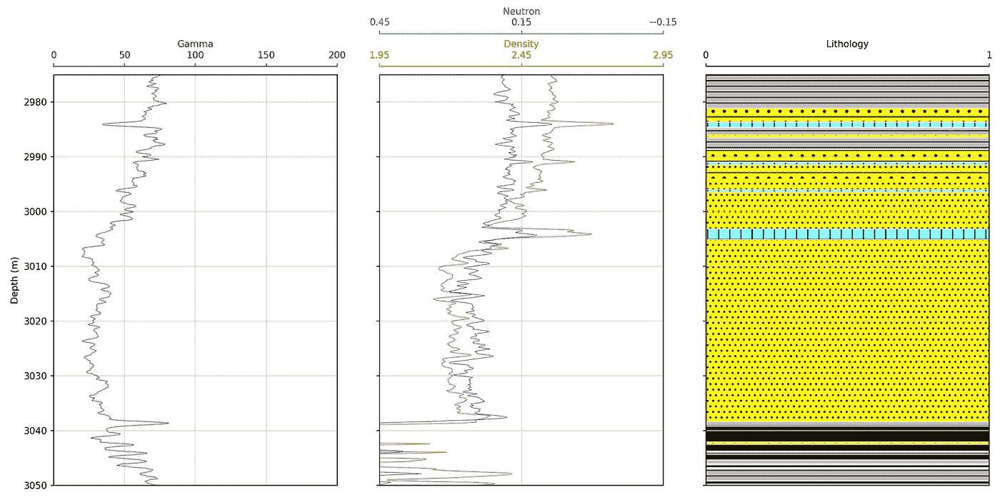
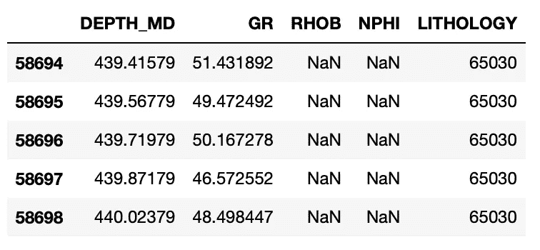
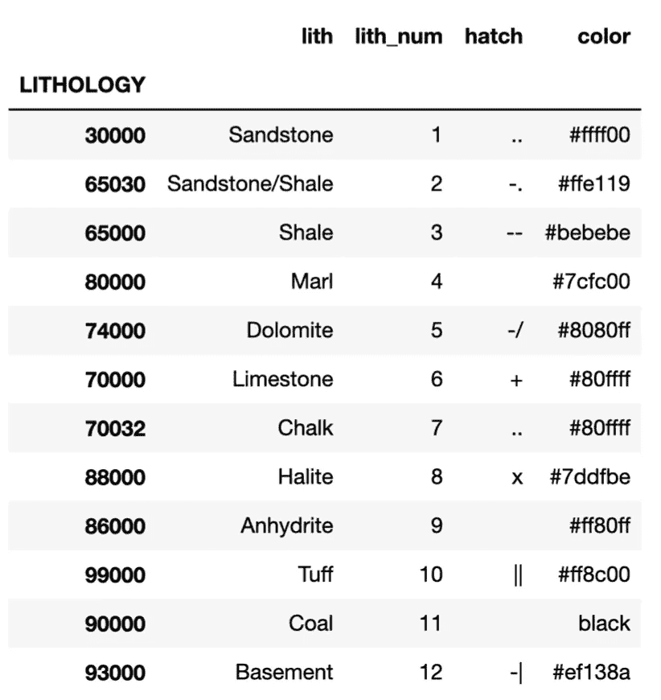
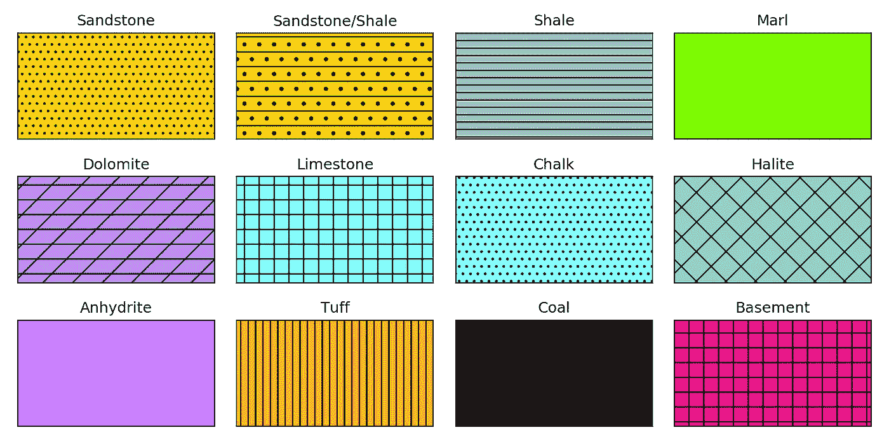
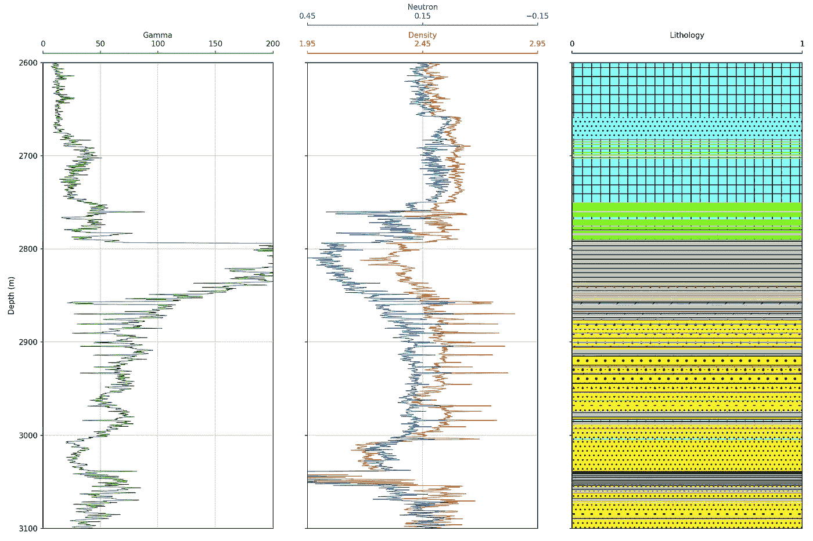
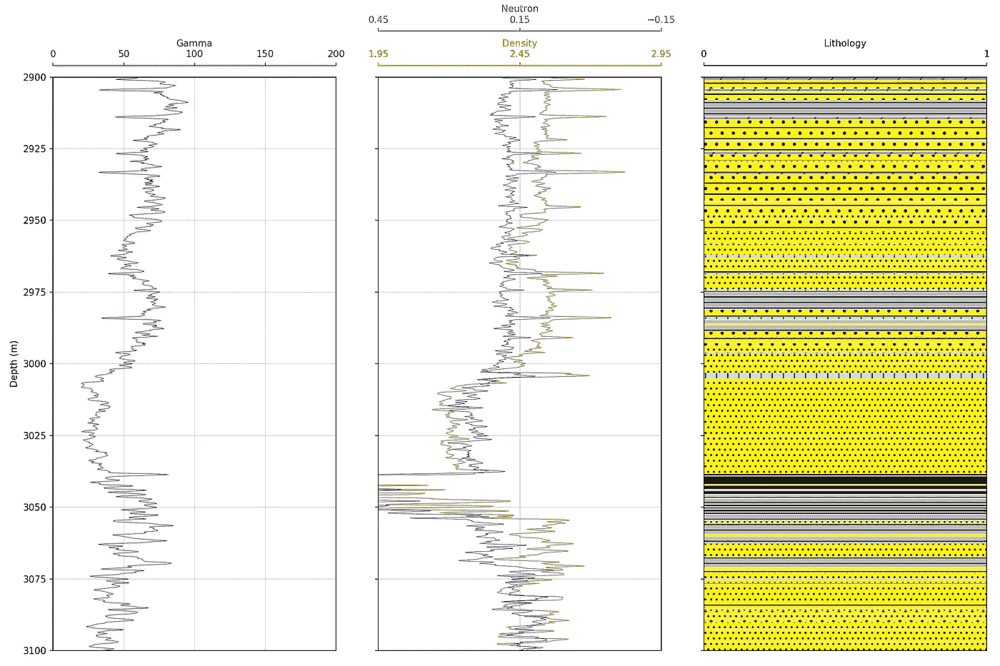

# 使用 Python 在测井图上显示岩性数据

> 原文：<https://towardsdatascience.com/displaying-lithology-data-using-python-and-matplotlib-58b4d251ee7a?source=collection_archive---------11----------------------->

## 使用 matplotlib 中的 fill_betweenx()为地质岩性数据添加可变颜色填充和阴影

测井曲线，伽马射线、中子孔隙度和体积密度数据与岩性数据一起绘制。作者创造的形象。

将岩性信息添加到测井曲线可以增强岩石物理或地质解释。它可以用来理解为什么一些日志响应会有这样的行为。该数据可能来源于之前的矿物学解释或泥浆测井。

在我的上一篇文章中:[用绘图填充增强测井曲线的可视化](/enhancing-visualization-of-well-logs-with-plot-fills-72d9dcd10c1b)，我们看到了:如何在曲线和轨迹边缘之间应用固定颜色填充，如何应用密度-中子交叉填充，以及如何根据绘制的曲线值应用可变填充。

在本文中，我们将介绍如何使用一个可变的填充来应用颜色和阴影。使用这两个选项，我们可以生成岩性填充。

这篇文章是我的 Python &岩石物理学系列的一部分。完整系列可以在[这里](http://andymcdonald.scot/python-and-petrophysics)找到。对于下面的例子，你可以在我的 GitHub 知识库中找到我的 Jupyter 笔记本和数据集，链接如下。

 [## andymcdgeo/岩石物理学-Python-系列

### 本系列 Jupyter 笔记本将带您了解使用 Python 和岩石物理数据的各个方面。一个…

github.com](https://github.com/andymcdgeo/Petrophysics-Python-Series) 

接下来，Jupyter 笔记本可以在上面的链接中找到，这篇文章的数据文件可以在 Python &岩石物理学库的[数据子文件夹](https://github.com/andymcdgeo/Petrophysics-Python-Series/tree/master/Data)中找到。

# 在测井图上设置和显示岩性填充

## 设置库

第一步是引入我们将在本文中使用的库。我们将只使用两个库: [pandas](https://pandas.pydata.org/) 和 [matplotlib](https://matplotlib.org/) 。这将允许我们将数据加载到数据框中，并在图上显示出来。

导入熊猫和 matplotlib。

## 加载数据

我们将在本文中使用的数据集来自 Xeek 和 FORCE([https://xeek.ai/challenges/force-well-logs/overview](https://xeek.ai/challenges/force-well-logs/overview))最近举办的岩性预测机器学习竞赛。竞赛的目的是从由 98 口训练井组成的数据集中预测岩性，每口井的测井完整性程度不同。目的是根据测井测量预测岩相。要下载该文件，请导航到上面链接的数据部分。

可以使用`pd.read_csv()`加载数据。由于这是一个相当大的数据集，我们将使用其中的一个单独的井来处理，我们还将只取我们需要的曲线(列)。我们可以通过这样的数据子集来实现:

为单井的特定测井曲线过滤 pandas 数据帧。

为了简单起见，我们将把`FORCE_2020_LITHOFACIES_LITHOLOGY`列重命名为`LITHOLOGY`。这是通过在数据帧上使用 rename 函数并传递旧名称和新名称的字典来完成的。注意，使用`inplace=True`参数将替换原始数据帧中的列名。

重命名熊猫数据框架中的列。

当我们使用`data.head()`调用我们的数据框架时，我们可以看到我们的数据集很小，我们的岩性列已经被重命名。

我们的熊猫数据框的前五行包含伽马射线(GR)、体积密度(RHOB)、中子孔隙度(NPHI)和岩性。

## 使用嵌套字典设置岩性

岩性栏中当前列出的岩性包含一系列数字。我们可以将它们映射到一个嵌套字典中，在这个字典中，我们有岩性的全名、简化的数字(如果需要转换的话)、阴影样式和填充的颜色。

这些颜色是基于堪萨斯地质调查局的网站。但是，在 matplotlib 的默认设置中，剖面线符号受到限制。在未来的文章中，我将介绍如何创建自定义阴影和岩性。

包含岩性信息的 python 嵌套字典。

我们可以像这样使用 from_dict 函数，快速地将我们的嵌套字典转换成 pandas 数据帧，使人们更容易阅读。

嵌套字典到熊猫数据框架的转换。

这将返回一个格式良好的表格，我们可以看到每个岩性代码的颜色和阴影。

从嵌套字典生成的熊猫数据帧。

仅仅看字典，很难理解这些单词的样子。为了解决这个问题，我们可以快速创建一个简单的图像，显示每种岩性的不同阴影和颜色。

为此，我们将首先为两个新变量 x 和 y 定义一些坐标。然后，我们将使用子图形设置 matplotlib 图形和轴:

`fig, axes = plt.subplots(ncols=4, nrows=3, sharex=True, sharey=True, fig size=(10,5), subplot_kw={'xticks':[], 'yticks':[]})`

这允许我们定义绘图的大小(4 列乘 3 行)、图形大小，并关闭两个轴上的刻度线。

然后，我们希望遍历展平的轴和嵌套的字典，将数据和阴影颜色填充添加到每个子情节中。当我们处理一个嵌套的字典时，我们需要多次使用方括号[ ][ ]来进入两个层次。第一层是键，第二层是嵌套字典的键。例如，要检索颜色，我们可以通过键入`lithology_numbers[30000]['color']`来访问它

循环遍历嵌套字典中的每一项并将其绘制在子情节上的简短代码片段。

这将生成下面的图例，我们稍后可以参考它。请注意，岩性符号并不 100%匹配堪萨斯地质调查局的图表。我们将在以后的文章中看到如何解决这个问题。

使用 matplotlib 的颜色和阴影的图形表示。作者创建的图像。

## 用岩性轨迹建立测井曲线

在以前的文章中([用绘图填充增强测井曲线的可视化](/enhancing-visualization-of-well-logs-with-plot-fills-72d9dcd10c1b)和[用测井曲线数据进行勘探数据分析](/exploratory-data-analysis-with-well-log-data-98ad084c4e7))，我已经动态地设置了绘图并传入了我正在处理的数据帧。在本文中，我将创建一个简单的 makeplot 函数，我们可以将数据帧传递给它。

假设曲线名称相同，这使我们可以轻松地将代码重新用于其他数据帧。这可以进一步完善，使其更加通用。这个新函数接受三个参数，dataframe、top_depth 和 bottom depth。

该代码将生成一个有 3 条轨迹的测井曲线，一条用于伽马射线，一条包含中子孔隙度和体积密度，最后一条包含我们的地质岩性数据。

一个 python 函数，用于绘制包含伽马射线、体积密度和中子孔隙度以及岩性的测井图。

确保 matplotlib 中的岩性`fill_betweenx`函数创建可变填充的关键代码如下所示。我们所做的就是遍历字典中的每个键，为字典中的特性分配简单的变量名，然后使用`fill_betweenx`函数检查我们的岩性列中的值是否等于字典键。如果是这样，那么它会将相关的颜色和阴影应用到填充中。然后，它将移动到下一个键并重复，直到所有键都循环通过。

循环通过嵌套字典并基于岩性数据应用可变填充。

## 显示测井曲线和岩性

一旦我们建立了一个函数图。我们可以简单地传递我们的数据框架和我们想要绘制的深度。在本例中，我们将重点关注一小部分数据，以便能够看到绘图填充的变化。

调用 makeplot 函数。

一旦我们这样做了，下面的情节就会出现。

matplotlib 生成的测井曲线，地质岩性数据覆盖 2600 至 3100 米。作者创造的形象。

要更详细地查看岩性填充，我们可以通过更改深度范围值来放大。

matplotlib 生成的测井曲线，地质岩性数据覆盖 2900 至 3100 米。作者创造的形象。

# 摘要

在本文中，我们介绍了如何使用 matplotlib 的`fill_betweenx()`函数设置和显示岩性数据。我们看到了如何使用嵌套字典来存储每个岩性的参数，然后使用 for 循环调用它来填充正确的颜色和阴影。

将这些数据添加到绘图中可以增强地球科学家或岩石物理学家将电测井测量与地质相关联的方式。

***感谢阅读！***

*如果您觉得这篇文章很有用，请随时查看我的其他文章，这些文章介绍了 Python 和测井数据的各个方面。你也可以在*[***GitHub***](https://github.com/andymcdgeo)***找到我在这篇文章和其他文章中使用的代码。***

*如果你想联系我，你可以在*[***LinkedIn***](https://www.linkedin.com/in/andymcdonaldgeo/)**或者在我的* [***网站***](http://andymcdonald.scot/) *找到我。**

*有兴趣了解更多关于 python 和测井数据或岩石物理学的知识吗？跟我上 [***中***](https://andymcdonaldgeo.medium.com/) *。**

# *参考*

*堪萨斯地质调查局，岩性符号。[http://www . kgs . ku . edu/PRS/Ozark/PROFILE/HELP/DATA _ ENTRY/岩性/岩性-符号. html](http://www.kgs.ku.edu/PRS/Ozark/PROFILE/HELP/DATA_ENTRY/lithology/Lithology-Symbols.html)*

*“岩相数据由 FORCE Machine Learning competition 提供，测井和地震 2020 年”Bormann P .，Aursand P .，Dilib F .，Dischington P .，Manral S. 2020 年。2020 原力机器学习大赛。[https://github . com/bolgebrygg/Force-2020-机器学习-竞赛](https://github.com/bolgebrygg/Force-2020-Machine-Learning-competition)*