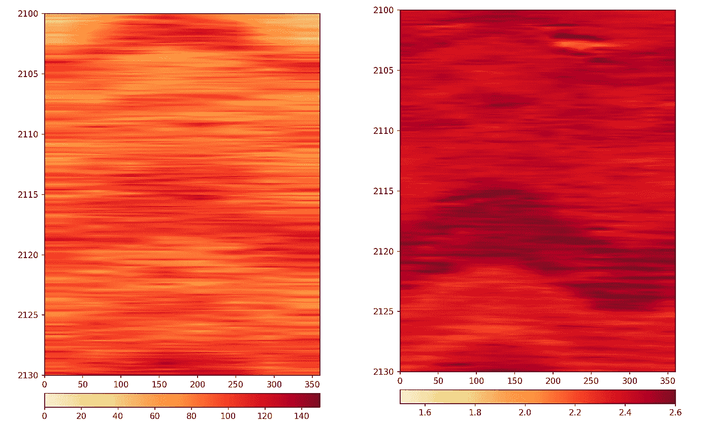
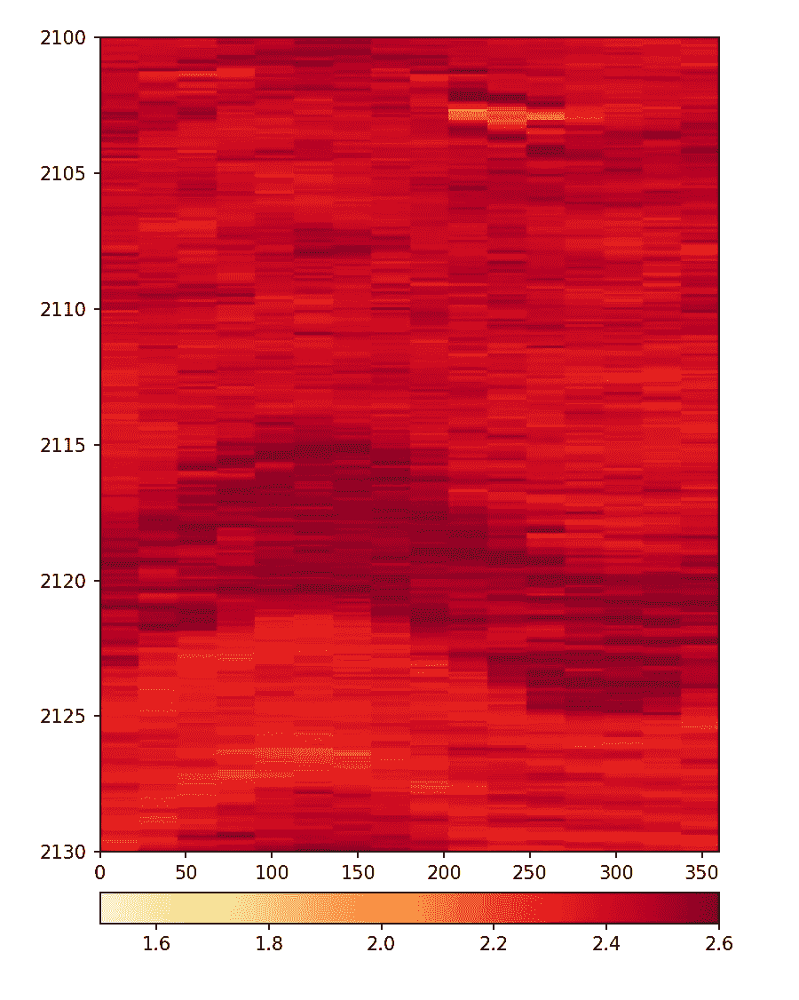
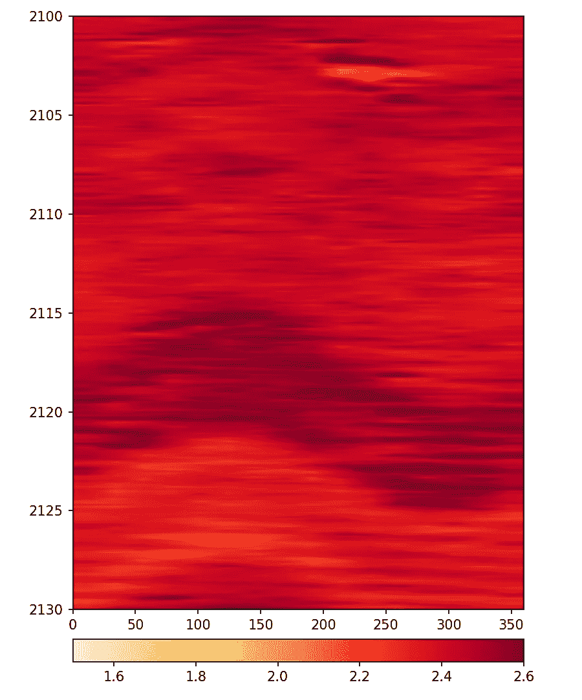
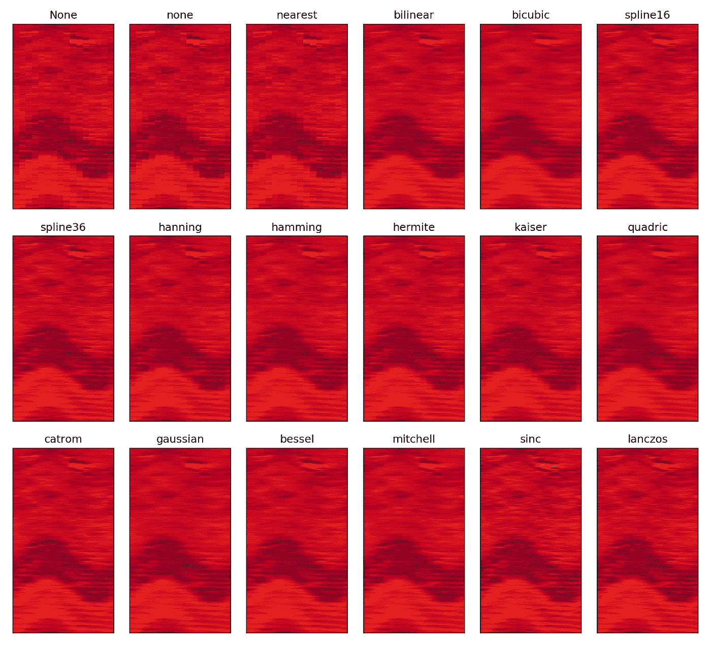
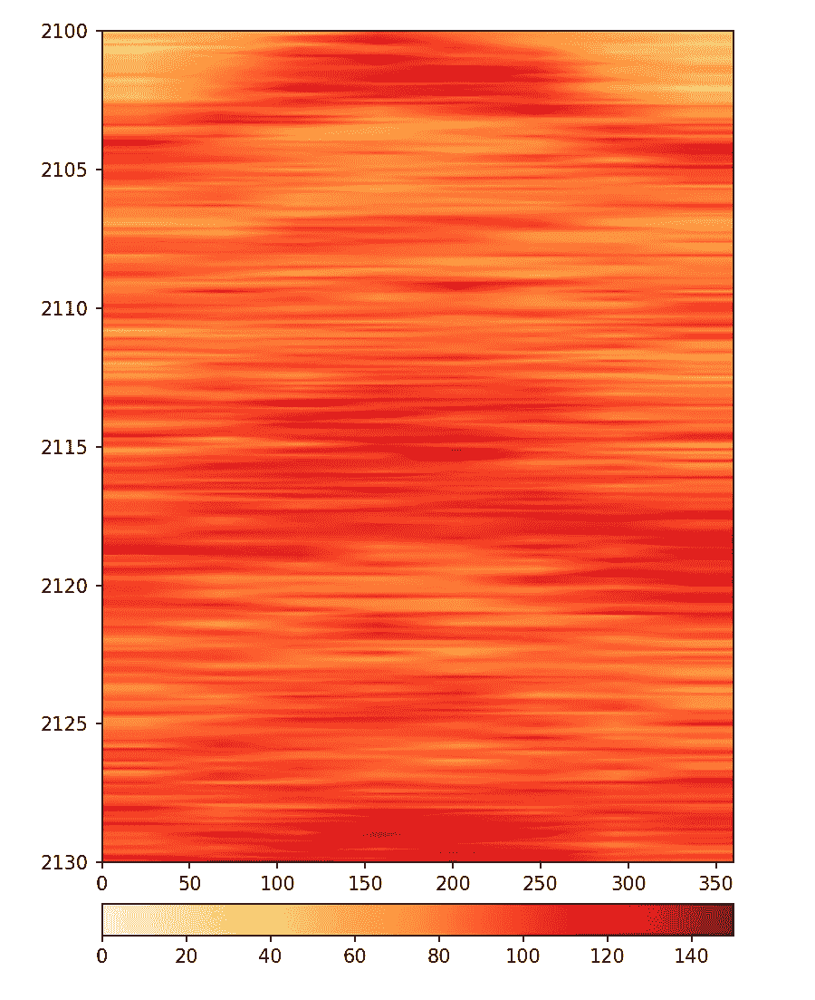
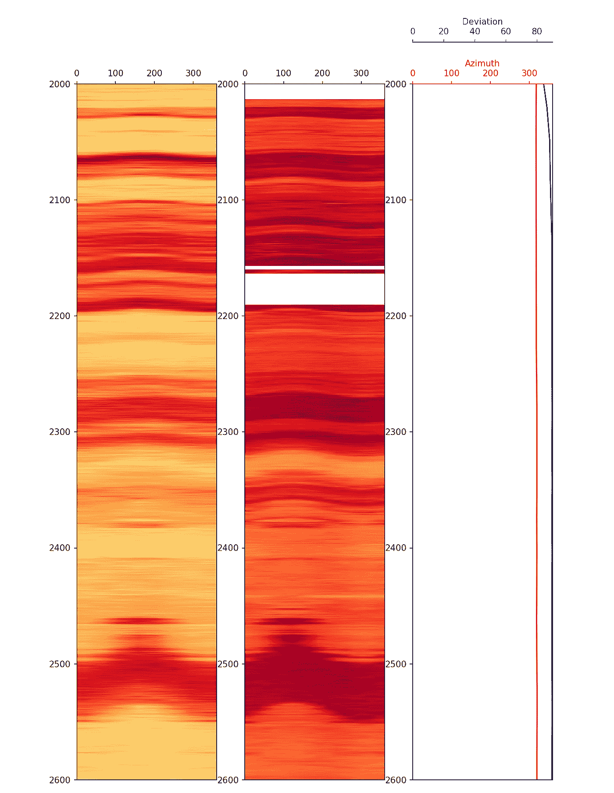

# 在 Python 中显示随钻测井(LWD)图像日志

> 原文：<https://towardsdatascience.com/displaying-logging-while-drilling-lwd-image-logs-in-python-4babb6e577ba?source=collection_archive---------28----------------------->

## 利用 matplotlib 的强大功能显示井筒图像数据



使用 Python 中的 matplotlib 显示随钻测井图像数据。作者创造的形象。

# 介绍

钻孔图像测井是从不同的测井测量/工具生成的钻孔壁的假彩色伪图像。电缆测井和随钻测井(LWD)获取井眼图像的方式不同。在电缆环境中，测量是通过压在井壁上的衬垫上的按钮进行的，覆盖范围有限，但分辨率很高。相比之下，在 LWD 环境中，测量是由构成钻柱/工具组件一部分的工具中内置的传感器进行的，并使用工具旋转，提供完整的 360 度覆盖范围。LWD 图像数据通常被分成扇区，扇区的数量根据工具技术的不同而不同。随着工具的旋转，数据被收集到相关的扇区中，由此我们可以建立井壁的伪图像。

生成的图像通常以二维形式显示在测井图上，如“展开的钻孔”和上图所示。圆柱形钻孔在垂直井中沿着北方位角切割，或者在斜井/水平井中沿着钻孔的高边切割。作为投影到 2D 表面的结果，任何与钻孔相交的平面要素在图上都表示为正弦曲线形状。通过分析这些正弦曲线的振幅和偏移，地质学家可以了解地下的地质结构。钻孔图像数据也可用于识别和分类不同的地质相/结构、识别薄层、断层和裂缝分析等。

在本文中，我将使用 Python 和 matplotlib 显示方位伽马射线和方位密度测量的随钻测井图像数据。

这篇文章是我的 Python &岩石物理学系列的一部分。详情可在[这里](http://andymcdonald.scot/python-and-petrophysics)找到。对于下面的例子，你可以在我的 GitHub 知识库中找到我的 Jupyter 笔记本和数据集，链接如下。

<https://github.com/andymcdgeo/Petrophysics-Python-Series>  

接下来，本文的数据文件可以在 Python &岩石物理库的[数据子文件夹](https://github.com/andymcdgeo/Petrophysics-Python-Series/tree/master/Data)中找到。

# 加载和显示 LWD 图像数据

## 设置库和加载数据

在我们开始处理数据之前，我们需要导入一些库来处理。对于本文，我们将使用[熊猫](https://pandas.pydata.org/)、 [matplotlib](https://matplotlib.org/) 、 [numpy](https://numpy.org/doc/stable/index.html) 和 [lasio](https://github.com/kinverarity1/lasio) 库。这三个库允许我们加载 las 数据、使用它并创建数据的可视化。

显示 LWD 影像数据所需的 Python 库加载。

## 导入油井和测量数据

我们使用的数据集来自可公开访问的荷兰 NLOG 数据库。las 文件混合了 LWD 测量值和两幅图像。由于 las 文件是平面的，不支持阵列，LWD 影像数据通常以单个扇区的形式交付。我们将加载的第二个文件是调查，这使我们能够了解井眼的偏差和方位角，并有助于计算准确的地层倾角。在这篇文章中，我们将不讨论倾角调整。

我们将首先使用 lasio 加载 las 文件，并使用`.df().`将其转换为数据帧

加载图像 las 文件并将其转换为熊猫数据帧。

一旦数据被加载，我们可以通过使用`.describe()`来确认我们所拥有的数据。由于文件中有大量的曲线，我们可以调用`df.columns()`查看完整的曲线列表:

检索熊猫数据帧中的列。

它返回:

```
Index(['APRESM', 'GRAFM', 'RACELM', 'RPCELM', 'RACEHM', 'RPCEHM', 'RACESLM', 'RPCESLM', 'RACESHM', 'RPCESHM', 'RPTHM', 'NPCKLFM', 'DPEFM', 'BDCFM', 'DRHFM', 'TVD', 'BLOCKCOMP', 'INNM', 'ROP_AVG', 'WOB_AVG', 'TCDM', 'ABDCUM', 'ABDCLM', 'ABDCRM', 'ABDCDM', 'ABDC1M', 'ABDC2M', 'ABDC3M', 'ABDC4M', 'ABDC5M', 'ABDC6M', 'ABDC7M', 'ABDC8M', 'ABDC9M', 'ABDC10M', 'ABDC11M', 'ABDC12M', 'ABDC13M', 'ABDC14M', 'ABDC15M', 'ABDC16M','ABDCM', 'GRAS0M', 'GRAS1M', 'GRAS2M', 'GRAS3M', 'GRAS4M', 'GRAS5M', 'GRAS6M', 'GRAS7M', 'GRASM'], dtype='object')
```

如简介中所述，我们可以看到方位密度图像被分成 16 个单独的扇区，标记为 ABDC1M 至 ABDC16M。方位伽马射线图像被分成 8 个扇区，并标记为 gras 0 到 gras 7。

调查数据包含在 csv 文件中，可以按如下方式加载。

将油井测量数据加载到数据框架中。

当我们从数据帧中读取列时，我们发现有三条曲线:测量深度(深度)、井斜(DEVI)和井眼方位角(AZIM)。我们将使用这些曲线在我们的图上进行额外的可视化。

在我们绘制数据之前，我们将通过将主数据帧分割成两个较小的数据帧来简化数据的处理。我们可以通过调用 dataframe (df)并提供我们想要提取的曲线名称列表来实现这一点。

将主数据帧细分成方位伽马射线和方位密度图像。

# 绘制图像数据

## 方位密度图像

绘制图像数据相当简单。我们首先必须使用`plt.figure(figsize=(7,15))`创建一个人物对象。figsize 参数允许我们以英寸为单位控制最终绘图的大小。

我们也可以选择为最小和最大深度创建两个新变量。这些用于定义绘图区域的范围。由于我们的数据帧的索引包含我们的深度值，我们可以创建两个新变量`miny`和`maxy`，它们等于最小和最大索引值。

使用 matplotlib 中的 imshow()绘制方位密度数据，无需插值。

当我们执行代码时，我们生成了一个图像，向我们展示了我们的特征，但同时，我们可以看到它看起来有点块状。如果你看得足够近，你将能够分辨出图像的各个部分。



使用 matplotlib imshow()绘制的方位角密度图像，无插值。

我们可以对图像进行一些插值，使其平滑。在下面的示例中，插值已更改为双线性。



使用带有双线性插值的 matplotlib imshow()绘制的方位密度图像。

您可以在 [matplotlib 文档](https://matplotlib.org/3.1.1/gallery/images_contours_and_fields/interpolation_methods.html)中找到插值选项的完整列表。为了说明不同的方法，我使用了文档中的代码来生成显示不同选项的网格。

在方位密度图像数据上比较不同的 imshow()插值方法。



imshow()和方位密度图像数据的不同类型的插值。

你可以从上面的图像中看到，一些(lanczos 和 sinc)看起来比其他的稍微清晰一些。当处理图像数据时，选择将最终取决于用户偏好。

## 方位伽马射线图像

我们可以重复上述代码，通过将数据帧从 azidendf 更改为 azigamdf 来生成我们的方位伽马射线图像。



使用 matplotlib imshow()绘制的方位伽马射线图像。

当我们查看我们的图像时，我们注意到与密度图像相比，细节层次明显较少。这与测量类型和记录的较低扇区数有关。

# 构建最终情节

现在，我们可以使用支线图将我们的图像记录和勘测数据绘制在一起。`subplot2grid((1,3),(0,0))`方法允许我们设置绘图的形状，在本例中，我们绘制 1 行 3 列。然后，我们将 ax1、ax2 和 ax3 分配给函数中第二组数字表示的三列。因为我们在与方位角相同的轨道上绘制偏差，我们需要使用`ax.twiny()`在现有轴的顶部添加一个新轴。

为了绘制我们的图像数据，我们可以为每个图像使用前面部分中的代码，而不是将其分配给绘图，我们可以将它们分配给子绘图轴。

用于绘制方位密度图像、方位伽马图像以及油井勘测数据的 Python 代码。



方位密度和方位伽马射线数据的 Matplotlib 图，与井斜和方位一起绘制。

现在，我们可以一起看到两幅图像，我们还可以考虑我们的钻孔偏差，这表明我们处于水平段。了解这一点很重要，尤其是在从图像测井计算任何倾角时。

你可能会注意到，2500 点处的河床似乎在两个地块之间发生了偏移，需要进一步调查。这将不在本文中讨论。

# 摘要

在本文中，我们介绍了如何加载和显示来自 LWD 方位伽马射线和密度测量的井眼成像测井。一旦数据被分成各自的数据帧，很容易将它们传递到 matplotlib 中的`imshow()`图。从这些图像数据中，地质学家和岩石物理学家可以更好地了解地下的地质构成。

*“所有图片由作者生成”*

***感谢阅读！***

*如果您觉得这篇文章很有用，请随时查看我的其他文章，这些文章介绍了 Python 和测井数据的各个方面。你也可以在*[***GitHub***](https://github.com/andymcdgeo)***找到我在这篇文章和其他文章中使用的代码。***

*如果你想联系我，你可以在*[***LinkedIn***](https://www.linkedin.com/in/andymcdonaldgeo/)**或者在我的* [***网站***](http://andymcdonald.scot/) *找到我。**

**有兴趣了解更多关于 python 和测井数据或岩石物理学的知识吗？跟我上* [***中***](https://andymcdonaldgeo.medium.com/) *。**