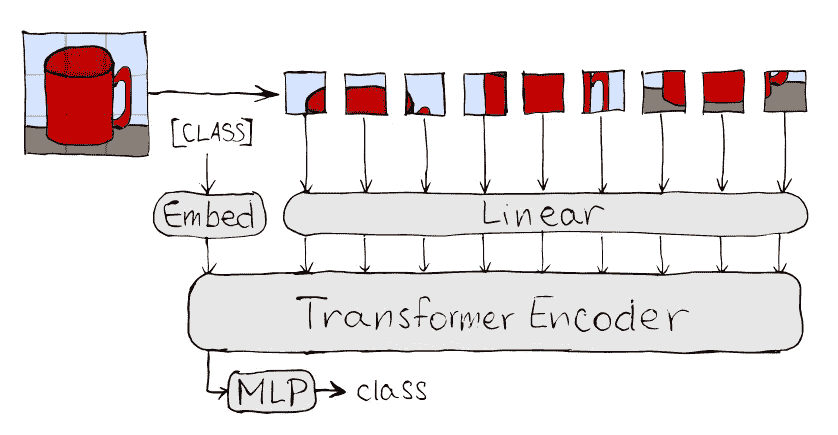
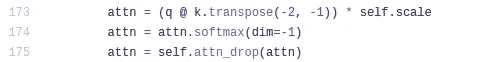
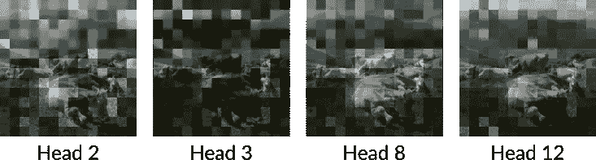
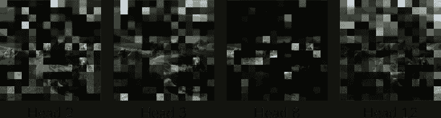

# 用 NoPdb 剖析 ML 模型

> 原文：<https://towardsdatascience.com/dissecting-ml-models-with-nopdb-6ff4651fb131?source=collection_archive---------19----------------------->

## [实践教程](https://towardsdatascience.com/tagged/hands-on-tutorials)

## 编程 Python 调试器 NoPdb 指南，以及可视化视觉转换器(ViT)注意力的应用


图片作者。

调试机器学习模型与调试“传统”代码非常不同。在深度神经网络中，我们必须处理大的特征图和权重矩阵，这些通常看起来没有意义。随着 *ML 可解释性*的日益重要，已经设计出了几种分析这些内部表示的方法，但是在实践中，获得它们并不总是简单明了的。像 [Pdb](https://pymotw.com/3/pdb/index.html) 这样的经典调试器可能会有所帮助，但是用它来进行可视化和分析至少是不方便的。

虽然 PyTorch 等一些框架通过允许将[挂钩](https://pytorch.org/tutorials/beginner/former_torchies/nnft_tutorial.html#forward-and-backward-function-hooks)附加到网络的层来解决这一问题，但这仅适用于我们感兴趣的功能作为特定层的*输入*或*输出*的情况。如果我们想要访问在某个函数中只作为*局部变量*可用的信息——例如在现在无处不在的变形金刚的许多实现中的*注意力权重*——我们就不走运了。

还是我们？

# 认识 NoPdb

[**NoPdb**](https://github.com/cifkao/nopdb) (声明:我是作者)是一个**非交互式 Python 调试器**。与标准 Python 调试器 Pdb 不同，NoPdb 没有交互式用户界面，但可以使用方便的上下文管理器对其进行**编程***—*——以在给定的代码段运行时执行特定的操作。例如，我们可以使用它轻松地从其他人的代码深处获取一个局部变量，并保存它以供以后分析，甚至可以动态地修改它的值，看看会发生什么。

我们将在这里使用的基本功能由`nopdb.capture_call()`和`nopdb.capture_calls()`提供(参见[文档](https://nopdb.readthedocs.io/en/stable/getting-started.html#capturing-function-calls))。这些上下文管理器允许捕获关于给定函数调用的有用信息，包括参数、局部变量、返回值和堆栈跟踪。一个更强大的上下文管理器是`[nopdb.breakpoint()](https://nopdb.readthedocs.io/en/stable/getting-started.html#setting-breakpoints)`，当到达给定的代码行时，它允许执行用户定义的动作(例如计算表达式)。

# 解剖视觉转换器

为了查看 NoPdb 的运行情况，我们将把它应用到一个 [**视觉转换器**](https://arxiv.org/abs/2010.11929) ( **ViT** )。ViT 是最近提出的完全基于 [Transformer](https://en.wikipedia.org/wiki/Transformer_(machine_learning_model)) 架构的图像分类模型。如下图所示，其主要思想相当简单:将输入图像分割成小块，让每个小块通过一个线性层，然后对这个“小块嵌入”序列应用一个标准的 Transformer 编码器。为了进行分类，使用一个常见的技巧:我们在输入序列的开头添加一个特殊的`[class]`标记，并在编码器输出的相应(第一个)位置附加一个分类头(单层 MLP)。



视觉转换器(ViT)。作者绘图。

虽然我们不太关心这篇文章中架构的细节，但我们确实需要知道模型的每一层都包含一个*注意机制*，它为*的每一对输入位置*(即图像块，加上`[class]`令牌)计算一个权重(一种相似性得分)。就像我们现在要做的，可视化这些权重可以给我们一个线索，告诉我们图像的哪些部分对模型最重要。

我们将使用来自 [pytorch-image-models](https://github.com/rwightman/pytorch-image-models) 库的`timm`包中预先训练好的 ViT，并且我们将跟踪[这个 Colab 笔记本](https://colab.research.google.com/github/cifkao/nopdb/blob/main/docs/pytorch_tutorial.ipynb)(笔记本最重要的部分都包含在这里)。

## 运行 ViT

让我们首先安装`timm`计算机视觉包，以及 [NoPdb](https://github.com/cifkao/nopdb) :

```
pip install timm==0.4.5 nopdb==0.1
```

加载预训练模型很容易:

现在，我们将加载一个图像并将其提供给模型。让我们试试这张我在瑞士拍的照片:


瑞士阿姆登的奶牛。作者照片。

模型返回的是所有类的*逻辑值*(前 softmax 值)。在[笔记本](https://colab.research.google.com/github/cifkao/nopdb/blob/main/docs/pytorch_tutorial.ipynb)里，我写了一个小函数`predict()`，打印出*最有可能*的类及其*概率*。打电话给`predict(input)`给:

```
alp     0.7936609983444214
ox      0.1110275536775589
valley  0.029854662716388702
oxcart  0.008171545341610909
ibex    0.008044715970754623
```

## 视觉化注意力

现在让我们看看模型的内部！ViT 由 12 个`blocks`组成，每个包含一个`attn`层；这是计算注意力权重的地方:

```
VisionTransformer(
  (patch_embed): PatchEmbed(
    (proj): Conv2d(3, 768, kernel_size=(16, 16), stride=(16, 16))
  )
  (pos_drop): Dropout(p=0.0, inplace=False)
  (**blocks**): **ModuleList**(
    (0): Block(
      (norm1): LayerNorm((768,), eps=1e-06, elementwise_affine=True)
      (**attn**): **Attention**(
        (qkv): Linear(in_features=768, out_features=2304, bias=True)
        (attn_drop): Dropout(p=0.0, inplace=False)
        (proj): Linear(in_features=768, out_features=768, bias=True)
        (proj_drop): Dropout(p=0.0, inplace=False)
      )
      (drop_path): Identity()
      (norm2): LayerNorm((768,), eps=1e-06, elementwise_affine=True)
      (mlp): Mlp(
        (fc1): Linear(in_features=768, out_features=3072, bias=True)
        (act): GELU()
        (fc2): Linear(in_features=3072, out_features=768, bias=True)
        (drop): Dropout(p=0.0, inplace=False)
      )
    )
    ...
  (norm): LayerNorm((768,), eps=1e-06, elementwise_affine=True)
  (pre_logits): Identity()
  (head): Linear(in_features=768, out_features=1000, bias=True)
)
```

假设我们想将注意力可视化在第 5 个区块，即`model.blocks[4]`。查看 `[Attention](https://github.com/rwightman/pytorch-image-models/blob/v0.4.5/timm/models/vision_transformer.py#L168-L180)` [层](https://github.com/rwightman/pytorch-image-models/blob/v0.4.5/timm/models/vision_transformer.py#L168-L180)的[代码，我们可以发现一个名为`attn`的变量，它正是我们要寻找的注意力张量:](https://github.com/rwightman/pytorch-image-models/blob/v0.4.5/timm/models/vision_transformer.py#L168-L180)



为了得到它的值，我们将使用`nopdb.capture_call()`上下文管理器来捕获对注意力层的`forward`方法的调用:

瞧——`attn_call`对象现在包含了一堆关于调用的有用信息，包括所有局部变量的值！让我们看看它们是什么:

检查`attn_call.locals['attn']`，我们可以看到它是一个形状为[1，12，197，197]的张量，其中 1 是批量大小，12 是注意头的数量，197 是图像块的数量+ 1 用于`[class]`令牌(记住，注意机制为每对*位置*计算一个权重)。

我们可以用不同的方法来分析这些注意力矩阵，但为了简单起见，我选择直观地显示每个补丁平均获得了多少注意力(针对每个注意力头):

(助手功能`plot_weights`，只是显示图像，并根据其权重调整每个面片的亮度，可以在[笔记本](https://colab.research.google.com/github/cifkao/nopdb/blob/main/docs/pytorch_tutorial.ipynb)中找到。)

调用`plot_attention(input, attn_call.locals[‘attn’][0])`为 12 个注意力头中的每一个产生一个图。以下是其中的一些:



第五个变形金刚模块中的平均注意力权重(对比度增加以便更好地观看)。每个补丁越亮，注意力权重越高。图片作者。

我们可以看到，一些头部倾向于主要关注图像中的特定对象，如奶牛(头部 8)或天空(头部 12)，一些头部到处看(头部 2)，一些头部主要关注一个看似随机的斑块，如背景中的一座山的一部分(头部 3)。

请记住，这只是一个有限的例子。我们可以通过使用 [*注意力卷展栏*或*注意力流*](https://arxiv.org/abs/2005.00928) 更进一步，这是估计单个输入面片如何对输出做出贡献的更好方法，我们可以以几乎相同的方式利用 NoPdb。

## 调整重量

NoPdb 可以做的另一件事是将代码*插入到函数中。这意味着我们不仅可以捕获变量，还可以修改它们！我选了一个有点傻的例子来说明这一点:我们将在所有层中使用前 softmax 注意力权重，并将它们乘以 3。(这就像应用一个低的 *softmax 温度*，使分布更加“峰值化”。)我们当然可以通过*编辑`timm`包的代码*来做到这一点，但是我们需要重新加载包和模型，这可能会很繁琐，特别是如果我们需要重复做的话。另一方面，NoPdb 允许我们快速地进行更改，而不需要重新加载。*

我们再来看看`Attention.forward()`:


我们希望将`attn = attn * 3`放在 softmax 之前，即第 174 行。我们将通过在这一行设置一个“断点”并让它执行这条语句来实现这一点。(注意，NoPdb 断点实际上并不停止执行；相反，它只是执行一些我们给它的代码。)我们也要像之前一样捕捉第 5 块的局部变量。

请注意，我们没有指定行号(174)，而是指定了该行的实际*代码*:`line='attn = attn.softmax(dim=-1)'`—这只是一个方便的特性，并且`line=174`(如同在传统调试器中一样)也可以工作。另外，请注意，由于我们将函数指定为`Attention.forward`(而不是`model.blocks[4].attn.forward`)，断点将在每个关注层的*处触发。*

让我们看看这是如何改变预测的:

```
balloon     0.2919192612171173
alp         0.12357209622859955
valley      0.049703165888786316
parachute   0.0346514955163002
airship     0.019190486520528793
```

我们捕捉到的注意力模式:



和上面一样的情节，但是调整了注意力的权重。图片作者。

# 关于其他框架的说明

虽然这篇文章关注的是 PyTorch，但是 NoPdb 不依赖于任何特定的框架，可以用于任何 Python 3 代码。

也就是说，一些框架，如 TensorFlow 或 JAX，将模型编译成计算图或直接编译成计算内核，然后在 Python 之外执行，NoPdb 无法访问。幸运的是，在大多数情况下，我们可以出于调试目的禁用该功能:

*   在 TensorFlow 2.x 中，我们可以在执行模型之前调用`[tf.config.run_functions_eagerly(True)](https://www.tensorflow.org/api_docs/python/tf/config/run_functions_eagerly)`。(注意，这不适用于为 TensorFlow 1.x 编写的模型，这些模型被显式编译为图形。)
*   在 JAX，我们可以使用`[disable_jit()](https://jax.readthedocs.io/en/latest/jax.html#jax.disable_jit)`上下文管理器。

# 一些 NoPdb 链接

*   [Colab 本帖笔记本](https://colab.research.google.com/github/cifkao/nopdb/blob/main/docs/pytorch_tutorial.ipynb)
*   [GitHub 库](https://github.com/cifkao/nopdb)
*   [单据](https://nopdb.readthedocs.io/en/stable/)