# 剖析 Stockfish 第 1 部分:深入了解象棋引擎

> 原文：<https://towardsdatascience.com/dissecting-stockfish-part-1-in-depth-look-at-a-chess-engine-7fddd1d83579?source=collection_archive---------5----------------------->

## Stockfish 是最好的现代国际象棋引擎之一，比 DeepBlue 强几个数量级。

*Stockfish 象棋引擎，*背景照片由 [ᴊᴀᴄʜʏᴍ ᴍɪᴄʜᴀʟ](https://unsplash.com/@jachymmichal?utm_source=unsplash&utm_medium=referral&utm_content=creditCopyText) 在 [Unsplash](https://unsplash.com/s/photos/chess?utm_source=unsplash&utm_medium=referral&utm_content=creditCopyText) 上拍摄

ost 国际象棋引擎有着相同的蓝图:抽象出一个国际象棋的位置，找到所有的候选棋步，遍历候选棋树直到一个给定的深度，并评估这些棋步的相关性以找到最好的一个。但是，它们的质量取决于以下标准:

*   速度:研究候选移动和树的迭代，
*   准确性:评估板。

这篇文章将仔细研究开源象棋引擎 [Stockfish 12](https://stockfishchess.org/) 的内部工作原理，并解释其成功的关键。本系列的第一部分将关注 Stockfish 如何提取头寸并生成候选人的移动。

# 比特板

**国际象棋棋盘由 64 个方块**组成，这意味着一个人可以在一个 **64 位变量**中存储一个给定棋子的位置。每个位对应一个方块，如果设置为 *1* ，则该方块上有一个棋子。例如，下面的位棋盘代表游戏开始时白玩家的棋子。

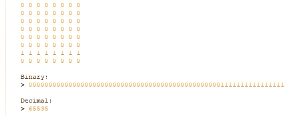

在 Stockfish 中，bitboards 从 a1 方块开始[，按等级进行，位置以小端编码方式存储](https://www.chessprogramming.org/Square_Mapping_Considerations#LittleEndianRankFileMapping)，如上所述。通过这种方式，棋盘上的操作可以转化为位运算:

*   将棋子向左移动一格:*左移 1 位，*
*   将棋子向前移动一格:*左移 8 位，*
*   检索一个玩家的所有棋子:*他所有棋盘的逻辑或，*
*   验证一个方块是否被占据:*棋盘和方块的位置掩码的逻辑与。*
*   …

作为一个例子，下面是 Stockfish 代码，它可以让**方块受到一个 bitboard of 卒** (bitboard.h)的攻击:

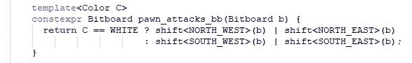

使用*Bitboard shift<D>(Bitboard b)*一个模板化的函数，使用移位操作在给定方向 *D* 上移动 bitboard *b* 。

# 寻找候选人

现在我们有了给定任何位置的棋盘的表示，国际象棋引擎必须为一个玩家找到所有的候选走法，以便建立所有可能走法的树。

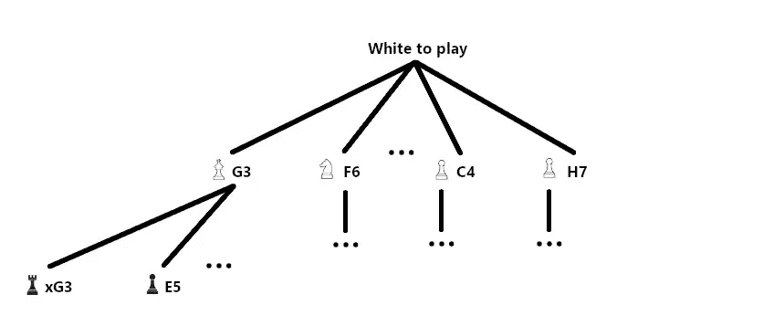

作者图片

## 样板

在模式中移动的棋子(棋子、骑士和国王)的候选移动是在一组固定的基数中。例如，D4 的白衣骑士总是有以下候选人:

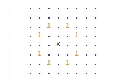

[在包含所有骑士的位板上的位移操作](https://en.wikipedia.org/wiki/Bitwise_operation#Arithmetic_shift)被用于计算那些候选移动:

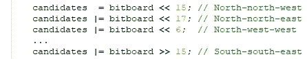

可能的移动是所有这些移动的或连接。然而，如果该骑士在一个侧面的行列(Ax，Hx，x1，x8)，它不允许移动到棋盘之外。因此，用边列或文件掩蔽位棋盘将确保如果骑士处于这样的位置，将不会生成候选者。

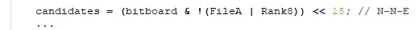

Stockfish 实际上是在生成候选项后执行检查，并使用一个*Bitboard safe _ destination(Square s，int step)* (bitboard.cpp)方法来确保棋步不会离开棋盘。最后，还有一些额外的验证，如阻塞块或发现的检查。为此，Stockfish 有一个*bool Position::legal(Move m)*方法(position.cpp)来测试一个伪合法的移动是否真的合法。

## 滑动件

车、象和王后可以沿着一个方向移动无限数量的方格，直到它们到达棋盘的边缘，或者直到另一个棋子阻碍了它们的移动。使用预先计算的射线即时计算它们的候选移动是可行的。棋子的攻击射线与所有被占据的方格的位板进行“与”运算，使用一个名为[*bitscan*](https://docs.microsoft.com/en-us/cpp/intrinsics/bitscanforward-bitscanforward64?view=msvc-160)*的处理器级指令来寻找计算结果的第一个非平凡位。然而，该操作必须对每个片段的每个攻击射线重复，这导致了实时使用的计算密集型方法。*

*因此，Stockfish 使用了一种计算效率更高的方法，即在包含滑动棋子候选移动的数组中进行查找。为了生成在该数组中查找的索引，仍然需要找到滑动块的所有阻挡块:*

*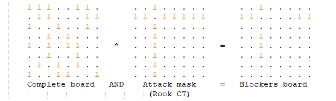*

*然后，Stockfish 将使用*阻挡板*作为包含候选移动的预先计算的位板的数组中的索引:*

*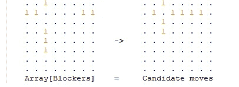*

*这种方法提出了一个实际问题。由于*阻挡器板*是一个 64 位变量，包含候选移动的数组将具有 2⁶⁴元素，其大小约为 1 艾字节。由于不可能在内存中创建这么大的数组，Stockfish 将使用一个[散列表](https://en.wikipedia.org/wiki/Hash_table)来存储候选移动。由于存在大约 20，000 个不同的阻断板，hashmap 的大小只有几百千字节。关键的部分是找到一个[散列函数](https://en.wikipedia.org/wiki/Hash_function)，它将在我们的拦截器板空间中快速计算并且没有冲突。*

*为此，Stockfish 实现了一种叫做**魔法位板**的方法。目标是找到与特定棋子 *p* (车或象)和特定方块 *s* 相关的数字 *λ(p，s)* ，例如:*

*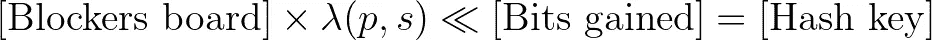*

*与原来的 *blockers_board* 相比，*哈希键*将具有更少的位(获得的*位】):它可以用于索引我们的数组，使用合理的内存量。给定我们之前在 C7 方块上的车的*阻挡器棋盘*的例子，散列密钥生成将是:**

*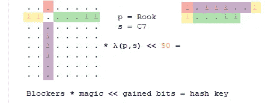*

*这是在相同方块上相同棋子的另一个散列密钥生成，但用于不同的阻断板:*

*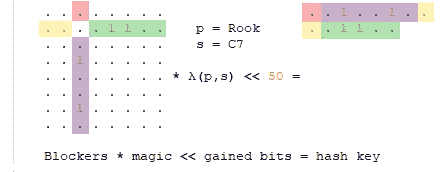*

*现在，如何通过一个简单的乘法运算找到那些将攻击方块串联成特定位置的幻数 *λ(p，s)* ？使用一种暴力方法(遍历随机幻数并检查所有阻断板的结果)，只需要几秒钟就可以找到合适的幻数。因此，Stockfish 在启动时使用一个种子随机数生成器预先计算所有的魔术数字，以便在最短的时间内选择正确的魔术(bitboard.cpp)。*

*本文展示了 Stockfish 如何能够抽象出一个棋盘，以及它如何生成候选移动来创建新的位置。Stockfish 选择正确走法的方法还没有出现。*

*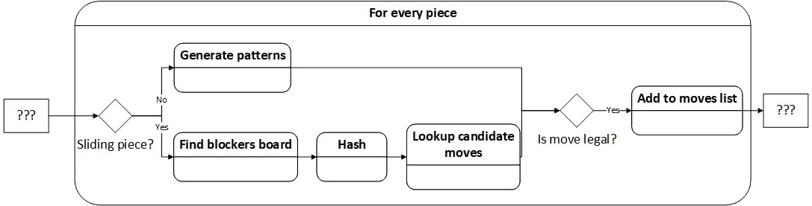*

*作者图片*

*本系列的下一部分将关注 Stockfish 评估头寸质量的方法和标准。这种评估方法将有助于选择我们所学的最佳候选动作。*

*[https://antoinechampion.com](https://antoinechampion.com)*