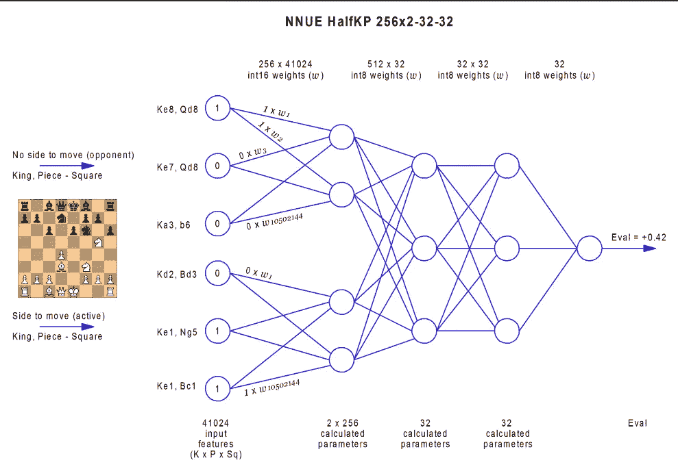
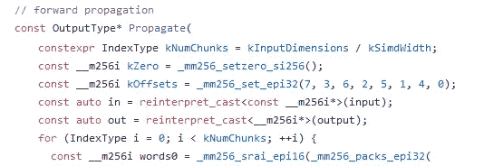
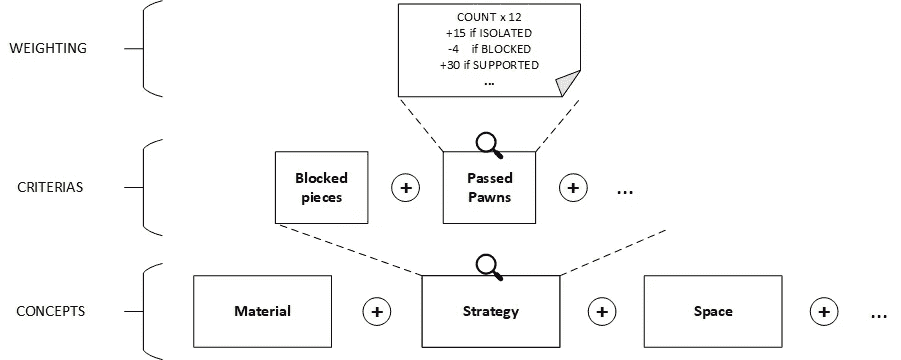
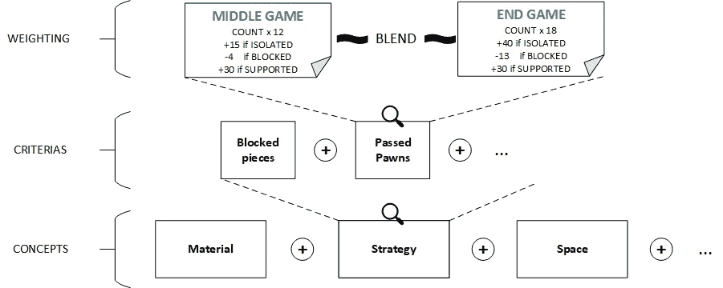
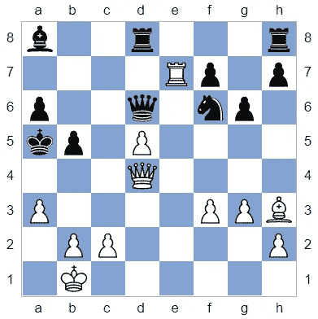
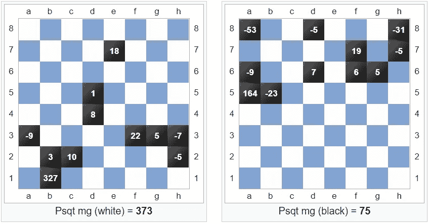
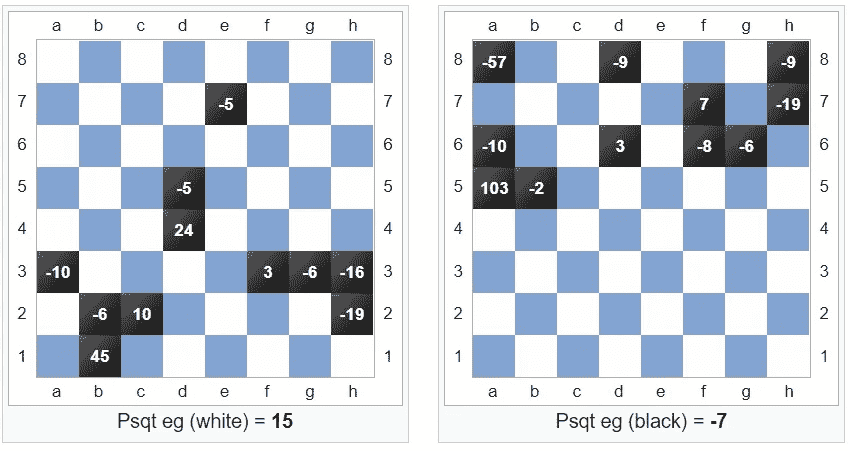
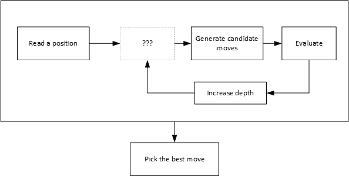

# 剖析 Stockfish 第 2 部分:深入了解象棋引擎

> 原文：<https://towardsdatascience.com/dissecting-stockfish-part-2-in-depth-look-at-a-chess-engine-2643cdc35c9a?source=collection_archive---------5----------------------->

## 当神经网络遇到硬编码知识时


Stockfish 象棋引擎，背景照片由 [ᴊᴀᴄʜʏᴍ ᴍɪᴄʜᴀʟ](https://unsplash.com/@jachymmichal?utm_source=unsplash&utm_medium=referral&utm_content=creditCopyText) 在 [Unsplash](https://unsplash.com/s/photos/chess?utm_source=unsplash&utm_medium=referral&utm_content=creditCopyText) 上拍摄

这个系列的第一部分展示了 Stockfish 如何抽象出一个国际象棋的位置，以及它如何快速找到每一个可能的走法。现在，引擎必须*评估一步棋*的质量，以便选择最好的一步。

过去，Stockfish 只依赖一套固定的规则，这些规则是国际象棋概念的算法翻译:[速度](https://en.wikipedia.org/wiki/Glossary_of_chess#tempo)，[材料](https://en.wikipedia.org/wiki/Glossary_of_chess#material)，[空间](https://en.wikipedia.org/wiki/Glossary_of_chess#space) …但在 2018 年，神经网络进入了许多国际象棋引擎，Stockfish [的表现优于](https://www.youtube.com/watch?v=wui0YweevtY)。为了填补这一空白，Stockfish 12 集成了一个神经网络，当已知经典评估的性能较差时，该网络优先于经典评估，通常处于平衡的闭合位置。

本文将首先关注神经部分的内部工作，然后再研究经典的评估方法。

# 神经网络体系结构

神经评价函数基于俞那苏的 NNUE 架构([基于高效可更新神经网络的计算机 Shogi 评价函数，俞那苏，2018](https://www.apply.computer-shogi.org/wcsc28/appeal/the_end_of_genesis_T.N.K.evolution_turbo_type_D/nnue.pdf) )。这个微小的神经网络在不需要图形处理器的情况下评估 CPU 上的游戏位置:Stockfish 仍然可以很容易地集成到许多设备上，并由它的大量贡献者进行调整。



NNUE 的建筑，图片来自[罗曼朱可夫，Stockfish NN Release (NNUE)，Talkchess](http://talkchess.com/forum3/viewtopic.php?f=2&t=74059&start=139)

## 输入编码

NNUE 不理解位板，必须首先对位置进行编码。NNUE 的输入参数表示如下布尔值，对每一个 W，X，Y，Z 迭代:
*是正方形 X 上的一个王与正方形 Z 上的一个 W[友|敌]棋子 Y？*

总共有 40，960 个参数。用这种二进制编码代替简单的“*棋子 X 在正方形 Y 上吗？”*编码(768 个参数)有几个好处:

*   在位置改变后更新输入和随后的神经元更快，因为这种编码允许[增量计算](https://en.wikipedia.org/wiki/Incremental_computing)，这是 NNUE 的优势；
*   改变玩家的回合也更快，因为输入只需要翻转；
*   在编码中提供比所需更多的信息被称为过度专门化，并且允许向网络输入更多的知识以降低其训练成本。

## 隐藏层和训练

该网络的目标是建立一个评价函数，该函数是由非线性分离的不同层的神经元的组合。该评估函数将根据其神经元的权重进行优化(训练阶段),以便在已知国际象棋游戏的情况下输出最准确的评估。

NNUE 训练的基本思想是建立一个巨大的随机生成位置的输入数据集，这些位置用经典的 Stockfish 在较低的深度进行评估。该网络使用该数据集进行训练，然后可以使用特定的位置和评估进行微调。就其本身而言，网络很简单，因为它由 3 个完全连接的层加上一个输出层组成，输出层可以表示为[材料分数](https://en.wikipedia.org/wiki/Chess_piece_relative_value)。

然而，NNUE 的真正独特之处在于它的输入编码和针对 CPU 评估优化的增量计算。



NNUE:使用 SIMD 内部函数进行大量优化(nnue/layers/clipped_relu.h)

# 经典评价

除了非常平衡的立场，Stockfish 仍然依赖于经典的评估。

这个想法是建立一个*评估函数，作为国际象棋概念*的组合，由几个加权和相加的标准组成。然后，该函数可以被缩放，以便用标准卒单位表示物质优势。



Stockfish 中的经典评价，图片来自作者

概念和相关标准如下:

*   **材料不平衡**:每个玩家的棋子数
*   **位置优势**:在特定的方格上有特定的棋子
*   **材料优势**:每件的强度，有一双毕肖普
*   **兵的战略优势**:双倍兵、孤立兵、连接兵、棋子支援兵、攻击兵
*   其他棋子的战略优势:被阻挡的棋子、在好哨站上的棋子、主教 X 射线攻击、长对角线上的主教、被困住的棋子、暴露的女王、被渗透的女王、在打开的文件上的车、车和女王炮台、被攻击的敌方国王
*   **来袭威胁**:攻击棋子、悬挂棋子、国王威胁、兵推威胁、发现/滑块攻击威胁、你的棋子可以移动但可以交换的方格、弱保护棋子
*   **走卒**:被阻挡或未被阻挡的走卒
*   空间:由你所有的棋子控制的方格
*   **王者安全**:攻击王者，来袭检查，王者在‘棋子避难所’，守军位置

这个巨大的结果评估函数实际上被计算到 2 阶，以基于玩家的已知攻击/防御状态来计算奖励/恶意。

Stockfish GitHub 存储库中的许多 pull 请求包含上述标准权重的微小变化，这导致了 ELO 分数的微小提高。

## 锥形缩放

不管我们是在开局、中局还是残局，不同标准的权重都是不同的。例如，一个被传递的棋子在游戏后期可能比中期更有价值。因此，Stockfish 对每个标准都有两个权重集:一个用于中期游戏，一个用于末期游戏。Stockfish 然后计算一个范围从 0(游戏结束)到 128(游戏未开始)的*相位因子*，这有助于在两个不同的权重之间进行插值。



中局和残局之间的锥形评估

然后，评估将再次缩放，以符合[五十步规则](https://en.wikipedia.org/wiki/Fifty-move_rule):当接近达到该规则时，评估将更接近平局。

## 个案研究

为了阐明经典的评估方法，我们将研究卡斯帕罗夫和托帕洛夫之间的一场比赛中的一个已知位置:



卡斯帕罗夫-托帕洛夫，Wijk aan Zee，1999 年。27:白棋

这个例子将集中于位置优势标准:*在特定的方格上有特定的棋子*。对于棋盘上的每个方格，分数是根据占据该方格的棋子来分配的(例如，在中局中，a5 上暴露的黑王的价值低于 g8，G8 是更安全的方格)。该分数奖励来自两个硬编码的正方形分数表:一个用于棋子，一个用于棋子。拥有两个不同得分表的原因是棋子的得分奖励在垂直轴上是对称的，而棋子*(*[*psqt . CPP*](https://github.com/official-stockfish/Stockfish/blob/2046d5da30b2cd505b69bddb40062b0d37b43bc7/src/psqt.cpp)*)*则不是。

```
if (typeof(piece) == PAWN) {
   bonus += PBonus[rank][file];
}
else {
   file = file < 4 ? file : 8 - file;
   bonus += Bonus[piece][rank][file];
}
```

黑棋和白棋的分数表是一样的，因为只需翻转[位板](/dissecting-stockfish-part-1-in-depth-look-at-a-chess-engine-7fddd1d83579)就可以计算黑棋的分数。例如，D4 上的白皇后在中局中值+8，在残局中值+24(如下所示),这与 D5 上的黑皇后是一样的。



棋子方桌奖金—中间游戏



棋子方桌奖金—结束游戏

棋子平方得分是棋盘上所有棋子的总和，通过中间游戏和结束游戏的棋子平方得分表计算得出(见上文)。然后，基于棋盘上非棋子材料的数量来计算渐变评估的相位因子。这里，相位因子等于 83。最后，使用该阶段因子计算在中间游戏和结束游戏棋子平方分数之间插入的最终奖金。

```
# MG: middle-game score
# EG: end-game score
# P: phase factorFINAL_BONUS = (MG * P + (EG * (P_MAX - P)) / (P_MAX-P_MIN))
```

最终白棋得分为+247，黑棋得分为+46:从 Stockfish 的角度来看，这个棋盘导致了白棋明显的位置优势。

# 结论

本系列的第一部分介绍了如何读取一个位置，以及如何根据这个位置生成候选移动。现在，第二部分解释了如何评估任何给定的位置，以便为每个玩家输出一个分数。



本系列的前两部分解释了 Stockfish 概念

然而，生成候选移动的每一个可能的组合并立即评估它们在性能上是不可思议的:随着我们搜索深度的增加，候选移动的数量呈指数增长。Stockfish 需要明智地选择它们，这将是本系列下一部分的主题。

https://antoinechampion.com