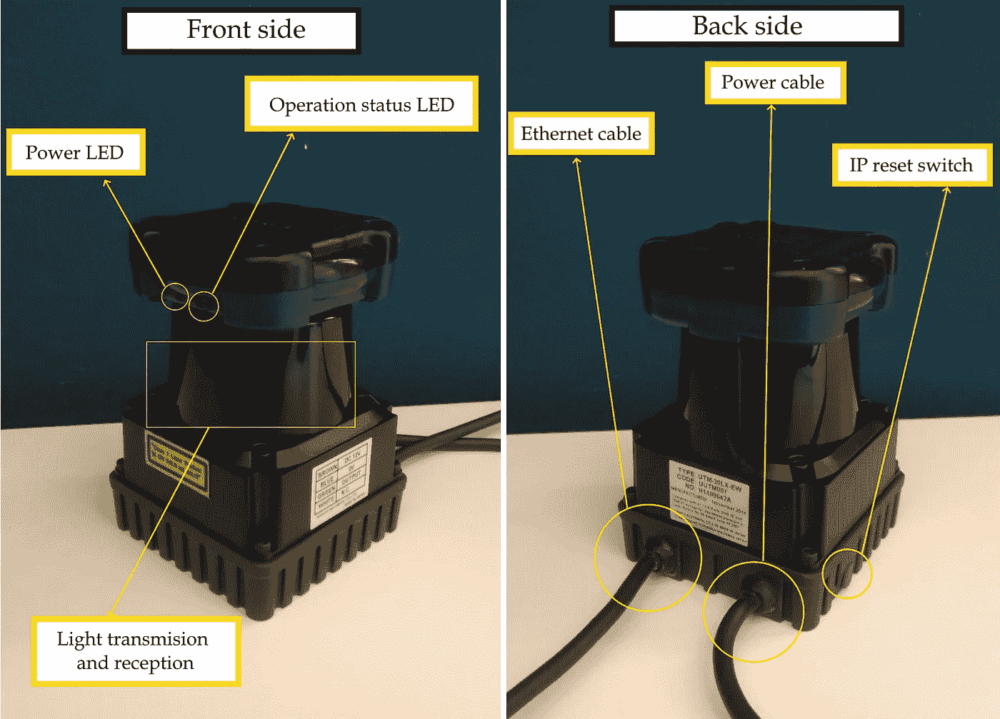
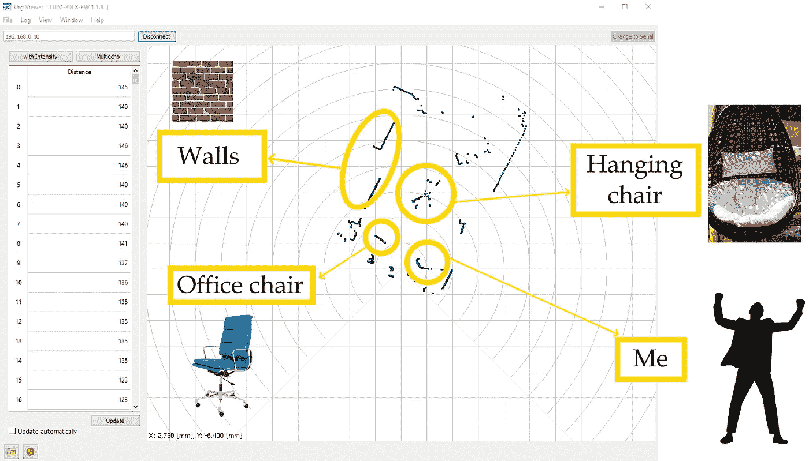

# 激光传感器测距第一部分

> 原文：<https://towardsdatascience.com/distance-measurement-using-laser-sensor-part-1-ccd45310dc1?source=collection_archive---------48----------------------->

## 易于使用的传感器，支持自动化系统中的机器学习和人工智能

照片由[詹姆斯·庞德](https://unsplash.com/@jamesponddotco?utm_source=medium&utm_medium=referral)在 [Unsplash](https://unsplash.com?utm_source=medium&utm_medium=referral) 拍摄

距离测量是不同任务的最重要的测量之一，主要涉及但不限于机器人或其他自动系统。任务可以包括房间映射、公园传感器、速度测量、运动检测、3D 建模等等。

在这个简短的系列文章中，我将向您展示如何使用激光传感器 Hokuyo UTM-30LX-EW 测量距离，并将其与您的应用程序连接。在本文中，我们将创建一个使用传感器的设置，在下一篇文章中，您将学习如何将该传感器集成到您的定制应用程序中。

# 介绍

嗯，这是传感器！

激光测距传感器 UTM 北友-30LX-EW(图片来源:作者)

我们可以在正面看到基本部件:

*   电源指示灯—电源的指示(开/关)。
*   运行状态 led——不同状态下的不同行为(例如如果操作没有错误，则始终开启)。
*   光传输和接收平面—传感器在这个塑料盖内。它有两个平面，传输平面和接收平面。

背面呢:

*   以太网电缆——用于与计算机通信。
*   电源线——为传感器供电。它有三条线:棕色(DC 12V)，蓝色(GND 0V)，绿色(OUT)。传感器正常工作需要大约 1A。
*   IP 重置开关—用于重置 IP 配置。

以下是与距离测量和传感器局限性相关的一些重要特征:

*   视野:270°
*   角度分辨率:0.25°
*   测量步长:1080 (270/0.25=1080)
*   最大值距离:30 米

在设置传感器之前，请[查阅官方用户手册](https://www.hokuyo-aut.jp/search/single.php?serial=170)。

# 设置

## 1.电源

传感器通过一根电源线供电，电源线包括三根电线:棕色(DC 12V)，蓝色(GND 0V)和绿色(OUT)。该传感器可以汲取 1A 的最大电流。我使用了一个旧的 PC 电源进行传感器测试。

## 2.沟通

在本文中，我们将展示如何用以太网电缆连接传感器。传感器的初始 IP 设置为 192.168.0.10。为了能够与传感器通信，PC 必须在同一个网络中。在 Windows PC 上，你可以按照[这个教程](https://support.microsoft.com/en-us/windows/change-tcp-ip-settings-bd0a07af-15f5-cd6a-363f-ca2b6f391ace)来做。例如，您可以使用 IP 地址 192.168.0.100 和子网掩码 255.255.255.0

# 衡量

给设备供电并将其连接到 PC 后，我们可以开始测量距离了！

为此，我们将使用 [Urg 浏览器应用程序](https://sourceforge.net/p/urgnetwork/wiki/urg_viewer_en/)。这是一个简单的应用程序，用于可视化测量和导出结果。使用以太网或串行连接(右上角的按钮)与传感器连接有两种选择。

连接到传感器后，距离测量值显示为表格(左平面)和蓝点(右平面)。在下图中，你可以看到我公寓里的距离测量结果。

距离测量示例(图片来源:作者)

# 结论

本文展示了使用激光传感器测量距离的用法和基本设置。你可以在许多项目中使用这种传感器，如报警系统、停车传感器或为移动机器人创建地图。

请继续关注本系列的下一篇文章，您将了解如何将该传感器集成到您的定制应用中。

如有任何问题或建议，欢迎评论或联系我！

领英:【https://www.linkedin.com/in/leo-tisljaric-28a56b123/ 

# 确认

该传感器由位于萨格勒布大学交通运输科学学院的 T4 智能交通系统实验室提供。

# 参考

*   https://www.hokuyo-aut.jp/search/single.php?serial=170 北越 UTM-30LX-EW 用户手册
*   更改电脑的 IP 地址，[https://support . Microsoft . com/en-us/windows/change-TCP-IP-settings-BD 0a 07 af-15 F5-cd6a-363 f-ca 2 b 6 f 391 ace](https://support.microsoft.com/en-us/windows/change-tcp-ip-settings-bd0a07af-15f5-cd6a-363f-ca2b6f391ace)