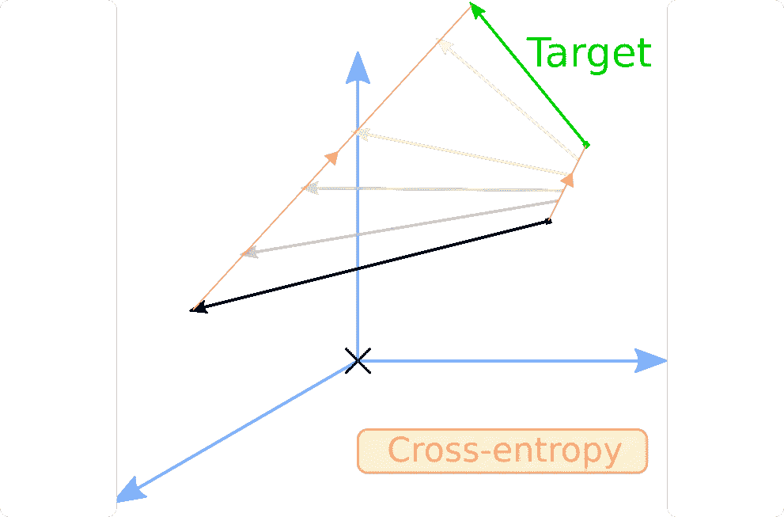

# 类伯特模型的提炼:理论

> 原文：<https://towardsdatascience.com/distillation-of-bert-like-models-the-theory-32e19a02641f?source=collection_archive---------2----------------------->

## [思想和理论](https://towardsdatascience.com/tagged/thoughts-and-theory)

## 探索蒸馏方法背后的机制

类伯特模型的提取过程。图片作者。

如果你曾经训练过像 BERT 或 RoBERTa 这样的大型 NLP 模型，你就会知道这个过程是极其漫长的。训练这样的模型可能要拖上好几天，因为它们体积庞大。当需要在小型设备上运行它们时，你可能会发现，你正在为今天不断提高的性能付出巨大的**内存和时间**成本。

幸运的是，有一些方法可以减轻这些痛苦，而对你的模特的表现几乎没有影响，这种技术叫做**蒸馏**。在本文中，我们将探索 DistilBERT 方法[1]背后的机制，它可用于提取任何类似 BERT 的模型。

首先，我们将讨论蒸馏的一般情况，以及为什么我们选择 DistilBERT 的方法，然后如何初始化该过程，以及蒸馏过程中使用的特殊损耗，最后是一些相关的额外细节，可以单独提及。

# 摘要

一、DistilBERT
二简介。抄袭老师的架构
三。蒸馏损失
IV。更多详情
五.结论

# 一、蒸馏器简介

**什么是蒸馏？** 蒸馏的概念相当直观:它是**训练一个小的学生模型尽可能地模仿一个更大的教师模型**的过程。如果我们只在用于微调的集群上运行机器学习模型，蒸馏将毫无用处，但遗憾的是，事实并非如此。因此，每当我们想要将一个模型移植到更小的硬件上时，比如有限的笔记本电脑或手机，蒸馏就派上了用场，因为蒸馏模型运行更快，占用的空间更少。

**BERT 蒸馏的必要性** 正如你可能已经注意到的，**基于 BERT 的模型**在 NLP 中风靡一时，自从它们在[2]中被首次引入以来。随着性能的提高，出现了许许多多的参数。准确地说，伯特的收入超过了 1.1 亿英镑，我们甚至还没有谈论伯特-拉奇。因此，蒸馏的需要是显而易见的，因为伯特是如此的多才多艺和出色。此外，随后的模型基本上是以相同的方式构建的，类似于 RoBERTa [3]，所以通过学习适当地提取 BERT，你可以一举两得。

**蒸馏伯特的方法** 第一篇关于伯特蒸馏的论文是我们要用来作为灵感的，即[1]。但其他人紧随其后，像[4]或[5]，所以很自然地想知道为什么我们把自己局限于蒸馏。答案有三点:第一，它相当简单，所以是很好的蒸馏入门；二是导致好的结果；第三，它还允许对基于 BERT 的模型进行提炼。

DistilBERT 的蒸馏有两个步骤，我们将在下面详述。

# 二。抄袭老师的建筑

伯特的建筑。图片作者。

伯特的理论主要是基于一系列相互叠加的**注意力层**。因此，这意味着伯特学到的“隐藏知识”就包含在那些层中。我们不会关心这些是如何工作的，但是对于那些想要更多细节的人来说，除了原始论文[1]，我可以推荐这篇 TDS 文章，它做得非常好[6]。现在，我们可以把注意力层当作一个黑盒，这对我们来说并不重要。

从一个 BERT 到另一个 BERT，层数 N 是变化的，但是当然模型的大小与 N 成比例。因此，训练模型所花费的时间和正向传递的持续时间也取决于 N，以及存储模型所花费的内存。因此提取 BERT 的逻辑结论是**减少 N** 。

DistilBERT 的方法是将**的层数减半**，并从老师的开始初始化学生的层数。简单而高效:

学生模型初始化。图片作者。

DistilBERT 在一个复制层和一个忽略层之间交替，根据[4]这似乎是最好的启发式，它尝试优先复制顶层或底层。

多亏了 huggingface 的变形金刚模块和对其内部工作原理的一点了解，这可以很容易地实现。我们将在另一篇文章中展示如何做到这一点，因为在这篇文章中我们将仅限于理论。

当然，如果你正在为一个特定的任务使用一个基于 BERT 的模型，比方说序列分类，那么你还需要为学生复制老师的头，但是一般来说，BERT 头的大小与其注意力层的大小相比就相形见绌了。

我们现在有了一个学生模型，可以开始教学了。然而，提炼过程并不是一个经典的拟合程序:我们不是像通常那样教学生学习一种模式，我们的目标也是模仿老师。因此，我们必须调整我们的训练程序，尤其是我们的损失函数。

# 三。蒸馏损失

本文顶部的图片展示了蒸馏程序。
我们的训练程序将基于损失，如前所述，这寻求实现几个目标:**最小化**老师训练的经典损失函数和**模仿**老师本身。更糟糕的是，模仿老师需要混合两种损失函数。因此，我们将从更简单的目标开始:最小化传统损失。

## **经典损失**

关于这一部分没有太多要说的:类似 BERT 的模型都以同样的方式工作，一个核心输出一个嵌入到特定问题的头部。教师被微调的任务有它自己的损失函数。为了计算这个损失，因为这个模型是由注意力层组成的，和老师有着相同的特定问题的头脑，我们只需要插入学生的嵌入和标签。

## **师生交叉熵损失**

交叉熵损失对两个三维矢量的影响。图片作者。

这是第一次损失，旨在减少学生和教师概率分布之间的差距。当类 BERT 模型正向传递输入时，无论是用于屏蔽语言建模、标记分类、序列分类等，它都会输出逻辑，然后通过 softmax 层转换为概率分布。

对于输入 x，教师输出:

学生的输出是:

请记住 softmax 和它附带的符号，我们稍后将回到它。无论如何，如果我们希望 T 和 S 接近，我们可以以 T 为目标对 S 应用交叉熵损失。这就是我们所说的师生交叉熵损失:

## **师生余弦损失**

余弦损失对两个三维向量的影响。图片作者。

帮助学生成为大师的第二个损失是余弦损失。余弦损失是有趣的，因为它不是试图使向量 x 等于目标 y，而是试图将 x 与 y 对齐，而不考虑它们各自的范数或空间原点。我们使用这种损失，以便教师和学生模型中的隐藏向量对齐。使用与之前相同的符号:

实际上，余弦损失有两种版本，一种是对齐向量，一种是将一个向量拉向另一个向量的相反方向。在本文中，我们只对第一个感兴趣。

## **完全蒸馏损失**

完全蒸馏损失是上述三种损失的组合:

# 四。其他详细信息

softmax 温度对概率分布的影响。图片作者。

## **蒸馏程序**

解释了损失之后，剩下的蒸馏程序就相当简单了。模型训练与其他模型非常相似，唯一不同的是你必须并行运行两个类似 BERT 的模型。感谢您的 GPU 的健康和内存，教师模型不需要梯度，因为反向传播只在学生身上进行。当然，实现损失仍然需要做，就像蒸馏过程一样，但是我们将在以后的文章中讨论它。

## **温度**

如前所述，让我们回到《T2》三中使用的符号。师生交叉熵损失:

DistilBERT 使用[7]中的温度概念，这有助于软化 softmax。温度是一个θ ≥ 1 的变量，当温度上升时会降低 softmax 的“置信度”。正常的 softmax 描述如下:

现在，让我们无用地把它重写为:

每个人都会同意这是正确的。1 实际上对应于温度θ。正常的软最大值是其温度设置为 1 的软最大值，具有常规温度的软最大值的公式为:

随着θ上升，θ上的商变为零，因此整个商变为 1/n，并且 softmax 概率分布变为均匀分布。这可以在上图中观察到。

在 DistilBERT 中，学生和老师的 softmax 在训练时都以相同的温度θ为条件，推理时温度设置为 1。

# 动词 （verb 的缩写）结论

现在您已经知道了类似 BERT 模型的提取是如何为 DistilBERT 工作的，唯一要做的就是选择一个模型并提取它！
显然，您仍然需要实现蒸馏过程，但是我们将很快介绍如何实现。

## **参考文献**

[1]维克多·桑，弗拉达利出道，朱利安·肖蒙德，托马斯·沃尔夫，[蒸馏伯特，伯特的蒸馏版:更小，更快，更便宜，更轻](https://arxiv.org/pdf/1910.01108.pdf) (2019)，拥抱脸

[2]雅各布·德夫林(Jacob Devlin)，张明蔚(Ming-Wei Chang)，肯顿·李(Kenton Lee)，克里斯蒂娜·图坦诺娃(Kristina Toutanova)，[伯特:语言理解的深度双向转换器的预训练](https://arxiv.org/pdf/1810.04805.pdf) (2018)，谷歌 AI 语言

[3]刘、米莱奥特、纳曼戈亚尔、杜、曼达尔乔希、陈、奥梅尔列维、、卢克塞特勒莫耶、韦塞林斯托扬诺夫、[罗伯塔:稳健优化的伯特预训练方法](https://arxiv.org/pdf/1907.11692.pdf) (2019)、arXiv

[4]，焦，尹宜春，，尚，，，，李，，，，， [TinyBERT:为自然语言理解提取 BERT](https://arxiv.org/pdf/1909.10351.pdf)(2019)，arXiv

[5]孙志清，俞鸿坤，，宋，，刘，，周， [MobileBERT:一种面向资源受限设备的紧凑任务不可知 BERT](https://arxiv.org/pdf/2004.02984.pdf)(2020)，arXiv

[6]莱米·卡里姆，[插图:自我关注](/illustrated-self-attention-2d627e33b20a) (2019)，走向数据科学

[7] Geoffrey Hinton，Oriol Vinyals，Jeff Dean，[在神经网络中提取知识](https://arxiv.org/pdf/1503.02531.pdf) (2015)，arXiv