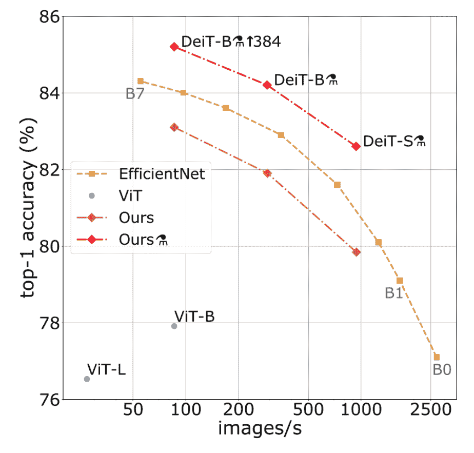
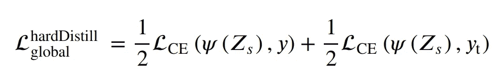
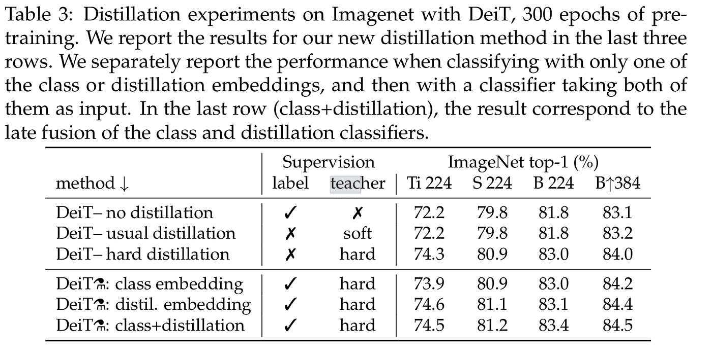
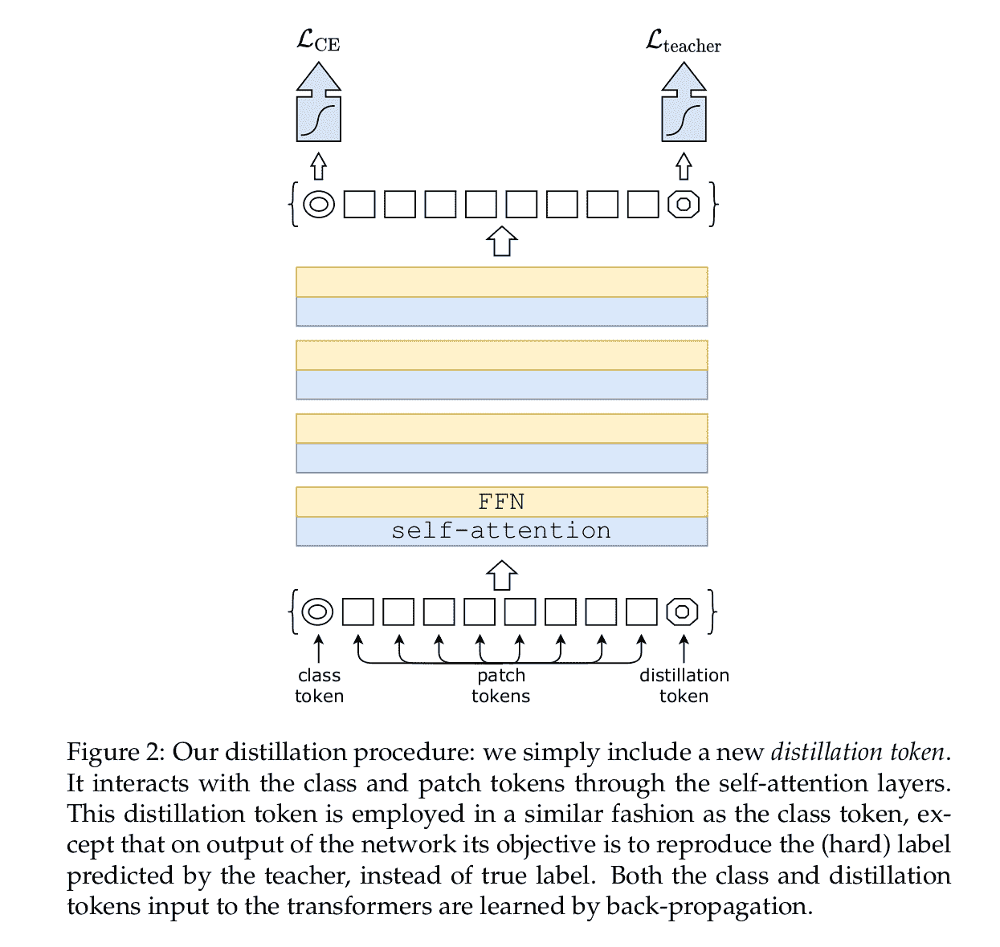

# 蒸馏变压器:(DeiT)数据高效图像变压器

> 原文：<https://towardsdatascience.com/distilling-transformers-deit-data-efficient-image-transformers-61f6cd276a03?source=collection_archive---------11----------------------->

在 [Unsplash](https://unsplash.com/s/photos/lab?utm_source=unsplash&utm_medium=referral&utm_content=creditCopyText) 上由[路易斯·里德](https://unsplash.com/@_louisreed?utm_source=unsplash&utm_medium=referral&utm_content=creditCopyText)拍摄的照片

*变形金刚 go brum brum*

嗨伙计们！今天我们将实施[训练数据高效的图像转换器&通过注意力进行提炼](https://arxiv.org/abs/2012.12877)一种新的方法来对视觉转换器进行知识提炼，称为 DeiT。

您很快就会看到这种新方法是多么优雅和简单。

代码是[这里是](https://github.com/FrancescoSaverioZuppichini/DeiT)，本文的互动版可以从[这里](https://github.com/FrancescoSaverioZuppichini/DeiT/blob/main/README.ipynb)下载。

DeiT 可以在我的新电脑视觉库中找到，叫做[眼镜](https://github.com/FrancescoSaverioZuppichini/glasses)

在开始之前我**高度推荐**先看看[视觉变形金刚](/implementing-visualttransformer-in-pytorch-184f9f16f632)

# 介绍

让我们通过了解 DeiT 型号系列的性能来介绍它们

论文作者(Hugo Touvron 等人)提供的图片

将注意力集中在 *ViT-B* 和 *DeiT-S* 上。如你所见，他们最小的型号有+4–5%的速度，比更大的 *ViT-B* 快 100 倍。**怎么可能？**

# 知识蒸馏

(这篇论文有一个很好的关于这个主题的总结部分，但是我会讲得很快)

知识蒸馏是一种训练技术，用来教一个*学生*模型去匹配一个*老师*模型的预测。这通常是用来，从一个大模型开始作为*老师*，产生一个新的更小的*学生*模型，产生比从头训练*学生*模型更好的性能。

有不同类型的蒸馏技术，在本文中他们使用了所谓的硬标签蒸馏。其思路是同时使用真实目标$y$和*老师*$ y _ t = \ text { arg max } _ cZ _ t(c)$产生的目标。

论文作者(Hugo Touvron 等人)提供的图片

其中$Z_s$和$Z_t$分别是学生和教师模型的对数，$\psi$是 sofmax 函数。

当把真实目标和教师目标错误分类时，损失将惩罚学生。这很重要，因为它们并不总是相同的。教师可能犯了一些错误，或者图片可能被大幅放大，因此目标已经改变。

有趣的是，当他们使用 convnet ( [regnet](https://arxiv.org/abs/2003.13678) )作为老师，而不是变压器时，最好的结果被存档了。

论文作者(Hugo Touvron 等人)提供的图片

它被称为**硬**，因为学生依赖于老师的硬标签。在 PyTorch 中，这可以通过

# 注意力蒸馏

论文作者(Hugo Touvron 等人)提供的图片

ViT 使用**类标记**进行最终预测。类似地，我们可以添加一个**蒸馏令牌**，用于进行第二次预测；第二个预测在损失的第二部分。作者报告说，类和提取令牌收敛到一个非常相似的向量，正如预期的那样，因为教师预测与目标相似，但仍然不相同。

我们可以很容易地改变我们的损失:

轻松点。

# 蒸馏令牌

现在我们必须将`dist`标记添加到我们的模型中。DeiT 只是一个普通的 ViT，有了这个额外的令牌，所以我可以从我的 [ViT 教程](/implementing-visualttransformer-in-pytorch-184f9f16f632)中回收代码。

这个新令牌作为类令牌被添加到嵌入的补丁中。

# 分类头

变形金刚用类令牌做预测，没啥新意。在我们的例子中，我们还使用蒸馏令牌进行教师流失中使用的第二次预测。

我们还必须在训练时改变头来返回两个预测。在测试时，我们只是将它们平均。

然后，它遵循我在我的[上一篇文章](/implementing-visualttransformer-in-pytorch-184f9f16f632)中使用的相同 ViT 代码

最后，我们的模型看起来像:

训练的话，可以用大一点的模型(ViT-Huge，RegNetY-16GF……)当*老师*，小一点的模型(ViT-Small/Base)当*学生*。训练代码如下所示:

我不是 facebook，所以我没有几百个图形处理器，所以我不能在 ImageNet 上训练这些模型，但你会明白的！这篇论文有大量的实验，如果你好奇的话，我建议你看一下。

# 结论

在本文中，我们看到了如何使用新技术从 vision transformer 中提取知识。

顺便说一下，**我正在开发一个新的计算机视觉库，名为** [**眼镜**](https://github.com/FrancescoSaverioZuppichini/glasses) **，**如果你喜欢，可以去看看

保重:)

弗朗西斯科