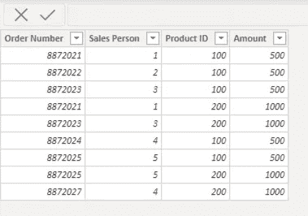
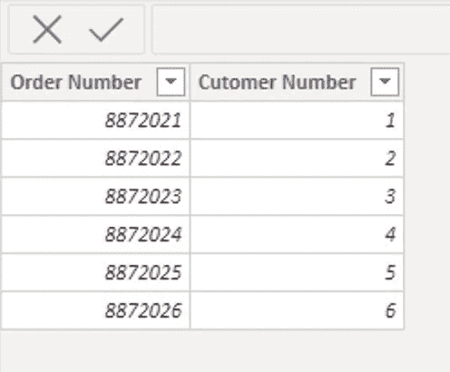
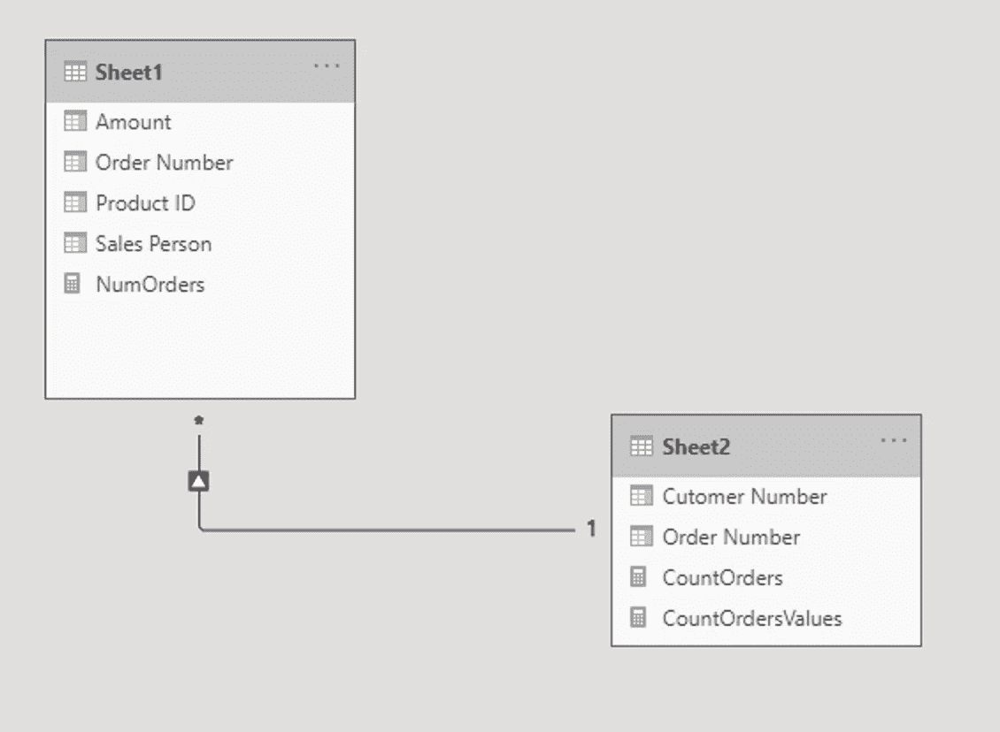
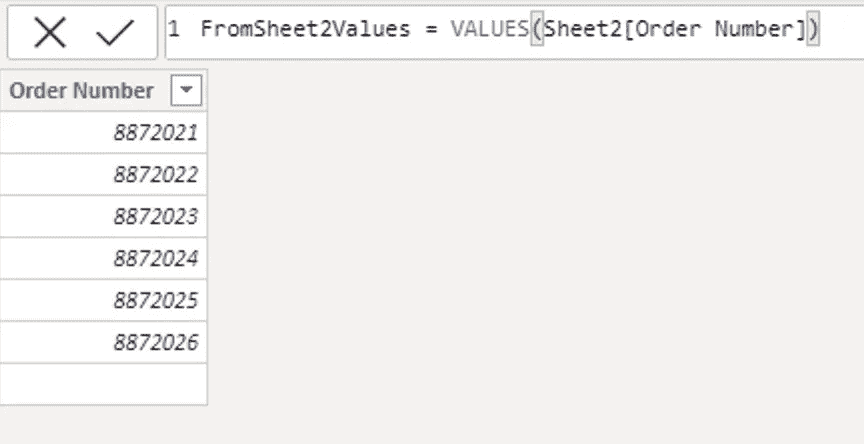
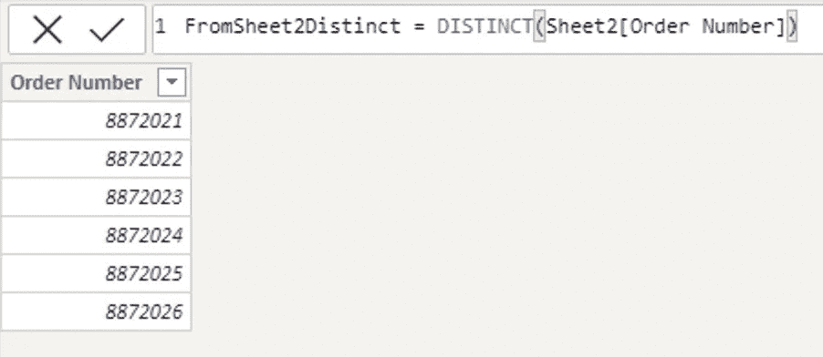
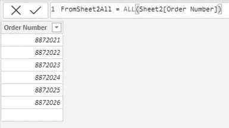
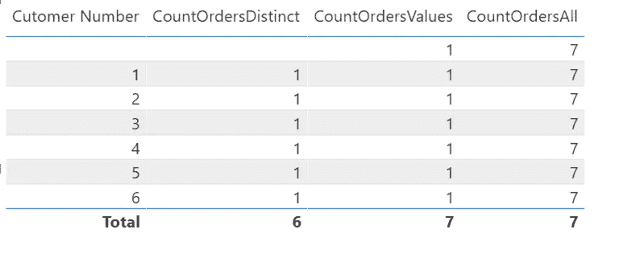
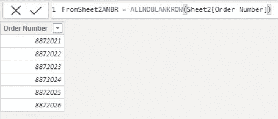

# DAX 中的不同值

> 原文：<https://towardsdatascience.com/distinct-values-in-dax-7d71fdee8e79?source=collection_archive---------12----------------------->

## 价值观、截然不同的价值观和所有价值观之间的差异和相似之处

照片由[诺亚·纳夫](https://unsplash.com/@noahdavis?utm_source=medium&utm_medium=referral)在 [Unsplash](https://unsplash.com?utm_source=medium&utm_medium=referral) 上拍摄

Power Pivot、SQL Server Analysis Services 和 Power BI 中使用的函数式语言 DAX 功能强大。像所有强大的语言一样，理解它们在用法上的细微差别是很重要的。从表面上看，VALUES 和 DISTINCT 这两个函数似乎提供了相同的结果，并且它们似乎与 ALL 函数不相似。但是，给定正确的上下文和用法，VALUES 和 DISTINCT 返回与 ALL 相同的结果。此外，在某些情况下，值的方式和不同的过程数据之间存在微小但有价值的差异。清楚地理解这三个函数之间的相似性和差异，以及每个函数周围的情况，对于在 DAX 代码中正确地实现它们是必要的。

*下面是我们将使用的表格以及它们之间的关系。*

Sheet1(包含订单编号和其他订单详细信息)

表:Sheet2(包含订单编号和客户编号)

Sheet2 和 Sheet1 之间的一对多关系。这两个表使用 Order Number 列连接。Sheet2 中的每个订单编号只出现一次(一个)。Sheet1 中的每个订单编号都有必要的次数(多次)。

**VALUES 函数有什么作用？**

当我们创建一个 Power BI 度量时，有时我们希望考虑一列中的不同值。 *VALUES(column_name)* 从指定的列中返回不同的值，将当前的筛选器上下文考虑在内。例如，让我们使用通过切片器过滤到最近一个季度的销售订单的可视化表格。我们的销售表包含具有相同订单号的多行。我们想统计最近一个季度的订单数量。为此，我们需要一个唯一的订单号列表，不能重复。*VALUES(' Sales '[order number])*提供了这样一个列表—每个订单号占一行。使用这种技术，我们可以很容易地计算出最近一个季度的订单数量。

用 VALUES 函数创建的计算表。

当 Power BI 在这两个表之间创建关系时，会在表 2(我们的客户订单表)的一侧创建一个空白行，因为表 1(我们的销售订单详细信息表)中有一行的订单编号在表 2 中找不到。这是因为工作表 2 位于一对多关系的一侧。DAX 不喜欢这样，它在关系的一侧创建了一个空白条目，与 Sheet 1 中的额外订单编号相对。此处出现空白是因为值是针对表 2 中的订单编号列执行的，而不是表 1。

## 独特的功能是做什么的？

好消息！还记得 VALUES 函数吗？DISTINCT 函数做同样的事情。那为什么 DAX 两者都包括？简单。正如我们在上面看到的，有时我们的数据集在一列中有空值。VALUES 将空白视为有效，并将它们包含在其结果集中。DISTINCT 排除了它们。就是这样。

如果我们有一个包含九个实际订单编号的订单编号列和一个包含空白的行，则值将返回所有十行。DISTINCT 将返回十行中的九行。空白行将会丢失。

虽然不建议使用带有空白的数据模型，但是在某些情况下会出现这种情况。要么您正在创建一个更好的数据模型，要么您已经在模型中的两个表之间创建了一个一对多的关系，不知何故，在关系的多面有一个值在关系的一面是缺失的，就像我们的示例表一样。不理想，但现实生活中会发生。

注意，在使用 DISTINCT 时，对应于 8872027 (Sheet1)的空行丢失。

## 什么时候价值观和独特性像所有人一样发挥作用？

熟悉 ALL 的人会记得它的语法通常是 *ALL(table_name)* 。该函数的主要用途是返回由 *table_name* 指定的表格的未过滤版本。然而，ALL 函数还有另一个用途。如果我们提供一个列名而不是表名作为参数，该函数将返回一个包含一列的计算表。该列包含作为参数传递的列中的每个不同值。当然，source 列是未经过滤的，这是我们所期望的。这在我们需要一列不同值的列表时非常有用。

正如我们已经看到的，价值和独特的工作在过滤的上下文中。因此，返回的唯一值仅来自过滤后的子集，当用于度量时。但是，如果在计算列中使用 VALUES 或 DISTINCT 而不是度量值，则筛选的上下文不适用。因此，在这种情况下，它们的工作方式与 *ALL(column_name)* 完全一样。

ALL 返回与 sheet 2[订单编号]的值完全相同的结果。

按客户编号的汇总表。

*请注意，在上面的汇总表中，DISTINCT 和值返回 1，因为它们在每个客户的筛选器上下文中执行，并且值包括有效的空行(表的顶行)。但是当我们通过 ALL 对行进行计数时，ALL 已经丢弃了过滤器，并对表中的所有七行进行计数。*

## 包扎

你应该使用哪种方法？在计算列中使用时，请自行选择。在这种情况下，我推荐其他两个功能。如果需要在计算列的公式中排除空白，请使用 ALLNOBLANKROW。

ALLNOBLANKROW 丢弃类似于 DISTINCT 但不引用任何筛选器的空白。

创建度量时，如果需要列中不同的值列表，而不考虑当前过滤器，请使用 ALL。但是，如果您需要维护过滤后的上下文，请根据您希望如何处理空白，在 VALUES 和 DISTINCT 之间进行选择。我建议您使用值，除非您的特定情况需要排除空值。在这种情况下，使用 DISTINCT。

大兴快乐！

***杆蓖麻*** *帮助企业获得分析权！他帮助国际组织和小型企业改善他们的数据分析、数据科学、技术战略和技术领导力。除了咨询，Rod 还喜欢公开演讲、教学和写作。你可以在 rodcastor.com**和通过他的* [*邮件列表*](https://rodcastor.com/newsletter/) *了解更多关于 Rod 和他的工作。*