# 使用 PySpark 的分布式生物医学文本挖掘用于癌症基因突变的分类——第一部分:EDA 和逐点互信息分析

> 原文：<https://towardsdatascience.com/distributed-biomedical-text-mining-using-pyspark-for-classification-of-cancer-gene-mutations-3e11507b2450?source=collection_archive---------26----------------------->

*分布式机器学习使用 Apache Spark 对癌症肿瘤基因突变进行大规模分类*

在这篇由两部分组成的文章中，我将分享我在分布式计算研究生课程中参与的一个学期研究项目的心得。我使用 PySpark 实现了一个机器学习算法，用于对癌症肿瘤基因突变进行分类，PySpark 是 Apache Spark 的 Python 实现。在这一部分中，我将描述探索性数据分析(EDA)以及逐点互信息(PMI)的自然语言处理(NLP)概念的分布式实现。

我在这篇文章中只分享代码的某些部分，因为包含整个代码会使文章太长。完整代码请查看 GitHub 链接 [**这里**](https://github.com/bsets/Distributed_ML_with_PySpark_for_Cancer_Tumor_Classification/tree/main/BRCA1_PMI_Computation) 。我还准备了一个 5 分钟的视频，你可以在这里 找到[。如果你想跳过这一步直接进入分布式 ML 部分，这里有第二部分](https://www.youtube.com/watch?v=LRp75Ku8Hc4) [**的链接。**](https://bharatss.medium.com/distributed-biomedical-text-mining-using-pyspark-for-classification-of-cancer-gene-mutations-bd3b2ca05a9c)

**简介**

癌症如此难以理解并因此难以治疗的主要原因之一是肿瘤基因突变的巨大复杂性。肿瘤细胞中可能有几千个基因，这些基因中的每一个都可能有几千个已知的突变，以及大量尚未发现的突变。并非所有的突变都是癌性的，其中一些可能是良性的。毕竟，基因不断变异是自然进化的一部分，并不是每个突变都对生物体有害。为了开发有效的抗癌药物，药物研究人员需要了解肿瘤中大多数突变的性质。

> 然而，对肿瘤基因突变进行分类的过程是手工的、费力的和耗时的。对于在实验室的肿瘤标本中发现的每一个突变，研究人员都必须阅读几页医学文献，才能将发现的突变归类到适当的类别。这种以人为媒介从医学文献中检索信息的过程大大减缓了知识增长的速度。如果一名研究人员花 1 个小时对一个突变进行测序，5 个小时对其进行分类，研究界会产生巨大的机会成本，因为花在分类上的时间本可以更好地用于发现新的突变或研究恶性突变的治疗方法。

生物医学文本挖掘是一套计算技术，用于从大型生物医学研究文献数据集中提取见解和可操作信息。

自从互联网出现以来，尤其是在下一代测序(NGS)等新技术在实验室得到广泛采用之后，生物医学文献一直在快速增长。下图显示了一组选定国家癌症研究出版物数量的年增长率。

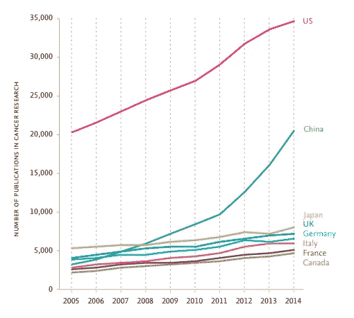

全国癌症研究出版物数量的增长(资料来源: [Elsevier](https://www.elsevier.com/?a=230374) (第 11 页))

因此，越来越需要计算技术来处理这些数据，并从中获得见解，以帮助医学研究人员加快他们的研究。

现在我将描述我在这项研究中使用的数据集。

**数据集**

我使用了由纪念斯隆-凯特琳癌症中心(MSKCC)汇编和发布的[个性化医疗](https://www.kaggle.com/c/msk-redefining-cancer-treatment)数据集，用于他们在 2017 年举办的一场 Kaggle 比赛。该数据集包含来自各种医学杂志的关于肿瘤基因突变分类研究的研究论文。训练数据集有 3321 篇这样的论文。每篇论文都是关于一个特定的基因和与之相关的突变。癌症专家研究人员将这些突变归为九类中的一类(1-9)。由于我没有测试数据集的标签，所以我将初始训练数据集拆分为 80:20 的训练和测试拆分，并使用初始训练数据集大小的 80%的新数据集进行训练。

虽然 Kaggle 竞赛中没有说明这些突变类别代表什么，但我从一篇编辑过的文章中发现，它们很可能意味着以下内容:

突变类的含义(图片由作者提供)

下图显示了数据集的结构:

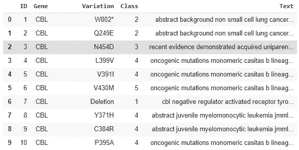

训练数据集的格式(图片由作者提供)

例如，ID 为 1 的论文是关于 CBL 基因及其变异(突变)W802*。这种变异属于 2 类。论文的起始文本显示在标题为“文本”的列中。本文开头的几行如下图所示:

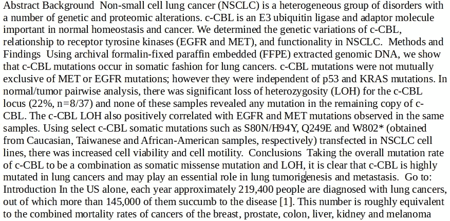

研究论文的开头句子(图片由作者提供)

正如我们所观察到的，这是一篇密集的科学论文，包含几个生物学术语，总共有 5757 个单词。测试数据集与训练数据集具有相同的结构。

**挑战**

让我们假设一名研究人员的阅读速度为每分钟 300 个单词，她必须阅读 5 篇这样的论文才能对突变进行分类。这意味着，即使不考虑研究论文不能像小说一样阅读的事实，她完成这项任务也需要 2 个小时。如果一个肿瘤基因包含 10 种不同的突变，这对于可能存在的突变数量来说是一个适中的数字，会怎么样呢？

> 如果我们可以提出一种算法，可以“阅读”大量的生物医学文献，并学习论文中的关键词和论文描述的突变分类之间的关联，我们可以大大减少研究人员手动注释新突变的时间。例如，如果一个算法可以在 80%的时间里在 1 秒钟内注释一个突变(如果我们有足够的计算资源，这是一个相当长的时间，可以大大减少)，这样的方法对癌症研究人员来说非常有用。

**想法**

在这项研究中，我有两个想法:

1.  作为探索性步骤，我检查了文献中基因的两个突变的频繁共现是否表明它们属于同一类别的可能性较高，反之亦然，即两个突变的共现低于平均水平是否表明它们属于不同类别的可能性较高。为此，我使用了 PMI，这是一个在 NLP 领域中非常成熟的概念。
2.  我使用 Spark MLLib 训练了一个分布式多项式逻辑回归模型，并使用它对测试数据集中的突变进行分类。

我将在这一部分描述第一个想法。在此之前，下面是使用分布式计算的基本原理:

**使用分布式计算背后的基本原理**

有两类算法挑战——一类是可以分成更小的部分，这样每个部分都可以单独处理，另一类是需要作为一个整体来处理，因此不能分成更小的部分。例如，要将一个大列表中的所有数字相加，我们可以将列表分成几个子列表，分别将这些子列表中的数字相加，然后将这些子列表相加得到最终结果。另一方面，要计算一个数字列表的平均值，我们需要将所有的数字相加，然后将总和除以列表中数字的总数。我们无法通过将列表分成子列表、计算子平均值、然后计算子平均值的平均值来计算正确的平均值。

对于可以分解成几个部分的问题，如果我们将每个部分分配给不同的机器，我们可以加速算法的执行，这就是分布式计算的用武之地。如果我们有 10 台机器，我们可以为每台机器提供 1/10 的较大问题，并在 1/10 的时间内获得结果，而不是在单台机器上处理整个问题，这对于许多涉及大型数据集的问题来说甚至是不可能的。

例如，计算一对基因突变的 PMI 分数需要计算同一篇论文中两个突变的同时出现次数，这一任务非常适合拆分成多个部分并在多台机器上执行。

我现在将讨论一些 EDA 步骤及其结果，以了解数据集的本质:

**探索性数据分析**

1.  **查找没有关联发布的条目:**导入库并创建 sparkcontext 后，我检查数据集中是否有丢失的值。在训练数据集中的 3321 个条目中，有 5 个条目没有相关的研究论文，如下图所示:

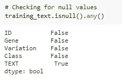

按列检查缺少的值(图片由作者提供)

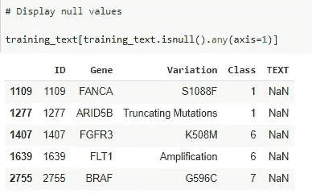

没有相关研究论文的训练数据行(作者图片)

我用包含基因名称和相关突变的连接文本填充这些 NaN 值。例如，对于 ID 1277，我用“ARID5B 截断突变”替换了 TEXT 列中的 NaN 值，如下图所示:

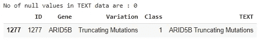

用基因突变串联替换文本列中的 NaN 值(图片由作者提供)

2.**确定训练数据集中输出类的分布:**为了检查是否存在显著的类不平衡，我绘制了属于训练数据集中每个类的实例数量，结果如下图所示:

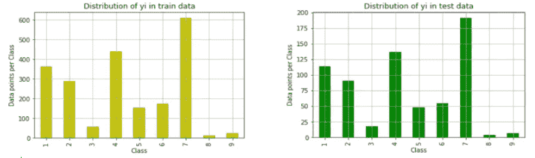

训练和测试数据集中突变类的分布(图片由作者提供)

因此，第 7 类和第 4 类在训练和测试数据集中的比例过高。

**3。确定基因及其突变在出版物中出现的分布:**

接下来，我绘制了所有 236 个基因中与特定基因相关的发表数量的计数，以检查分布是否相对均匀，或者少数基因是否出现了大量的次数。基因指数相对于其在研究文献中出现频率的图如下所示:

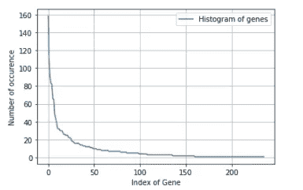

基因直方图(图片由作者提供)

从图中可以清楚地看出，少量基因(~10 个基因)是大部分研究文献的主题，这间接表明了这样一个事实，即这些是突变最多的基因，因为每篇论文对应于一个基因的一个突变。

为了检查是否有相同的突变发生在一个以上的基因中，我绘制了突变指数与突变计数的直方图。

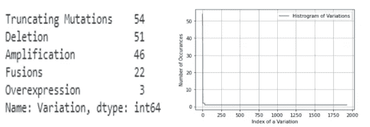

突变直方图(图片由作者提供)

基因之间存在一般的突变，如缺失、融合、截短，但它们的确切性质取决于所讨论的特定基因。正如所料，我们从右边的图中看到，绝大多数突变是独特的(计数为 1)，这意味着它们只发生在一个基因中。

现在，在继续讨论代码实现之前，我将简要讨论 PMI 的概念。

**点态互信息**

逐点互信息(PMI)是信息论和统计学中使用的一种关联度量。事件 x 和 y 的 PMI 由下式给出:

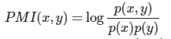

PMI 公式(图片作者提供)

其中，p(x)和 p(y)分别是事件 x 和 y 的边际概率，p(x，y)是事件 x 和 y 的联合概率。正 PMI 表示事件 x 和 y 比它们独立时更有可能同时发生。同样，负的 PMI 表明 x 和 y 不太可能同时出现。

让我们考虑一个例子。假设我们有一个包含 10 篇论文的文档，其中有两个单词 Alpha 和 Beta。α出现在 6 篇论文中，β出现在 4 篇论文中，它们都出现在 3 篇论文中。这种情况下的 PMI 计算如下所示:

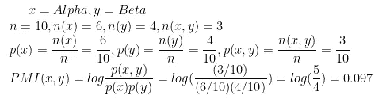

PMI 计算示例(图片由作者提供)

如果α和β是基因的两个突变，那么如果它们的 PMI 得分为正，这意味着它们在研究文献中频繁地同时出现，而不是为零或为负。

**brca 1 和 CBL 基因突变的 PMI 分布式计算**

我考虑了两个基因 BRCA1 和 CBL，并计算了这两个基因所有突变的 PMI 分数。总共有 236 个独特的基因。CBL 的选择是随机的，以避免任何选择偏差，而我选择了 BRCA1 基因，因为它有最高数量的突变。

以下是计算基因突变 PMI 值的步骤顺序:

1.我创建了一个包含所有 BRCA1 基因突变的列表，然后删除了一般的突变，如截短、缺失、扩增等。然后，我生成了该基因所有剩余独特突变的突变对列表，如果组成突变属于同一类，则将一对标记为 1，如果属于不同类，则将一对标记为 0。我嵌入了下面的代码片段，它也显示了输出。突变 R1753T 和 C44Y 属于相同的第 4 类，因此我将这对标记为 1。另一方面，突变 R1753T 和 R1835P 分别属于第 4 类和第 1 类，因此我将这对标记为 0。

根据属于相同或不同类别，将突变对标记为 1 或 0(图片由作者提供)

2.我将所有与 BRACA1 基因相关的文档合并成一个文档，并计算每个突变在这个合并文档中出现的概率。从现在起，分布式计算开始出现。观察 PySpark 如何将计算突变的任务进行划分，方法是将这个大文档分成几组论文，将这些论文发送到不同的机器，然后通过 reduce 操作将结果组合起来，得出组合文本中这些突变出现的概率。S1655F 突变在合并文献中出现频率最高，出现概率为 0.78(这意味着它出现在与 BRCA1 基因相关的 264 篇论文中的 209 篇中)。

计算文献中不同 BRCA1 突变发生的概率(图片由作者提供)

3.接下来，我实现了上面讨论的 PMI 公式的分布式版本，以计算所有 BRCA1 突变对的 PMI 值。例如，突变 G1743R 和 L1657P 各自单独出现 85 次，一起出现 62 次，它们的 PMI 值为 0.358。

PMI 计算代码片段(图片由作者提供)

**结果**

为了简洁起见，我将讨论 BRCA1 基因的结果，但我观察到的 CBL 基因的趋势是相同的。我绘制了所有突变对的 PMI 与分类相似性，该图如下图所示:

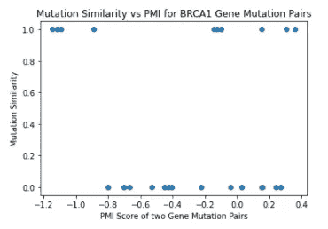

BRCA1 基因突变的 PMI 与突变相似性(图片由作者提供)

从这个图中我们可以得出两个结论:

1.  很明显，与人们的预期相反，PMI 得分的值和突变的相似性之间没有明确的关系。存在属于相同突变类别的具有低 PMI 分数的突变对，并且存在属于不同突变类别的具有高 PMI 分数的突变。因此，似乎两个突变之间的高 PMI 分数并不能很好地预测它们的类别相似性。
2.  有趣的是，具有最低和最高 PMI 值的突变对属于同一突变类别。为什么几乎不一起发生的突变(即低 PMI 值突变对)属于同一类，这是一个令人感兴趣的研究问题，进一步的研究可以揭示这一意外发现。

**应用程序**

我们不仅可以在检测基因突变的相似性方面使用分布式 PMI 计算，还可以在我们有一组类别和与类别相关的多个指示词的任何领域使用。例如，我们可以通过计算与我们最相关的一组词对的 PMI，并通过我们的算法运行几篇新闻文章，找到其中几篇在这些词对的 PMI 得分方面排名较高的文章，来确定一篇新闻文章是否与我们相关。我们也可以有两个以上的词，分布式计算也可以很容易地扩展到这种情况。

第一部分到此为止！希望你能从这篇文章中学到一些有用的东西。在 [**第二部分**](https://bharatss.medium.com/distributed-biomedical-text-mining-using-pyspark-for-classification-of-cancer-gene-mutations-bd3b2ca05a9c) 中，我将讨论我在 Spark MLlib 中训练分布式多项逻辑回归模型的工作，以对未见过的研究论文中的突变进行分类。

(我感谢 Namratesh 关于这个数据集的[帖子](https://medium.datadriveninvestor.com/personalized-cancer-diagnosis-aea93bad0587)，它帮助指导了我的 EDA 的初始部分。)

参考

1.  通过探索不同的分类器对基因突变进行自动分类，Badal Soni 等人，使人工智能应用于数据科学，计算智能研究，Springer