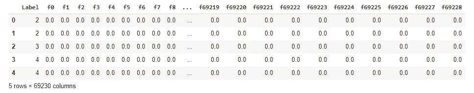
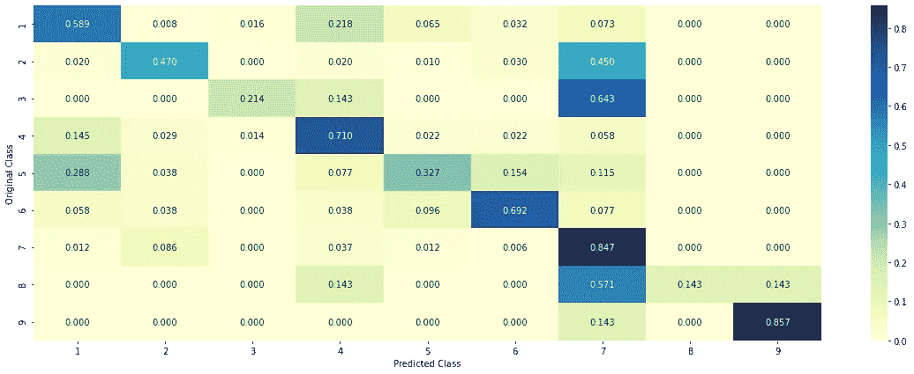
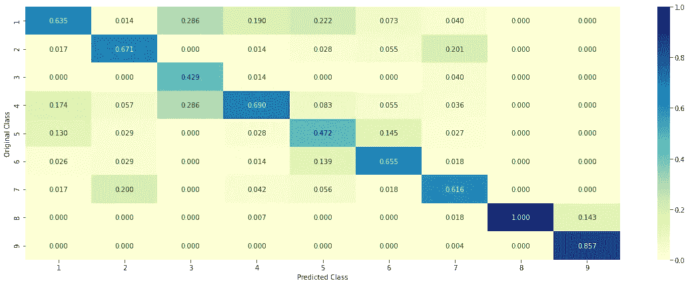
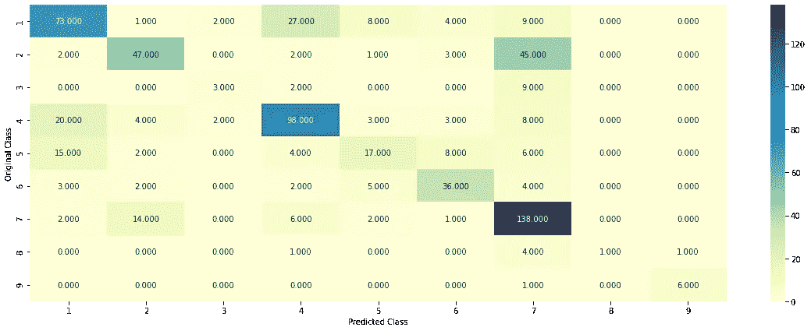

# 基于 PySpark 的分布式生物医学文本挖掘在癌症基因突变分类中的应用——第二部分:多项式逻辑回归

> 原文：<https://towardsdatascience.com/distributed-biomedical-text-mining-using-pyspark-for-classification-of-cancer-gene-mutations-bd3b2ca05a9c?source=collection_archive---------28----------------------->

## *分布式机器学习使用 Apache Spark 对癌症肿瘤基因突变进行大规模分类*

在 [**第一部分**](https://bharatss.medium.com/distributed-biomedical-text-mining-using-pyspark-for-classification-of-cancer-gene-mutations-3e11507b2450) 中，我讨论了探索性数据分析和将逐点互信息应用于突变对，以找出 PMI 分数和突变类相似性之间是否存在任何相关性。在这一部分中，我将讨论训练一个分布式多项逻辑回归(MLR)模型，并将其应用于测试数据集以确定突变的类别。

同样，为了简洁起见，我在本文中只分享代码的某些部分。完整代码请查看 GitHub 链接 [**这里**](https://github.com/bsets/Distributed_ML_with_PySpark_for_Cancer_Tumor_Classification/tree/main/Tumor_Gene_Classification_using_Multinomial_Logistic_Regression) 。我还准备了一个 5 分钟的视频，你可以在这里找到**。**

**在继续在 MLlib 中训练模型之前，需要几个预处理步骤:**

****数据预处理****

1.  ****处理缺失值**:正如我们在第一部分中看到的，训练数据集中有 5 个条目没有相关的研究论文文本。这些在文本列中有 NaN 值。我把这些 NaN 值换成了基因+突变值的组合。**
2.  ****执行基本的 NLP 操作**:我在研究论文文本(每行的文本列)上执行了一些基本的 NLP 操作，以标准化跨行的值，并在不丢失有价值信息的情况下减小数据集的大小。这些行动是:**

**A.用一个空格替换文本中的特殊字符，如*、@等**

**B.用单个空格替换多个空格**

**C.将所有字符转换为小写**

**D.仅存储文本中非停用词的那些词。像 and、the、the 等这样的词称为停用词。它们对于使句子语法正确至关重要，但在大多数情况下并不包含有用的信息。例如，考虑句子“药物阿司匹林已经被用作止痛药很长时间了”。这两个词中哪个是关键词:“阿司匹林”还是“as”？停用词数量众多，虽然移除停用词会造成一些意义的损失，但这种损失通常是最小的，并且所获得的数据压缩是巨大的，因为停用词是任何文档中最频繁出现的词。**

**下面的代码片段执行这四个操作:**

**对数据集执行基本的 NLP 预处理操作(图片由作者提供)**

**如下所示，这些预处理步骤的分布式实现花了 8 秒钟，而我在单台机器上完成时只花了 30 秒钟。**

**3.**矢量化基因、突变(变异)和文本特征:**我为基因、突变和训练数据集中的所有文本创建了一个热编码。在训练数据集中的所有文章中有 65946 个唯一单词。**

**在训练数据集论文中矢量化基因、突变和单词(图片由作者提供)**

**4.**组合所有编码以创建合并的训练数据集:****

**对于每一行，我组合了基因、突变和文本 one-hot-encoding 来创建一个表示这些信息的合并向量。**

**创建合并的编码训练数据集(图片由作者提供)**

**每行有 69229 个二进制条目，如下图所示:**

****

**训练数据集的矢量化表示(图片由作者提供)**

**5.**将数据帧转换为 Spark MLlib 友好格式:****

**为了训练分布式 ML 模型，我在上图中显示的训练数据集 panda dataframe 需要转换为特定的格式，这是通过我在 GitHub 文件夹中共享的 csvlibsvm1.py 程序文件来完成的。**

****训练 MLR 模型****

**这是我用来训练 MLR 模型的代码片段。我设置了超参数值(正则化常数=0.01，弹性参数=1)，在手动调整这些值并观察结果后，产生了良好的结果。更系统的方法是 GridsearchCV，一旦我做到了并得到更好的结果，我会更新这篇文章。**

**Spark MLLib 中多项式逻辑回归模型的分布式训练(图片由作者提供)**

****结果****

**我得到了 64%的总体分类准确率和 1.12 的多项式对数损失，这与 Kaggle 竞赛中最佳表演者报告的值相当。他们得到了 2.03 的多项式对数损失，尽管
他们的测试数据集与我的不同，因为我在分割训练数据集后准备了我的测试数据集。尽管如此，总体而言，MLR 似乎对该数据集工作得很好
。**

**这是回忆矩阵:**

****

**回忆矩阵(作者的图像)**

**令人鼓舞的是，该模型可以很好地预测实际的班级。2–7、3–7 和 8–7 的标签错误非常严重，需要进一步调查。这可能是由于高偏差导致模型将少数类(2，3，8)分类为多数类(7)。**

**精度矩阵如下所示:**

****

**精确矩阵(作者提供的图像)**

**该模型总体上具有良好的精度，因为它可以从对角线上呈现的相当高的值得到。3 级和 5 级的精度低于标准，这表明了进一步工作的方向。**

**混淆矩阵如下所示:**

****

**困惑矩阵(图片由作者提供)**

**再次，该模型在预测突变类别方面具有良好的准确性。有明显的 2–7 和 1–4 错配需要进一步调查。**

****结论****

**我发现分布式计算可以显著加速生物医学文本挖掘，这对于大数据尤其重要。我可以想到几个改进领域，包括通过超参数调整进一步提高精度和召回率，使用深度学习(特别是基于 BERT 的模型)，通过检查学习到的系数了解模型学习到的内容，提出更好的方法来表示数据，并将此方法应用于生物医学文本挖掘的其他领域以检查其性能。当我得到一些有趣的结果与大家分享时，我会在未来就其中的一些话题发表文章。**

**希望你觉得这个两部分的系列有用。如果您想了解本研究的任何部分或想与我合作，请随时联系我们。**

**(再次感谢 Namratesh 关于这个数据集的[帖子](https://medium.datadriveninvestor.com/personalized-cancer-diagnosis-aea93bad0587)，它帮助指导了我的数据预处理的最初部分。)**