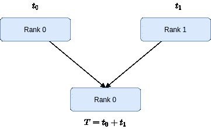
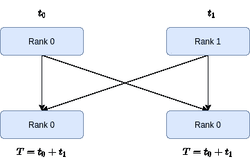

# 分布式深度学习 101:简介

> 原文：<https://towardsdatascience.com/distributed-deep-learning-101-introduction-ebfc1bcd59d9?source=collection_archive---------28----------------------->

## 如何使用 PyTorch 编写分布式深度学习应用程序的指南

[Omar Flores](https://unsplash.com/@omarg247?utm_source=unsplash&utm_medium=referral&utm_content=creditCopyText) 在 [Unsplash](https://unsplash.com/?utm_source=unsplash&utm_medium=referral&utm_content=creditCopyText) 上的照片

深层神经网络(dnn)是机器学习最新进展的主要推动力。从图像分类到语言翻译，从内容推荐到药物发现，dnn 已经改变了我们解决各种用例挑战的方式。

> 如今，向外扩展模型训练以获得更多计算资源的需求比以往任何时候都高。

最近的进展主要归功于我们掌握的大量数据，这些数据是确保 Deep Learning 引擎持续运行的燃料。因此，向外扩展模型训练以获得更多计算资源的需求比以往任何时候都高。

有两种方法可以实现这一点:(I)数据并行化或(ii)模型并行化，前者是最常用的方法。本文解释了什么是数据并行化，并实现了一个教学示例来检查其内部工作。在接下来的故事中，我们将在一个真实的用例中更深入地展开培训过程。

简而言之，数据并行化的概念非常简单；例如，假设我们有一个以上的 GPU 加速器，我们会:

1.  在每个图形处理器上复制模型
2.  分割数据集，并使模型适合不同的子集
3.  在每次迭代中传达梯度，以保持模型同步

虽然这是一个容易理解的想法，但是它的实现却并非微不足道。这就是为什么像 PyTorch 和 TensorFlow 这样的主要框架都带有对分布式培训的本地支持。让我们潜水吧！

> [学习率](https://www.dimpo.me/newsletter?utm_source=medium&utm_medium=article&utm_campaign=pytorch_distributed_intro)是一份针对那些对人工智能和移动机器人世界感兴趣的人的时事通讯。你会听到我每周五与最新的人工智能新闻和文章的更新和想法。在此订阅[！](https://www.dimpo.me/newsletter?utm_source=medium&utm_medium=article&utm_campaign=pytorch_distributed_intro)

# DNN 训练的基础

首先，让我们巩固 DNN 培训的基础。通常，要训练 DNN，我们遵循三步程序:

1.  我们通过 DNN 层传递数据来计算损失(即前向传递)
2.  我们通过每一层反向传播损耗来计算梯度(即反向通过)
3.  我们应用学习规则来更新模型的参数(即优化步骤)

为了构建一些上下文，让我们看看 PyTorch 代码中的这些步骤。以下示例使用一个简单的单层神经网络和一个玩具数据集来演示训练过程。

首先，我们生成两个随机张量；一个用于输入数据(特征)，一个用于我们的目标(标签)。然后，我们初始化一个简单的模型(只是一个线性层)、优化器(随机梯度下降— SGD)和损失函数(均方误差损失— MSE)。在第 19 行，我们开始向前传递，将数据输入模型并计算损失。最后，在第 23 行，我们执行向后传递，并在最后一行更新模型的参数。

# 数据并行性

PyTorch 提供了几个工具来帮助我们扩展上一节中看到的培训过程。但是让我们退一步，运用常识；并行化该培训脚本的最简单方法是什么？

首先，我们需要在每个 GPU 上复制模型。接下来，我们将照常运行正向传递，并在反向传递期间计算梯度。到目前为止，一切顺利，但现在我们需要同步梯度，以保持我们的模型同步。实现这一点的简单方法是收集两个 GPU 上的所有梯度，应用一些缩减操作(例如，对它们求平均)，然后更新模型参数。

在这一节中，我们将看到如何将这个简单的想法转换成 PyTorch 代码。下面的脚本是我们将在整篇文章中使用的脚手架。

这个脚本启动了两个进程，初始化了进程组，这样每个进程都能够通过一个主进程进行协调，最后执行给定的`train`函数，这个函数此时什么也不做。所以，下一步是填充这个方法。

剧本好像挺熟悉的。我们有正向传递，反向传播步骤，最后，我们更新模型的参数。但是有两个补充:首先，我们需要对数据集进行分区，因此每个进程都处理整个数据集的一个子集。然后，在优化步骤之前，我们有一个名为`average_loss`的函数。让我们来实施那些事情吧！

## 数据集分区

在这个故事中，我们使用流行的 MNIST 数据集。MNIST 数据集有 60，000 张手写数字图像。因此，我们希望将其中的 30.000 个提供给第一个 GPU，其余的提供给第二个 GPU。为了实现这一点，我们实现了一个`DatasetPartitioner`助手类。

这和分布式训练没什么关系。它只是获取一个数据集，打乱它的索引，然后把它分成两个子集。然后，它以 PyTorch 数据集的形式返回我们请求的数据集的分区，我们可以将它传递给 DataLoader。在[文档](https://pytorch.org/tutorials/beginner/data_loading_tutorial.html)中阅读更多关于 PyTorch 数据集和数据加载器的信息。

现在，让我们创建我们在训练函数中使用的`partition_dataset`方法。

该方法将 MNIST 数据集加载到内存中，获取可用的 GPU 数量，并相应地对其进行拆分。例如，如果我们使用 2 个 GPU，`get_world_size`方法将返回`2`。因此，如果我们想给我们的模型提供 128 幅图像，我们只需将 128 分成两组，给我们的两个模型提供 64 幅图像。

最后，我们应该根据运行它的 GPU 来指定每个进程将使用数据的哪个分区；例如，如果我们在第一个 GPU 上，`get_rank`方法将返回`0`。因此，我们将使用第一个数据分区。

## 平均梯度

为了将一切联系在一起，我们需要收集梯度，应用归约操作(即平均)并更新模型参数。但在深入研究之前，我们需要一些背景知识。

PyTorch 进程使用集体通信来对数据执行某些操作。例如，对某个张量的`reduce`操作将从主节点上的每个进程收集所有这样的张量，并执行指定的操作。

缩小功能-按作者分类的图像

PyTorch 目前共有 6 个集体。更多细节参见[文档](https://pytorch.org/docs/stable/distributed.html)。但是这里我们需要的不仅仅是收集主节点上的梯度，而是每个节点上的梯度。因此，我们需要`all_reduce`集体。

所有缩小功能—作者图片

我们已经准备好实现`average_gradients`方法。

首先，我们用`get_world_size`方法得到可用的 GPU 数量。然后，对于每个模型参数，我们执行以下操作:

1.  使用`dist.all_reduce`收集每个过程的梯度
2.  对渐变应用求和运算
3.  除以世界尺寸，取平均值

最后，我们可以继续使用平均梯度来更新模型参数！

# 结论

深度神经网络(DNNs)一直是机器学习领域大多数最新进展背后的主要力量。像这样的突破主要是由于我们可以处理的数据量，这增加了将训练过程扩展到更多计算资源的需求。

在这个故事中，我们研究了 PyTorch 如何帮助我们分发 DNN 的培训，使用一个教学示例来获得更多的洞察力。在随后的故事中，我们将更深入，并在真实的用例中扩展培训过程。

# 关于作者

我叫[迪米特里斯·波罗普洛斯](https://www.dimpo.me/?utm_source=medium&utm_medium=article&utm_campaign=pytorch_distributed_intro)，我是一名为[阿里克托](https://www.arrikto.com/)工作的机器学习工程师。我曾为欧洲委员会、欧盟统计局、国际货币基金组织、欧洲央行、经合组织和宜家等主要客户设计和实施过人工智能和软件解决方案。

如果你有兴趣阅读更多关于机器学习、深度学习、数据科学和数据运算的帖子，请关注我的 [Medium](https://towardsdatascience.com/medium.com/@dpoulopoulos/follow) 、 [LinkedIn](https://www.linkedin.com/in/dpoulopoulos/) 或 Twitter 上的 [@james2pl](https://twitter.com/james2pl) 。此外，请访问我的网站上的[资源](https://www.dimpo.me/resources/?utm_source=medium&utm_medium=article&utm_campaign=pytorch_distributed_intro)页面，这里有很多好书和顶级课程，开始构建您自己的数据科学课程吧！