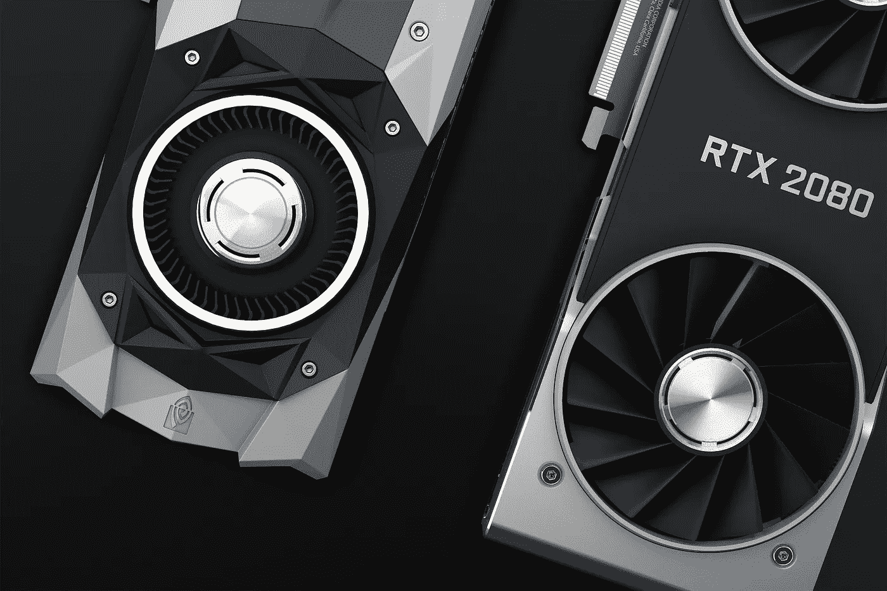
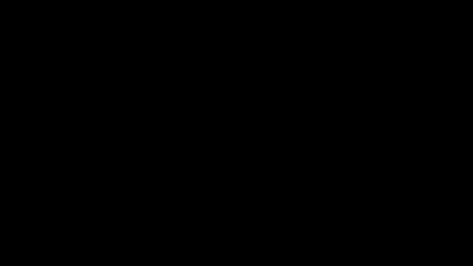
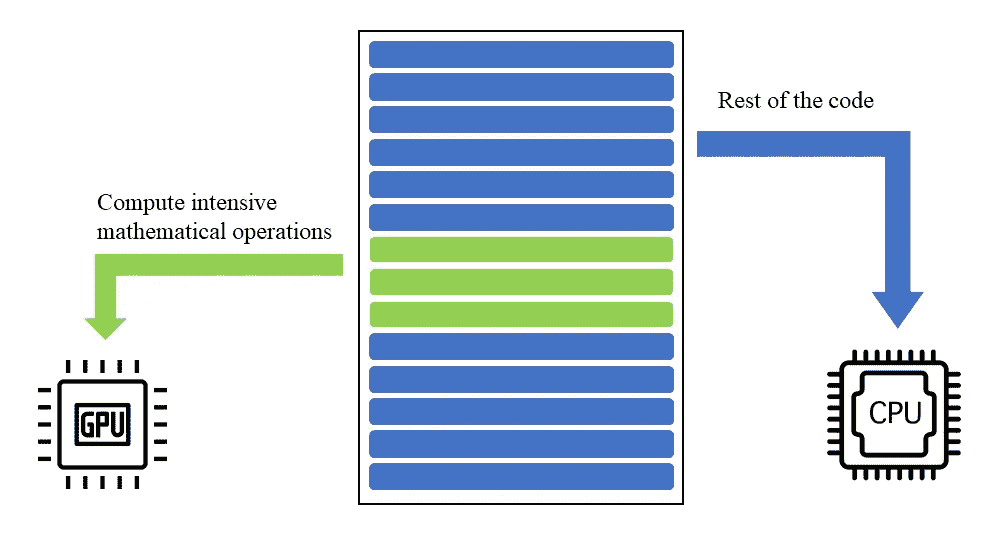
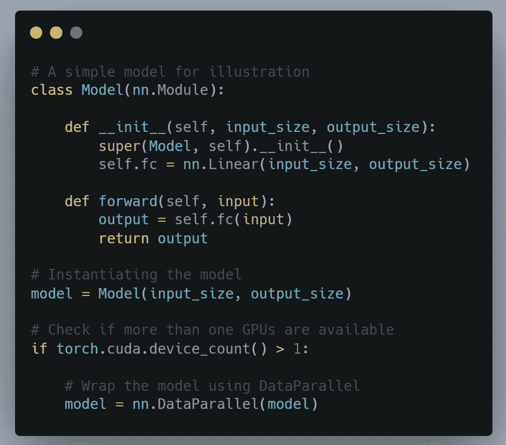

# 分布式深度学习—图解

> 原文：<https://towardsdatascience.com/distributed-deep-learning-illustrated-6256e07a0468?source=collection_archive---------28----------------------->

## **了解如何使用多个 GPU 执行深度学习**

照片: [pixabay](https://pixabay.com/)

## 分布式深度学习可视化！

请继续阅读！(图片由作者提供)

在这篇文章中，我将说明分布式深度学习是如何工作的。我已经创建了动画，应该可以帮助您对分布式深度学习有一个高层次的理解。但是让我们从基础开始。

# GPU 如何加速深度学习？

GPU 如何加速执行(图片由作者提供)

图形处理单元(GPU)是能够执行多个同步数学计算的专用内核。深度学习计算可以分解为一系列矩阵乘法，这就是 GPU 优于 CPU 的地方。当代码被执行时，这些数学运算被卸载到 GPU，而代码的其余部分在 CPU 上运行。由于深度学习本质上是对这些数学例程的迭代，我们通过使用 GPU 获得了巨大的加速。

# 分布式深度学习

当我们想要使用多个 GPU 来加速我们的模型训练过程时，就会使用分布式深度学习。分布式深度学习主要有两种类型——模型并行和数据并行。**模型并行**用于当您的模型有太多的层而无法放入单个 GPU 时，因此不同的层在不同的 GPU 上训练。**数据并行**，两者中较为常见的一种，通过将数据分割到不同的分区来实现加速。该模型使用不同的数据分区在多个 GPU 上同时运行。

下面的动画展示了使用多个 GPU 的分布式深度学习。每个阶段调用的函数显示在动画的右侧。这些功能(原语)解释如下。

*   **复制**:在多个 GPU 上复制一个模型
*   **分散**:将输入分配给多个 GPU
*   **采集**:采集所有 GPU 的输出，并发送给主 GPU
*   **parallel_apply** :在已经分布的输入上并行运行模型

## 输入数据和模型分布

(图片由作者提供)

*   输入数据批被分成与 GPU 数量相同的分区。
*   主 GPU (GPU0)上的模型权重被复制到所有 GPU

## 输出和损耗计算

(图片由作者提供)

*   该模型同时运行在所有 GPU 各自的数据分区上
*   输出被收集并发送到 GPU0，然后 GPU 0 计算损耗
*   丢失被发送到所有 GPU

## 梯度计算和模型更新

(图片由作者提供)

*   每个 GPU 在其各自的数据分区上计算梯度
*   梯度被收集并发送到 GPU0
*   GPU0 使用平均梯度来计算更新的模型
*   来自 GPU0 的更新模型被发送到所有 GPU，它们将更新模型用于下一次迭代
*   整个过程再次从头开始迭代

我希望现在你已经对分布式深度学习如何在多个 GPU 上工作有了直观的理解。我使用了 PyTorch 深度学习框架，但其基本原则仍然是一样的。使用 PyTorch 框架时的示例代码如下所示。

在多个 GPU 上运行模型的 PyTorch 代码

## 数据并行模式的缺点

如果你分析上面解释的 PyTorch 中的数据并行工作流，你可以看到设计中存在一定的局限性。GPU0 充当主 GPU，它比其他 GPU 做更多的工作。这意味着当 GPU0 在做额外的工作时，其他 GPU 处于闲置状态。一个更好的设计是确保所有的 GPU 都做同样多的工作，以便它们得到充分利用。

PyTorch DataParallel 模式的另一个限制是，它使用单个进程多线程，这种模式存在著名的 python 全局解释器锁(GIL)问题。数据并行的优点是所需的编码最少。如果您准备编写更多的代码，您应该在 PyTorch 中使用 DistributedDataParallel，它使用多处理。

## 未来的工作

我计划涵盖其他高级分布式深度学习方法，如分布式数据并行、Ring All-reduce 等。在以后的文章中。理解分布式深度学习是如何工作的，对于构建健壮的大规模机器学习解决方案至关重要。我希望这一系列文章能够帮助您朝着这个方向迈出一步。