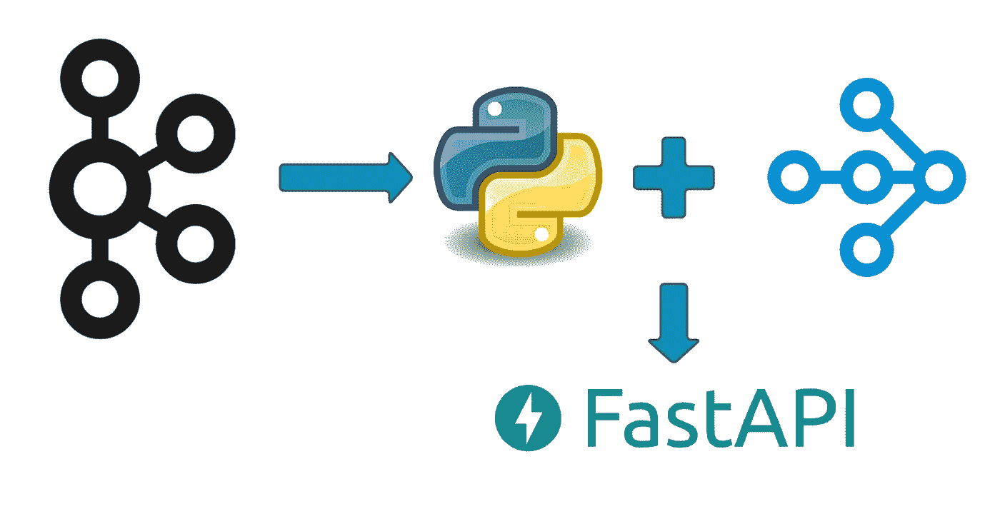

# 使用 Ray-Python 的分布式 Kafka 消费者

> 原文：<https://towardsdatascience.com/distributed-kafka-consumers-using-ray-python-d3101ab58de6?source=collection_archive---------7----------------------->

## 如何使用 Ray 用 Python 编写分布式 Kafka 消费者


照片由[约书亚·索蒂诺](https://unsplash.com/@sortino?utm_source=medium&utm_medium=referral)在 [Unsplash](https://unsplash.com?utm_source=medium&utm_medium=referral) 拍摄

# 介绍

通过这个博客，我将尝试给出一个要点—

*   我们将要用到的一些射线成分
*   然后研究如何使用 Ray 为我们的流处理创建分布式 Kafka 消费者。提供至少一个担保。
*   最后，公开 REST APIs 来管理这些消费者。



# 为什么用 Ray 进行流处理？

许多团队每天都在不同的用例中使用 python。今天，Python 是使用最多的语言之一。

还有其他分布式计算引擎，如 Apache Spark 和 Apache Flink，它们提供 Python 接口，但学习曲线非常陡峭，您需要创建专门的数据集，如 RDDs/DataFrames 等，操作和概念围绕这些结构。

当我第一次使用 Ray 时，它看起来更像是编写分布式系统的 pythonic 方式，使用 Ray 不需要学习太多。您可以轻松地转换现有的 python 函数和类，以在分布式模式下运行，而无需编写新代码或更改现有代码。

# 雷简介

*如果你已经知道 Ray* ，请跳到“创造 Kafka 消费者”部分

请通过[射线文档](https://docs.ray.io/en/latest/index.html)了解更多详细信息。

Ray 提供了简单的 API 来在节点集群中运行你的函数和类。

**射线术语**

*   任务-在分布式设置中运行的 Python 函数
*   参与者-在分布式设置中运行的 Python 类
*   对象引用——这类似于 Javascript 中的未来或承诺。您可以在这些 refs 上调用 get 来从执行的*任务*中获取数据

**在分布式设置中运行功能**

要让一个函数以分布式模式运行，你只需要在你的函数上添加一个装饰器`@ray.remote()`。

在下面的代码中，我们计算数字 10 到 16 的阶乘。单个数字的计算在 7 个不同的过程中并行进行，这些过程是由 Ray 创建的。

在上面的代码中:

*   我们使用`ray.init().`启动 Ray，它启动调度程序，创建对象存储来保存参与者和任务，并做一系列其他事情。
*   我们得到了一个计算给定数字的阶乘的阶乘函数。我们用`@ray.remote()`修饰了这个函数，它创建了一个新的以分布式模式运行的 Ray 任务。
*   告诉 ray 重新运行任务 3 次，以防任务在完成前终止。当运行任务的节点关闭或死亡时，任务可能会死亡。
*   `num_cpus`告诉 ray 在 1 个 CPU 的 50%运行这个任务。
*   在随后的代码中，我们调用 10 到 16 的阶乘，并将未来值保存到一个列表中。我们稍后调用`ray.get`，它允许我们等待所有的`factorial()`任务完成。

输出将如下所示:

```
This cluster consists of
    1 nodes in total
    8.0 CPU resources in total(factorial pid=1155) calculating factorial of 15
(factorial pid=1155) Factorial of 15 = 1307674368000
(factorial pid=1154) calculating factorial of 16
(factorial pid=1154) Factorial of 16 = 20922789888000
(factorial pid=1148) calculating factorial of 10
(factorial pid=1148) Factorial of 10 = 3628800
(factorial pid=1149) calculating factorial of 14
(factorial pid=1149) Factorial of 14 = 87178291200
(factorial pid=1151) calculating factorial of 11
(factorial pid=1151) Factorial of 11 = 39916800
(factorial pid=1153) calculating factorial of 13
(factorial pid=1153) Factorial of 13 = 6227020800
(factorial pid=1152) calculating factorial of 12
(factorial pid=1152) Factorial of 12 = 479001600Process finished with exit code 0
```

如您所见，所有的`factorial()`任务都已经在它们自己的进程中启动。

上述设置可以转换为基于类的设置(也称为 Actors ),只需用`@ray.remote()`注释该类，这将创建一个运行在不同进程上的新 worker 实例，我们可以调用类成员函数来创建这些 worker 上的远程任务。

# 创建分布式 Kafka 消费者

正如您在上一节中看到的，我们能够在不同的进程中远程运行函数和类成员函数。
我们将使用相同的概念在多个节点的不同流程中运行我们的消费者。

在本节中，我将介绍以下功能-

1.  为创建 Kafka 消费者提供配置支持。
2.  以分布式模式运行 Kafka 消费者。
3.  公开 REST APIs 来管理(启动、停止等)这些消费者。

> 我们使用 [kafka-python](https://pypi.org/project/kafka-python/) 客户端创建消费者，使用 [fastapi](https://pypi.org/project/fastapi/) 为我们的消费者创建 REST APIs

## 使设置可配置

消费者配置 JSON 文件—该消费者配置 JSON 文件将包含消费者组配置列表。对于列表中的每个配置，我们将使用配置的工作人员/使用者数量来启动一个使用者组。

> 为了获得最佳性能，保持`number_of_workers`等于主题的分区数量。
> 
> 警告:如果您有 4 个内核，并且每个进程占用 1 个 CPU，那么您最多可以启动 4 个工作进程。

配置详细信息—

配置详细信息

检查 [ser_des_util.py](https://github.com/bkatwal/distributed-kafka-consumer-python/blob/main/src/kafka_core/ser_des_util.py) 中可用的串行化器和去串行化器。

**流转换器**

通过扩展抽象类 [StreamTransformer](https://github.com/bkatwal/distributed-kafka-consumer-python/blob/main/src/transformers/transformer.py) 创建你自己的流转换器

下面是一个这样的转换器，它将字符串消息从 Kafka 转换为 JSON，并创建一个 SinkRecordDTO 对象。
注意，我没有在这里的消息中执行任何操作。您可能希望创建自己的 StreamTransformer 来进行一些处理。

最后，在`sink_configs`部分下的 [consumer_config.json](https://github.com/bkatwal/distributed-kafka-consumer-python/blob/main/config/consumer_config.json) 中添加您新创建的流转换器。

**流作者**

流写入器是写入目标存储的一组类。例如，要将转换后的事件写入 Elasticsearch，您可以创建自己的流编写器，使用 es 客户端更新索引。

要创建流编写器，请扩展类 [StreamWriter](https://github.com/bkatwal/distributed-kafka-consumer-python/blob/main/src/stream_writers/stream_writer.py) 。

例如，我创建了一个流编写器来打印控制台中的键和消息。

最后，我创建了一个[接收器任务类](https://github.com/bkatwal/distributed-kafka-consumer-python/blob/main/src/kafka_core/sink_task.py)，它将作为一个编排器，执行以下任务:

1.  转换数据
2.  使用提供的流编写器写入数据存储
3.  失败时推入死信队列

# 以分布式模式运行 Kafka 消费者

正如我们在前面一节中看到的，我们可以通过用`@ray.remote()`修饰类和函数，在不同的进程中远程运行一个函数或类成员函数

在本节中，我们将创建远程工作人员和管理这些消费者的管理器。

你可以在这里找到完整的代码。

**远程消费者工作者**

通过这种设置，Ray 将在一个单独的进程中创建一个工人实例`ConsumerWorker`，并在其上启动任务，这意味着在其上调用`run()`函数。

注意，我们在装饰器中添加了一些额外的参数:

```
@ray.remote(max_restarts=2, max_task_retries=2, num_cpus=WORKER_NUM_CPUS)
```

`ray_restarts`告诉 ray，如果工人死亡或被杀，最多重启工人实例 2 次。在本例中，`ConsumerWorker`是我们的 worker 实例。

`max_task_retries`告诉 ray，如果工人死亡或被杀，重新启动任何正在运行的任务/功能最多 2 次。在这种情况下，`run()`功能被重新触发。

在上面的工人中，我们有—

1.  在构造函数中创建了一个新的 Kafka 消费者
2.  创建了一个`run()`函数，该函数执行:
    -运行一个无限循环来轮询()消费者记录/消息
    -通过调用`sink_task.process()`
    发送记录进行处理-如果消息处理成功，则向代理提交偏移量。
    -通过中断循环，按需停止工人
3.  创建一个`stop_worker()`函数，设置标志来停止正在运行的工作线程。

**消费者工人经理**

管理器负责按需启动和停止消费者工作器。

经理课程中需要注意的关键事项

*   它维护了一个包含 ray actors/worker 实例的容器，并对它们调用 run/stop。
*   提供 API 来启动所有的消费者组或特定的消费者组，并启动这些消费者组上的`n`工作器
*   在创建工人时，我们提供了一个选项- `max_concurrancy=2`。这将允许我们在 worker 实例上调用`stop()`，即使`run()`任务正在运行。
    默认情况下，Worker 实例在单线程中顺序运行任务。
*   停止后使用`ray.kill(actor/worker instance)`杀死工作实例。

# Rest APIs 管理消费者工作人员

我使用 Fast API 为我们的消费者工作者管理创建端点，并使用基本 auth 来验证请求。

请注意，在服务的`@app.on_event("startup")`上，应用程序创建并启动所有的消费群。

# 在 K8 的远程 Ray 集群上运行消费者

阅读安装指南[此处](https://github.com/bkatwal/distributed-kafka-consumer-python)，获取更多详细说明。

要连接到远程光线簇，我们需要在应用程序中进行以下更改—

```
Instead of ray.init() change to:
----if LOCAL_MODE == 'Y':
    ray.init()
else:
    ray.init(address=RAY_HEAD_ADDRESS)------
RAY_HEAD_ADDRESS is your remote ray cluster head address ex:  ray://10.20.30.40:30001
```

## **在 K8 建立射线簇**

创建下面的射线 YAML 配置文件:

在下面的配置中，

*   我们正在创建一个头部 pod 和两个工人副本 pod。
*   头节点占用一个内核和 512 MB 内存—根据需要进行更改
*   工作节点占用 0.5 CPU 和 512 MB 内存—根据需要进行更改
*   通过使用节点端口的 K8 外部服务公开仪表板、ray head 节点和 Redis 服务器以供公众访问。
*   将所有代码依赖项作为一个包安装在 head 和 worker 节点中。这样，射线头节点和工作者节点可以找到这些模块。`pip install kafka-connect-dependency==0.1`

应用更改:

```
kubectl apply -f ray-cluster-config.yaml -n ray
```

## 运行消费者应用程序

请注意，您的应用程序不一定需要在 K8 集群上运行。您可以在任何服务器上运行，甚至可以在 docker 容器或 K8 pod 中运行。

```
## to run outside container
RAY_HEAD_ADDRESS=ray://192.168.64.3:30001 uvicorn src.event_consumer_app:app --port 8002
```

您甚至可以运行 docker 容器。建立 [Dockerfile](https://github.com/bkatwal/distributed-kafka-consumer-python/blob/main/Dockerfile) 。然后使用环境变量运行图像，传递光线头节点地址和其他相关的环境变量。

```
docker run -e RAY_HEAD_ADDRESS=ray://<head node IP>:<port> -e LOCAL_MODE=N  -dp 8002:8002 kafka-connect-ray
```

这将启动应用服务器，并为消费者组`some_consumer_group`启动两个消费者，如下所示—

在 Postman 中运行 Rest[API，或者你可以在 path `/docs`中查看 Swagger 文档](https://app.getpostman.com/run-collection/10991325-25322c48-3b7c-401b-8227-43e103ffd86a?action=collection%2Ffork&collection-url=entityId%3D10991325-25322c48-3b7c-401b-8227-43e103ffd86a%26entityType%3Dcollection%26workspaceId%3D58ae760a-8ac4-49a5-a57a-c52027d29550)

# 摘要

在这篇博客中，我展示了一种使用 Ray 创建分布式 Kafka 消费者并使用 Rest APIs 管理这些消费者的生命周期的方法。

如前所述，这种设置是高度可配置的，您只需要创建自己的转换器和流编写器逻辑就可以让它工作。

# 参考

[](https://docs.ray.io/) [## 射线版本 1.7.0

### Ray 通过以下方式完成这项任务:为构建和运行分布式应用程序提供简单的原语…

docs.ray.io](https://docs.ray.io/)  [## KafkaConsumer-Kafka-python 2 . 0 . 2-dev 文档

### 消费 Kafka 集群中的记录。消费者将透明地处理 Kafka 中服务器的故障…

kafka-python.readthedocs.io](https://kafka-python.readthedocs.io/en/master/apidoc/KafkaConsumer.html) [](https://fastapi.tiangolo.com/) [## FastAPI

### FastAPI 框架，高性能，简单易学，快速编码，准备生产文档…

fastapi.tiangolo.com](https://fastapi.tiangolo.com/)