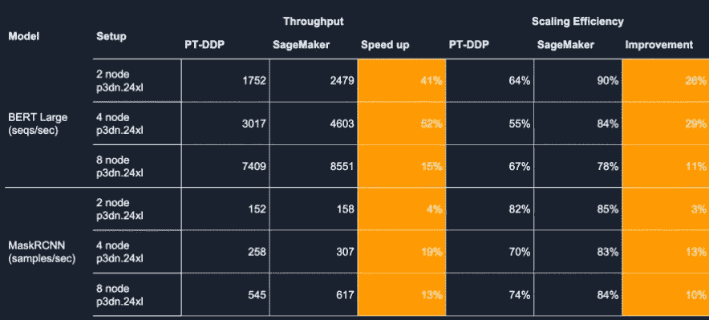
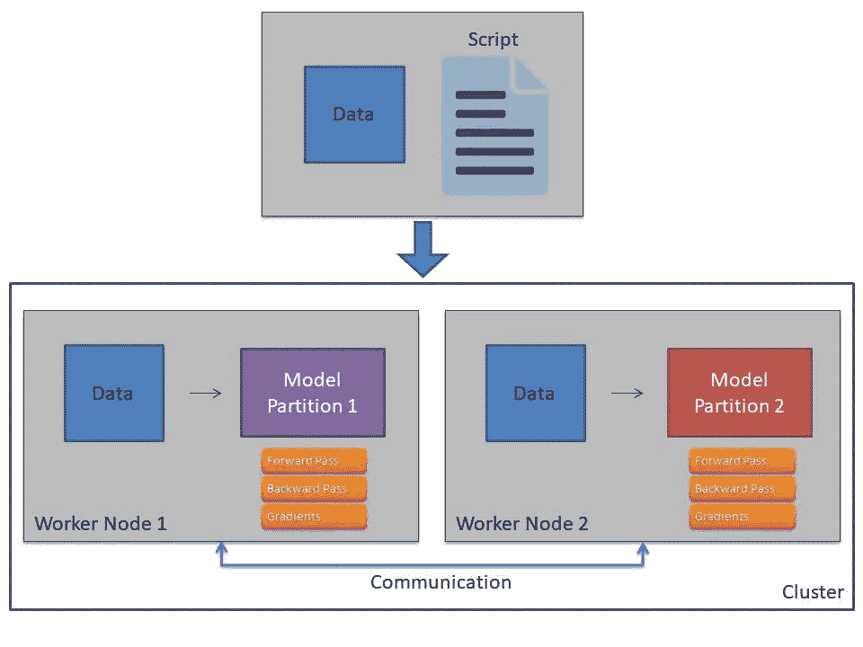

# 关于 AWS SageMaker 的分布式培训

> 原文：<https://towardsdatascience.com/distributed-training-on-aws-sagemaker-8bcbea28466c?source=collection_archive---------17----------------------->

## 了解 AWS SageMaker 上可用于分布式培训的数据并行和模型并行选项。

艾莉娜·格鲁布尼亚克在 [Unsplash](https://unsplash.com?utm_source=medium&utm_medium=referral) 上的照片

在当今世界，当我们可以访问海量数据、更深更大的深度学习模型时，在本地机器上的单个 GPU 上进行训练很快就会成为瓶颈。一些模型甚至不适合单个 GPU，即使它们适合，训练也可能非常慢。在这种设置下，即在大量训练数据和模型中，运行单个实验可能需要几周甚至几个月。因此，这可能会妨碍研究和开发，并增加制作概念证明所需的时间。然而，让我们欣慰的是云计算是可用的，它允许人们设置远程机器，并根据项目的要求对它们进行配置。这些都是可扩展的(向上和向下)，不需要你来维护。因此，管理费用由为您提供服务的公司承担。一些主要的提供商有:亚马逊 AWS、谷歌云、IBM 云、微软 Azure 等。(按字母顺序排列。)我们将研究使用 AWS SageMaker 的分布式培训来解决伸缩问题。

# 分布式培训

它有助于解决缩放模型大小和训练数据的挑战[1]。正如前面所讨论的，虽然增加模型大小和复杂性可以提高性能(取决于问题陈述)，但单个 GPU 可以容纳的模型大小是有限制的。此外，缩放模型大小会导致更多的计算和训练时间。如果您有非常大的数据集，情况也是如此。

在分布式训练中，训练模型的工作量被分割并在多个小型处理器之间共享，这些处理器被称为工作节点[2]。这些工作节点并行工作以加速模型训练。

基于我们选择如何分割工作，这里有两种主要类型的分布式训练，即数据并行和模型并行。

# 数据并行性

这是最常见的分布式培训方法。这个想法是，我们有很多训练数据，所以我们批量处理这些数据，并将数据块发送到多个 CPU 或 GPU(节点)以供神经网络处理[1]。数据块/分区的数量等于计算集群中可用节点的数量。模型被复制到这些 worker 节点中的每一个，并且每个 worker 操作它自己的数据子集。**我们需要理解，每个节点都必须有足够的计算能力来支持正在训练的模型，即模型必须完全适合每个节点[2]。**每个节点都有模型的副本(精确副本),并独立计算其各自数据批次的正向传递、反向传递和梯度。在移动到下一批并最终移动到另一个时期之前，与其他节点共享权重更新以进行同步。

数据并行性:相同的模型在不同的工作节点之间被复制和共享。每个工人都可以访问不同的数据子集进行培训。每个步骤之后的参数更新通过通信在不同的节点上聚集。(图片来源:作者)

**SageMaker 分布式数据并行库:** AWS SageMaker API 可以让你轻松进行数据并行分布式训练，而无需对你的脚本进行大量修改。它为您处理集群的创建。它还以两种方式解决了这种培训所需的通信开销:

1.  该库执行 AllReduce，这是分布式训练期间的一个关键操作，它负责很大一部分通信开销。算法负责使用某种操作将梯度聚合在一起，并将结果转发给所有工人。你可以在这里了解更多信息:
2.  [分布式深度学习背后的技术:AllReduce |首选网络研究&开发](https://tech.preferred.jp/en/blog/technologies-behind-distributed-deep-learning-allreduce/)
3.  该库通过充分利用 AWS 的网络基础设施和 Amazon EC2 实例拓扑来执行优化的节点到节点通信。

以下是 AWS Sagemaker 和 PyTorch 的数据并行库的基准测试。(虽然我没有亲自验证这些数字。)我们确实观察到了 AWS DDP 库的加速。

来源:[SageMaker 分布式数据并行库介绍—亚马逊 SageMaker](https://docs.aws.amazon.com/sagemaker/latest/dg/data-parallel-intro.html)

# 模型并行性

**在模型并行性(网络并行性)中，模型被分割成不同的部分，这些部分可以在不同的节点上并发运行，并且每个部分都将运行在相同的数据上。**其可扩展性取决于算法的任务并行化程度，实现起来比数据并行更复杂。工作者节点只需要同步共享参数，通常对于每个向前和向后传播步骤同步一次。在这种训练中考虑几个因素是很重要的[1]。

模型并行性:根据某种算法，模型被手动或自动分割成不同的分区。每个分区都被赋予相同的数据批次。模型分区的执行基于调度策略。根据计算图形关系，激活/层输出在分区之间传递。(图片来源:作者)

1.  **如何跨设备分割模型**:模型的计算图(PyTorch 和 TensorFlow 中的[计算图](/computational-graphs-in-pytorch-and-tensorflow-c25cc40bdcd1?sk=97a421cf7039f60aa3bb9389d2c0688b))、模型参数和激活的大小以及资源约束(例如内存和时间)决定了最佳的分区策略。为了减少有效分割模型所需的时间和精力，您可以使用 Amazon SageMaker 的分布式模型并行库提供的自动化模型分割特性。
2.  **实现并行化:**在深度学习中，模型训练是高度有序的，因为我们运行正向计算和反向传播来获得梯度。每个操作必须等待另一个操作计算其输入。因此，深度学习训练的正向和反向传递阶段不容易并行化，天真地将一个模型拆分到多个 GPU 上可能会导致设备利用率低下。例如， **GPU i+1** 上的层必须等待来自 **GPU i** 上的飞片的输出，因此， **GPU i+1** 在此等待期间保持空闲。模型并行库可以通过构建高效的计算调度来实现流水线执行，从而实现真正的并行化，其中不同的设备可以同时对不同的数据样本进行前向和后向传递。

要进一步了解这些策略，我建议您阅读 Jordi TORRES 的[关于并行和分布式基础设施的](/scalable-deep-learning-on-parallel-and-distributed-infrastructures-e5fb4a956bef)可扩展深度学习。艾。

**AWS 的 SageMaker 的分布式模型并行[5]:** 它通过提供自动化的模型拆分和复杂的流水线执行调度，使模型并行更容易实现。模型分割算法可以优化速度或内存消耗。该库还支持手动分区。该功能内置于 PyTorch/TensorFlow 估计器类中。

**自动化模型分割:**顾名思义，这个库为您处理模型分割。它使用一种分区算法来平衡内存，最大限度地减少设备之间的通信，并优化性能。您可以配置分区算法来优化速度或内存。当第一次调用 smp.step 修饰函数时，自动分区发生在第一个训练步骤中。在调用期间，库首先在 CPU RAM 上构建模型的一个版本，然后分析模型图以做出分区决定。基于这个决定，每个模型分区被加载到一个 GPU 上，并且只执行第一步。

**手动模型分割:**如果您想要手动指定模型如何在不同的设备上分割，手动分割也是可能的。为此，您可以使用 smp.partition 上下文管理器。

**流水线执行时间表:**sage maker 的 DMP 库的一个基本特性是流水线执行，它决定了在训练期间跨设备进行计算和处理数据的顺序。这是一种在模型并行中实现真正并行化的技术，通过让 GPU 同时对不同的数据样本进行计算，并克服顺序计算带来的性能损失。流水线操作是基于将一个小批量分成多个小批量，这些小批量被一个接一个地送入训练流水线，并遵循由库运行时定义的执行时间表。有两种类型的管道:

1.  交错流水线:在这种流水线中，只要有可能，微批处理的向后执行就会被优先考虑。它允许更快地释放用于激活的内存，更有效地使用内存。
2.  简单管道:在这个管道中，每个微批次的前向传递在开始后向传递之前完成。这意味着它仅在自身内部管道化前向传递和后向传递阶段。

# 结论

我们看到，数据并行和模型并行是可用于深度学习的两种主要类型的分布式训练技术。数据并行比模型并行更容易。AWS SageMaker 对这两者都有选择，并很好地集成到 SageMaker PyTorch/TensorFlow 估计器中。我将在另一篇文章中举例说明如何用代码做到这一点。希望你喜欢这篇文章。关注更多有趣的文章。如果你对分布式培训有什么偏好，请在评论中分享。你可以在 LinkedIn 上和我联系。

# 参考

[1][https://docs . AWS . Amazon . com/sage maker/latest/DG/distributed-training . html # distributed-training-get-started](https://docs.aws.amazon.com/sagemaker/latest/dg/distributed-training.html#distributed-training-get-started)

【2】[什么是分布式培训？— Azure 机器学习](https://docs.microsoft.com/en-us/azure/machine-learning/concept-distributed-training#:~:text=In%20distributed%20training%20the%20workload,mini%20processors%2C%20called%20worker%20nodes.&text=Distributed%20training%20can%20be%20used,for%20training%20deep%20neural%20networks.)

[3] [PyTorch 分布式概述— PyTorch 教程 1.9.0+cu102 文档](https://pytorch.org/tutorials/beginner/dist_overview.html)

[4] [理解机器学习中的数据并行性](https://www.telesens.co/2017/12/25/understanding-data-parallelism-in-machine-learning/)

[5][SageMaker 分布式模型并行的核心特性——亚马逊 SageMaker](https://docs.aws.amazon.com/sagemaker/latest/dg/model-parallel-core-features.html)