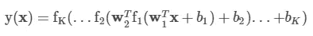
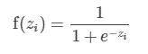
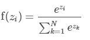
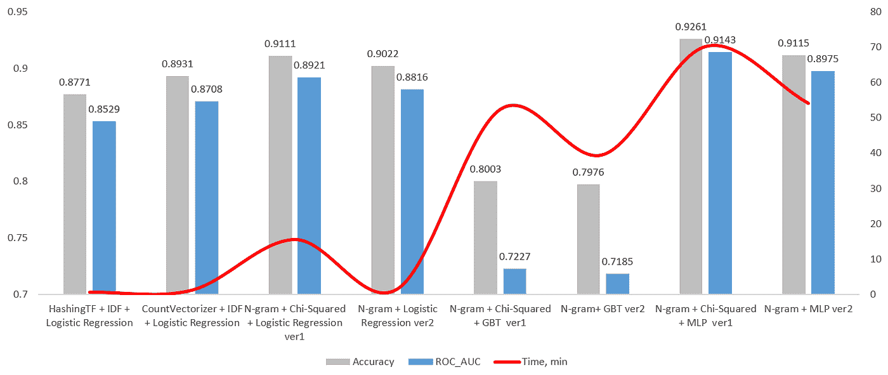

# 使用 Pyspark 的分布式情感分析学习

> 原文：<https://towardsdatascience.com/distributing-learning-for-sentiment-analysis-with-pyspark-1e90065c7137?source=collection_archive---------16----------------------->

## Pyspark 中不同方法在学习速度和准确性方面的权衡

*在本文中，我将展示 Pyspark 中不同方法在学习速度和识别积极和消极 twit 任务的准确性方面的权衡。*

照片由[🇨🇭·克劳迪奥·施瓦茨| @purzlbaum](https://unsplash.com/@purzlbaum?utm_source=medium&utm_medium=referral) 在 [Unsplash](https://unsplash.com?utm_source=medium&utm_medium=referral)

情绪分析在社交媒体监控中非常有用，因为它允许我们获得特定话题背后更广泛的公众意见的概览。这个任务已经用不同的框架和编程语言进行了大量的研究和实现。

在本文中，我将展示我们如何在 Pyspark 中对数据块使用不同的方法，我们可以获得哪些指标，最重要的是我们需要多少时间。众所周知，模型时间性能可能是现实生活中最重要的事情，因为新数据和案例增长非常快，我们几乎每天都需要重新训练我们的模型。第二件事是模型预测响应时间，如果模型具有 99.9%的准确性，这是非常好的，但如果在输入数据流期间模型响应时间太长，我们就会错过机器和深度学习给我们带来的所有好处。

在这项研究中，我使用了来自 [Kaggle](https://www.kaggle.com/) 的 [Twitter 和 Reddit 情感分析数据集](https://www.kaggle.com/cosmos98/twitter-and-reddit-sentimental-analysis-dataset)。

我的第一种做法是—***“HashingTF+IDF+Logistic 回归”*** *。*

让我们开始弄清楚它是什么以及它是如何工作的。[词频-逆文档频数(TF-IDF)](http://en.wikipedia.org/wiki/Tf%E2%80%93idf) 是一种广泛应用于文本挖掘的特征矢量化方法，用以反映语料库中某个词对某个文档的重要性。

术语频率和文档频率的定义有几种变体。在 MLlib 中，将 TF 和 IDF 分开，使它们具有灵活性。

**TF**:`HashingTF`和`CountVectorizer`都可以用来生成术语频率向量。

`HashingTF`是一个`Transformer`,它接受多组术语，并将这些集合转换成固定长度的特征向量。在文本处理中，“术语集”可能是一个单词包。`HashingTF`利用[哈希技巧](http://en.wikipedia.org/wiki/Feature_hashing)。通过应用散列函数将原始特征映射到索引(术语)中。这里使用的哈希函数是 [MurmurHash 3](https://en.wikipedia.org/wiki/MurmurHash) 。然后基于映射的索引计算术语频率。这种方法避免了计算全局术语-索引映射的需要，这对于大型语料库来说可能是昂贵的，但是它遭受潜在的哈希冲突，其中不同的原始特征在哈希之后可能变成相同的术语。为了减少冲突的机会，我们可以增加目标特征维数，即哈希表的桶的数量。由于使用散列值的简单模来确定向量索引，建议使用 2 的幂作为特征维数，否则，特征将不会均匀地映射到向量索引。默认特征尺寸为`218=262,144218=262,144`。可选的二进制切换参数控制术语频率计数。当设置为真时，所有非零频率计数被设置为 1。这对于模拟二进制而非整数计数的离散概率模型尤其有用。

**IDF** : `IDF`是一个`Estimator`，它适合数据集并产生一个`IDFModel`。`IDFModel`获取特征向量(通常由`HashingTF`创建)并缩放每个特征。直观上，它降低了语料库中频繁出现的特征的权重。

这是响应文本预处理的管道模式的第一部分。我的第一个模型是逻辑回归，它是机器学习中最简单和快速的模型之一，但如果有良好的数据预处理，它可以给出良好的结果。在[统计](https://en.wikipedia.org/wiki/Statistics)中，使用**逻辑模型**(或 **logit 模型**)对某类或某事件存在的概率进行建模，如正类或负类。逻辑回归使用最大似然技术实现最佳预测。Sigmoid 是一个数学函数，其特征是可以取-∞和+∞之间的任何实数值，并将其映射到 0 到 1 之间的实数值。因此，如果 sigmoid 函数的结果大于 0.5，那么我们将其归类为正类，如果小于 0.5，那么我们可以将其归类为负类。

结果我们得到了:

*   准确度分数:0.8771
*   ROC-AUC: 0.8529
*   训练时间 56.79 秒

第二种方法是— ***“计数向量器+ IDF +逻辑回归”*** *。*这种方法与前一种非常相似，但是对于文本预处理，我想使用 CountVectorizer 方法。那么，它是什么，它是如何工作的？

`CountVectorizer`和`CountVectorizerModel`旨在帮助将一组文本文档转换成令牌计数的向量。当没有先验词典时，可以使用`CountVectorizer`作为`Estimator`来提取词汇，并生成一个`CountVectorizerModel`。该模型为词汇表中的文档生成稀疏表示，然后可以将其传递给 LDA 等其他算法。

在拟合过程中，`CountVectorizer`将选择语料库中按词频排序的前`vocabSize`个单词。可选参数`minDF`也通过指定一个术语必须出现在词汇表中的最小文档数(如果是< 1.0，则为分数)来影响拟合过程。另一个可选的二进制切换参数控制输出向量。如果设置为真，所有非零计数都被设置为 1。这对于模拟二进制而非整数计数的离散概率模型尤其有用。

结果我们得到了:

*   准确度分数:0.8931
*   ROC-AUC: 0.8708
*   训练时间 1.27 分钟

如你所见，准确率更高，但我们需要按训练时间付费。

第三种方法是——***N-gram+Chi 平方 *+ Logistic 回归**** **。**

*在这个方法中，我使用 N-gram 作为文本预处理的技术，使用卡方作为特征选择的方法。*

*让我们从 N-gram 开始。n-gram 是某个整数 n 的 n 个标记(通常是单词)的序列。NGram 类可用于将输入要素转换为 n-gram。NGram 将一系列字符串作为输入(例如，分词器的输出)。参数 n 用于确定每个 n 元语法中的项数。输出将由一系列 n-gram 组成，其中每个 n-gram 由一个由 n 个连续单词组成的空格分隔的字符串表示。如果输入序列包含的字符串少于 n 个，则不会产生输出。Spark 不会自动组合来自不同 n-gram 的特征，所以我不得不在管道中使用 VectorAssembler 来组合我从每个 n-gram 获得的特征。*

*这种方法的下一步是特征选择。要素选择是自动选择数据中对您感兴趣的预测变量或输出贡献最大的那些要素的过程。在对数据建模之前执行要素选择的好处是:*

*   *避免过度拟合:较少的冗余数据会提高模型的性能，从而减少根据噪声做出决策的机会*
*   *减少训练时间:更少的数据意味着算法训练更快*

**卡方*检验用于数据集中的分类特征。我们计算每个特征和目标之间的卡方，并选择具有最佳卡方分数的期望数量的特征。它确定样本的两个分类变量之间的关联是否反映了它们在总体中的真实关联。
机器学习模型不变——逻辑回归。*

*结果我们得到了:*

*   *准确度分数:0.9111*
*   *ROC-AUC: 0.8921*
*   *训练时间 15.25 分钟*

*让我们做同样的，但没有特征选择。于是，我的第四种方法——***N-gram*+Logistic 回归**** **。这里我想利用* **N-gram** 产生的序列分析能力和快速的逻辑回归。**

**结果我们得到了:**

*   **准确度分数:0.9022**
*   **ROC-AUC: 0.8816**
*   **训练时间 1.54 分钟**

**正如我们所看到的，在训练时间不可思议地减少的同时，精确度降低了一点点。**

**好吧，逻辑回归是好的，但是如何使用更复杂的东西呢——梯度增强树。让我们保留相同的数据预处理—N-gram +卡方，并增加梯度增强分类器的功能。所以，我的下一个迭代将是—***N 元文法+卡方 *+* 梯度提升树分类器******。*****

**梯度推进树(GBTs)是一种使用决策树集成的流行分类和回归方法。GBTs 迭代地训练决策树以最小化损失函数。在梯度提升中，弱学习器的集合用于提高机器学习模型的性能。弱学习者通常是决策树。结合起来，它们的输出会产生更好的模型。在梯度推进中，弱学习者顺序工作。每个模型都试图改进前一个模型的误差。**

**结果我们得到了:**

*   **准确度分数:0.8003**
*   **ROC-AUC: 0.7227**
*   **训练时间 52.408 分钟**

**对我来说，它太长了，而且我们有很多风险让 GBT 生产的模型过度拟合。GBT 是一个非常好的模型，但在这种情况下，我们有太多的特征，对我来说卡方检验法可能不太好。**

**让我们检查相同的管道，但是没有卡方检验，只是为了检查如果我们排除特征选择，我们节省了多少时间。于是，就有了下一种方法——***N-gram+梯度提升树分类器******。*****

**结果我们得到了:**

*   **准确度分数:0.7976**
*   **ROC-AUC: 0.7185**
*   **训练时间 39.564 分钟**

**我们真的可以减少时间，但正如我之前所说，我们的算法确实需要更少的功能，所以我们可以看到我们在精度上损失了一点。**

**假设我们不知道或不想在我们的管道中使用任何其他特征选择技术，但仍然希望提高准确性。在这种情况下，我们可以使用深度学习的力量。**

**在接下来的步骤中，我还想保留相同的数据预处理管道，但使用深度学习(MLP)模型— **N-gram +卡方*+*MLP****。****

**多层感知器分类器(MLPC)是基于[前馈人工神经网络](https://en.wikipedia.org/wiki/Feedforward_neural_network)的分类器。MLPC 由多层节点组成。网络中的每一层都完全连接到下一层。输入层中的节点表示输入数据。所有其他节点通过输入与节点权重`w`和偏差`b`的线性组合以及应用激活函数，将输入映射到输出。这可以用矩阵形式写为 MLPC 与`K+1`层如下:**

****

**[多层感知器分类器](https://spark.apache.org/docs/latest/ml-classification-regression.html#multilayer-perceptron-classifier)**

**中间层中的节点使用 sigmoid(逻辑)函数:**

****

**[乙状结肠(逻辑)功能](https://spark.apache.org/docs/latest/ml-classification-regression.html#multilayer-perceptron-classifier)**

**输出层中的节点使用 softmax 函数:**

****

**[Softmax 功能](https://spark.apache.org/docs/latest/ml-classification-regression.html#multilayer-perceptron-classifier)**

**输出层中的节点数量`N`对应于类的数量。MLPC 采用反向传播来学习模型。我们使用逻辑损失函数优化和 L-BFGS 作为优化程序。**

**在我的例子中，我将对 64 和 32 个神经元使用 2 个隐藏层。**

**结果我们得到了:**

*   **准确度分数:0.9261**
*   **ROC-AUC: 0.9143**
*   **训练时间 70.2 分钟**

**与以前的方法相比，这是最好的结果，但是训练时间太长，而且只针对少量数据。**

**让我们检查相同的管道，但是没有卡方检验，只是为了检查如果我们排除特征选择，我们节省了多少时间。于是，就有了下一种方法——***N-gram+MLP******。*****

**结果我们得到了:**

*   **准确度分数:0.9115**
*   **ROC-AUC: 0.8975**
*   **训练时间 54.108 分钟**

**我们确实节省了时间，但如果我们将结果与之前的所有测试进行比较，我们会发现使用逻辑回归的方法会更好，这种方法可以产生几乎相同的准确性，但时间更短。**

**以下是所有结果的表格和图表:**

****

**作者的实验结果**

# **结论**

**结论很简单——建模越快，就越希望使用简单的模型和数据预处理管道。在本文中，我只使用了数据科学的全部方法和模型中的一小部分。**

**对于这个任务，你也可以使用架构比 MLP 更复杂的 TensorFlow 或者 PyTorch 框架。要使用 Databricks 的强大功能，您还可以使用分布式培训方法。 [Horovod](https://github.com/horovod/horovod) 是一个用于 TensorFlow、Keras 和 PyTorch 的分布式培训框架。Databricks 支持使用 HorovodRunner 和`horovod.spark`包的分布式深度学习训练。对于使用 Keras 或 PyTorch 的 Spark ML 流水线应用，可以使用`horovod.spark` [估算器 API](https://spark.apache.org/docs/latest/ml-pipeline.html#estimators) 。**

**此外，您可以使用微调语言模型进行情感分析任务，例如使用 BERT 和所有其他衍生工具。**

**你能在 Git 仓库中找到的所有代码— [链接](https://github.com/AndriiShchur/Distributing-learning-for-sentiment-analysis-with-Pyspark)。**

**你也可以在我的文章中阅读如何使用 Keras 进行情感分析——“深度学习方法的[假新闻检测器(第二部分)建模](https://medium.com/@andriishchur/fake-news-detector-with-deep-learning-approach-part-ii-modeling-42b9f901b12b)”。**