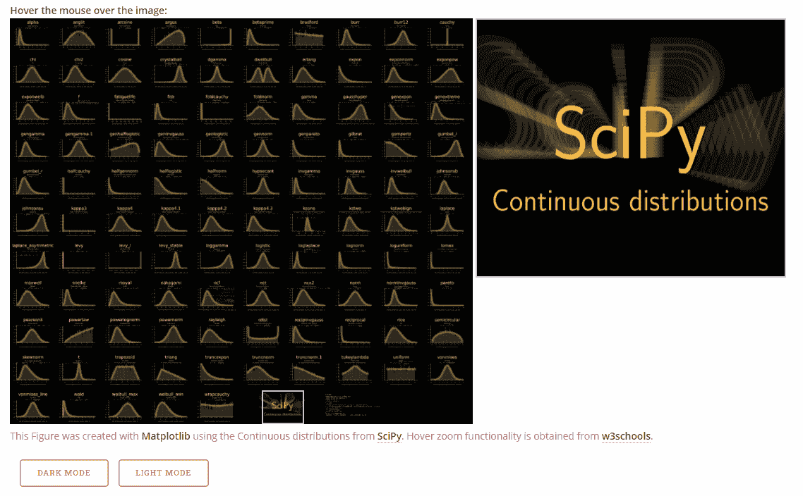
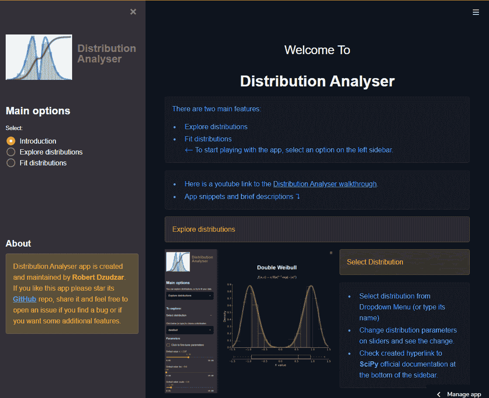
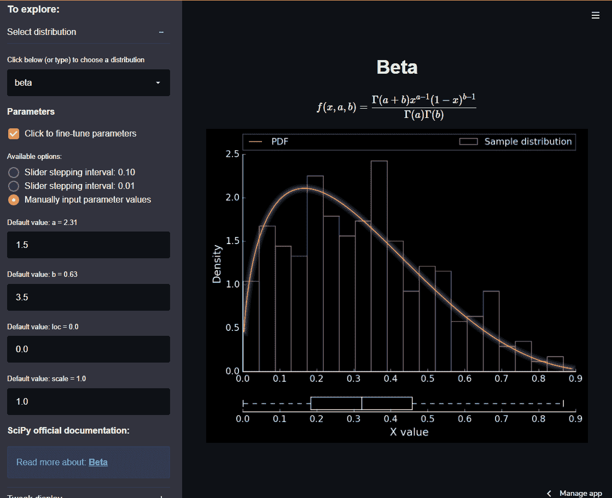

# 分布分析器

> 原文：<https://towardsdatascience.com/distribution-analyser-b826b88b7b8d?source=collection_archive---------26----------------------->

## [实践教程](https://towardsdatascience.com/tagged/hands-on-tutorials)

## 用 Streamlit 制作的 Web 应用程序

Distribution Analyser 是一个 web 应用程序，允许您以交互方式探索连续分布，并使分布符合您的数据。Distribution Analyser 是使用 [Streamlit](https://streamlit.io/) 构建的，Streamlit 是一个用于制作定制 web 应用的开源 Python 库。

分布分析器

# 分布分析器的出现

不久前，我在用“世界幸福”数据集做探索性的数据分析，思考我要如何呈现这些数据，我在各种可视化中寻找灵感。很快，我停在了配对剧情上，我只是盯着对角线上的支线剧情，看着各种各样的分布。过了一会儿，我发现自己在**[**scipy . stats**](https://docs.scipy.org/doc/scipy/reference/stats.html#module-scipy.stats)页面上对列出的发行版数量感到敬畏，因为它们中的大多数我都不认识。我首先想到的是——**他们长得怎么样？****

**当然，互联网提供了一些关于这些分布看起来如何的答案，但是我并不满意，所以我开始了创造我的可视化的任务。这个项目的结果是一个包含所有分布、它们的名称和方程的大图，除此之外，将鼠标悬停在图上可以看到一个放大的区域。我把这个图像放在我的网站上，并在社交媒体上分享——这吸引了人们的注意。你可以在[我的网站](https://rdzudzar.github.io/scipy_distributions.html)上找到这个高分辨率的可视化效果，并在下面看到一个. gif 示例。**

**虽然这个项目给了我最初问题的答案，但我想要更多的自由、交互性和有用性——这让我产生了创建一个 web 应用程序的想法。我一点一点地将我最初的想法转换成代码，出现了**[**分布分析器**](https://share.streamlit.io/rdzudzar/distributionanalyser/main/main.py)**。******

************

******[从 SciPy 可视化连续分布](https://rdzudzar.github.io/scipy_distributions.html)******

# ******分布分析器概述******

******在[“分布分析器”](https://share.streamlit.io/rdzudzar/distributionanalyser/main/main.py)1.0 版中，主要的应用选项有:******

*   ********探索发行版** — *交互探索 SciPy v1.6.1 的连续发行版函数。*如果用户想熟悉某个特定的发行版，这个特性非常有用。通过与分布参数的相互作用，可以很容易地看到分布是如何变化的。******
*   ******拟合分布** — *导入您的数据并拟合选定的连续分布。*如果用户希望快速了解如何以及哪些分布适合他们的数据，该功能非常有用，使他们能够缩小分布的选择范围，继续进行数据分析。****

# ****探索发行版****

****有 **100 个连续分布**可以玩。对于每个选定的分发，用户将获得:****

*   ****方程(概率密度函数)；****
*   ****分布图(带可调组件，见图 2。);****
*   ****分布参数—可通过滑块或手动输入进行调整。在选择时，每个参数的名字旁边都会写有它的默认值(如在 SciPy 中);****
*   ****到官方 SciPy 文档的超链接，有更多的细节。****

********

****图一。选择发行版的演练，探索发行版如何通过改变其参数(通过滑块和手动输入)来改变，并演示到官方 SciPy 文档的超链接。****

## ****调整显示****

******对于在图上显示什么有一点自由会大有帮助。**也许用户只希望看到一个直方图，也许用户希望看到尽可能多的信息，因此，用户可以选择他们希望在图中显示的内容:****

*   ****直方图；****
*   ****概率密度函数；****
*   ****CDF——累积密度函数；****
*   ****SF —生存函数；****
*   ****P(X <=x) — Probability of obtaining a value smaller than x for selected x;****
*   ****Empirical quantiles for a data array: Q1, Q2, Q3 respectively 0.25, 0.50, 0.75;****
*   ****Shaded: mean± *xσ (σ* 为标准差)。****
*   ****箱线图。****

****用户还可以选择在**亮或暗**主题中显示图形——这很重要，不仅因为他们可以根据自己的屏幕亮度调整图形，而且重新使用所需的图形会更方便。除了图形之外，用户还可以**显示关于所选分布及其参数的统计信息**——这些信息将出现在图形下方的表格中。通过此功能，用户可以很容易地看到统计信息是如何随着分布参数的变化而变化的(例如平均值)。****

********

****图二。调整地物组件(可以打开/关闭每个特性)的演练，演示地物模式:暗/亮并显示带有统计描述的表格。****

## ****出口代码****

****用户将收到预填充的 Python 代码及其选定的参数，以便他们可以重用它。拥有这样的选项可以节省用户的时间和精力来复制他们选择的发行版。我写了一篇关于此功能重要性的文章，您可以在此处阅读该文章:****

**** [## 我们如何在交互式探索性数据分析后节省时间？

### 一款 Web 应用程序，可以带回家的不仅仅是一个数字

towardsdatascience.com](/how-can-we-save-time-after-an-interactive-exploratory-data-analysis-c9edfdb8d3e5) 

图 3。使用选定的分发版及其参数导出 Python 代码的演练，这些代码可重复使用(在本例中，使用 Spyder 在 Python 中本地绘图)。**** 

# ****拟合分布****

## ******数据导入和检查******

****上传. csv 文件后，用户可以通过绘制直方图和叠加基本统计信息来检查他们的数据。然后，用户**选择分布**来适应他们的数据，或者选择任意数量的单个分布，或者选择“**所有分布**”选项来适应所有可用的分布(这需要 10-15 秒)。****

********

****图 4。演示数据上传、检查数据和选择我们希望适合数据的发行版的演练。这里选择了“ **All_distributions** ”选项，但也可以选择任意数量的发行版。****

## ******结果******

****用户将获得最佳拟合分布、其参数和误差估计，以及到官方 SciPy 文档的链接。拟合结果的形式为:****

*   ******交互式图形:**两个图形是使用 [Bokeh](https://docs.bokeh.org/en/latest/) 制作的，Bokeh 是一个用于创建交互式可视化的 Python 库。在一张图中，pdf 被覆盖，而在另一张图中，CDF 被覆盖。拥有一个互动图形的重要性如下所示——有时拟合可能会脱离图表，使图表无法检查。使用散景互动，用户可以放大图形的特定部分，并通过**互动图例选择在图形上显示哪个分布(15 个最佳分布中的一个)。******
*   ******表**:所有分布及其参数的列表，按误差估计排序(从最佳到最差)。****
*   ******Python 代码**具有最佳拟合分布及其参数。****

********

****图 5。检查拟合结果的演练:1)两个交互图形:一个用于检查 pdf，一个用于检查 CDFs2)具有所有分布、它们的拟合参数和误差估计的表格；3)包含可重复使用的最佳分布的 python 代码(在这种情况下，使用 Spyder 在 Python 中本地绘图)。****

# ****最后****

****Distribution Analyser 是一个 web 应用程序，它允许您以交互方式探索连续分布，使分布符合您的数据，并获得比数字更多的信息。****

******我向所有人推荐这款应用**，无论他们是发行版新手还是专家，无论他们是学生还是教师，因为:****

*   ****通过与分布参数的交互，用户可以非常快速和容易地熟悉特定的分布。****
*   ****用户可以快速查看哪些分布适合他们的数据，从而缩小他们需要用于分析的分布的数量。****

****[**分布分析器**](https://share.streamlit.io/rdzudzar/distributionanalyser/main/main.py) 是通过 Streamlit 共享部署的，你可以在这里访问[。我的](https://share.streamlit.io/rdzudzar/distributionanalyser/main/main.py)**[**GitHub**](https://github.com/rdzudzar/DistributionAnalyser)上有完整的源代码。新的应用功能正在准备中，敬请关注。******

******本文所有图均为作者所作。*****