# 深度学习模型的基于分布的损失函数

> 原文：<https://towardsdatascience.com/distribution-based-loss-functions-for-deep-learning-models-71fa4b042465?source=collection_archive---------13----------------------->

## [实践教程](https://towardsdatascience.com/tagged/hands-on-tutorials)

## 交叉熵及其度量分类损失的变体综述——以高度不平衡数据集为例

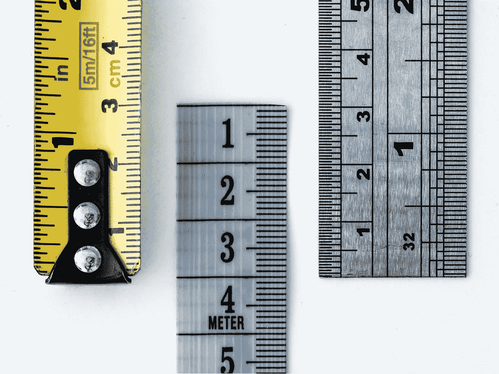

由[威廉·沃比](https://unsplash.com/@wwarby?utm_source=unsplash&utm_medium=referral&utm_content=creditCopyText)在 [Unsplash](https://unsplash.com/s/photos/measure?utm_source=unsplash&utm_medium=referral&utm_content=creditCopyText) 上拍摄的照片

# 赋予数据意义

信息由数据组成。在训练步骤期间，人工神经网络学习将一组输入映射(预测)到来自标记数据集的一组输出。计算最佳权重是一个优化问题，通常通过 [**随机梯度下降**](https://en.wikipedia.org/wiki/Stochastic_gradient_descent) 来解决:使用预测误差的反向传播来更新权重。梯度下降算法更新沿着误差的梯度(或斜率)向下导航的权重，从而可以减少下一次预测的误差。从本质上讲，这就是神经网络的工作方式。

# 什么是损失函数？

在寻找最佳权重时，学习算法需要一个特殊的对象来评估一组候选权重的适用性:这是**目标函数**。


照片由 [Afif Kusuma](https://unsplash.com/@javaistan?utm_source=unsplash&utm_medium=referral&utm_content=creditCopyText) 在 [Unsplash](https://unsplash.com/s/photos/target?utm_source=unsplash&utm_medium=referral&utm_content=creditCopyText) 上拍摄

根据上下文，目标函数可以最大化或最小化。在处理深度学习模型时，专家更喜欢根据误差进行推理，因此他们的目标是最小化目标函数。因此，目标函数称为**损失函数**，其值(即误差)简称为 ***损失*** 。损失函数对于确保模型响应的适当数学表示至关重要，必须仔细考虑其选择，因为它必须*适合模型域及其分类目标*。

损失函数的定义和应用始于标准的机器学习方法。当时，这些函数是基于标签的**分布，正是由于这个原因，下面的函数被称为基于**分布的损失函数**。**

我们的讨论正是从这里开始的，特别是从**交叉熵**的概念开始。

注意:所有用于情节和案例研究的代码都可以在我的个人 github 上获得:[https://github . com/Andrea-ci/misc-stuff/tree/master/nn-metrics](https://github.com/andrea-ci/misc-stuff/tree/master/nn-metrics)。

# 引入交叉熵


照片由 [Greyson Joralemon](https://unsplash.com/@greysonjoralemon?utm_source=unsplash&utm_medium=referral&utm_content=creditCopyText) 在 [Unsplash](https://unsplash.com/s/photos/balls?utm_source=unsplash&utm_medium=referral&utm_content=creditCopyText) 上拍摄

根据信息论，给定一个离散随机变量 *x* ，其**熵** *H(x)* (也被称为**香农熵**，由其创造者[克劳德·香农](https://en.wikipedia.org/wiki/Claude_Shannon)定义为概率的倒数的对数的期望值:

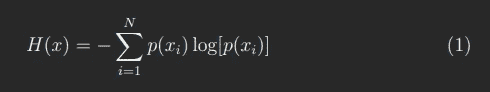

熵—作者提供的图像

直观地说，**熵**衡量与随机过程的可能结果相关的不确定性:对观察者来说，它们越“令人惊讶”，熵就越高。

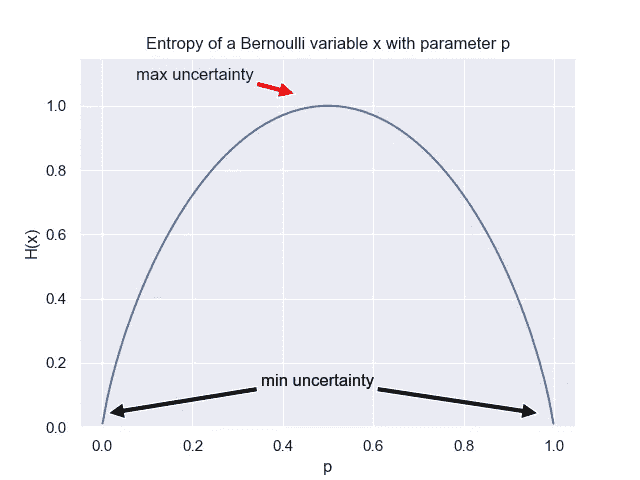

作者的伯努利变量图像的熵

请注意，对数以 2 为底，因为在信息论的背景下，我们感兴趣的是对随机过程携带的信息进行编码所需的比特数。

现在假设我们有两个概率分布， *p* 和 *q* ，定义在同一个随机变量 *x* 上。如果编码方案是针对 *q* 而不是 *p* 优化的(这将是真实的分布)，我们想要测量**从 *x* 的样本空间中识别一个事件所需的平均比特数**。

在可能的结果只有两个的情况下，如在前面的伯努利变量的例子中，我们对**二元交叉熵损失函数有如下定义:**

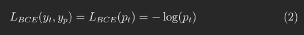

二元交叉熵—作者图片

具有二元场景允许简化方程，使得我们只有一个自变量， *pt，*，其代表由模型分配给*真实类别*(即样本实际所属的类别)的概率值。

二元交叉熵被广泛用作损失函数，因为它对许多分类任务都很有效。事实上，它是基于分布的损失函数的基本**基线。**

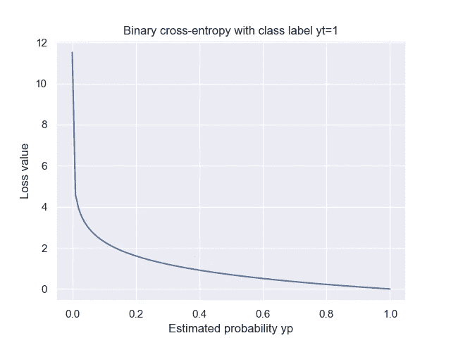

作者图片

图中， *yt* 是二元分类任务中样本的类别标签， *yp* 是模型赋予该类别的概率。该函数严重惩罚预测错误，其中以高置信度做出错误决策(即 *yp* 接近 *0* )，而当预测接近 *1* 的真值时(即做出正确分类)，该函数变为零。

注意:为了简单起见，我们将保留与二元分类任务相关的讨论和示例。然而，到目前为止以及在下文中所做的考虑是有效的，并且自然也适用于多标签分类的情况。

# 交叉熵的演化

在实践中，我们必须经常处理**非常不平衡的**数据集:例如，如果我们想要训练一个模型来识别海洋中的船只，那么正像素的数量，即那些属于“船”类的像素，相对于所有像素来说将是非常小的百分比。


有时阳性样本就像四叶草一样罕见——达斯汀·休姆斯[在](https://unsplash.com/@dustinhumes_photography?utm_source=unsplash&utm_medium=referral&utm_content=creditCopyText) [Unsplash](https://unsplash.com/s/photos/four-leaf-clover?utm_source=unsplash&utm_medium=referral&utm_content=creditCopyText) 拍摄

因此，基于它们在数据集中的丰度，或者换句话说，根据它们的*先验*分类概率，具有能够以不同方式处理不同类别标签的损失函数将是有用的。

为此开发了两种二进制交叉熵:加权二进制交叉熵和平衡交叉熵。

**加权二进制交叉熵** ( **WBCE** )使用一个系数对阳性样本进行加权，当数据表现出明显的偏斜时，它通常是首选:

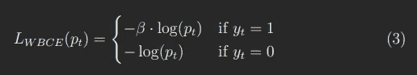

加权二进制交叉熵—作者图片

**平衡二进制交叉熵**(**)**类似于加权交叉熵，但是在这种情况下，负样本也受到如下权重系数的影响:****

****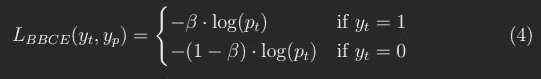****

****平衡二进制交叉熵—作者图片****

****最后，**焦点损失(FL)** 也可以看作是二元交叉熵的变化。此函数适用于高度不平衡的数据集，因为它对正确分类的样本的贡献进行加权，并允许更好地学习硬样本(即未检测到的阳性样本):****

****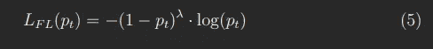****

****焦点丢失—作者提供的图像****

****这里 *λ* 是一个超 *-* 参数，我们可以用它来校准错误分类样本的重要性。直观地说， *λ* 通过扩展简单样本接收低值损失的范围来减少简单样本的损失。****

****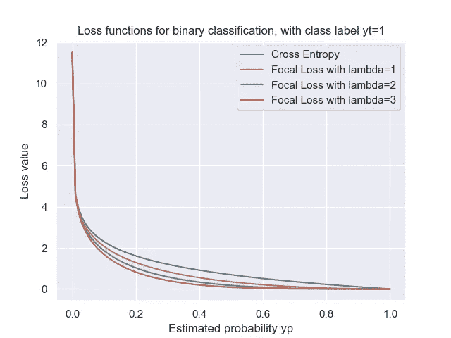****

****作者图片****

****注意，当 *λ=0* 时，我们得到标准交叉熵损失。****

****此外，聚焦损失还可以采用另一个参数，通常称为 *α* 参数，其允许进一步平衡误差项:****

****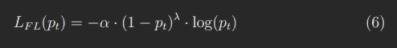****

****焦点丢失的 Alpha 版本—图片由作者提供****

# ****案例研究:信用卡欺诈的检测****

********

****马库斯·温克勒在 [Unsplash](https://unsplash.com/s/photos/credit-cards?utm_source=unsplash&utm_medium=referral&utm_content=creditCopyText) 拍摄的照片****

****让我们举一个例子，其中选择**聚焦损失**允许我们解决一个在极度不平衡的数据集上的二进制分类问题。****

****为此，我们考虑托管在 Kaggle 上的[信用卡欺诈检测](https://www.kaggle.com/mlg-ulb/creditcardfraud)数据集。正如他们的网页上所说:****

> ****“该数据集包含欧洲持卡人在 2013 年 9 月的信用卡交易。
> 该数据集显示了两天内发生的交易，其中 284，807 笔交易中有 492 笔欺诈。数据集高度不平衡，正类(欺诈)占所有交易的 0.172%。”****

****不言而喻，这里的目标是检测所有交易中欺诈操作的(非常)小的子集。在下文中，我们给出了以下步骤的简要概述。****

****首先，我们加载数据集并执行一些清理，以便为模型训练准备数据。****

```
**#
# DATA LOADING/CLEANSING
## Load data from CSV file.
df_raw = pd.read_csv(‘creditcardfraud/creditcard.csv’)
n_samples = len(df_raw)
print(f’Num. of samples: {n_samples}.’)# Check size of samples.
df_pos = df_raw[df_raw[‘Class’] == 1]
n_pos_samples = len(df_pos)
pos_ratio = 100 * n_pos_samples / n_samples
print(f’Num. of positive samples: {n_pos_samples} ({pos_ratio:.2f}% of total).’)# Drop useless data and convert amount to log space.
df_cleaned = df_raw.copy()
df_cleaned.pop(‘Time’)
df_cleaned[‘log-amount’] = np.log(df_cleaned.pop(‘Amount’) + 0.001)# Double train/test split for testing and validation data.
df_train, df_test = train_test_split(df_cleaned, test_size = 0.2, shuffle = True)
df_train, df_valid = train_test_split(df_train, test_size = 0.2, shuffle = True)print(f’Size of training data: {len(df_train)}.’)
print(f’Size of validation data: {len(df_valid)}.’)
print(f’Size of test data: {len(df_test)}.’)# Extract labels and features from data.
labels_train = np.array(df_train.pop(‘Class’))
labels_valid = np.array(df_valid.pop(‘Class’))
labels_test = np.array(df_test.pop(‘Class’))
features_train = np.array(df_train)
features_valid = np.array(df_valid)
features_test = np.array(df_test)# Normalize data.
scaler = StandardScaler()
features_train = scaler.fit_transform(features_train)
features_valid = scaler.transform(features_valid)
features_test = scaler.transform(features_test)# Enforce lower/upper bounds.
features_train = np.clip(features_train, -5, 5)
features_valid = np.clip(features_valid, -5, 5)
features_test = np.clip(features_test, -5, 5)
n_features = features_train.shape[-1]**
```

****我们可以看到数据集实际上是极不平衡的，阳性样本只占预期总数的 *0.17%* 。****

****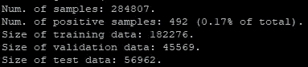****

****样本大小—图片由作者提供****

****使用 **Keras** ，我们建立了一个简单的模型，并使用二进制交叉熵作为损失函数来训练它。这是我们的**基线模型**。然后我们采用**焦损**函数来代替，并比较所获得的性能。****

****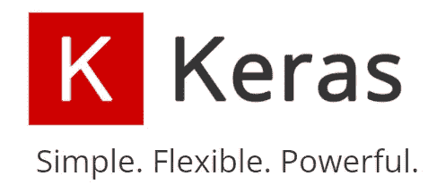****

****Keras logo —来源: [keras.io 主页](https://keras.io/)****

****作为评估指标，我们认为*真阳性*、*假阴性*和*回忆*指标、是因为我们对衡量模型预测欺诈的能力感兴趣。****

****事实上，在这种情况下，使用准确性并不是一个正确的选择:一个总是预测*假*(即没有欺诈)的“模型”将在这个数据集上获得超过 99.8%的准确性。这就是为什么很难在如此不平衡的数据上训练一个模型。****

```
**#
# MODEL TRAINING
## Model parameters.
opt = Adam(learning_rate = 1e-3)metrics = [
    TruePositives(name = 'tp'),
    FalseNegatives(name = 'fn'),
    Recall(name = 'recall')
]losses = [
    BinaryCrossentropy(),
    SigmoidFocalCrossEntropy(gamma = 2, alpha = 4)
]loss_names = [
    'binary cross-entropy',
    'focal loss'
]logs_loss = []
logs_recall = []for loss in losses: # Setup/compile the model.
    model = Sequential()
    model.add(Dense(16, input_dim = n_features, activation = 'relu',
        kernel_initializer = 'he_uniform'))
    model.add(Dropout(0.5))
    model.add(Dense(1, activation = 'sigmoid'))
    model.compile(optimizer = opt, loss = loss, metrics = metrics) # Fit the model.
    logs = model.fit(features_train, labels_train, validation_data = (features_valid,
        labels_valid), epochs = EPOCHS, verbose = 0) logs_loss.append(logs.history['loss'])
    logs_recall.append(logs.history['recall']) # Evaluate the model.
    eval_train = model.evaluate(features_train, labels_train, verbose = 0)
    eval_test = model.evaluate(features_valid, labels_valid, verbose = 0)table = PrettyTable()
    table.field_names = ['Data', 'Loss', 'TruePositives', 'FalseNegatives', 'Recall'] for stage, eval_info in zip(('training', 'test'), (eval_train, eval_test)):
        row = [stage]
        for ii, lbl in enumerate(model.metrics_names):
            row.append(f'{eval_info[ii]:.3f}')
        table.add_row(row) print('\n')
    print(table)**
```

****在训练和验证了这两种配置之后，我们可以比较所获得的结果。从基线模型中，我们得到:****

****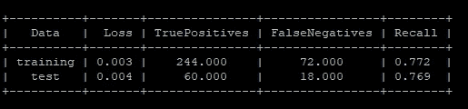****

****二值交叉熵分类—按作者分类的图像****

****相反，使用焦点损失时，分类性能会显著提高，并且所有欺诈案例都会被正确检测到:****

****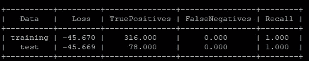****

****焦点损失分类—按作者分类的图像****

****让我们也比较两个损失函数的行为。****

****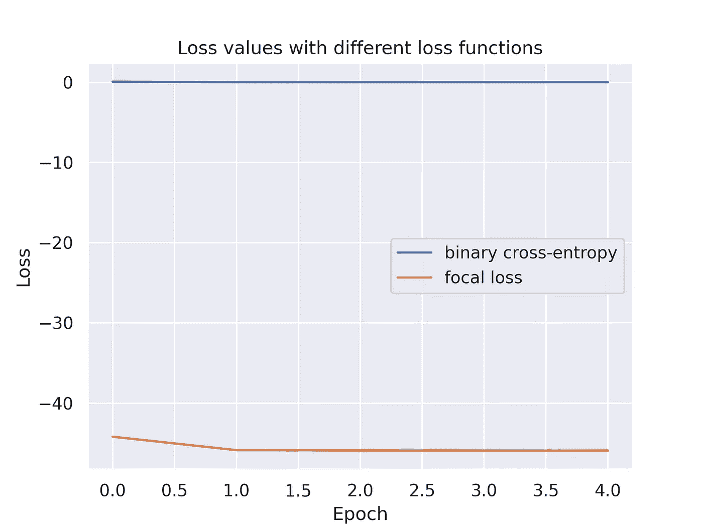****

****损失之间的比较—按作者分类的图像****

****正如所料，焦点损失值低于交叉熵值。焦点损失会降低被错误分类的阳性样本(欺诈)的权重，从而“鼓励”模型提高对欺诈案例的敏感度。****

# ****参考资料:****

****[1]宗-林逸、普里亚·戈亚尔等人，[密集物体探测的焦损失](https://arxiv.org/abs/1708.02002)****

****[2] Hichame Yessou 等，[多标签遥感影像分类的深度学习损失函数比较研究](https://arxiv.org/abs/2009.13935)****

****[3] [针对不平衡数据集的具有焦点损失的多类分类](https://www.dlology.com/blog/multi-class-classification-with-focal-loss-for-imbalanced-datasets)****

****[4] [不平衡数据的分类](https://www.tensorflow.org/tutorials/structured_data/imbalanced_data)****

****[5] [关于信用卡欺诈检测的 Kaggle 数据集](https://www.kaggle.com/mlg-ulb/creditcardfraud)****