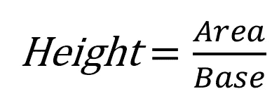

# 使用 Python 的分布可视化 101

> 原文：<https://towardsdatascience.com/distribution-visualization-101-with-python-a12d481afec7?source=collection_archive---------14----------------------->

## 选择你的武器:直方图，密度图，或方块图

数据就像音乐，以错误的方式呈现会变得很糟糕(图片来自 [Unsplash](https://unsplash.com/photos/HppavctO8Us)

处理数据时，快速理解数据的最佳方式是通过可视化。与其以表格的形式分析它们，不如将它们可视化，以便快速直观地理解。通过可视化数据，您甚至可能会发现令人惊讶的结果。

> “我们大多数人需要听音乐才能理解它有多美。但这通常是我们展示统计数据的方式:我们只展示音符，不演奏音乐。”— [汉斯·罗斯林](https://www.ted.com/talks/hans_rosling_shows_the_best_stats_you_ve_ever_seen)

我们可以从我们的数据中获得许多有趣的见解，这可以通过了解数据的**分布来获得。可视化数值数据的分布可以给我们一些见解，比如数据的偏斜度、模式(最高峰)、分布形状等等。**

使用密度图的分布可视化示例(图片由作者生成)

有时，我们也有兴趣看到多个数值观测值的分布。例如，我们可能对比较 5 个不同亚洲国家的人的身高感兴趣。为了从统计学上确认组间的差异，我们可以利用 t 检验(2 组)或 ANOVA(2 组以上)。但是，一个直观的方式来看到不同群体之间的差异是可视化。

直观显示差异的一个简单方法是将同一观测值的不同组的分布图叠加起来。下面是一些最流行的方法，我们可以用 Python 可视化不同组的分布差异。

# 柱状图

直方图是分布可视化的经典。直方图将数据频率可视化。直方图中的条形越高，它在观察数据中出现的频率越高。让我们比较一下三种不同鸢尾的分布。

用于分布比较的直方图示例(图片由作者生成)

为了检查物种之间的差异，我们可以使用 ANOVA 并检查产生的 p 值。然而，单独用方差分析解释结果可能是不够的，特别是当我们向对统计学理解有限的人展示结果时。**使用直方图可以帮助我们克服知识障碍，因为直方图非常直观**。在没有任何统计分析的情况下，很明显，与上图中的杂色鸢尾和海滨鸢尾相比，刚毛鸢尾的花瓣长度更小。

我最喜欢添加到直方图或任何其他分布图的附加指标之一是平均线。平均线可以从数据的平均值或中值构建，尽管我个人更喜欢使用中值，因为它更能抵抗异常值。添加一条平均线可以快速确定总体的期望值。

# 密度图

类似于直方图，从下图中我们可以清楚地看到，即使不做任何统计分析，刚毛鸢尾的花瓣长度也与杂色鸢尾和海滨鸢尾不同。但是密度图中的平滑曲线是怎么来的呢？

用于分布比较的密度图示例(图片由作者生成)

类似于直方图，密度图测量数据频率，但用平滑的连续线代替矩形条。类似于直方图，x 轴是来自观察数据的数值。密度图的 y 轴非常特殊，因为它不是频率的绝对计数，而是产生密度曲线的给定数据的[概率密度函数(PDF)](https://en.wikipedia.org/wiki/Probability_density_function) 的估计值。将绝对频率计数变成平滑曲线的一种常见方法是使用[核密度估计(KDE)](https://en.wikipedia.org/wiki/Kernel_density_estimation) 。

解读 y 轴可能会有点混乱。例如，鸢尾花瓣长度的峰值怎么会在 2.4 左右？这个数字从何而来？在密度图中，积分时曲线下的总面积为 1。但是曲线的一小部分呢？假设我们想从手工计算中得到 2.4。我们可以通过一个简单的公式来实现:

由作者生成的图像

面积是曲线函数的积分。因为我们的曲线看起来像一个翻转的 **U，**的近似函数是:

曲线的功能在 [Desmos](https://www.desmos.com/calculator?lang=en) 中可视化

我们选择峰值周围的基值。在这种情况下，我们选择 1.4 到 1.5。那么，这个函数的积分是:

https://www.integral-calculator.com/[的积分计算器](https://www.integral-calculator.com/)。24%的观察数据落在这条曲线下。

根据我们非常粗略的计算，我们将 0.24 除以 0.1(碱基之间的差异)，得到 2.4，这是我们密度图的峰值。如果所有的数学太复杂，只要记住密度函数最终测量频率。**峰值越高，频率越高。**

# 箱形图

直方图和密度都很难将许多组(超过 3 组)的差异可视化。看看这个密度图。

美国 5 个种族每周工作时间分布图(图片由作者生成)

上面的图表解释了美国人每周花在工作上的时间。从图中我们可以得出一个结论，不管什么种族，大多数美国人每周工作大约 40 个小时。然而，数据的堆叠使得密度图不便于查看和分析。一种替代方法是将数据**或**分成子集，以使用**箱线图**代替。看看下面的例子。

美国 5 个种族的每周工作时间箱线图(图片由作者生成)

如果我们看看箱线图结果，虽然我们的发现仍然正确，即所有种族的平均工作时间为 40 小时/周，但通过离群值可视化，结果解释变得更有趣。

当我们对异常值感兴趣时，箱线图特别有用。盒状图须外部的黑色圆圈表示组中的异常值。一圈相当于一次观察。盒图中的盒子包含 50%的数据。盒子外面是胡须，胡须外面是离群值。我们可以看到，实际上有许多美国人没有遵守每周平均工作 40 小时的规定。有些人每周工作不到 10 小时，有些人每周工作超过 60 小时。

# 结论

现在你已经理解了我们可视化分布的几种方法，你可以根据你的需要使用上面的任何一种方法。为了快速直观地了解组间比较，请尝试使用直方图或密度图。但是，如果您对可视化异常值感兴趣，或者如果有太多组，箱线图可能是更好的选择。

那都是乡亲们！这个帖子使用的代码和数据可以在这里找到【https://github.com/ZainulArifin1/distribution_viz 。让我知道你是否有其他有趣和有意义的方法来可视化分布。

图片来自 [Pixabay](https://pixabay.com/illustrations/orchestra-orchestra-pit-conductor-1825653/)