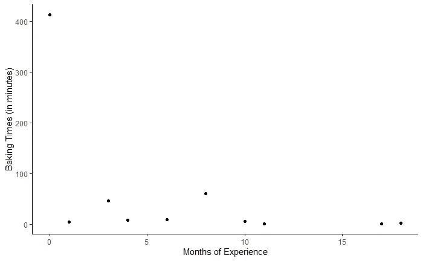
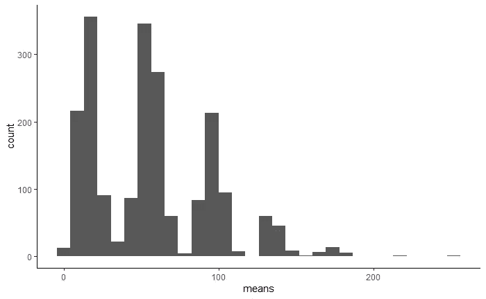
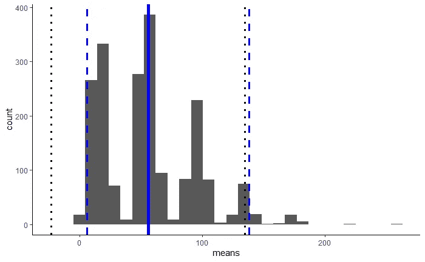
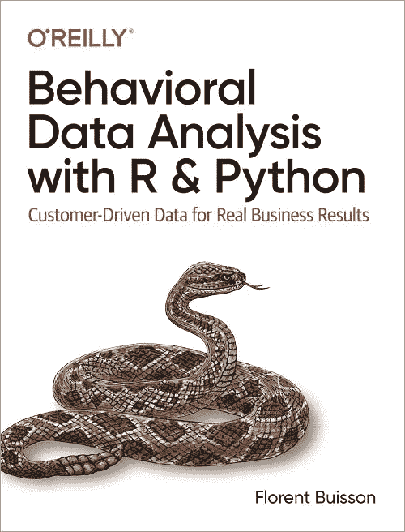

# 丢弃 p 值。请改用 Bootstrap 置信区间

> 原文：<https://towardsdatascience.com/ditch-p-values-use-bootstrap-confidence-intervals-instead-bba56322b522?source=collection_archive---------2----------------------->

## [行业笔记](https://towardsdatascience.com/tagged/notes-from-industry)

## p 值并不意味着人们认为他们意味着什么；他们依赖于不太可能实现的隐藏假设；他们偏离了真正的问题。下面是如何在 R 和 Python 中使用引导程序

几年前，我受雇于美国最大的保险公司之一，开始并领导他们的行为科学团队。我拥有世界十大经济系之一的行为经济学博士学位和五年的战略顾问经验，因此我相信我的团队能够通过精心设计的实验和数据分析来推动商业决策。


由[马库斯·斯皮斯克](https://unsplash.com/@markusspiske?utm_source=medium&utm_medium=referral)在 [Unsplash](https://unsplash.com?utm_source=medium&utm_medium=referral) 上拍摄的照片。什么叫我的样本“太小”？

事实上，我与对统计学有着敏锐理解的高技能数据科学家一起工作。但是在设计和分析实验多年后，我对我们向决策者传达结果的方式越来越不满意。我觉得对 p 值的过度依赖导致了次优决策。在与其他公司的同事交谈后，我意识到这是一个更广泛的问题，我着手编写[更好的数据分析指南](https://amzn.to/2XIK4u4)。在本文中，我将介绍本书最重要的建议之一，即放弃 p 值，使用 Bootstrap 置信区间。

# 沟渠 p 值

您应该放弃 p 值的原因有很多，我将在这里分析其中的三个主要原因:

1.  他们的意思并不像人们认为的那样
2.  他们依赖于不太可能实现的隐性假设
3.  他们偏离了真正的问题


照片由[凯尔·格伦](https://unsplash.com/@kylejglenn?utm_source=medium&utm_medium=referral)在 [Unsplash](https://unsplash.com?utm_source=medium&utm_medium=referral) 上拍摄

# 1.他们的意思并不像人们认为的那样

当您运行应用数据分析时，无论是在私营部门、非营利部门还是公共部门，您的目标都是为决策提供信息。我们需要解决的很大一部分问题是不确定性:数据告诉我们数字是 10，但它可能是 5 吗？也许 100？我们能依靠数据分析得出的数字吗？经过多年，有时是几十年，在这个问题上教育商业伙伴，他们通常理解不确定性的风险。不幸的是，他们经常从那里跳到假设 p 值代表一个结果是偶然的概率:p 值为 0.03 意味着有 3%的可能性我们认为是正的数字实际上是空的或负的。事实并非如此。实际上，它代表了假设真实值确实为零，我们看到*的结果的概率。*

在科学术语中，真实值为零或负值被称为*零假设*(缩写为 H0)，真实值严格大于零被称为*备择假设*(缩写为 H1)。人们错误地认为 P 值是给定数据 P(H0 |数据)的 H0 的概率，而实际上它是给定数据 H0 的概率，P(数据|H0)。你可能会想:马铃薯 po-tah-to，这是令人毛骨悚然的，非常小的 p 值确实是一个好迹象，表明一个结果不是由于偶然。在许多情况下，你会大致正确，但在某些情况下，你会完全错误。

让我们举一个简单但有启发性的例子:我们想确定罗伯特的公民身份。无效假设:罗伯特·H0 是美国公民。另一种假设:H1，他不是。我们的数据:我们知道罗伯特是美国参议员。3.3 亿美国公民中有 100 名参议员，因此在零假设下，我们的数据(即 p 值)的概率为 100 / 300，000，000 ≈ 0.000000303。根据统计显著性规则，我们可以有把握地得出结论，我们的零假设被驳回，罗伯特不是美国公民。这显然是错误的，那么问题出在哪里呢？如果罗伯特是美国公民，他成为美国参议员的概率确实很低，但如果他不是，概率就更低了(即零！).p 值在这里帮不了我们，即使有更严格的 0.01 甚至 0.001 阈值(关于这个问题的另一个说明，参见 [xkcd](https://xkcd.com/1132/) )。

# 2.他们依赖隐藏的假设

p 值是在所有计算都必须手工完成的时代发明的，因此它们依赖于简化的统计假设。概括地说，他们假设你所观察到的现象服从某种规则的统计分布，通常是正态分布(或者来自同一个家族的分布)。不幸的是，这很少是真的:

*   除非你在测量一些低水平的心理生理变量，否则你感兴趣的人群通常是由异质群体组成的。假设你是不可能汉堡的营销经理，正在调查肉类替代品的需求。你必须考虑两个群体:一方面，素食者，对他们来说，相关的选择是不同的素食产品；另一方面，肉食者可能会被诱惑，但比起肉本身，他们更关心味道和价格。
*   正态分布是对称的，并向两个方向延伸至无穷大。现实生活中，有不对称，有门槛，有极限。人们从来不买负数，也不买无穷大。他们在 18 岁之前根本不投票，120 岁的市场比 90 岁和 60 岁的市场要窄得多。
*   相反，我们看到“厚尾”分布，其中极值比正态分布的预期更频繁。从百万富翁和亿万富翁的数量来看，亿万富翁的数量比你想象的要多。

这意味着来自标准模型的 p 值通常是错误的。即使你正确地把它们当作 P(数据|H0)而不是 P(H0 |数据),它们也经常会相差很大。

# 3.他们偏离了真正的问题

比方说，你已经记住了前两个问题，并建立了一个完整的贝叶斯模型，最终允许你正确地计算 P(H0 |数据)，即在给定观察数据的情况下，真实值为零或负的概率。你应该把它带给你的决策者吗？我认为你不应该这么做，因为它不能反映经济结果。

假设业务决策者正在考虑两种可能的行动，A 和 b。根据观察到的数据，零收益或负收益的概率为:

*   行动 A 为 0.08
*   行动 B 为 0.001

决策者应该根据这些数字选择行动 B 吗？如果我告诉你相应的 90%置信区间是:

*   [-50 万美元；9950 万美元]用于行动 A
*   [10 万美元；20 万美元]用于行动 B

行动 B 可能导致零或负结果的概率较低，但它对企业的预期价值要低得多，除非企业极其厌恶风险。在大多数情况下，决策者的“经济重要性”取决于两个问题:

*   我们可能赚多少钱？(又名，期望值)
*   在“最糟糕的情况下”，我们会损失多少钱？(又名，置信区间的下限)

置信区间是一个比单一概率值更好的工具来回答这些问题。

# 请改用引导程序

让我们举一个具体的例子，改编并简化自我的书。一家公司进行了一项时间研究，根据面包师的经验水平，他们准备定制蛋糕需要多长时间。让一个工业工程师在全国各个商店测量做一个蛋糕需要多长时间，既费钱又费时，所以数据集只有 10 个点，如下图所示。



除了样本规模非常小之外，左上角还有一个异常值:一名新员工花了一天的大部分时间在一个复杂的蛋糕上，为一次公司务虚会做准备。应该如何向业务伙伴报告数据？人们可以抛弃极端的观察。但是，这种观察虽然不同寻常，但本质上并不反常。没有测量误差，这种情况可能会时有发生。另一种选择是只报告总平均持续时间，56 分钟，但这也会产生误导，因为它不会传达数据中的可变性和不确定性。

或者，可以根据传统的统计假设计算正常置信区间(CI)。正态置信区间与 p 值密切相关:当且仅当相应的置信区间不包含零时，估计才具有统计显著性。正如您将在任何统计类中学到的，正常 95% CI 的下限等于平均值减去 1.96 倍标准误差，上限等于平均值加上 1.96 倍标准误差。不幸的是，在目前的情况下，置信区间是[-23；135]而且我们可以想象，商业伙伴不会太喜欢负烘烤持续时间的可能性…

这个问题来自于烘焙时间是正态分布的假设，而事实显然不是这样。人们可以尝试拟合更好的分布，但使用 Bootstrap 置信区间要简单得多。

# 1.引导程序通过替换绘图来工作

为了建立 Bootstrap 置信区间，你只需要通过从原始样本中抽取替换样本来建立“大量相似样本”。在 R 和 Python 中，替换绘图都非常简单，我们只需在每种情况下将“replace”设置为 true:

```
## R
boot_dat <- slice_sample(dat, n=nrow(dat), replace = TRUE)## Python
boot_df = data_df.sample(len(data_df), replace = True)
```

*为什么我们要用替换来绘图？为了真正掌握 Bootstrap 发生了什么，值得后退一步并记住统计学的要点:我们有一个无法完全检验的群体，所以我们试图根据有限的样本对这个群体做出推断。为此，我们通过统计假设或 Bootstrap 创建了一个“假想”人口。根据统计假设，我们说，“假设这个样本是从一个正态分布的总体中抽取的”，然后在此基础上做出推论。对于 Bootstrap，我们说，“假设总体与样本具有完全相同的概率分布，”或者等价地，“假设样本是从由该样本的大量(或无限)副本组成的总体中抽取的。”那么从该样本中抽取替换就等同于从该假想总体中抽取不替换。统计学家会说，“自助样本对于样本就像样本对于总体一样。”*

我们重复这个过程很多次(比如说 2000 次):

```
## R
mean_lst <- list()
B <- 2000
N <- nrow(dat)
for(i in 1:B){
 boot_dat <- slice_sample(dat, n=N, replace = TRUE)
 M <- mean(boot_dat$times)
 mean_lst[[i]] <- M}
mean_summ <- tibble(means = unlist(mean_lst))## Python
res_boot_sim = []
B = 2000
N = len(data_df)
for i in range(B):
    boot_df = data_df.sample(N, replace = True)
    M = np.mean(boot_df.times)
    res_boot_sim.append(M)
```

该过程的结果是一个 Bootstrap 样本均值列表，我们可以用直方图绘制该列表:



如您所见，直方图非常不规则:有一个峰值接近我们原始数据集的平均值，还有一些较小的峰值对应于某些模式。考虑到我们的异常值有多极端，七个峰值中的每一个都对应于它在 Bootstrap 样本中的重复次数，从 0 到 6。换句话说，它根本不会出现在均值位于第一个(最左边)峰的样本中，它只出现在均值位于第二个峰的样本中一次，依此类推。

# 2.从 Bootstrap 样本计算置信区间

由此，我们可以计算自举置信区间(CI)。置信区间的界限由前面平均值的经验分布决定。我们可以简单地将值从最小到最大排序，然后查看 2.5%分位数和 97.5%分位数以找到双尾 95% CI，而不是尝试拟合统计分布(例如，正态分布)。对于 2，000 个样本，2.5%的分位数等于第 50 个最小平均值的值(因为 2，000 * 0.025 = 50)，97.5%的分位数等于从较小到较大的第 1950 个平均值的值，或者第 50 个最大平均值的值(因为两个尾部具有相同数量的值)。幸运的是，我们不必手工计算这些:

```
## R 
LL_b <- as.numeric(quantile(mean_summ$means, c(0.025)))
UL_b <- as.numeric(quantile(mean_summ$means, c(0.975)))## Python 
LL_b = np.quantile(mean_lst, 0.025) 
UL_b = np.quantile(mean_lst, 0.975) 
```

下图显示了与之前相同的直方图，但添加了均值、正常 CI 界限和 Bootstrap CI 界限。



2，000 个样本的平均值分布，包括平均值(蓝色粗线)、正常 95%置信区间(黑色虚线)和引导置信区间(蓝色虚线)

Bootstrap 95%-CI 为[7.50；140.80](正负一些抽样差异)，这就真实多了。没有正常假设的负值！

# 3.Bootstrap 更灵活，与业务决策更相关

一旦你开始使用 Bootstrap，你会对它的灵活性感到惊讶。小样本量、不规则分布、业务规则、期望值、集群组的 A/B 测试:Bootstrap 可以完成所有这些！

例如，让我们想象一下，在我们前面的例子中，公司正在考虑制定一个时间承诺——“你的蛋糕在三个小时内或打五折”——并想知道蛋糕目前需要三个多小时才能烤好。我们的估计是样本百分比:它发生在 10 个观察到的案例中的 1 个，或 10%。但是我们不能就此打住，因为这个估计有很大的不确定性，我们需要传达出来。10 次观察中的 10%比 100 次或 1000 次观察中的 10%更不确定。那么，我们如何围绕这 10%的价值构建 CI 呢？当然是用自举啦！

Bootstrap 估计值的直方图也为业务合作伙伴提供了一个很好的可视化展示:“这条垂直线是实际测量的结果，但你也可以看到所有可能的值”。根据现有信息，90%或 95%的下限提供了“合理的最坏情况”。

最后，如果你的老板或商业伙伴对 p 值非常执着，Bootstrap 提供了一个类似的衡量标准，达到的显著性水平(ASL)。ASL 就是等于或小于零的自举值的百分比。这种解释非常接近人们错误地分配给 p 值的解释，所以需要的教育非常有限:*“美国手语是 3%，所以有 3%的可能性，真实值是零或更少；ASL 小于 0.05，因此我们可以将该结果视为显著的“*”。

# 结论

总而言之，尽管 p 值在应用数据分析中仍然无处不在，但它们已经不受欢迎了。他们并不意味着人们通常认为他们的意思；即使他们做到了，这也不是决策者想要的答案。即使在学术界，目前也有一股强大的推动力来减少对 p 值的盲目依赖(参见美国大豆协会的声明 below⁴).

使用 Bootstrap 置信区间既简单又有说服力。他们不依赖隐藏的统计假设，只依赖一个简单明了的假设:总体人口看起来和我们的样本一样。它们提供了关于可能结果的信息，这些信息更加丰富，并且与业务决策更加相关。

# 但是等等，还有呢！

最后不要脸的塞来了。如果你想了解更多关于 Bootstrap 的知识，我的书会告诉你:

*   如何确定抽取的 Bootstrap 样本数；
*   如何将 Bootstrap 应用于回归、A/B 测试和特别统计；
*   如何编写高性能的代码，不会让你的同事对你的 FOR 循环窃笑；
*   以及许多其他关于在商业中分析客户数据的很酷的事情。



# 参考

[1] F. Buisson， [*行为数据分析用 R 和 Python*](https://amzn.to/2XIK4u4) (2021)。显然是我的书！本书的 Github repo 中提供了示例代码。

[2] R. Wilcox， [*现代统计方法基础:大幅度提高功效和准确性*](https://smile.amazon.com/Fundamentals-Modern-Statistical-Methods-Substantially/dp/1441955240/) (2010)。我们通常假设我们的数据是正态分布的。威尔科克斯表明，这是没有根据的，会严重影响分析。一本关于高级主题的可读性很强的书。

[3]参见我之前的帖子[“你的行为数据真的是行为的吗？”](https://medium.com/behavior-design-hub/is-your-behavioral-data-truly-behavioral-efb258a24a6c)。

[4] R. L .沃瑟斯坦和 N. A .耶戈(2016) [《美国统计学会关于 p 值的声明:背景、过程和目的》](https://amstat.tandfonline.com/doi/pdf/10.1080/00031305.2016.1154108?needAccess=true&)，*《美国统计学家*，70:2，129–133，DOI:10.1080/00030303506