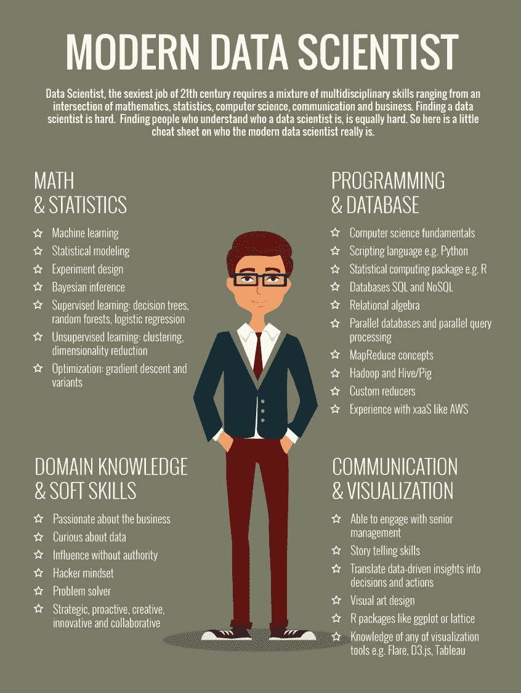
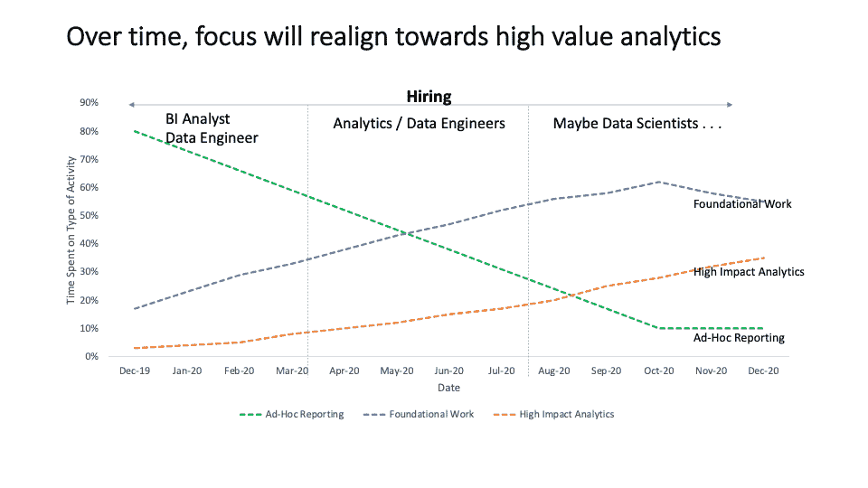

# 招聘数据团队中的不同技能和角色

> 原文：<https://towardsdatascience.com/diverse-skills-and-roles-on-a-data-team-feec00a5e4ff?source=collection_archive---------36----------------------->

相同但不同(来源:图片来源于 Nikhil Goyal 授权的 Shutterstock)

## Psst:你的“数据人”不是东西

建立一个数据团队可能是一件棘手的事情。有几十个松散使用的标题来表示需要在组织中执行的一组数据相关的任务(已识别的和通常未识别的)。数据科学家和业务分析师可能是市场上最知名的数据角色，数据工程师在过去的 12-24 个月里变得炙手可热。许多雇佣了大量数据科学家来寻找数据天堂的公司最终都失望了，并且不明白为什么分析没有带来承诺的影响。Gartner(我以前的公司)的研究显示，超过一半的营销领导者对分析投资的影响或缺乏感到失望( [Gartner 对高级营销领导者的调查](https://www.gartner.com/en/newsroom/press-releases/2020-10-07-gartner-reveals-more-than-half-of-marketing-leaders-a))。

# 如果要我指出数据科学泡沫破裂的原因，那就是四象限数据科学家信息图。

**我不认可这张信息图。(来源:** [我](https://www.pinterest.com/pin/496310821409727821/)营销酒厂法师，[http://www . marketingdistillery . com/2014/08/30/data-science-skill-set-explained/](http://www.marketingdistillery.com/2014/08/30/data-science-skill-set-explained/)**)**

将数据科学家描述为拥有这 4 个方面的技能本身并没有错，但这至少给了一些非技术业务领导者(尤其是在营销领域)一种错误的感觉，即通过雇佣独角兽数据科学家来建立数据团队所需的流程、基础设施和技能的完整性和可替代性。这也让人们对招聘抱有不切实际的期望，最终让买家后悔。

在某种程度上，聪明人纠正了这一点，并开始雇用数据工程师，如果你还没有听说，现在雇用一名经验丰富的数据工程师比试图在魁地奇比赛中找到金色飞贼要糟糕得多([数据工程工作在 2020 年同比增长 50%](https://quanthub.com/data-engineer-demand/#:~:text=DICE's%20recent%202020%20Tech%20Job,growing%20by%2050%25%20in%202019.))。当我在 LeafLink 面试时被问到，2020 年我会雇佣多少数据科学家时，我的回答是“大概 0”。相反，我试图解释的是下面的图表:

构建数据仓库和标准化关键指标报告等基础工作减少了临时报告任务，从而让数据团队有时间解决更高层次的业务问题。(图片来源:Nikhil Goyal)

最近，作为项目的一部分，Fishtown Analytics 对这个主题进行了启发性的思考。通过认识到分析师需要借鉴软件开发剧本，并仔细考虑数据分析师遇到的用例及问题(与后端工程师非常不同)，dbt 定义了市场中一个全新的数据角色——分析工程师的角色([什么是分析工程师？](https://blog.getdbt.com/what-is-an-analytics-engineer/))。它非常出色，因为它系统化了大多数组织在构建数据堆栈的早期发现他们需要的角色，但不知道该如何称呼。在我看来，分析工程师是最终的数据通才，是 BI 分析师角色的演变。有人可以理解业务逻辑，在维度模型中表示它，编写 SQL 来计算指标，并利用 dbt 的强大功能来抽象，表达，模板和版本管理所有这些。

即使有了所有这些角色定义，数据工作通常也不会具体化为行动，因为执行分析的人和采取行动的人之间存在沟通差距。理论上，数据科学家应该拥有出色的沟通技能，但市场供求动态导致低于最佳预期的均衡(阅读:难以捉摸的独角兽数据科学家)。麦肯锡建议，为了弥合这一差距，数据团队需要一名分析翻译([分析翻译——新的必备角色](https://www.mckinsey.com/business-functions/mckinsey-analytics/our-insights/analytics-translator))。如果我听说过一个小众角色，那就是这个——可以去给别人的作品代言的人。坦率地说，这是数据分析师最讨厌的角色。冒着点燃许多人激情的风险，我要补充一点，我宁愿培训分析师撰写建议和提供故事，也不愿雇佣分析翻译来翻译数据科学家或 BI 分析师的工作。

回到我们开始的地方，在 BI 分析师、数据科学家、数据工程师、分析工程师、分析翻译和无数其他人(数据库管理员、ML 工程师、BI 开发人员、数据可视化人员)之间，应该从哪里开始招聘呢？所有这些角色和细微差别给数据专业的招聘经理带来了更多问题，特别是在向非技术利益相关方(如财务、人力资源和其他赞助或支持数据角色招聘的业务合作伙伴)解释时。像这样的问题:

*   BI 分析师、数据科学家、数据工程师和分析工程师之间有什么区别？我在他们所有的简历上看到了如此多的技能重叠——他们都知道 SQL、Python、R 和 Tableau！
*   我们多久才能意识到所有这些角色的影响？

事实是，随着数据生态系统随着业务的发展而发展，您将需要它们。没有认识到数据运营领域和技能集的广度会导致利用数据力量的工作不协调和不完整(请原谅这种陈词滥调)以及糟糕的招聘决策。更令人困惑的是，数据专业人员通常有着丰富的经验，涉及数据操作的各个方面，让每个人看起来都像是万事通。因此，数据团队中的每个人都是一个…。“数据人”。在这里，与工程界的简单类比是“全栈工程师”。在理想的情况下，每个雇员都应该是所有方面的专家。这种类比的一个有趣而荒谬的简化是只雇佣全栈员工——一个可以管理产品、销售、运行客户体验、执行收款、记账等的角色。还有…雇佣和解雇他们自己。想象一下一个满是堆垛机的公司。我在故意搞笑。但是为了便于讨论，让我们假设某人是多种技能的专家，他们有时间扮演所有这些角色吗？

考虑您需要哪种数据角色的一个有用的方法是回到经常重复的问题——“您需要雇佣什么样的人”。问一个问题——哪些技能对该角色最重要，该角色最需要在数据价值链的哪个部分工作。

为了我自己和我的招聘伙伴的利益，我制作了一个简单的技能矩阵来理解和解释不同的角色:

列 A:广泛的技能领域，列 B:用于执行工作的工具或技术，列 C-G:映射到重点领域和专业水平的关键数据角色。(图片来源:Nikhil Goyal)

需要澄清的是，我并不是说数据科学家不能拥有数据工程师的技能，或者分析工程师不能成为专业的 BI 开发人员。数据领域的技能非常清晰，因此没有什么可以阻止数据工程师成为数据分析和可视化方面的专家，或者数据科学家拥有专家级的数据工作流编排技能集。在所有广泛的数据操作领域获得最低的熟练程度几乎是这个行业的标准。一些聪明的人学会成为多个领域的专家。是的，独角兽是存在的。我知道几个。但是寻找独角兽通常会导致不适当的延迟，有时会导致巨大的失望。

对于有抱负的数据专业人士来说，把自己的关注领域和专业领域想象成一片雨林。技能集的树冠是什么样子的？而深根是什么样子的呢？

这是一种看法。我很乐意听取和学习该领域专业人士的观点和经验，并发展我的思维。

附注: [LeafLink](https://leaflink.com/careers#openings) 正在招聘数据工程师、分析工程师、数据科学家和 BI 开发人员。查看我们的职业页面，并在我们的网站上申请，或者直接给我留言！