# 多样性带来更好的解决方案。原因如下。

> 原文：<https://towardsdatascience.com/diversity-leads-to-better-solutions-heres-why-adc9f0a30b32?source=collection_archive---------18----------------------->

## 多样性优势背后的数学原理

使用数据推动创新和业务成果的优势经常被讨论，大量证据支持其功效。然而，数据本身没有价值。正是**人**剖析数据(数字的或模拟的)以提取解决棘手问题所需的信息。因此，讨论我们系统中的*人*组件如何影响我们解决方案的质量是有意义的。

在导致非凡表现的人为因素中，团队**多元化**一直是我们所掌握的最不为人所知、最未被充分利用的杠杆之一。

我写这篇文章并不是为了让你相信最大化多元化会提高企业绩效。有[一个](https://www.pwc.co.uk/financial-services/assets/pdf/pwc-diversity-is-the-solution.pdf) [压倒性](https://www.scientificamerican.com/article/how-diversity-makes-us-smarter/) [数量](https://hbr.org/2017/03/teams-solve-problems-faster-when-theyre-more-cognitively-diverse)[证据](https://www.sciencedaily.com/releases/2009/03/090331091252.htm) [证明](https://knowledge.wharton.upenn.edu/article/how-a-highly-diverse-team-can-help-untangle-complexity/) [多样](https://joshbersin.com/2015/12/why-diversity-and-inclusion-will-be-a-top-priority-for-2016/) [团队](https://hbr.org/2013/12/how-diversity-can-drive-innovation) [产生](https://www.catalyst.org/research/the-bottom-line-connecting-corporate-performance-and-gender-diversity/) [更](https://www.mckinsey.com/featured-insights/diversity-and-inclusion/diversity-wins-how-inclusion-matters) [有利](https://www.mckinsey.com/business-functions/organization/our-insights/why-diversity-matters) [结果](https://www.ted.com/talks/rocio_lorenzo_how_diversity_makes_teams_more_innovative)(对，那些都是商业和科学领域的链接)。

我想探究现象背后的**机制**。**多元化如何带来令人满意的结果？我们可以使用从进化生物学和统计学中推导出的正式模型来得出导致这一有趣结果的基本力量。**

如果你选择的媒体是视频，请完全跳过这篇文章的其余部分，只看我用动画挥手展示这些概念。

如果你更喜欢阅读材料，博客的其余部分以文本形式涵盖了完全相同的材料。

# 问题解决形式化

如果我们想讨论多样性如何影响我们解决方案的质量，我们必须首先正式定义解决问题意味着什么。

> 我们有些问题 **→ P**
> 
> 我们提出一些解决方案 **→** **S**
> 
> 我们的解决方案对我们有一些价值 **→** **V(S)**
> 
> 我们希望在有限的时间内实现价值最大化

如果我们将问题的所有潜在解决方案的价值可视化，它可能看起来像这样:

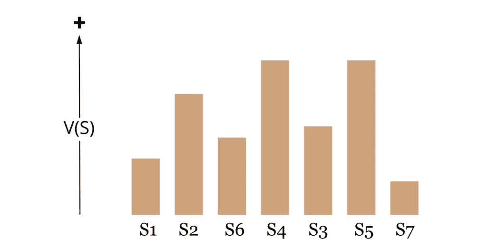

解决方案 1–7 的假设值|作者图片

# 观点

你可以从不同的角度看待一个特定的问题。观点并不新鲜。例如，要表示平面上的特定点，您可以使用笛卡尔透视，将该点表示为 X 和 Y 坐标，或者使用极坐标透视，其中该点由角度和长度定义。

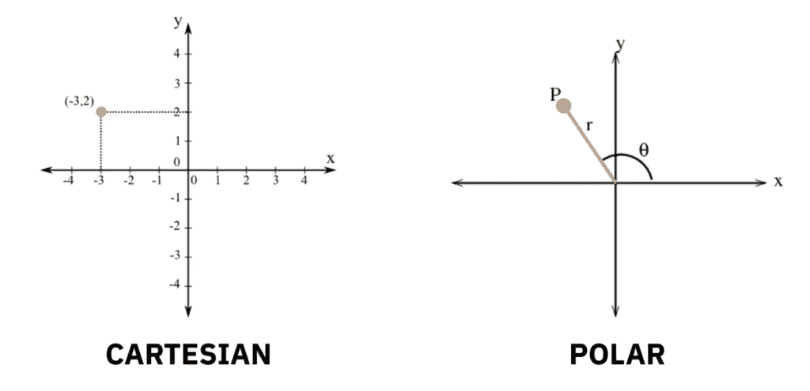

*空间中某点的替代视角|作者图片*

你视角的选择将极大地影响你表达问题解决方案的能力。如果您想要表示一条直线，使用笛卡尔透视图更有意义，而要表示圆弧，极坐标透视图可能是更合适的编码。

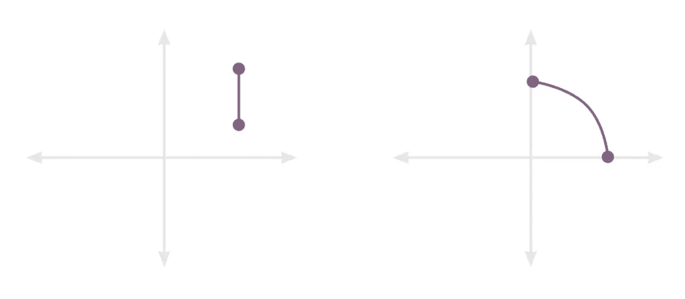

*视角的选择影响解决方案的简单性|作者图片*

这是另一个例子。假设你正在找房子。你选择使用的视角会对你找到的公寓的满意度产生很大的影响。

*   **奢华→** 平方英尺
*   **便利→** 靠近地铁线
*   **教育→** 附近学校的质量

当你从一个特定的角度看待一个问题时，你最终会得到一个由这个角度定义的潜在解决方案的连续景观。

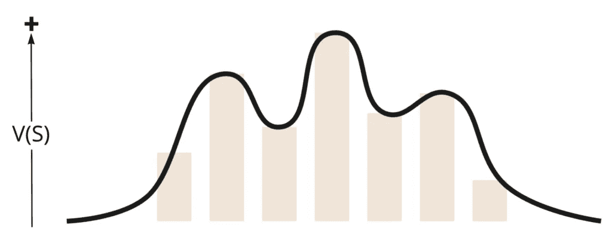

*连续解决方案风景|作者图片*

例如，假设你是一个巧克力棒制造商，想要最大化新产品将销售的巧克力棒数量的价值函数 **V(S)** 。

你可以从新巧克力棒的**卡路里**或**咀嚼度**的角度来看问题。视角的选择会影响你的风景。

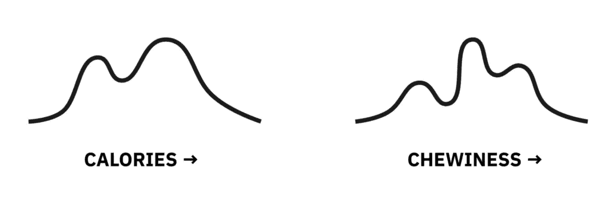

*视角的选择影响风景的形状|作者图片*

对于卡路里，左边是对卡路里敏感的零食爱好者的峰值，另一边是糖爱好者的峰值，但是一旦每根棒的卡路里含量高得离谱，就没人会买了。

咀嚼度会产生更多的峰值，因为销量和巧克力的咀嚼度之间没有明确或有用的关系。这些峰值被称为**局部最优值，**更好的视角往往有更少的峰值，使解决方案更容易导航。

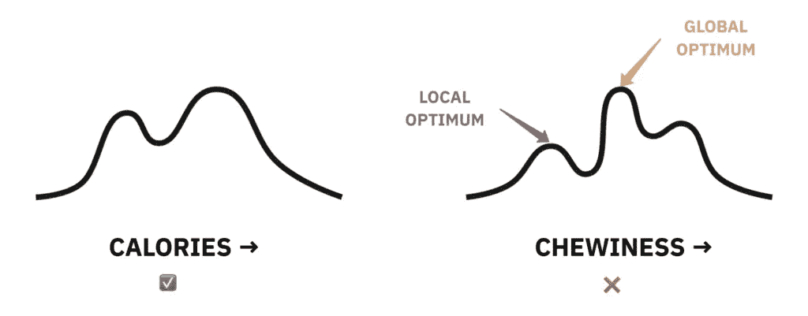

*热量景观的峰值比咀嚼景观的峰值少|图片由作者提供*

更少的峰值是可取的，因为当你提出一个解决方案，所有相邻的可能解决方案都有较低的值，找到一个更好的解决方案是棘手的，除非你跳出框框思考。峰值越少，你被卡住的机会就越少。

# 完美的视角

有一个完美的视角，产生一个只有 1 个最优的景观。这种景观被称为富士山景观。

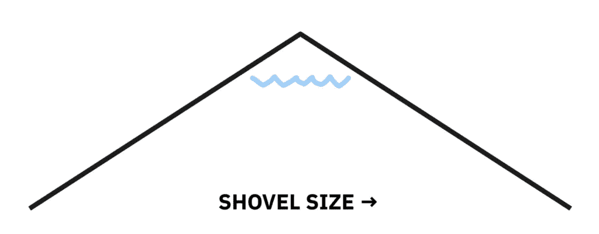

*从铲大小的角度看富士山的积雪量|图片由作者提供*

富士山风景的一个例子是铲雪时的大小。当铲的尺寸很小时，可以移动的雪很少，当铲的尺寸太大时，雪变得太重而无法移动。

富士山风景不仅仅适用于简单的问题。考虑下面的双人策略游戏。我们有 1 到 9 张牌，每个玩家轮流选择一张牌，试图以 3 张牌结束游戏，总共 15 张牌。

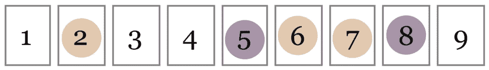

*Sum-to-15 策略游戏|作者图片*

你可以想象要阻止你的对手拿到正确的牌需要多少策略。

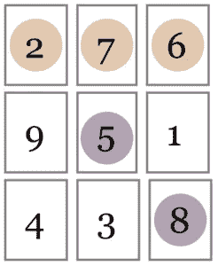

*排列成魔方的卡片|作者图片*

用正确的视角解决并不一定很难。富士山的视角将卡片排列成一个魔方。魔方是所有行、列和对角线的总和为 15 的数字网格。

突然间，我们的高难度策略游戏变成了我们熟悉的井字游戏，只需要一个简单的最优决策树。

有趣的是，我们知道富士山的风景可以解决所有的问题。

> **学者存在定理**
> 对于任何问题，都存在许多创造富士山景观的视角。

怎么会？

一个人只需要以这样的方式排列潜在的解决方案，就能产生这样的景观？如果顺序存在，视角也存在。

问题是，这种完美的视角在大多数情况下是极其难以找到的。

考虑一下这个。某个问题只有 15 种可能的解决方案，但实际上有 15 种！订购解决方案的方式。那是 1.3 万亿个视角。

我们需要一些方法来更有效地导航解决方案空间。

这就是我们来到**启发式**的地方

# 探索法

试探法是一种不完美但实用的解决问题的方法，众所周知，这种方法在大多数情况下都能达到近似最优的解决方案。

有许多你可能熟悉的启发法。

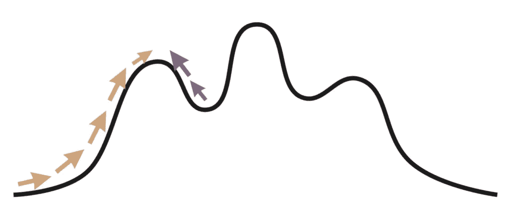

*爬山启发式|作者图片*

最常见的启发式是“爬山”或梯度上升。使用这种启发式方法，您可以找到与当前解决方案最接近的可能解决方案，从而产生显著的改进。大多数增量改进都属于这一类。

如您所见，这可以很好地工作，但是有陷入局部最优的风险。这对于依赖梯度下降来寻找最小化预测误差的函数的参数的机器学习实践者来说是众所周知的。

另一个启发可能是“反其道而行之”你可能通过扮演“魔鬼代言人”来实践这种形式。

这方面的一个例子可以在市场营销领域看到。大多数营销人员将他们最有价值的资产放在电子邮件捕获表单后面来收集线索。

一些营销人员做的正好相反。他们不是在遇到障碍后给出价值，而是提前传递价值，用所提供信息的质量吸引观众，引导他们*愿意*给出电子邮件以了解更多信息。这种解决方案可以有更好的参与度，甚至可以收集更多的电子邮件。

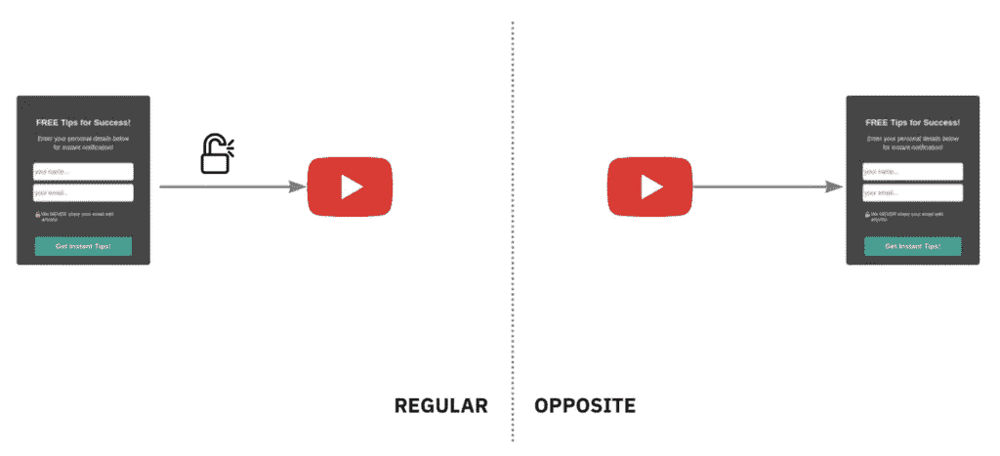

*“反其道而行之”启发式电子邮件捕获|作者图片*

管理领域的另一个启发性例子是“先有大石头再有石头”。如果你今年有一大堆目标，而你所有的努力都花在了小目标上，那么清单上的大目标就不会得到足够的关注。

你可能会问自己这个百万美元的问题:

*“对于所有问题，有没有比其他方法更好的启发式方法？”*

不幸的是，答案是**不**这已经被[没有免费的午餐定理](https://en.wikipedia.org/wiki/No_free_lunch_theorem)所证明，该定理指出，除非你对正在解决的问题有所了解，否则在搜索所有解决方案时，没有任何搜索算法会比任何其他算法表现得更好。

# 团队多样性的影响

现在我们有了词汇，我们可以把它们汇集在一起。到目前为止，我一直含糊地说“多样化”会带来更好的结果。什么样的多样性？

为了想出更好的解决方案，我们需要不同的**启发法**以及不同的**观点。**当然，这些与性别和种族多样性高度相关。

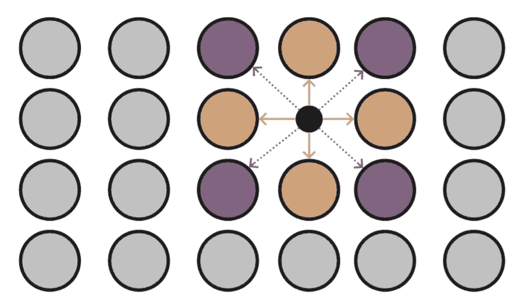

*对角线 vs 行列试探法|作者图片*

因为在所有的解决方案中，没有一个试探法比其他的更好，我们需要不同的试探法来在我们的环境中找到更多的最优解。例如，如果我们的解空间是一个网格，我向上、向下、向左、向右看寻找最佳解，如果你也斜着看，我们可能会更快地收敛到最优解。

不同的视角对整个团队的解决方案前景有着非常有趣的影响。假设我们有两个团队成员 Hans 和 Hanna，每个人都有独特的视角。

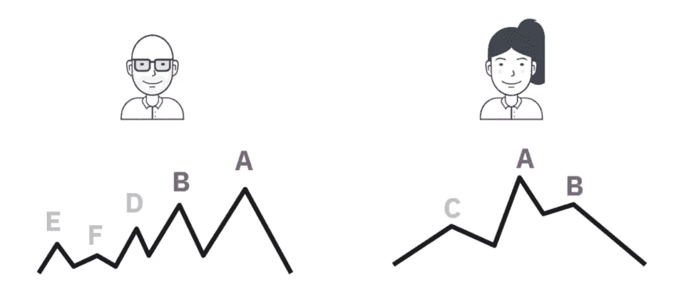

*汉斯和汉娜视角下的风景|作者图片*

请注意，Hans 环境中的解决方案 A 和 B 代表 Hanna 环境中完全相同的*解决方案 A 和 B。换句话说，不同的视角在两种情况下都会产生相同的局部最优解。*

谁的视角更好？汉娜的峰值更少(意味着卡住的地方更少)，所以她的视角可能更有用。我们也可以从每个人的局部最优的平均值的“角度”来看这个问题。每个人的最优值的平均值称为**个人能力**。

查看**能力**，我们可以看到 Hanna 的局部最优解也比 Hans 的有更高的平均值。

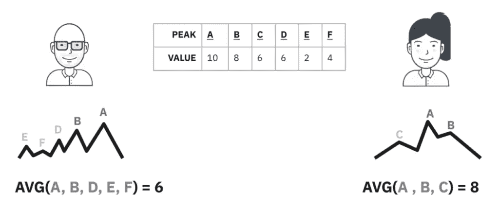

*汉斯和汉娜的个人能力|作者图片*

在团队成员中拥有不同的局部最优解意味着，如果一个团队成员陷入最优解，他们可以检查其他团队成员是否有更好的解决方案，并简单地从那里继续搜索。

总的来说，我们可以作出如下主张:

> **认领**
> *一个团队只能卡在一个由* ***每个成员*** *共享的局部最优上。*

团队能力往往高于任何个人能力，因为团队的局部最优值越少，意味着侵蚀平均值的局部峰值越少。

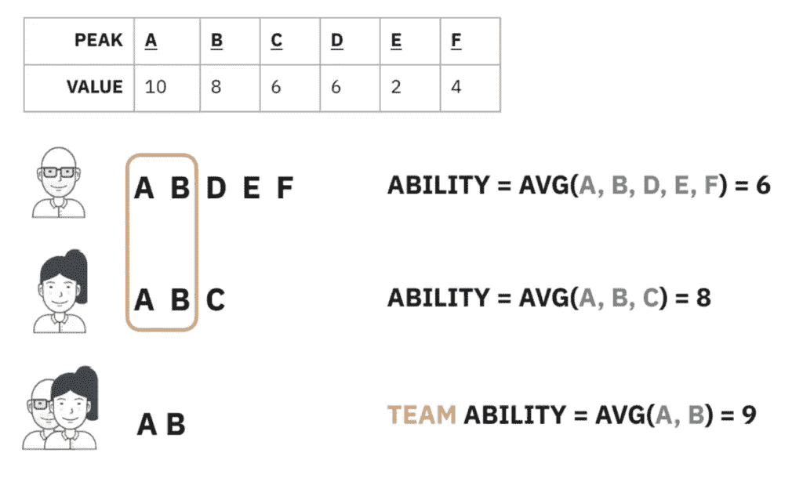

*团队能力往往高于个人能力|作者图片*

随着团队成员的增加，这种效果会成倍增加。然而，只有在个人观点多样化的情况下，对团队能力的有益影响才会实现。如果所有的团队成员都有相同的观点，你不会减少局部最优的重叠，放弃任何可能提供的收益。

# 细则

上述模型忽略了一些影响结果多样性有效性的因素。

## 不完善的沟通

我们不是完美的沟通者。我不可能把我的想法灌输给你，让你明白我的解决方案的价值。一种减少错误的方法是跳过口头交流，制作一个代表解决方案的人工制品，这样你就可以直接观察到它。

## 缺乏包容性

如果我邀请你。但是没有以一种有意义的方式把你包括进来，你独特的观点、启发和解决方案将会被浪费。

## 甲骨文的价值

到目前为止，我一直认为任何特定解决方案的价值对整个团队来说都是显而易见的。事实上，我们没有一些“价值先知”来告诉我们潜在解决方案的确切价值。

在这种情况下，我们必须依靠专家预测的汇总来准确估计每个解决方案的价值。这就把我们带到了下一个话题，“群体的智慧”

# 群体的智慧

虽然个人做出的预测往往不准确，但当你开始组合多个个人的预测时，你往往会得到一个非常接近标准的预测。

例如，假设我们有 3 个人对实际值为 **18 的结果进行预测。**

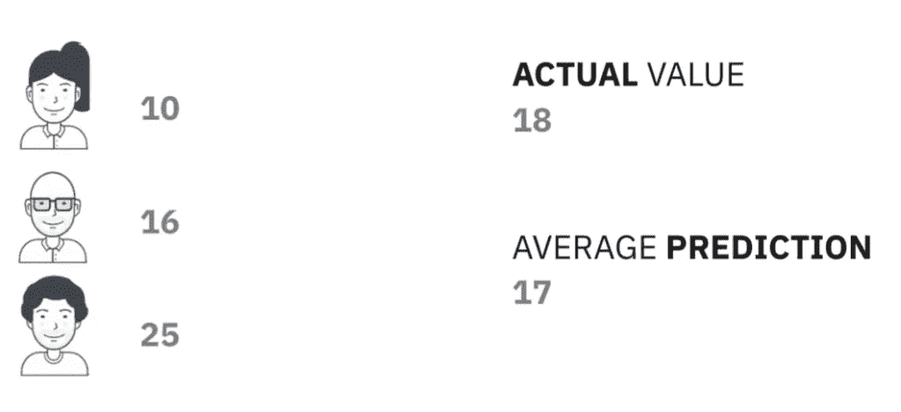

*个人预测对比平均预测|作者图片*

就个人而言，他们的预测做得不好，但他们的平均预测只差 1。

我们可以将每个单独预测的**误差**定义为预测值和实际值之间的差值。在计算平均个体误差时，为了防止实际值的正差异抵消负差异，我们可以对个体误差求平方以去除负值。

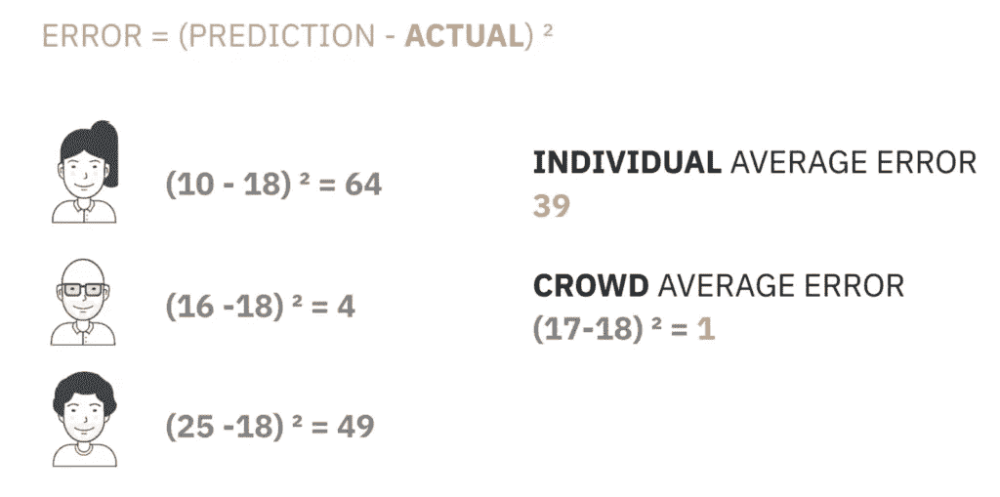

*误差=(预测-实际)* |图片作者

类似地，我们可以通过测量每个预测与*平均预测*的差异来计算预测的**多样性**。我们再次平方这些项来处理负值。在统计学中，这个差异项也称为样本的方差。

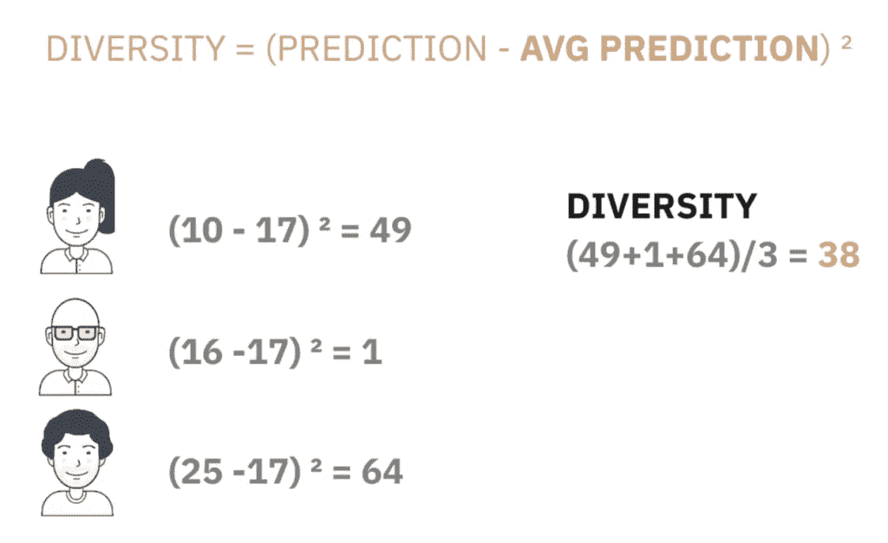

*多样性=(预测-平均预测)|作者图片*

已经定义了误差和差异，我们现在可以解开**差异预测定理**。

> ***多样性预测定理*** *群体误差=平均个体误差—多样性*

虽然这看起来像伪数学，但我给你的定义是扩展这一项，证明等价有效所必需的。

形式上，这被定义为以下公式

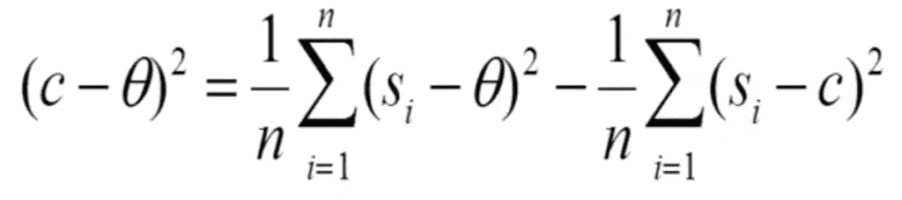

*多样性预测定理|作者图片*

**c** =预测的人群
**=实际值
**s *i*** =预测的第 *i* 个个体
**n** =个体数量**

**这个简单的公式继续告诉我们同一个故事:**没有多样性，人群中就没有智慧。****

**为什么？**

**个体误差小的时候，人群的误差也低，多样性起不到作用，因为我们的问题容易。**

**当我们的问题很难解决时，个人的预测将会不准确，导致我们群体的误差上升。减少群体误差的唯一方法是增加多样性。**

# **信号独立性**

**有时，即使你引入了多样性，你也可能因为没有从独特的视角和启发中提取价值的过程而错过所有的好处。**

**例如，在头脑风暴会议期间，如果房间里的每个人都在参与同一个讨论，我们往往会陷入集体思考的陷阱，失去来自我们多元化团队的个人天赋。让每个人并行构思，然后共同努力，以实现最高价值的解决方案，这样会好得多。**

**这一观点得到了研究的充分支持，研究表明，即使团队成员的预测之间存在轻微的相关性，你也只能获得从独立角度获得的信号的一小部分。**

**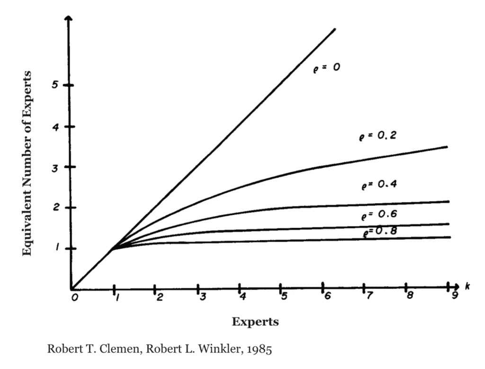**

***独立专家的等效数量给出不同专家之间的相关性|图来自* [*原文*](https://pubsonline.informs.org/doi/abs/10.1287/opre.33.2.427)**

**令人震惊的是，即使相关性为 0.2，9 个专家添加的信号并不比 3 个有独立观点的专家添加的信号多。如果相关性更高，达到 0.4，你将很难得到比两个独立专家更高的信息。**

**这种相关性是如何产生的？它可能来自于专家们一起讨论问题，甚至是和他们共同认识的人一起讨论。它也可能产生于社会文化因素，如共享相似的文化或教育背景。**

# **进一步阅读**

**这只是对多样性主题及其如何影响我们组织的浅显探讨。我们已经讨论了一些为什么，但是让多元化成为我们工作文化的一部分仍然是一个值得研究的挑战。**

**本文的大部分材料都是基于 Scott E. Page 所做的工作。具体来说，将进化生物学(适应度景观)和计算机科学(启发式)的思想应用到创新领域源于他的书《模型思考者》。**

**Scott 还在他的书《差异》和《T2》中详细阐述了这些观点。**

**如果您想探索围绕多元化的有形业务优势所做的工作，您可以使用以下资源:**

*   **HBR — [当团队的认知更加多样化时，他们解决问题的速度会更快](https://hbr.org/2017/03/teams-solve-problems-faster-when-theyre-more-cognitively-diverse)**
*   **麦肯锡— [多元化取胜:包容性有多重要](https://www.mckinsey.com/featured-insights/diversity-and-inclusion/diversity-wins-how-inclusion-matters)(或[详细报告](https://www.mckinsey.com/~/media/mckinsey/business%20functions/organization/our%20insights/delivering%20through%20diversity/delivering-through-diversity_full-report.ashx))**
*   **TED — [多元化如何让团队更具创新性](https://www.ted.com/talks/rocio_lorenzo_how_diversity_makes_teams_more_innovative)**
*   **世界经济论坛— [工作场所多元化的商业案例现在势不可挡](https://www.weforum.org/agenda/2019/04/business-case-for-diversity-in-the-workplace/)**
*   **《自然》——[这些实验室非常多样化——这就是它们在科学领域获奖的原因。](https://www.nature.com/articles/d41586-018-05316-5)**
*   **HBR — [其他多元化红利](https://hbr.org/2018/07/the-other-diversity-dividend)**

**如果你对实施让多元化成为头等大事所需的系统有什么见解，请在评论中或在你选择的社交网络上参与讨论。**

**想进一步讨论这个吗？在 Linkedin 上留言或[联系我。](https://www.linkedin.com/in/balmasi/)**

## **📕这篇文章最初发表在[向我展示数据](https://showmethedata.blog/diversity-leads-to-better-solutions?utm_source=medium&utm_campaign=post&utm_content=diversity)博客上，在那里我讨论了更多关于数据驱动业务的话题。**