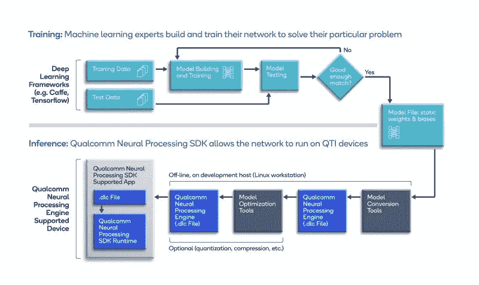
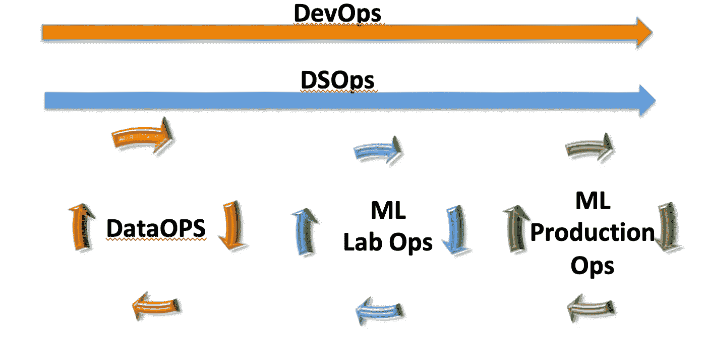

# 将 MLOPs 分成五个操作组

> 原文：<https://towardsdatascience.com/dividing-mlops-into-five-ops-groups-87d06a85c955?source=collection_archive---------27----------------------->

## MLOps = devo PS+data ops+MLLabOps+MLProdOps+DSOps

MLOps 很复杂。在 [Unsplash](https://unsplash.com/images/nature/star?utm_source=unsplash&utm_medium=referral&utm_content=creditCopyText) 上由 [Neven Krcmarek](https://unsplash.com/@nevenkrcmarek?utm_source=unsplash&utm_medium=referral&utm_content=creditCopyText) 拍摄的照片

我被教导通过将问题分成更小的子问题，将复杂的问题转化为更简单的问题。

我通过将机器学习操作( **MLOps** )分成五个不同但重叠的过程组或操作( **Ops** )组，使其过程范式更简单。

## MLOps 对我意味着什么？

MLOps 正在实现机器学习产品生命周期的自动化。

## MLOps 为什么存在？

1990 年，我们有 80%以上的 IT 项目从未推出。失败率下降是因为标准化的开发工具、可重复的过程迭代、瀑布方法的死亡、敏捷方法的兴起和单元测试——这里列举了一些代码开发的进步。

在 2000 年，我们有 80%以上的 Web 项目从未推出。失败率随着 **DevOps:** 开发过程自动化而下降。使用没有内存管理的面向对象语言(指针、malloc 等。)可能增加了首次展示的成功率。

2020 年，Gartner、VentureBeat 和其他民调告诉我们，80%以上的机器学习项目永远无法走出实验室。

**MLOps** 承诺降低机器学习应用推广的失败率。但与 **DevOps** 的成熟做法不同， **MLOps** 还在不断进化。

## 新代码触发 DevOps 操作。

DevOps 可以处理数据格式或类型的变化，因为它们并不常见。因此，所需的代码更改和随后的生产部署并不常见。例如，避免在财务表中添加新列。

> **注意**:有些人会认为代码变更的成本抑制了数据格式、类型和形状的变化。我参加过“数据标准委员会”的许多会议，会上他们考虑了在共享的 rmdb(ed)的表中添加、删除或重命名列的“环境影响”。关系数据库管理系统)。

我不认为 T21 需要更换。推出代码变更的过程自动化工作“*好* *够*”更重要的是，我认为 DevOps 很好地服务于 Jenkins、Ansible、Cafe、Chef、Puppet、Github Actions、Gitlab 等工具。

**DevOps** 很棒。这里没有争论。

然而…

如果说几十年来有一个经验教训的模式，那么我们有新的流程在 **DevOps** 的范围之外。

## 我们为什么需要 MLOps？

我们需要我们的计算机在互联网、我们的手机、我们的身体、蛋白质测序以及所有其他现有和未来技术每秒钟创造的数据量爆炸式增长的过程中动态地学习和适应。

## 机器学习解决方案的数据经常变化。

我们需要**传销**，因为*数据*的变化可以改变传销的优化或改变我们对传销的选择。

如果数据的形状改变，机器学习应用程序的生产版本也会改变。

> **注**:微软、[谷歌](https://blog.google/technology/health/improving-breast-cancer-screening)、[斯坦福](https://venturebeat.com/2020/09/15/ai-researchers-devise-failure-detection-method-for-safety-critical-machine-learning/)等都有过机器学习应用推出失败的情况。在训练、测试和验证中工作良好的机器学习应用在真实世界的数据上失败了。

## 定义 MLOps 的五个操作组= devo PS+data Ops+MLLabOps+MLProdOps+DSOps

我将五个 **Ops** 组称为“*重叠*”，因为我们正处于 **MLOps** 的早期采用阶段。另外**、****MLOps**范式正在快速发展**。**在 **MLOps** 中的流程组件可以被添加、删除、复制、重命名，并且可以被分成不同的子流程组件。

我将 **MLOps** 的五个子 **Ops** 组定义为:

1.  开发运营或 **DevOps** 是工具和子流程的成熟市场。
2.  分布式系统操作或**dsop**不要与更通用的术语云操作或 **CloudOps** 相混淆。我称之为 **DSOps** 是因为我想包含 **CloudOps** 术语**中不一定包含的东西。**一个例子是边缘设备或者更好地称为物联网。目前，我将 **CloudOps** 归类为 **DSOps** 的子集，专注于在供应商或本地 IT 云中执行组件的架构和编排。

图一。显示了部署物联网边缘设备时发生的**dsop**的附加流程。

图一。DSOps 涵盖了边缘设备到物联网部署的底层流程(深蓝色)。图片:[去飞溅](https://images.app.goo.gl/1JHZ3HfQrSV2uSN48)

> **注**:我可能是唯一一个用 **DSOps** 这个词的人。如果 **DSOps** 这个术语演变成 **CloudOps** ，我不会感到惊讶。称它为 **CloudOps** 比称它为 **DSOps** 要酷得多。

3.数据操作是一个成熟但仍在发展的工具和子流程市场。

4.机器学习实验室操作或 **MLLabOps** 是决定然后训练机器学习模型(MLm)的过程。此外，在 **MLLabOps** 组中是特定于 Mlm 的过程，如数据编码、特征重要性、特征工程、数据异常值去除和超参数优化。还可能有进一步的 MLm 微调、验证和多个 MLm 的集合。注意到 **MLLabOps** 的一些动作也可能在 **DataOps 中。**

5.机器学习生产操作或 **MLProdOps** 是将机器学习应用程序投入生产所需的所有流程。 **MLProdOps** 中的进程是经过训练的机器学习模型、日志记录、监控、可解释性，以及一些将新数据发送回**数据操作**进程的机制。日志记录、监控和可解释过程也可能出现在 **MLLabOps 中。**

MLOps = devo PS+data ops+MLLabOps+MLProdOps+DSOps

# 结论

这篇博客是一长系列 **MLOps** 博客的第四部分。前三个博客是:

 [## 在将机器学习应用程序投入生产时，避免这些数据陷阱

### 你有多少次听到“机器学习应用程序在实验室工作得很好，但在现场却失败了。”？这是…

towardsdatascience.com](/the-failure-of-moving-machine-learning-applications-into-production-3ff48b28f591)  [## 机器学习应用项目设计阶段的 10 个陷阱和 11 个最佳实践

### 我们专注于您在机器学习项目的初始设计阶段可能遇到的陷阱。我们详述我们的…

towardsdatascience.com](/10-pitfalls-and-11-best-practices-for-the-design-phase-of-a-machine-learning-application-project-66c3d599f87)  [## 停止调用机器学习操作执行流管道

### 当我们继续开发机器学习操作(MLOps)时，我们需要考虑机器学习(ML)开发…

medium.com](https://medium.com/swlh/stop-calling-machine-learning-operations-execution-flow-a-pipeline-94e55dd45366) 

**MLOps** 系列的下一个计划博客是 **:**

*   *m lops 生态系统的 22 个工具；*
*   *m lops 治理的四十条准则*。

我通过将复杂的主题 **MLOps** 分成五个操作( **Ops** )组来简化它——MLOps = devo PS+data Ops+MLLabOps+MLProdOps+DSOp。

我相信这些 **xOps** 的名字会随着 **MLOps** 的成熟而改变或被吸收。与此同时，它帮助我将工作分成不同的小组。希望这对读者你有帮助。