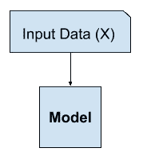
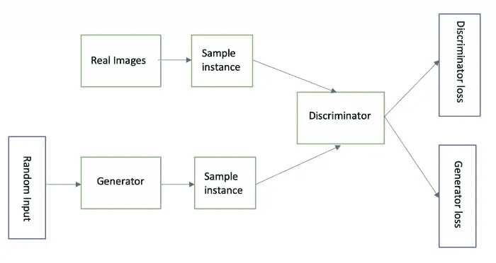

# 深入了解不同的 GAN 架构

> 原文：<https://towardsdatascience.com/diving-into-different-gan-architectures-a96d05c03c5c?source=collection_archive---------13----------------------->

英格玛在 [Unsplash](https://unsplash.com?utm_source=medium&utm_medium=referral) 上的照片

**简介**

**GAN** 是机器学习中有趣且令人兴奋的创新之一。**生成对抗网络** (GAN)是两个神经网络以零和博弈的形式相互竞争的一类。给定一个训练集，这种技术学习生成具有与训练集相同的统计数据的新数据。

这是机器学习中的一项[无监督学习](https://en.wikipedia.org/wiki/Unsupervised_learning)任务，涉及自动发现和学习输入数据中的模式，以使模型可用于生成或输出可从原始数据集中提取的新示例。
在无监督学习中，只给出输入，目标是在数据中找到感兴趣的模式。

图:无监督学习示例 Img Ref: [机器学习掌握度](https://machinelearningmastery.com/what-are-generative-adversarial-networks-gans/)

gan 是生成模型，即它们从训练数据创建新的数据实例。

**应用**

GAN 在时尚、艺术、科学、视频游戏等领域的应用迅速增加。例如，甘人从罗马皇帝的雕像中创造出看起来像人的形象。

**建筑**

生成式对抗网络由生成器和鉴别器两部分组成。生成器学习生成看似来自训练数据的可能数据，另一方面，鉴别器试图将生成器的假数据与真实数据区分开。鉴别器因不可信的结果而惩罚发生器。

生成器试图欺骗鉴别器，使其认为生成的图像是真实的，鉴别器试图区分真实和虚假的图像。随机噪声被输入发生器，发生器将随机噪声转换成“假图像”。鉴别器从训练集图像和来自生成器的伪图像中得到反馈，并且它必须将它们区分开来。

图:GAN Img 的架构 Ref: [Google 开发者](https://developers.google.com/machine-learning/gan/gan_structure)

GAN 背后的主要思想是交替训练发生器和鉴别器，以使它们在产生和鉴别图像方面尽最大努力。目的是通过改进其中一个网络，以这种博弈论的方式，另一个网络必须做得更好才能赢得比赛，这反过来又提高了性能，这个循环继续下去。生成性对抗网络在无监督任务中表现出令人印象深刻的性能。

一些最受欢迎的 GAN 架构包括:

a. **CycleGAN**

b.**斯泰勒根**

c.**伊斯甘**

d. **DiscoGAN**

照片由 [Michal Bar Haim](https://unsplash.com/@michalbarhaim?utm_source=medium&utm_medium=referral) 在 [Unsplash](https://unsplash.com?utm_source=medium&utm_medium=referral) 上拍摄

**a. CycleGAN**

它是一种涉及图像到图像翻译模型的自动训练的技术，而不需要成对的例子。图像到图像翻译的例子是将马翻译成斑马，反之亦然。CycleGAN 使用周期一致性损失来实现不需要成对数据的训练。它可以从一个域转换到另一个域，而不需要源域和目标域之间的一对一映射。图像到图像转换问题的目标是使用对准图像对的训练集来学习输入图像和输出图像之间的映射。

对于两个域 **X** 和 **Y** ，CycleGAN 学习一个映射 **G:X - > Y** 和 **F:Y - > X** 。

CycleGAN 有三个部分:**编码器、变压器**和**解码器。**

当需要进行颜色转换时，CycleGAN 会很有帮助。

b. StyleGAN

由 Nvidia 研究人员推出的 StyleGAN 是一种新型的生成式对抗网络。StyleGAN 是 GAN 架构的扩展，它对生成器模型提出了较大的更改，包括使用映射网络将潜在空间中的点映射到中间潜在空间，使用中间潜在空间来控制生成器模型中每个点的样式，以及引入噪声作为生成器模型中每个点的变化源。
生成的模型不仅能够生成令人印象深刻的照片级高质量人脸照片，还能通过改变样式向量和噪声来控制不同细节层次的生成图像的样式。

**c. LSGAN(最小二乘敌对网络)**

在正常的 GAN 中，鉴别器使用交叉熵损失函数，这有时会导致消失梯度问题。相反，LSGAN 对鉴频器使用最小平方损失函数。它希望向生成器提供关于远离鉴别器模型的判定边界的假样本的信号，以便将它们分类为真或假。它可以通过对鉴别器层的输出层进行微小的改变并采用最小二乘法或损失函数来实现。

**d. DiscoGAN**

给定**域 A** 中的图像，它生成**域 B** 中产品的图像。它将元素从一幅图像转移到另一幅图像。DiscoGAN 有两个发电机。第一生成器将输入图像从**域 A** 映射到**域 B** 。第二生成器将图像从域 B 重建到域 a。

CycleGAN 和 DiscoGAN 有一点相似。在 CycleGAN 中，它有一个附加的超参数来调整重建/周期一致性损失在总损失函数中的贡献。
DiscoGAN 可用于将装饰从一款时尚单品(如包袋)转移至另一款时尚单品(如一双鞋)。

**结论**

有数千篇关于 GAN 的论文和数百个命名的 GAN，即具有定义名称的模型，通常包括“ *GAN* ”。使用 GAN 架构创建新架构可能会有一些困难。众所周知，训练 GAN 网络非常不稳定。超参数优化很难在学习率之间找到正确的平衡来有效地训练网络。在所有架构中，生成器最常用于训练数据。

参考资料:

1.[https://en . Wikipedia . org/wiki/Generative _ adversarial _ network](https://en.wikipedia.org/wiki/Generative_adversarial_network)

2.[https://machine learning mastery . com/what-are-generative-adversarial-networks-gans/](https://machinelearningmastery.com/what-are-generative-adversarial-networks-gans/)

3.[https://developers . Google . com/machine-learning/gan/gan _ structure](https://developers.google.com/machine-learning/gan/gan_structure)

4.[https://www . ka ggle . com/Roy data science/introduction-to-generative-adversarial-networks](https://www.kaggle.com/roydatascience/introduction-to-generative-adversarial-networks)

5.[https://www . geeks forgeeks . org/cycle-generative-adversarial-network-cycle gan-2/](https://www.geeksforgeeks.org/cycle-generative-adversarial-network-cyclegan-2/)

6.[https://neptune.ai/blog/6-gan-architectures](https://neptune.ai/blog/6-gan-architectures)

7.[https://medium . com/forward-artificial-intelligence/generating-matching-bags-from-shoe-images-and-verse-using-disco gans-8149 e2cbc 02](https://medium.com/towards-artificial-intelligence/generating-matching-bags-from-shoe-images-and-vice-versa-using-discogans-8149e2cbc02)