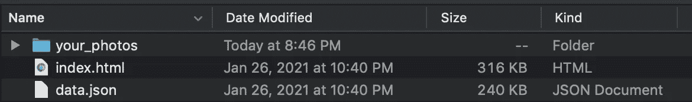
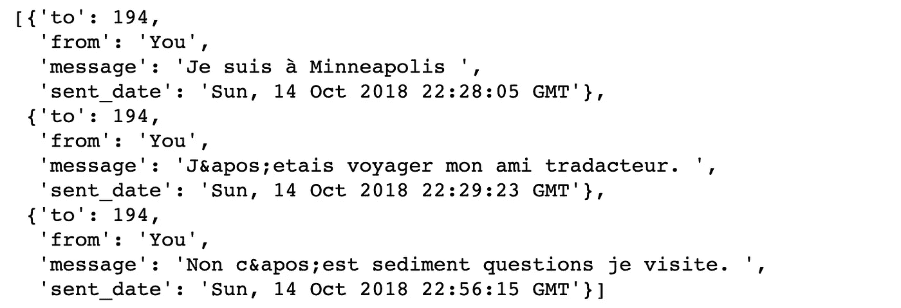
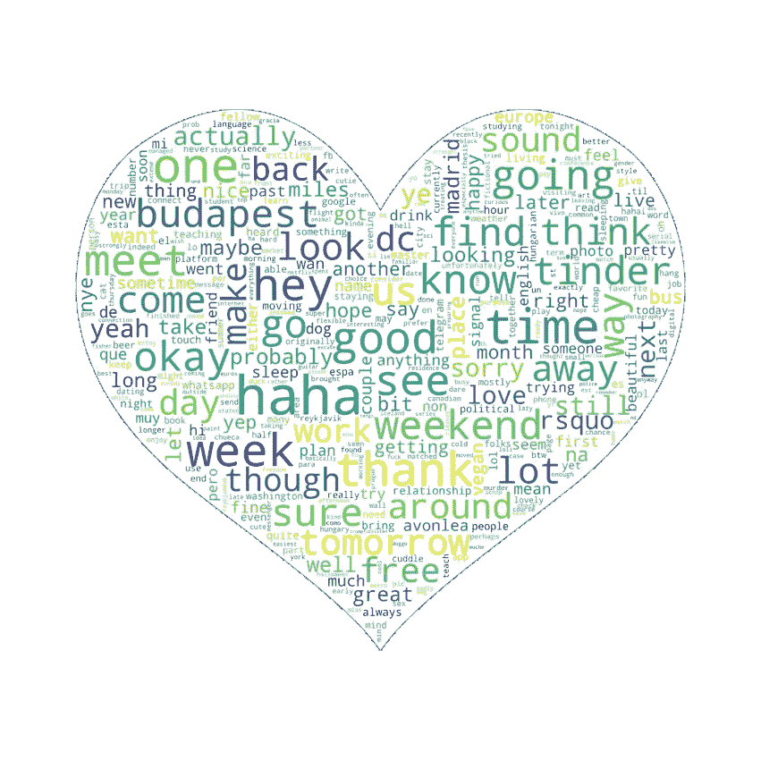

# 跳进我的火绒里

> 原文：<https://towardsdatascience.com/diving-into-my-tinder-dat-e-a-a508269b8d10?source=collection_archive---------32----------------------->

## 用 NLP 探索三年约会 app 消息

由[亚历山大·辛恩](https://unsplash.com/@swimstaralex?utm_source=unsplash&utm_medium=referral&utm_content=creditCopyText)在 [Unsplash](https://unsplash.com/s/photos/heart-data?utm_source=unsplash&utm_medium=referral&utm_content=creditCopyText) 拍摄的照片

## 介绍

情人节就要到了，我们很多人都有浪漫的想法。为了公共健康的利益，我最近避免了约会应用程序，但当我在思考下一个数据集时，我突然想到 Tinder 可以帮我找到(双关语)我过去多年的个人数据。如果你好奇，你也可以通过 Tinder 的[下载我的数据](https://www.help.tinder.com/hc/en-us/articles/115005626726-How-do-I-request-a-copy-of-my-personal-data-)工具来请求你的。

在提交我的请求后不久，我收到了一封允许访问 zip 文件的电子邮件，内容如下:

个人 Tinder 数据 zip 文件内容

“data.json”文件包含购买和订阅数据、应用程序打开日期、我的个人资料内容、我发送的消息等等。我最感兴趣的是应用自然语言处理工具来分析我的消息数据，这将是本文的重点。

## **数据的结构**

JSON 文件有许多嵌套的字典和列表，从中检索数据可能会很棘手。我用`json.load()`将数据读入字典，并将消息分配给‘message _ data’，这是对应于唯一匹配的字典列表。每个字典都包含一个匿名的匹配 ID 和一个发送给匹配的所有消息的列表。在列表中，每条消息都采用另一个字典形式，带有“收件人”、“发件人”、“消息”和“发送日期”关键字。

以下是发送给单个匹配项的消息列表示例。虽然我很想分享这次交流的有趣细节，但我必须承认，我不记得我想说什么，为什么我想用法语说，或者“Match 194”指的是谁:

邮件列表示例

因为我对分析消息本身的数据感兴趣，所以我用下面的代码创建了一个消息字符串列表:

第一个块创建长度大于零的所有消息列表的列表(即，与至少发送一次消息的匹配相关联的数据)。第二块索引来自每个列表的每个消息，并将其附加到最终的“消息”列表。留给我的是 1013 个消息字符串的列表。

## 清理时间

为了清理文本，我首先使用自然语言工具包(NLTK)的停用词语料库创建了一个停用词列表——常用的和不感兴趣的词，如“the”和“in”。您会注意到，在上面的消息示例中，数据包含特定类型标点符号的 HTML 代码，如撇号和冒号。为了避免将这段代码解释为文本中的单词，我将它与“gif”和“http”等文本一起附加到停用词列表中。我将所有停用字词转换成小写，并使用以下函数将消息列表转换成字词列表:

第一个块将消息连接在一起，然后用一个空格代替所有非字母字符。第二个模块将单词简化为它们的“词条”(字典形式)，并通过将文本转换为单词列表来“标记”文本。第三个块遍历列表，如果单词没有出现在停用词列表中，则将它们追加到“clean_words_list”中。

## 词云

我用下面的代码创建了一个[单词云](https://amueller.github.io/word_cloud/)，以直观地了解我的消息语料库中最常见的单词:

第一块设置字体、背景、遮罩和轮廓美感。第二个块生成云，第三个块调整图形的大小和设置。这是渲染出来的单词云:

作者的 Wordcloud。经由 [Vecteezy](https://www.vecteezy.com/vector-art/552501-heart-romantic-love-graphic) 的云罩。

云端显示了我住过的一些地方——布达佩斯、马德里和华盛顿特区——以及大量与安排约会相关的词汇，比如“自由”、“周末”、“明天”和“见面”还记得我们可以随意旅行，和刚在网上认识的人一起吃饭的日子吗？是啊，我也是…

你还会注意到云中散布的几个西班牙语单词。住在西班牙时，我尽力适应当地的语言，滑稽的笨拙对话总是以“no hablo mucho espaol”开头。

## 二元柱状图

NLTK 的[搭配](https://www.nltk.org/howto/collocations.html)模块允许您查找并评估双词或在文本中一起出现的词对的频率。以下函数接收文本字符串数据，并返回前 40 个最常见二元模型及其频率分数的列表:

我对清理后的消息数据调用函数，并在 Plotly Express [条形图](https://plotly.com/python/bar-charts/)中绘制二元语法-频率配对:

由作者策划。

在这里，你会再次看到很多与安排会议和/或将对话从 Tinder 上移开有关的语言。在疫情出现之前的日子里，我更喜欢在约会应用程序上保持最少的来回，因为面对面的交谈通常会带来更好的化学反应。

对我来说，bigram ('bring '，' dog ')进入前 40 名并不奇怪。老实说，狗狗陪伴的承诺是我正在进行的 Tinder 活动的一个主要卖点。

## 信息情感

最后，我用[Vader impression](https://pypi.org/project/vaderSentiment/)计算了每条消息的情感得分，它识别四种情感类别:负面、正面、中性和复合(衡量整体情感价值的一种方法)。下面的代码遍历消息列表，计算它们的极性分数，并将每个情感类别的分数附加到单独的列表中。

为了直观显示邮件中情感的总体分布，我计算了每个情感类别的得分总和，并绘制了它们:

由作者策划。

柱状图表明,“中性”是这些信息的主导情绪。应该注意的是，取情感分数的总和是一种相对简单的方法，它不处理单个消息的细微差别。例如，一些“中性”分数极高的信息很可能导致了该类的主导地位。

尽管如此，中立在这里比积极或消极更重要是有道理的:在与某人交谈的早期阶段，我试图显得礼貌，而不是用特别强烈、积极的语言超越自己。制定计划的语言——时间、地点等——很大程度上是中性的，似乎在我的信息语料库中广泛存在。

## 结论

如果你发现自己今年情人节没有计划，你可以花它来探索你自己的 Tinder 数据！你可能会发现有趣的趋势，不仅是在你发送的信息中，也在你对应用程序的使用中。

要查看该分析的完整代码，请访问其 [GitHub](https://github.com/AvonleaFisher/Exploring-Tinder-Message-Data-with-NLP) 库。