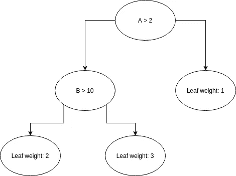
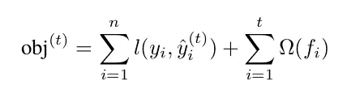
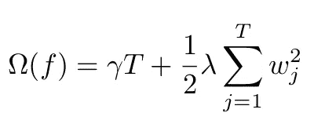
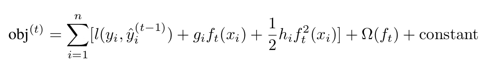
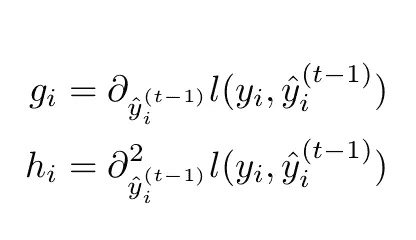
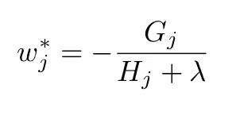
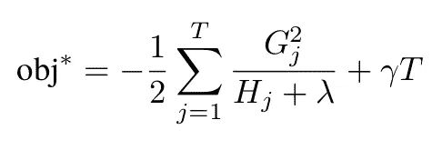
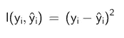
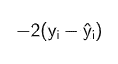
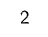

# XGBoost 解释:用不到 200 行 python DIY XGBoost 库

> 原文：<https://towardsdatascience.com/diy-xgboost-library-in-less-than-200-lines-of-python-69b6bf25e7d9?source=collection_archive---------20----------------------->

照片由 [Unsplash](https://unsplash.com?utm_source=medium&utm_medium=referral) 上的[延斯·勒列](https://unsplash.com/@madebyjens?utm_source=medium&utm_medium=referral)拍摄

> 更新:发现我关于渐变增强的新书，[实用渐变增强](https://amzn.to/3OMgEkR)。这是用 python 中的许多例子对渐变增强的深入探究。

<https://amzn.to/3OMgEkR> 所示。但是有多少人真正理解它的基本原理呢？

你可能会认为，一个性能和 XGBoost 一样好的机器学习算法可能会使用非常复杂和高级的数学。你可能会认为这是软件工程的杰作。

你说对了一部分。XGBoost 库非常复杂，但是如果只考虑应用于决策树的梯度推进的数学公式，它并不复杂。

您将在下面看到如何使用不到 200 行代码的梯度推进方法为**回归**训练决策树的详细信息。

# 决策图表

在进入数学细节之前，让我们回顾一下关于决策树的记忆。原理相当简单:将一个值与遍历二叉树的一组给定特征相关联。二叉树的每个节点都附加一个条件；树叶是有价值的。

如果条件为真，我们使用左边的节点继续遍历，否则，我们使用右边的节点。一旦到达一片叶子，我们就有了我们的预测。

通常，一张图片胜过千言万语:

三层决策树。图片由作者提供。

附加在节点上的条件可以看作是一个决策，因此得名**决策树**。

这种结构在计算机科学的历史上非常古老，已经成功地使用了几十年。下面几行给出了一个基本实现:

# 堆叠多棵树

尽管决策树已经在一些应用中取得了一些成功，如专家系统(在人工智能冬天之前)，但它仍然是一个非常基本的模型，无法处理现实世界数据中通常遇到的复杂性。

我们通常将这类估计量称为 ***弱模型*** 。

为了克服这一限制，九十年代出现了将多个*弱模型*组合起来创建一个*强模型:* ***集成学习*** *的想法。*

这种方法可以应用于任何类型的模型，但由于决策树是简单、快速、通用和易于解释的模型，所以它们被广泛使用。

可以部署各种策略来组合模型。例如，我们可以使用每个模型预测的加权和。或者更好的是，使用贝叶斯方法基于学习将它们结合起来。

XGBoost 和所有的 **boosting** 方法使用另一种方法:每个新模型都试图补偿前一个模型的错误。

# 优化决策树

正如我们在上面看到的，使用决策树进行预测非常简单。当使用*集成学习*时，这项工作并没有变得更加复杂:我们所要做的就是将每个模型的贡献相加。

真正复杂的是建造树本身！我们如何找到在训练数据集的每个节点应用的最佳条件？这就是数学帮助我们的地方。完整的推导可以在 [XGBoost 文档](https://xgboost.readthedocs.io/en/latest/tutorials/model.html)中找到。这里，我们将只关注本文感兴趣的公式。

与机器学习一样，我们希望设置我们的模型参数，以便我们的模型对训练集的预测最小化给定的目标:

客观公式。作者的公式。

请注意，该目标由两个术语组成:

*   一个是测量预测产生的误差。这就是著名的损失函数 *l(y，y_hat)* 。
*   另一个，*ω*，控制模型复杂度。

正如 XGBoost [文档](https://xgboost.readthedocs.io/en/latest/tutorials/model.html)中所述，复杂性是目标的一个非常重要的部分，它允许我们调整偏差/方差权衡。许多不同的函数可以用来定义这个正则项。XGBoost 使用:

正则项。作者的公式。

这里 *T* 是叶子的总数，而 *w_j* 是附在每片叶子上的权重。这意味着大的重量和大量的叶子会被扣分。

由于误差通常是复杂的非线性函数，我们使用二阶泰勒展开将其线性化:

损失的二阶展开。作者的公式。

其中:

高斯和海森公式。作者的公式。

线性化是相对于预测项计算的，因为我们想要估计当预测改变时误差如何改变。线性化是必不可少的，因为它将使误差最小化。

我们想要用梯度增强实现的是找到将最小化损失函数的最优*【δ_ y _ I】*，即，我们想要找到如何修改现有的树，使得修改改进预测。

在处理树模型时，有两种参数需要考虑:

*   定义树本身的:每个节点的条件，树的深度
*   附在每片树叶上的值。这些值就是预测本身。

探索每棵树的配置将会太复杂，因此梯度树提升方法仅考虑将一个节点分成两片叶子。这意味着我们必须优化三个参数:

*   分割值:在什么条件下我们分割数据
*   附加到左叶的值
*   附加到右叶的值

在 XGBoost 文档中，树叶 *j* 相对于目标的最佳值由下式给出:

相对于目标的最佳叶值。作者的公式。

其中 *G_j* 是附着在节点 *j* 上的训练点的梯度之和， *H_j* 是附着在节点*j*上的训练点的 hessian 之和

利用该最佳参数获得的目标函数的减少量为:

使用最佳权重时的客观改进。作者的公式。

使用 brut force 选择正确的分割值:我们计算每个分割值的改进，并保留最佳值。

现在，我们已经获得了所有必要的数学信息，可以通过添加新叶来提高初始树的性能。

在具体做之前，我们先花点时间了解一下这些公式是什么意思。

# 爬行梯度推进

让我们试着了解一下权重是如何计算的，以及 *G_j* 和 *H_i* 等于什么。因为它们分别是损失函数相对于预测的梯度和 hessian，我们必须选择一个损失函数。

我们将关注平方误差，这是常用的，也是 XGBoost 的默认目标:

平方误差损失函数。作者的公式

这是一个非常简单的公式，它的梯度是:

损失函数的梯度。作者的公式。

和黑森:

损失函数的海森。作者的公式。

因此，如果我们记住最大限度减少误差的最佳权重公式:

相对于目标的最佳叶值。作者的公式。

我们认识到最优权重，*即*我们添加到先前预测的值是先前预测和真实值之间的平均误差的相反值(当正则化被禁用时，即*λ= 0*)。使用平方损失来训练具有梯度增强的决策树归结起来就是用每个新节点中的平均误差来更新预测。

我们还看到*λ*具有预期的效果，即确保权重不会太大，因为权重与*λ*成反比。

# 训练决策树

现在是容易的部分。假设我们有一个现有的决策树，它可以确保预测有给定的误差。我们希望通过分割一个节点来减少误差并改进附加目标。

这样做的算法非常简单:

*   选择感兴趣的特征
*   使用所选要素的值对附加到当前节点的数据点进行排序
*   选择一个可能的分割值
*   将此拆分值下方的数据点放在右节点中，将上方的数据点放在左节点中
*   计算父节点、右节点和左节点的目标约简
*   如果左右节点的目标约简之和大于父节点的目标约简之和，则保持分割值为最佳值
*   迭代每个分割值
*   使用最佳分割值(如果有)，并添加两个新节点
*   如果没有拆分改进了目标，就不要添加子节点。

产生的代码创建一个决策树类，该类由一个目标、多个估计器(即树的数量)和一个最大深度来配置。

正如承诺的那样，这段代码不到 200 行:

训练的核心编码在函数 *_find_best_split* 中。它基本上遵循上面详述的步骤。

注意，为了支持任何种类的目标，没有手动计算梯度和 hessian 的痛苦，我们使用自动微分和 [jax](https://jax.readthedocs.io/en/latest/index.html) 库来自动计算。

最初，我们从只有一个节点的树开始，这个节点的叶值 leaf 是零。因为我们模仿 XGBoost，所以我们也使用一个基本分数，我们将它设置为要预测的值的平均值。

另外，请注意，在第 126 行，如果我们达到了初始化树时定义的最大深度，我们将停止树的构建。我们可以使用其他条件，如每片叶子的最小样本数或新权重的最小值。

另一个非常重要的点是用于分割的特征的选择。这里，为了简单起见，特性是随机选择的，但是我们可以使用更聪明的策略，比如使用方差最大的特性。

# 结论

在本文中，我们看到了梯度推进是如何训练决策树的。为了进一步提高我们的理解，我们编写了训练决策树集合并使用它们进行预测所需的最小行集。

深入理解我们用于机器学习的算法绝对至关重要。它不仅帮助我们构建更好的模型，更重要的是允许我们根据自己的需要修改这些模型。

例如，在梯度增强的情况下，使用损失函数是提高预测精度的一个很好的方法。