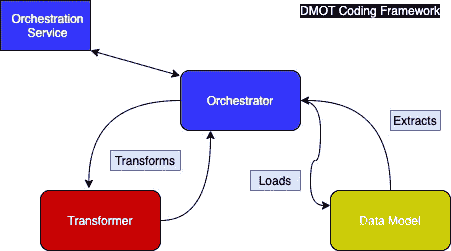

# DMOT:ETL 的设计模式——数据模型、编排器、转换器

> 原文：<https://towardsdatascience.com/dmot-a-design-pattern-for-etl-data-model-orchestrator-transformer-c0d7baacb8c7?source=collection_archive---------24----------------------->

## 一个为生产 ETL 项目(MLOps)开发的 OOP 框架，受类似于 MVC 的框架的职责分离原则的启发。

图 1: DMOT 框架交互。作者图片(draw.io)

TLDR；编写 ETL 数据管道代码(MLOps)的建议设计模式。使用这个框架来减少调试时间，提高可测试性和多环境产品。

**数据模型**与数据源和存储进行通信。**变压器**操纵数据。**编排器**指导 ETL 作业，连接数据模型&转换器类，并且很可能链接到一个适用的编排服务。

这在写作时是新的(根据作者的知识)，任何人都可以改进。

# **动机**

为生产机器学习项目编写管道没有它们可能集成到的软件应用程序那么丰富的经验。然而，我们可以借鉴他们发展过程中的一些经验。

在 iOS 开发中，基于宏观层面的职责分离代码与 [MVC 合作得很好。给 iOS 开发者的补充说明:如果你认为有人可以编写一个巨大的视图控制器，那就等着看 jupyter 笔记本有多大吧。数据项目已经存在，因此代码库的构建需要考虑测试&验证、开发人员可移植性和易维护性。](https://www.youtube.com/watch?v=DUg2SWWK18I)

# **DMOT 概况**

DMOT 根据 ETL 工作的职责将代码库分为三个不同的类别。该框架认为 ETL 的核心职责是提取和加载数据(有时是两个职责)，转换数据，以及编排运行时文件/数据流。

一个 ETL 作业或管道可以由逻辑序列中的几个任务/作业组成。一个很好的软件管道类比是 onboarding flow，每个视图都是一个任务。每个任务都有自己的编排器、转换器和数据模型文件。实用程序类的继承(例如 SQL db 连接器)对于任务文件将是常见的。下面是如何工作的代码示例。

**指挥者**

orchestrator 是任务的实际运行时间。这是一个获取运行时环境、数据库机密和操纵数据的虚构示例。大多数编制者应遵循以下流程:

1.  初始化要求
2.  使用数据模型读入数据
3.  使用转换器复制数据
4.  使用数据模型保存复制的数据

**数据模型**

数据模型是一个使用自定义 SQL 类的类。这个 SQLclass 代表任何自定义数据库类。正如您所看到的，这个类有两个责任来提取和加载数据。数据模型应该避免使用像 pandas 或 numpy 这样的数据操作库。

在某些情况下，人们可以争论将阅读和写作分开。然而，如果数据源和目的地是同一个数据存储(例如:数据仓库或湖边小屋中的表)，作者发现拥有一个类实际上更方便。

**变压器**

这个转换器例子很简单。它将数组转换成 pandas df，然后利用内置的。dropna()函数删除空值。任何时候数据发生变化，都应该在转换器中执行。

机器学习训练或推理工作将在变压器中进行。通常会看到自定义的 sklearn 或 keras utilty 类被导入到这些转换器中。

# 数据模型

## **职责**

*   所有数据的提取和加载
*   与数据源/存储直接通信

## 例子

*   数据库查询
*   DDL 语句
*   原始文件副本
*   * *模型加载和保存

## 验证方法

*   图式一致性
*   数据验证规则
*   数据源/存储测试连接

# 变压器

## 责任

*   数据处理和生成
*   从/向 orchestrator 接受和返回数据

## 例子

*   清理、格式化、日期时间转换
*   特征工程
*   模型训练和推理

## 验证方法

*   单元测试

# 管弦乐演奏家

## 责任

*   按顺序在数据模型和转换器之间传递数据
*   与数据模型、转换器和编排服务直接通信

## 例子

*   实例化数据模型和转换器类
*   以正确的顺序调用数据模型或转换器类中的公共函数
*   获取环境变量

## 验证方法

*   管道做它应该做的事情
*   与业务流程服务器的连接

# 为什么 DMOT 在实践中起作用

*   OOP 允许项目间高度可重用的代码。
*   数据模型与转换的分离允许正确的测试发生。测试与数据库的连接不同于单元测试。
*   处理多环境项目，因为 Orchestrator 将环境层分离出来。数据模型和转换器可以在需要时使用它作为输入。
*   高度可移植的代码，因为开发人员将知道在哪里寻找问题。管道运行不正确，请检查业务流程。数字看起来不对，试试变压器。完全没有数据，检查数据模型。