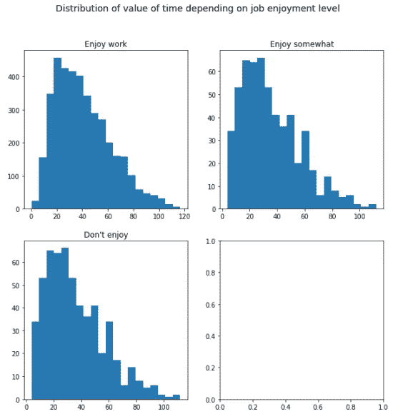
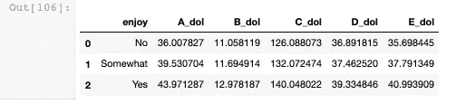
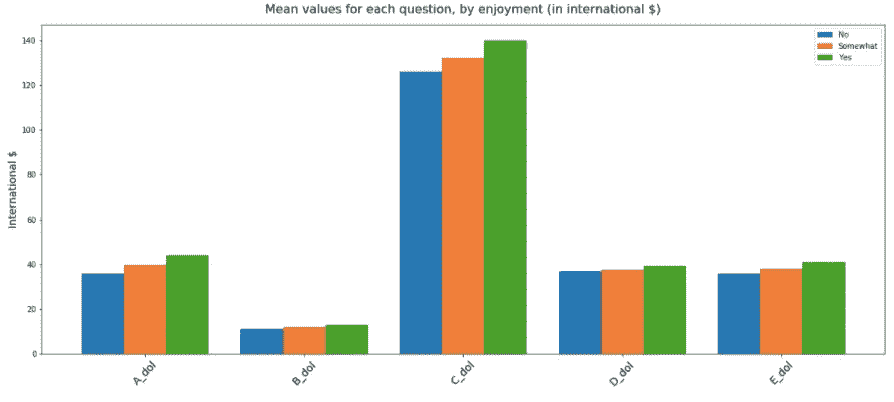
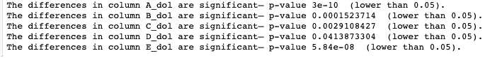
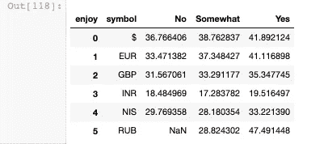
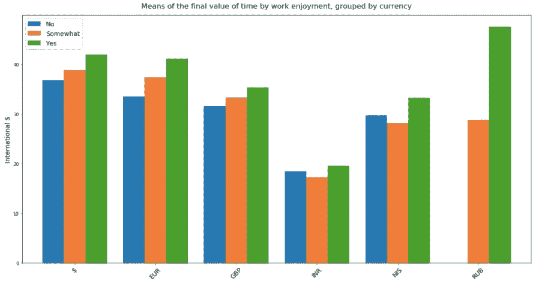

# 所有俄罗斯人都热爱自己的工作吗？🧐工作的乐趣如何改变你对时间的重视程度。

> 原文：<https://towardsdatascience.com/do-all-russians-love-their-jobs-how-work-enjoyment-changes-how-much-you-value-your-time-4daca4e7ba19?source=collection_archive---------47----------------------->

## 数据分析、统计和可视化 13k+对时间计算器值的响应

照片由 Malvestida 杂志在 Unsplash 上拍摄

你一小时的时间值多少钱？可以看看赚多少。但是，如果有人每小时多付你两倍的工资，你会像灰姑娘一样牺牲一个小时的空闲时间来分好的和坏的扁豆吗？

**你时间的价值不仅仅在于你得到了多少报酬。**你知道这一点，并有意无意地赋予自己的时间一个价值，基于这个价值，你在生活中做出选择。

对于如何支配时间，最好能做出更明智的决定。但是，你怎么能计算出你一小时时间的价值呢？

幸运的是，**有一个工具可以帮助你量化这个**。而且，根据人们的反馈，我们可以更多地了解工作和时间价值之间的关系。

# 什么？一个时间价值计算器？😯

[时间价值计算器](https://programs.clearerthinking.org/what_is_your_time_really_worth_to_you.html#.X_WMM2T0lQI) (VTC)是由研究机构 [Clearer Thinking](https://www.clearerthinking.org/) 开发的工具，该机构的“ [*使命*](https://www.clearerthinking.org/mission) *是弥合关于人类行为的研究与现实世界中的行动之间的差距。”*

VTC 是一个互动的在线测验，它让回答者面对不同的场景和发人深省的问题。完成大约需要 10 分钟，在回答完所有问题后，你会得到一个相当公正的估计，你有多重视他们的时间。(*那不是超级酷吗，btw？*)

该工具还询问了许多人口统计学问题，可以进一步洞察人们如何与他们的时间相关联。

# 💜热爱你的工作，热爱你的时间？

我们之前已经研究过就业状态之间的差异，并检查过[就业者是否比失业者更珍惜他们的时间](https://medium.com/swlh/cook-or-order-takeaway-how-employment-status-pay-level-changes-how-much-you-value-your-time-8dd3bf0c48f2)。

该工具还询问人们从工作中获得的快乐程度。

*现在，* ***这个*** *是一个有趣的数据点！我想。*

你从工作中获得的快乐程度会改变你对时间的重视程度吗？

总的来说，有 3947 人喜欢他们的工作，3321 人有点喜欢，568 人不喜欢。相当正面的画面。当然，这里可能存在自我选择效应——只有特定类型的人首先对使用职训局感兴趣。

这是每个工作乐趣级别的时间价值分布。

奖励第四个情节，你可以在那里画一只微笑的猫。😸

以下是每个享受组和每个问题的方法:

输出:

好吧，这告诉我们很少，但密谋救援！

输出:

*哇*，差异似乎真的很小。这张图表也让我想检查一下问题 C 是关于什么的，平均答案是如此之高。😲 [1]

但是！**在统计学领域，目测图表是不够的！**我们最好在不同的群体之间进行一些 t 检验，用一些实际的数字来告诉我们的直觉！

我们得到了白纸黑字的答案

嗯，现在看看这个！

似乎我们的**直觉错了**。当比较那些不喜欢自己工作的人和喜欢自己工作的人时，结果表明，他们在回答每个问题和珍惜时间方面的差异是显著的。

> 也就是说，你越喜欢你的工作，你就越珍惜你的时间。*(但请参见下面的备选解释)

检查其他值对之间的显著性也证明了:

*   那些只喜欢自己工作的人比那些喜欢自己工作的人更不珍惜自己的时间。
*   与那些不喜欢自己工作的人相比，有些喜欢自己工作的人在问题 A 的答案和时间的最终价值中有明显更高的价值。

所以，你对工作的享受程度对你如何评价自己的时间很重要。

这些结果可能有几种不同的解释。

*   享受程度越高，你就越有可能在职业培训中心描述工作场景的问题中给出更有价值的答案。
*   或者，通常喜欢活动(包括工作)的人更重视他们的时间。
*   或者，更珍惜时间的人，会做出更谨慎的工作决定，更有可能从事自己喜欢的工作。

# 🌏全球工作乐趣！

在数据集中，受访者的收入以下列货币计:美元(USD)、欧元(EUR)、英镑(GBP)、以色列谢克尔(NIS)和印度卢比(INR)。这些值被标准化为国际美元(根据 2019 年来自[经合组织数据](https://data.oecd.org/conversion/exchange-rates.htm#indicator-chart)的转换率)。

好了，这不是整个地球，只是其中的一部分。

让我们看看享受和时间的最终价值之间的关系在不同的货币中是否成立。

传入:平均值！

输出:

为你的视觉享受而策划。

输出:

在**类别中，没有俄罗斯受访者，这是否意味着所有俄罗斯人都喜欢自己的工作？**

*不，我们不要妄下结论。诚然，每个货币组中的受访者人数并不相等，有些人很少(卢布收入者是最小的群体)。因此，就结果而言，我将是**对美元、欧元、英镑和 NIS(后者次之)最有信心的**。*

*从上面的图表中可以看出一个令人惊讶的现象。在印度和以色列，那些不喜欢工作的人比喜欢工作的人更看重时间。这与我们之前看到的总体趋势相反，其他所有货币也是如此。*

> *工作乐趣越高，时间价值越高。*

# *🔮工作享受的未来(分析)*

*作为未来的一步，检查价值(享受和货币的时间价值)与平均年薪的平方是很有趣的。*

*工作假说认为，更高的年薪会带来更高的享受， ***和*** 会带来更高的时间价值。*

*如果这是真的，高收入者会非常珍惜他们的时间，即使他们厌恶自己的工作。*

*我敢肯定你有一个刻板的、最不喜欢的职业，很容易想到这个例子(那个有六位数收入却总是抱怨的朋友？).但是要小心情绪化的可用性偏见！*

*也许将来我们能够用真实的数字来检验这个假设。*

*[1]事情是这样的:*

*假设你有机会在一家你经常去的商店获得一张价值 100 美元的礼券，但是促销活动要求你在商店排队等候领取礼券。假设你有某种形式的最低限度的娱乐，那么你等待的时间既不会特别愉快，也不会特别不愉快。*

**多长时间* ***分钟*** *你愿意等多久？*”*

*如果你喜欢这种思维练习，并且想知道你到底有多珍惜你的时间，那么[看看这里的计算器](https://programs.clearerthinking.org/what_is_your_time_really_worth_to_you.html)。*