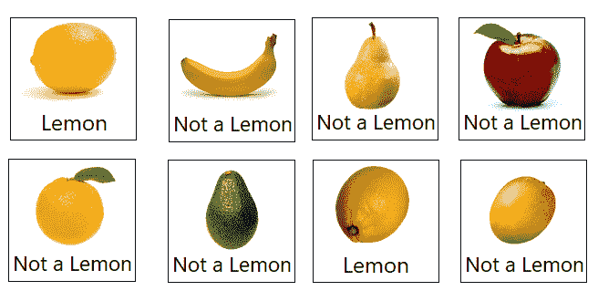
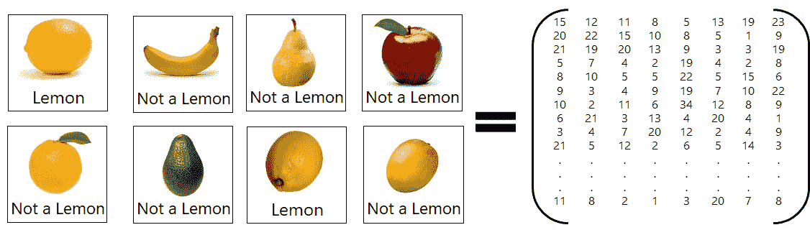
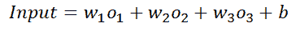
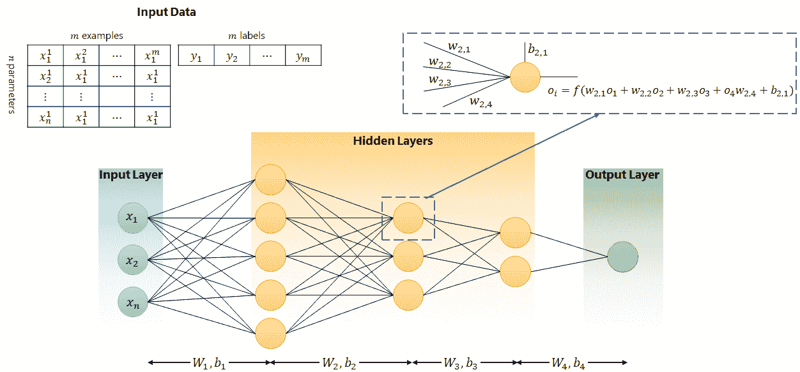
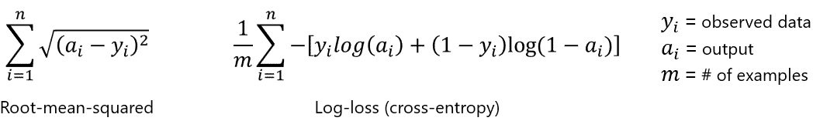
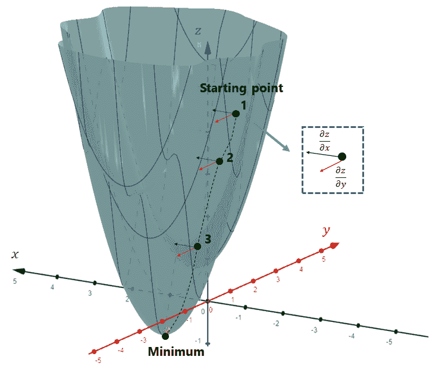
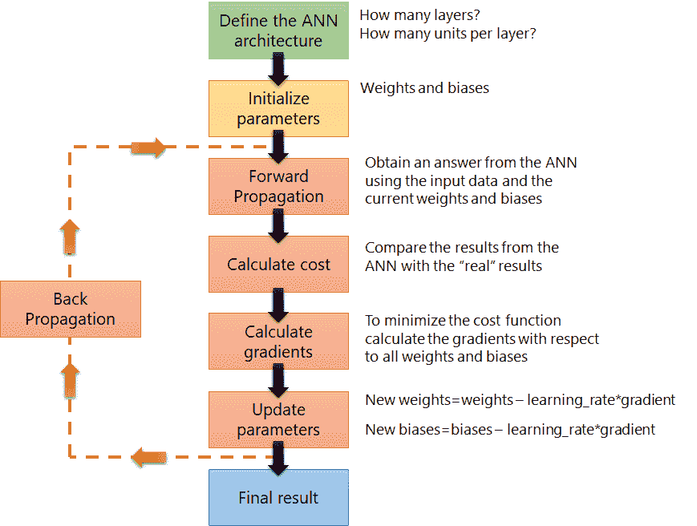

# 人工神经网络真的会学习吗？

> 原文：<https://towardsdatascience.com/do-artificial-neural-networks-really-learn-e6c3a4b09b55?source=collection_archive---------34----------------------->

## 或者他们的学习过程只是超铀星的另一个想法？

埃文·卡拉乔戈斯在 [Unsplash](https://unsplash.com?utm_source=medium&utm_medium=referral) 上拍摄的照片

*两千年前，一些穿着长袍的希腊人问自己，思想从何而来，我们如何学习。这些问题使他们成为重要的历史人物，并引发了一场持续的讨论。回答“我们如何学习？”可能会带我们经历一次世界各地哲学家和思想家的旅程。这与今天关于深度学习的讨论有什么关系？答案少了点哲理，多了点实用……*

# 深度学习前的一些深度思考

在我们生命中的某个时刻，我们一定听说过[苏格拉底](https://en.wikipedia.org/wiki/Socrates)、[柏拉图](https://en.wikipedia.org/wiki/Plato)和[亚里士多德](https://en.wikipedia.org/wiki/Aristotle)。也许你见过他们的大理石半身像，或者你试图在拉斐尔的壁画[中找出谁是谁，雅典学院](https://en.wikipedia.org/wiki/The_School_of_Athens)(实际上这并不是一件容易的事情！).他们不断地以不同的方式被绘制和描绘，几个世纪以来，人们一直在研究和分析他们的作品。柏拉图的语录是哲学讲座以及 t 恤和杯子背后的动力。他们和一切都有关系！甚至深度学习。

图一。[雅典学派](https://www.raphaelsanzio.org/The-School-Of-Athens-From-The-Stanza-Della-Segnatura-1510-11.html)。拉斐尔的壁画(1509-1511)

苏格拉底从未写过任何东西[1]。我们对他的了解都是因为他最著名的学生柏拉图。受到他的老师的学习的启发，柏拉图是第一个思考我们的想法和学习过程的人。简单来说，他认为学习就是记忆。根据柏拉图的说法，我们都来自一个灵魂的世界(他称之为[亥伯拉尼翁](https://en.wikipedia.org/wiki/Hyperuranion))，在那里我们对所有的思想有着完美的了解。当我们生活在地球上的时候，我们仅仅记得我们从灵魂世界所知道的事情。想法就在那里，我们只需要记住它们！

有时候，当我在等待我的[人工神经网络](https://en.wikipedia.org/wiki/Artificial_neural_network) (ANN)完成它的训练时，我会想到这个。也许人工神经网络也来自这样一个世界，在这个世界里，不管我们有多少个人工神经网络，它们的所有参数都是已知的。也许训练只是记忆？这总是给我希望！

柏拉图的观点受到了批评。柏拉图的一个学生亚里士多德说，不存在我们都来自的思想世界。对亚里士多德来说，人类有能力找到每天都知道的事物的普遍特征。如果我们第一次被带到超市，看到一堆柠檬，我们会知道它们都是柠檬，尽管它们不完全相同。柠檬又圆又黄的想法在所有的柠檬中是普遍的。我们不需要来自一个特殊的灵魂世界才能知道这些！我们的大脑足够聪明来概括这些特征，并提出柠檬的概念。对亚里士多德来说，学习不是记住那些不知何故已经深深埋藏在我们内心的想法。相反，亚里士多德认为我们从现实世界中每天感知和经历的事物中学习。

在亚里斯多德和柏拉图之后一千多年，[约翰·洛克](https://en.wikipedia.org/wiki/John_Locke)提出了类似的想法。他说，当我们出生时，我们的大脑就像一块白板，我们的经历和与世界的互动塑造了我们的思想，进而塑造了我们的人格。这与柏拉图的思想相矛盾，即大脑记得已经存在的事物，并引发了今天仍然活跃的讨论。现代[先天 vs 后天](https://en.wikipedia.org/wiki/Nature_versus_nurture)的争论包含了两种不同的观点:要么人类的行为是由我们的经历塑造的，要么我们的行为是由我们的基因决定的。

这一切和人工神经网络有什么关系？看起来，所有这些关于哲学家的故事和他们的想法与人工神经网络算法和 Python 库毫无关系。然而，这些事情之间的联系比你想象的更强。

# 人工神经网络

人工神经网络(ANN)是理解深度学习的关键。在对深度学习过程的每一个描述背后，都有一个人工神经网络，它被设计和训练来完成一个特定的目标。人工神经网络是一组接收和发送信号的连接单元(神经元)。人工神经网络的工作方式应该类似于我们大脑中神经元的交流过程。[2]在现实中，虽然 ann 和真正的神经网络有共同之处，但它们并没有那么相似。为了解释生物神经网络是如何工作的，我们需要谈论电和化学突触以及蛋白质和膜。解释一个简单的人工神经网络如何工作与其他事情有关。

在人工神经网络中，一组输入数据被输入到分布在不同层的单元网络中。输入数据根据每个单元的激活函数以及连接所有单元的权重和偏差进行转换。在网络的末端，最后一层检索输出，并将其与实际观察到的数据进行比较。到目前为止，人工神经网络一直在前向传播模式下工作，这意味着输入数据、激活函数、权重和偏差一起用于确定输出。将该输出与观察到的(真实)数据进行比较会触发人工神经网络中的第二个过程，称为[反向传播](https://en.wikipedia.org/wiki/Backpropagation)或简称为反向传播。在此过程中，输出和实际数据之间的差异用于调整连接所有单元的权重和偏差。通过[损失函数](https://en.wikipedia.org/wiki/Loss_function)计算出输出数据与真实数据的差距。[3]这种调整被重复多次，直到我们可以说人工神经网络被“训练”好。最好用一个例子来说明这一点。

# 苹果、橘子和柠檬

让我们假设我们正在开发一个能够区分柠檬和其他水果的人工神经网络。这类似于我们之前提到的例子，但并不相同(我们稍后将回到这一点)。我们首先需要的是输入数据。在这种情况下，我们应该有一个不同图片的数据库和一个标签，告诉我们这些水果中哪些是柠檬，哪些不是。该数据集的大小和质量是人工神经网络训练过程中最重要的方面之一。该数据集将允许我们将来自人工神经网络的结果与预期结果进行比较，并相应地调整权重和偏差。图 2 显示了一些水果及其标签的例子。这只是为了演示的目的。实际上，我们需要一个大于 8 个例子的数据集。

图二。示例中使用的小型数据集(取自 Microsoft Office 的图片)

像这样的数据集必须以一种算法可以解释的方式进行编码。对于这样一个简单的例子，我们可以将标签转换成一(1)和零(0)，并将图像[转换成 1D 数组](https://www.geeksforgeeks.org/how-to-convert-images-to-numpy-array/)，该数组考虑了图像的分辨率和每个像素的颜色。如果我们假设第一幅图像的分辨率为 30×30 像素，我们可以用一个 30×30×3[RGB 数组](https://docs.astropy.org/en/stable/visualization/rgb.html#:~:text=In%20general%2C%20an%20RGB%20image,opacity)%20value%20can%20be%20specified.)来表示该图像，该数组可以展平为一个 1D 数组，其中包含每幅图像的多个参数。这意味着具有 30×30 像素分辨率的 8 个图像的输入数据集可以被转换成包含 2700 行和 8 列的 2D 矩阵。请注意，这个过程是解释如何处理图像识别问题的简单方法。更可靠的方法是使用多维张量和使用[卷积神经网络](https://en.wikipedia.org/wiki/Convolutional_neural_network)【4】

图 3。如何转换数组中的图片(图片取自 Microsoft Office)

# 前进

输入数据不仅包含编码图像，还包含每个图像的编码标签。因此，对于图 2 的矩阵中的每一列，我们将有另一个矩阵，其标签指示图像是柠檬(1)还是不同的水果(0)。这些矩阵中的第一个通过左侧进入网络，如图 4 所示。这是正向传播过程的开始。每个示例的每个参数根据网络的架构以及权重和偏差的值进行转换。许多书籍和在线资源都包含了不同的例子和解释。[2，5]在这种情况下，可以说每个单元考虑了权重和偏差的值以及从左侧连接的单元的输出。每一条连接单元的黑线都有一个单独的权重( *w* )，每一个黄色和绿色的单元都包含一个单独的偏差( *b* )。因此，每个单元内部都有两个主要过程:

*   权重和偏差用于计算该单元的总输入。如果一个单元连接到三个单元，那么我们将需要这些单元的三个输出值、三个权重和一个偏差:

*   一旦我们有了这些值，我们使用每个单元的[激活函数](https://ml-cheatsheet.readthedocs.io/en/latest/activation_functions.html)将输入转换成每个单元的输出。激活函数是人工神经网络的核心。它们的主要功能是添加建立模式和关联进入网络的所有信息所需的非线性。如果你画出这些激活函数中的一些，你会注意到它们中的大多数是非线性的，这正是我们想要的:在单元和层之间建立非线性关系。

图 4。一个简单的人工神经网络方案(图片由作者制作)

关于人工神经网络的体系结构还有最后一件事要说，这与它的层次有关。图 4 所示的人工神经网络包含一个输入层、一个输出层和三个隐藏层或中间层。我们应该有多少层？每层多少单元？这不是一个简单的问题。层的大小和数量可以极大地改变人工神经网络的性能。更多的层或更多的单元并不一定意味着人工神经网络的性能会更好。人工神经网络的体系结构对于不同类型的问题可能是特定的，并且在决定正确的层数和单元数之前必须进行测试。对于与示例中出现的问题类似的问题，隐藏层的数量通常为 2–4[6]，但这可能会根据数据量及其质量而增加。包含两层以上的人工神经网络通常被认为是深度学习的一个例子[7]。

我们已经走了一半了。在这一点上，我们已经完成了第一次正向传播，我们最终得到了一个可以与标签矩阵进行比较的输出矩阵。这种比较将告诉我们我们的人工神经网络有多精确。通常，神经网络的初始权重和偏差是随机选择的。然而，对于人工神经网络的特定应用，情况可能并非如此[8]。在这种随机初始化权重和偏差的情况下，人工神经网络很可能会产生错误的结果。那我们要做什么？我们如何告诉人工神经网络一些苹果被错误地归类为柠檬？更重要的是，柏拉图的思想世界发生了什么变化？为什么这个安不能记住柠檬是什么？

# 回到超铀星

除了观察到人工神经网络不是真正的神经网络之外，还有一个事实，即人工神经网络的行为依赖于它的权重和偏差。如果这些参数是随机初始化的，那么我们几乎可以保证这个人工神经网络将在它的第一次迭代中错误地分类许多水果。我们需要一个过程来调整权重和偏差，这样我们就可以无误地执行分类。这个过程被称为反向传播。

在反向传播过程中，测量输出和观察数据之间的差异，然后用于在所有层上分布误差，改变权重和偏差。输出和观测数据之间的差异或误差可以用多种形式计算。我们可以使用[均方根](https://ml-cheatsheet.readthedocs.io/en/latest/loss_functions.html#mae-l1)误差，尽管在分类问题中，比如柠檬例子中的问题，通常使用[对数损失函数](https://ml-cheatsheet.readthedocs.io/en/latest/loss_functions.html)。这个函数被称为成本函数。

图 5。均方根和对数损失成本函数

计算所有输出和观察数据之间的误差将告诉我们人工神经网络在分类中有多精确。但是，这个数字不足以调整权重和偏差，也不足以改善网络的预测。反向传播背后的主要思想是有一种找到成本函数最小值的方法。请记住，任何成本函数都取决于观察数据( *y* )和人工神经网络的输出( *a* )。该输出是每层的权重和偏差以及输入数据的函数( *x* )。由于输入数据不可修改，调整成本函数最终值的唯一方法是修改权重和偏差。这种修改必须使最终成本尽可能低。因此，反向传播实际上是一个最小化问题。不过，这并不简单。成本函数取决于多个权重和偏差，这些权重和偏差随着添加到网络的每个单元或图层而增加。[3]那么如何解决这个问题呢？

# 如何反向传播

[梯度下降](https://en.wikipedia.org/wiki/Gradient_descent#:~:text=Gradient%20descent%20is%20a%20first,the%20direction%20of%20steepest%20descent.)的方法已经广泛应用于这类问题。它允许我们计算一个函数在特定点的梯度，这样我们就可以沿着这个方向，直到找到一个最小值。作为图形示例，请看图 6。它显示了一个依赖于两个变量 *x* 和 *y* 的函数。我们想知道 *x* 和 *y* 的值是多少，这将导致 *z* 的最小值。如果我们从 *x* 和 *y* 的随机组合开始，这是曲面中的一个随机点，我们可以计算出函数在那个特定点的梯度。这个梯度会告诉我们，如果我们想找到那个曲面的最小值，我们应该沿着哪个方向走。然后我们可以在那个方向上迈出一小步，再次计算梯度。如果我们重复这个过程足够长的时间，根据我们所拥有的表面类型，我们可以找到这个函数的最小值。

图 6。梯度下降(使用 [GeoGebra](https://www.geogebra.org/3d?lang=en) 绘制的 3D 图)

梯度下降法并不完美。不能保证找到的最小值是全局最小值。此外，它高度依赖于正在采取的步骤的大小。尽管如此，梯度下降已在许多不同规模和结构的人工神经网络中实施，并取得了良好的效果。更重要的是，这是理解人工神经网络如何被训练以及反向传播过程中发生了什么的好方法。如果你想尝试不同的优化方法，除了梯度下降，看看这个[链接](https://www.deeplearning.ai/ai-notes/optimization/)。

注意，如何通过函数对每个变量的偏导数，计算出从初始点到最小值的方向。一旦计算出这些偏导数，就从初始点中减去它们，以找到一个跟随梯度并接近最小值的新点。如果你不完全确定计算这些偏导数的效果是什么，或者你开始因为方程而担心，你可以阅读[这篇文章](/the-interesting-world-of-non-linear-regressions-eb0c405fdc97)或者做一个快速的在线搜索。这是一个简单的想法。

在图 6 的例子中，计算包括 *z* 相对于 *x* 和 *y* 的偏导数。然而，如果我们回到我们的人工神经网络的例子，你会看到，我们试图最小化的成本函数不仅取决于两个变量，而且取决于多个变量:每层上每个单元的权重和偏差。因此，我们将拥有与我们最初定义的权重和偏差一样多的权重和偏差梯度！最后一件事，还记得我们说过梯度下降法会指出我们应该遵循的方向，以找到最小值，一旦我们有了这个方向，我们就要朝着我们的最终目标迈出一小步。这一步有多小？这就是为什么我们在人工神经网络算法中又多了一个旋钮！[学习率](https://en.wikipedia.org/wiki/Learning_rate)[3]将定义该步长的大小。图 7 是一个简单的流程图，包含了人工神经网络工作流程中的所有步骤。请注意，在计算梯度后，我们必须通过从参数中减去梯度来更新参数。这些梯度乘以学习率。小的学习率将需要更多的迭代来找到最小值。一个大的学习率应该需要更少的迭代，但它可能有更多的问题要收敛。

图 7。人工神经网络流程图(图片由作者制作)

# 那么我们现在到底有什么，我们能用它做什么呢？

前面的例子只是真实的 ANN 实现的一瞥。正如我前面提到的，我们将需要一个更大的数据集和相当多的时间来调整层数和每层的单元数、激活函数、学习速率等。在此之后，我们应该使用不同的数据集(通常是原始数据集的子集)来测试人工神经网络的准确性。人工神经网络的一个常见问题是，它们最终经过足够的训练，可以在训练数据集上正确执行，但在不同的数据集上却给出糟糕的结果。这通常与较差的调优或架构规格有关。一旦我们完成了前面的所有步骤，并且对人工神经网络的性能有了信心，那么我们完成了什么呢？这个安学到了什么？

按照前面的例子，我们将有一个能够区分柠檬和任何其他水果的人工神经网络。我们给这个安一张任何水果的照片，它会告诉我们这是不是柠檬。请记住，每张图片都将作为 1D 数组进入人工神经网络，该数组中的所有值都将与每个单元和每个层的权重和偏差相互作用。在人工神经网络结束时，最后一层将输出一个值，该值将定义进入人工神经网络的图片显示的是柠檬还是任何其他水果。这个过程可以推广到许多其他应用。我们可以有一个人工神经网络，它的输出不是一个单一的值，而是由多个数字组成，这些数字将告诉我们图片是否对应于柠檬、苹果、香蕉或任何其他水果。通过更多的努力，我们可以建立一个人工神经网络来识别照片中是否包含汽车、自行车或交通灯。人工神经网络的应用是多方面的，并不仅仅与图像处理有关。一旦你对人工神经网络的工作原理有了清晰的认识，你就会发现我们日常生活的许多方面都与深度学习有关。不管应用程序的重要性和复杂性如何，人工神经网络背后的学习过程是一样的，事实上人工神经网络需要大量的数据来训练。

还记得我们说过柠檬标识符的例子和某人第一次去超市不完全一样吗？这个人以前对水果一无所知，他会试着辨别哪些水果是柠檬。这个人需要多少“柠檬——不是柠檬”的例子才能确定柠檬是柠檬？对于一个真实的神经网络，我们不需要很多例子。新生儿可能无法立即记住所有水果的名称，但他能够知道所有的柠檬，不管它们的大小、黄色和形状如何，都是柠檬，与香蕉或苹果完全不同。这个新生儿需要多少柠檬来概括柠檬的特征，并了解所有柠檬的共同点？肯定没有人工神经网络需要的多[9]。公平地说，我们的学习过程与人工神经网络的学习过程不同。人工神经网络真的会学习吗？如果他们这样做了，那么这将不是我们同样的学习过程。

# 柏拉图的形式，亚里士多德的共性，和安的隐藏层

在结束之前，让我们最后一次回到柏拉图、亚里士多德和先天与后天的争论。根据柏拉图的观点，我们在这个世界上看到的不是真实的东西。真正的是这些事物的“观念”或“形式”。在我们当前的世界里，没有完美的圆形或三角形。然而，我们知道完美的三角形或圆形应该是什么样子。这些“形式”代表了事物的本质，不知何故我们的头脑中已经有了这些信息。因此，学习就是意识到这些形式中的哪一种对一个特定的事物来说是独一无二的，从而可以定义它并将其与其他事物区分开来。

另一方面，亚里斯多德说事物之间有[的普遍特征](https://en.wikipedia.org/wiki/Aristotle%27s_theory_of_universals)。我们可以谈论柠檬的黄色或苹果的红色。然而，对于亚里士多德来说，这些普遍特征并不是自然而然地嵌入我们的头脑中的。它们是我们对现实世界体验的产物。在亚里士多德的观点中，我们可以看到一堆柠檬，并且知道它们都具有相同的黄色特征，尽管不是所有的柠檬都具有相同的形状，甚至不是相同类型的黄色。在这种情况下，学习是我们与现实世界互动的产物。我们的大脑能够定义事物的普遍特征，并知道哪些水果是柠檬，哪些是苹果。

人工神经网络与这些理论有什么关系？首先，很重要的一点是，使用人工神经网络的经典方法是随机初始化权重和偏差。这种随机初始化不同于柏拉图的一系列预先加载的想法或形式的想法。先验地知道正确的权重和偏见是什么，就像有一套预先加载的想法让我们学习一样。这在大多数情况下是不正确的。然而，柏拉图的理论可以解释为什么使用具有相同的初始权重和偏差集以及预先建立的架构的人工神经网络来解决类似的问题。尽管如此，没有一种权重和偏好的完美组合可以解决所有问题。人工神经网络可以在高度非线性的问题上有很好的表现，但对于看不见的数据，它永远不会达到 100%的准确性。

如果我们用亚里士多德的理论分析人工神经网络，那么我们会说，如果我们选择正确的架构，人工神经网络必须总是收敛到一个完美的结果。经过多次迭代并使用几乎无限的输入数据集后，人工神经网络将最终获得权重和偏差的正确值，结果将 100%准确。这对于简单的问题可能是正确的，但对于更复杂的问题，不幸的是，不能保证人工神经网络会收敛到一个完美的结果。的确，增加更多的隐藏层和使用不同的激活函数将有助于识别数据中的非线性关系。然而，这并不意味着人工神经网络将总是收敛到一个可接受的结果。

在现实中，人类和动物的学习是如何工作的可以解释，尽管有一部分信息在出生时就已经存在于大脑中，但学习还包括经验和与世界的互动。研究表明，大脑中神经元的连接方式在出生时就已经预先建立了[9]。这解释了为什么多种动物生来就有本能或指令来帮助它们完成基本的生存任务，如喂食或交配。这种知识已经存在于大脑中，它与包含在基因组中的信息有关，而基因组又是多年进化的产物。大脑中预装的信息补充了通过对世界的体验获得的知识。我们的学习过程是我们大脑结构(先天)和与世界互动(后天)的结果。

# 结论

虽然“学习”一词经常与人工神经网络联系在一起使用，但很明显，人类学习和人工神经网络学习是两个不同的过程。大脑结构的复杂性和复杂的人工神经网络结构之间有重要的区别。我们可以通过从以前的人工神经网络实现中继承权重、偏差和架构来模仿我们学习过程的一部分是天生的这一事实(这被称为[元学习](https://en.wikipedia.org/wiki/Meta_learning_(computer_science))，基本上包括发生在两个级别的学习过程，每个级别都与不同的时间尺度相关联[10–12])。然而，当正在使用的训练算法和我们大脑中发生的事情之间没有明确的平行关系时，我们仍然必须解决学习的“培育”部分。除此之外，记住人工神经网络的最终输出是通过多个层和单元评估的多个非线性函数的结果是很重要的。这个结果与使用的激活函数一样好。例如，仅具有线性激活函数的神经网络将不能识别非线性关系，不管其架构如何。

尽管它们之间存在明显的差异，但人工神经网络的设计遵循了生物神经网络的本质。这是人工神经网络重要改进的灵感来源，比如[卷积神经网络](https://en.wikipedia.org/wiki/Convolutional_neural_network)。真实的神经网络经常被用作人工神经网络应该是什么的参考。然而，我们应该谨慎对待我们可以从人工神经网络中期待什么，以及它的学习过程与生物学习有何不同。也许一个真正的神经网络只是一个想法或一种形式的人工神经网络应该是什么样子。在我们的内心深处，我们知道真正的学习是什么样子，我们知道可能永远不会有完美的人工神经网络。然而，我们与真实神经网络的互动和经验肯定会帮助我们提高对人工神经网络的理解，并使它们成为我们智力和推理的有力补充。

# 参考

1.  谁是苏格拉底？哲学最大的奥秘解读。大思考。
2.  主教，C. (2006 年)。模式识别和机器学习。斯普林格。美国纽约。
3.  Kantanforoosh，k .，Kunin，d .，Ma，J. (2019) [神经网络中的参数优化](https://www.deeplearning.ai/ai-notes/optimization/)。DeepLearning.ai。
4.  莫等(2019) [卷积神经网络结合集成学习算法的图像识别](https://iopscience.iop.org/article/10.1088/1742-6596/1237/2/022026/pdf)。物理学杂志。爵士。1237 022026
5.  叶，倪(2014)。数据挖掘。理论、算法和实例。CRC 出版社。美国佛罗里达州。
6.  深度神经网络赋值。[神经网络和深度学习](https://www.coursera.org/learn/neural-networks-deep-learning?specialization=deep-learning)(来自[深度学习专业](https://www.coursera.org/specializations/deep-learning)的课程 1)。Coursera
7.  [隐藏层数](https://www.heatonresearch.com/2017/06/01/hidden-layers.html)。希顿研究。
8.  Rudd-Orthner，R.N.M .，Mihaylova，l .在深度学习的智能城市应用中使用非随机权重初始化的可重复确定性。j 可靠的智能环境 6，31–49(2020)。[https://doi.org/10.1007/s40860-019-00097-8](https://doi.org/10.1007/s40860-019-00097-8)
9.  Zador，A.M. [对纯学习的批判以及人工神经网络可以从动物大脑中学习到什么](https://www.nature.com/articles/s41467-019-11786-6)。*国家共同体* 10，3770 (2019)。[https://doi.org/10.1038/s41467-019-11786-6](https://doi.org/10.1038/s41467-019-11786-6)
10.  桑托罗等人(2016 年)。[记忆增强神经网络元学习](http://proceedings.mlr.press/v48/santoro16.pdf)。第 33 届机器学习国际会议论文集。美国纽约。
11.  元学习的观点和调查。人工智能评论，18(2):77–95，2002。
12.  翁，L. (2018)。[元学习:学会快速学习。](http://lilianweng.github.io/lil-log/2018/11/29/meta-learning.html)