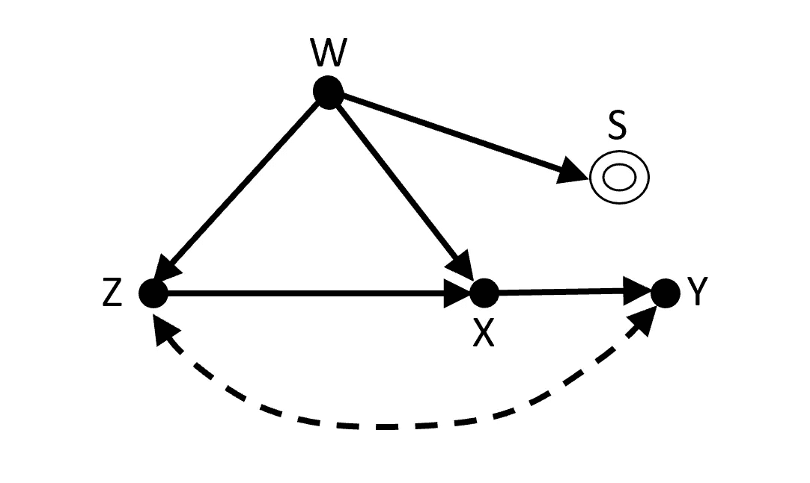
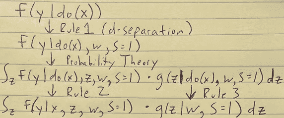
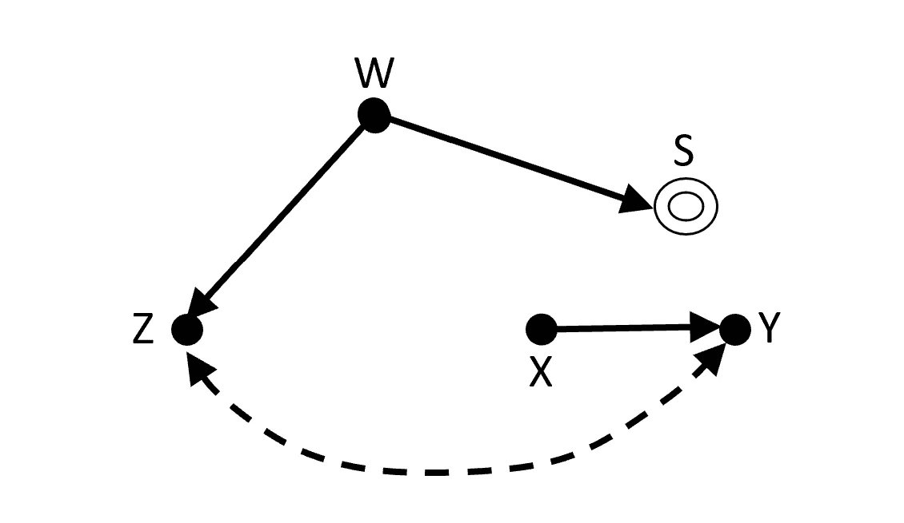
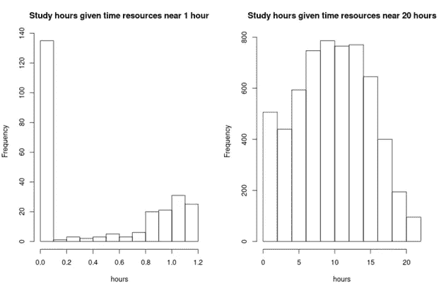
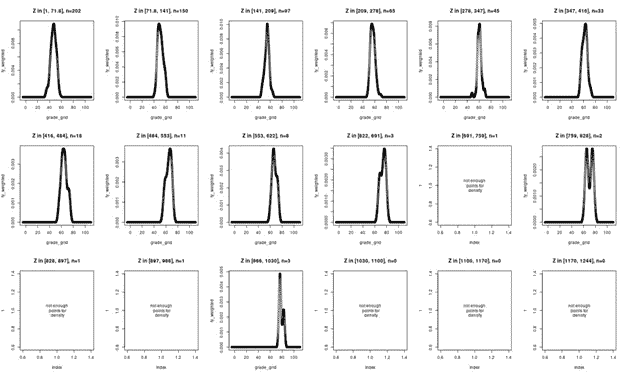
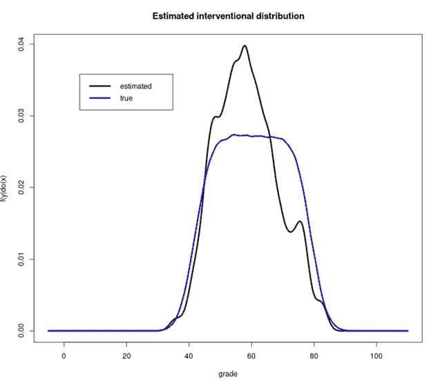
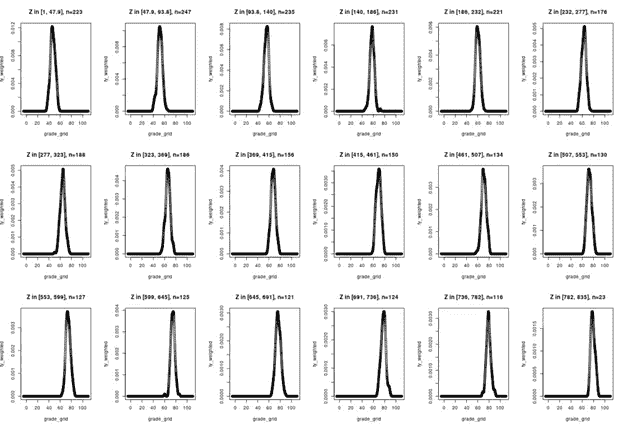
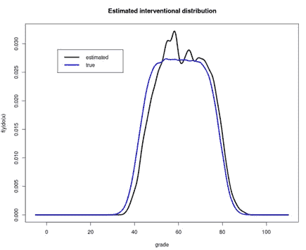
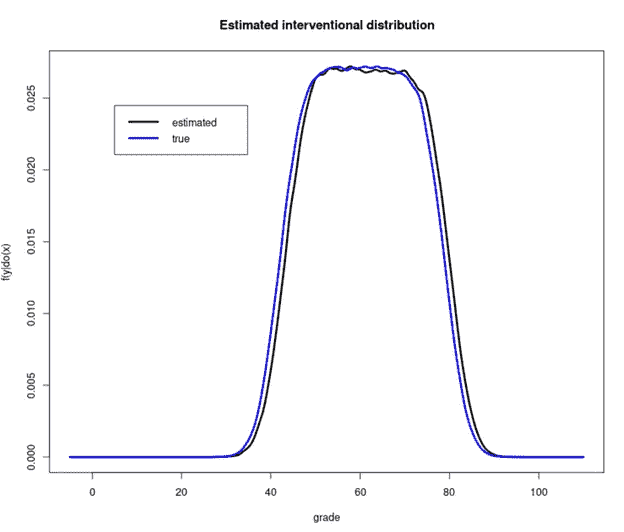

# 微积分和连续分布

> 原文：<https://towardsdatascience.com/do-calculus-and-continuous-distributions-866fb6a963bc?source=collection_archive---------27----------------------->

## [思想和理论](https://towardsdatascience.com/tagged/thoughts-and-theory)

## 连续分布对于 Do 演算来说没有概念上的困难，但是因果关系可能是容易的部分

当因果假设被编码在有向无环图(DAG)中时，可以应用[微积分](https://arxiv.org/abs/1210.4852)来寻找介入分布。然而，这些介入分布通常是难以估计的泛函。“*尽管这些方法获得了所有的能力，但仍然没有系统的方法来估计在计算和统计上都有吸引力的任意可识别泛函，”【Jung、Tian 和 Bareinboim [最近在 2020 年 6 月](https://causalai.net/r62.pdf)写道。通常，介入性分布用总和表示，至少暗示了离散变量(我还不理解算法)。*

Do-Calculus 的演示总是考虑离散分布，大概是因为这种区别对于推理的因果部分在概念上并不重要，也因为它允许使用二元变量的简单示例。即使对于高维的情况，从非参数估计的角度来看，比复杂的多元密度更容易想象知道一个大概率表是一场灾难。

本文探讨了微积分在连续变量中的应用。这是天真的，使用第一原则，并没有逃脱估计“灾难”我将介绍一个以非线性、非正态性为特征的人工数据生成过程，并匹配一个已知的 do-calculus 表达式，我希望这将有助于测试新方法。我会离散化为近似积分，但必须遵循一个规则:如果一个分布是连续的，用单变量核密度估计进行估计，数值积分得到下游量。不到 200 行的代码位于 Github Gist 中。

我们将会看到，虽然连续分布对于 Do 演算来说没有概念上的困难，但是维数灾难却赫然耸现。获得正确的 DAG 可能最终成为更容易的问题。

# 积分和微积分

本文从 Hünermund 和 Bareinboim 的[计量经济学中的因果推理和数据融合](https://arxiv.org/abs/1912.09104)中的选择偏差示例开始(第 A.2.2 节，2021 年 3 月 10 日修订)。从图中可以看出:

Hünermund 和 Bareinboim 的选择偏差示例的因果图(第 A.2.2 节)。图片作者。

出现了函数

Pr(y | do(x)) = \\sum_{z}P(y|w，z，x，s = 1)P(z|w，s = 1)。

为了说明和与积分在 Do-Calculus 表达式中是可以互换的，请考虑下面这个例子的论点概要，其中强调了 Do-Calculus 的三个规则的应用:

导致介入分配的 Do-Calculus 论证的手写草图。图片作者。

代替典型求和的积分完全来自概率论，除了首先需要扩展表达式之外，与微积分无关。

# 非线性连续数据生成过程

模拟数据很无聊，但我可以给它一个虚构。这是一个叠加在上面图 G 上的教室场景。这种观点认为，个人享有的“时间资源”既与上课有关(即选择机制)，也是学习材料中发现的“乐趣”和个人能够学习的时间的直接原因。不足为奇的是，享受学习的过程会比时间资源本身带来更多的学习。等级和享受之间的无向因果箭头被“主体亲和力”所取代，“主体亲和力”是一种潜在的自然能力，它决定了物质获得的难易程度，我们假设精神分析师无法获得这种能力。成绩本身只是投入的时间、天生的能力和一些噪音的结果。没有曲线；一个学生的成绩独立于所有其他学生。

**W:为考试学习的时间资源**，以小时为单位。

**W～γ(3，4)。**

**U:受试者亲和力**——在示例 7.3 中未提及，但将用作造成双向弧的未观察到的混杂因素。分析师未观察到的。

**U ~ Uniform(1，20)。**

**S:** 班级**招生二元指标。**

**Pr(S = 1 | w)** 是一个阶跃函数，在特定的时间资源水平上升:

*   **.1 如果 w < =5，**
*   **2 如果 w > 5，w < = 20，**
*   **.3 如果 w > 20。**

Z:在研究材料中发现的乐趣(分析师可能通过调查等获得)。).

**Z | w** 保持为 1，直到时间资源超过下限，然后与主题相似度成平方增加，与时间资源成对数增加:

*   **1 如果时间资源≤ 1.3，**
*   **subject _ affinity ^ 2 * log(1+time _ resources))**，否则。

**X:为考试而花在学习**上的时间。

**X| w，z** 是一个**截尾正态**，其均值随快乐指数的分数次方增加，但在左边受限于 0，在右边受限于时间资源

*   a **平均值为-1.5 + 1.5 * z ^ .35，**
*   一个****三个**的标准差**
*   **并且是不是**左边截成 0 小时，右边截成时间资源**(学习时数不能比自己多)。**

****Y:测试等级**。**

****Y| z，x** 正态分布，平均值随受试者亲和力线性增加，随研究时间对数增加**

*   **40 + u * log(1 + x)的平均值**，****
*   **一个**标准偏差为 4。****

**在移除流入 X 的所有箭头的“毁损”之后的介入 DAG 更简单:**

****

**来自 Hünermund 和 Bareinboim 的选择偏差示例的“残缺”图(第 A.2.2 节)。图片作者。**

**记住这个例子用单个混杂因素 u 代替了双向箭头，我们看到 y 和 s 之间的唯一路径 y z s 在条件集{x}下被碰撞器 z 阻塞了。因此，当从该机制进行模拟时，u 可以从 1 到 20 自由地均匀变化。**

**虽然观察数据生成过程相当复杂，但干预过程非常简单，导致等级分布基本均匀，具有轻微的正态尾部。即**

**Y = 40 + u * log(1 + do(小时))+ε，**

**其中 u ~均匀(1，20)，ε~正常(0，4)。对于 **do(hours =6)** ，我们预计 99%以上的所有等级的分布在 42 到 79 之间，并且正态尾部将范围扩展到 30 到 81。**

**我们生成的人口有 100 万人，我们非常大的 MOOC 有近 20 万名学生(198，111 人使用代码中提供的种子)。**

# **估计连续介入分布**

**第一个要问的问题是什么时候我们用时间资源(w)做什么？幸运的是，给定 x，y 和 w 是 d 分隔的，因为能够以 w 为条件解决了我们的选择偏差问题。但是 w 在表达式中两个密度条件的右边，从字面上理解，它告诉我们把它设置为一个值，然后离开它。您选择的哪个值会对观察到的花费时间(x)的条件分布产生影响:**

****

**给定时间资源(w ),花费时间(x)的条件分布。图片作者。**

**花费小时数(x)的数据生成过程将时间资源(w)作为最大可用小时数，因此这并不奇怪。虽然 do-calculus 没有说时间资源(w)的选择，但如果我们想插入 do(hours) = 6，我们将很难估计时间资源(w)设置为近 1 小时的条件分数分布，因为没有数据。这还是在以享受为条件之前(z)。**

**让我们将时间资源(w)设置为接近 20 个小时，我们在样本中观察一系列学习时间(x)。然而，当我们用快乐(z)来近似积分时，这个时候问题就出现了。对于 z 的几乎一半的可能范围，甚至没有两个点可用于估计密度 f(y|w，z，x，s = 1)。**

****

**没有足够的数据来估计每个 z-bucket 的 f(y|w，z，x，s = 1)。图片作者。**

**如果我们忽略这些洞并重新调整估计的密度，f(y | do(x))的估计就很差。**

****

**由于 z. Image 中的缺口，作者对 f(y | do(x))的估计不准确。**

**同样，我们的数据生成过程讲述了这个故事。随着乐趣(z)的增加，平均分数(y)也增加，这是通过学习更多小时(x)和通过选择拥有更高的平均学科亲和力(u)的影响。但是通过条件反射，学习时间(x)被固定在接近 6 小时，很少看到快乐时间(z)在这个范围的高端。忽略这部分分布会撕裂干预分布右侧的相当大的一部分，使得 6 小时学习的平均成绩看起来比它应该的要差。**

**我在时间资源上过滤的时候扔掉了很多数据(w)；可用的样本大小从 200k 到 15k。后来，当过滤得到接近 6 的小时数(x)时，样本量下降到只有 640。由于观察时间(x)的机制是它们不能超过时间资源(w)，例如，如果我们将时间资源固定为接近 6.6，由于天花板效应，我们将有更多的数据。虽然在过滤时间资源(w)时，最初的 200k 样本现在减少到只有 12k，但过滤接近 6 的小时数(x)仍然留下超过 2900 个观察值。这足以估计我们的 18 个享受(z)桶中的每一个的条件等级密度。(请注意，随着乐趣的增加，它们如何向右移动，表明平均分数更高。)**

****

**有足够的数据来估计每个 z 桶的 f(y|w，z，x，s = 1)。图片作者。**

**得到的介入分布的估计更好，尽管不是完美的:**

****

**f(y | do(x))的较好估计，仍然包含一些偏差。图片作者。**

**如果将样本量增加 200 倍(！)和 3 倍的 z 桶数量，您会得到一个非常接近的近似值。然而，这一事件仍不完美。**

****

**本文对 f(y | do(x))的最佳估计，尽管样本量很大，但仍不完美。图片作者。**

# **关于宁滨偏见的说明**

**对于这种第一原则方法，我称我的介入分布估计“足够好”然而，我必须诚实地说，即使拥有无限增加样本量的能力，我也无法消除所有的偏差(我尝试了一段时间)。**

**当我研究具有主体亲和力(u)的数据片段时(一个假设的分析师无法获得的变量)，即使对于相对较小的快乐值(z)，接近其下限 1 的 u 值也是罕见的。由于 z 与 u 成二次方增加，因此它相对于 u 快速增加。变量 z 和 u 在最小的 z 桶中紧密协变，在所有实际目的中，存在 1–1 关系(回想一下，z 的结构方程没有附加噪声)。然而，当 z 在其最小的桶中仅覆盖其范围的 3%时，u 覆盖其范围的全部 25%。尽管增加了样本大小和 z 桶的数量，我不认为我曾经完全克服了这一点。或许在 z 方程中加入噪声会有所帮助。**

**寻找偏差的其他地方是学习时间(x)和时间资源(z)桶的容差，但由于这些变量必须经过对数变换才能产生影响，因此小的偏差影响较小。**

# **最后的想法**

**我很想看看 Jung，Tian 和 Bareinboim 的加权分布方法是如何处理这个数据生成过程的。我将数据分类的方法是幼稚的，并且丢弃了宝贵的信息。另一方面，如果数据在一个地区不可用，它们就不存在，支持天真的一点是，这是(痛苦地)明显的。**

**当我第一次开始写这篇文章时，我打算使用 [RFCDE](https://github.com/tpospisi/RFCDE) 包的基于树的条件密度估计器。我转向分桶只是为了调试我自己的实现错误，但是后来我欣赏了分桶和单变量内核密度估计的清晰性，并继续使用它。我想回去用 RFCDE 进行实验，但我担心更复杂的条件密度估计器会让我不知道数据对于手头的任务来说是不够的，并且会得到一个非常有偏差的介入分布估计，而不知道有什么地方出错了。**

**也许有一种非参数贝叶斯方法，允许研究人员以有原则的方式“填充”分布差距。**

**我们的一个变量在等式的调节端，但没有被边缘化，这导致了一个不寻常的情况。因为这个变量可以固定在任何值，所以将这些估计值汇总起来是有意义的。然而，我们看到，当这个条件变量被设置为特定值时，核密度估计是没有希望的。也许一个更复杂的算法将只估计它能可靠估计的那部分介入分布，并在最后组合那些部分估计。**

**我原本计划在这个例子中引入评分曲线，但意识到这会使情况变得非常复杂，因为现在学生中存在博弈论干扰。我不知道如何扩展图表以适应评分曲线。**

**尽管我对微积分很着迷，但很难知道如何在实践中接近它。我可以预见未来，它将构成推理的框架，而各种分布假设将提供实体，这样你就不需要任何可以想象的超立方体中的数据。也许只是等待合适的软件，或者“杀手级应用”，一切都有意义。在那之前，孩子们，继续学习准备考试，不要听我的。**