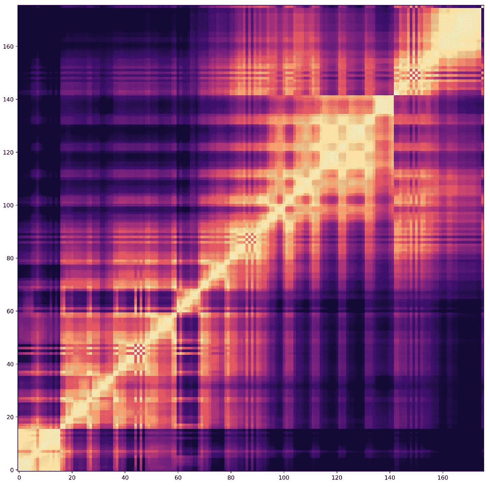
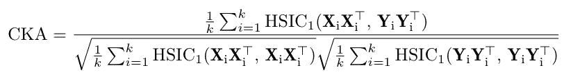
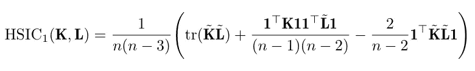
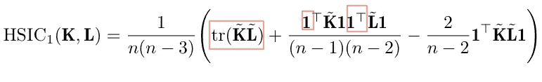
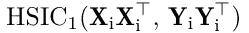
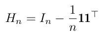
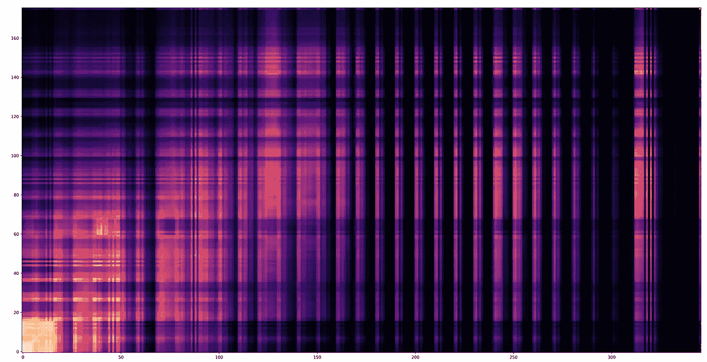
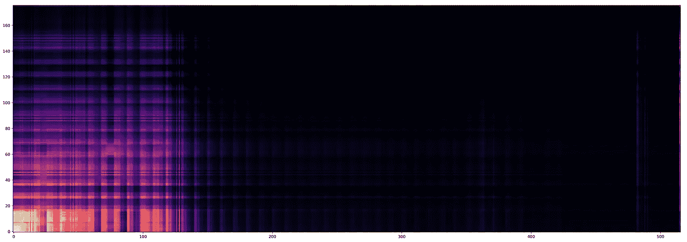

# 不同的神经网络学习的东西是一样的吗？

> 原文：<https://towardsdatascience.com/do-different-neural-networks-learn-the-same-things-ac215f2103c3?source=collection_archive---------16----------------------->

## 在 TensorFlow 中实现论文并对其进行注释

你有没有过一个数据集，问:这个模型学习的东西和那个模型不一样？这是阮*等人的疑问。艾尔。*在他们的论文“广泛的和深度的网络学习同样的东西吗？”[1].

# 概观

在这篇文章的其余部分，我引用报纸上的话

> 深度神经网络体系结构通常通过调整其宽度和/或深度来适应可用的计算资源。值得注意的是，这种简单的模型缩放方法可以为高资源和低资源体系带来最先进的网络(Tan & Le，2019)。

并在下面写下我的解释。

我将重点放在这篇 24 页论文的核心部分:建立网络和数据集，计算 CKA，并创建图表。这也是这篇文章的大纲:我们从一个简短的介绍开始，然后建立网络。然后我解释 CKA 分数背后的方程式。最后，我们编写代码，从纸上创建可视化。

# 介绍

> 我们应用 CKA (centered kernel alignment)来测量不同神经网络架构的隐藏表示的相似性，发现宽或深模型中的表示呈现出一种特征结构，我们称之为*块结构*。我们研究了块结构如何在不同的训练运行中变化，并揭示了块结构和模型过度参数化之间的联系——块结构主要出现在过度参数化的模型中。

基于后面显示的代码，我们可以通过比较两个模型之间的激活来可视化这样的块结构:

两个 ResNet50s 的激活比较。颜色越亮表示相似度越高。由作者创作，基于[1]。

# 实验装置

> [……]我们的实验装置由一个 ResNets 家族组成(何等，2016；Zagoruyko & Komodakis，2016)在标准影像分类数据集 CIFAR-10、CIFAR-100 和 ImageNet 上进行训练。

让我们把它写成代码。为了保持计算的可行性，我关注三个 resnet[2]:50、101 和 152；和 CIFAR-10 数据集[3]。

## ResNet50

最小的 ResNet 可以很容易地实例化:我们从 Keras 下载模型，并加载在 ImageNet 上预先训练的权重[7]。我们将输入形状设置为(32，32，3)，这是 CIFAR-10 数据集中一幅图像的形状。我们不需要完全连接的输出层，所以我们将 *include_top* 设置为 *False* 。最后，我们想要汇集输出层，这是一个 4D 张量，从我们的基本模型得到一个 2D 输出。由于我们的数据集中有 10 个类，所以我们包含了自己的密集输出层，其中有 10 个神经元和 softmax 激活。

最后，我们通过使用基础模型的输入作为输入，使用外部密集层作为输出来创建模型实例:

## ResNet101

对于较大的 ResNet101，过程类似:

## ResNet152

ResNet152 也类似:

## CIFAR-10 数据集

获取 CIFAR-10 数据集非常方便，因为它很容易从 TensorFlow 获得。我们下载训练和测试数据集，并将像素值从*0*–*255*重新调整到*0*–*1.0*，使它们成为浮点:

# 测量相似性

> 我们使用线性中心核对齐(Kornblith 等人，2019；Cortes et al .，2012)来度量神经网络隐藏表示之间的相似性。

如何衡量两个神经网络之间的相似性？一种方法是计算(隐藏)层的输出之间的相似性。

从概念上讲，这很简单:你获取一个数据批次，而不是仅仅捕获最终的输出，你还可以捕获任何隐藏层的输出。对两个网络都这样做，现在有两组激活:一组来自网络 A，一组来自网络 B

然后，对 A 的激活和 b 的激活进行两两比较，基本上就这样了。

但是，对于这样的*相似性*度量有一些要求:首先，它的范围必须在 0 和 1 之间，0 表示两个完全不同的激活(不相似)，1 表示两个相同的激活(相似)。此外，它必须处理不同形状的激活。

这个度量是(线性)居中的内核对齐[4][5]:

> 为了减少内存消耗，我们将 CKA 计算为对 k 个迷你批次计算的平均 HSIC 分数的函数:

> 其中，xᵢ∈r^(n×p₁)和 yᵢ∈r^(n×p₂)是包含两层激活的矩阵，一层具有 p₁神经元，另一层具有 p₂神经元，这两层激活是对相同的 n 个样本的小批量无替换采样。

在我解释这个等式之前，我们需要知道 HSIC 是什么:

> 我们使用的无偏估计量(宋等人，2012 年)，因此的值与批量无关:

> 其中~K 和~L 是通过将 K 和 L 的对角线项设置为零而获得的。

好了，让我们详细讨论这些等式，从 CKA 分数所基于的 HSIC₁开始:

## HSIC

HSIC 是希尔伯特-施密德独立性标准[6]的缩写，它衡量两个分布之间的统计独立性。在我们的例子中，这些分布就是激活。

让我们再看一遍[6]中的等式，但这次要突出重要的部分:

第一个框标记了 tr()操作符，它是矩阵的*轨迹*的缩写。矩阵的迹是主对角线上元素的和。我们计算轨迹的矩阵是修正的 **K** 和 **L** 之间的点积。

现在，为什么矩阵用粗体书写？来表明它们是矩阵；这是一个标准惯例。这也导致了第二个标记块，即 **1** :这是一个长度为 n 的向量，填充了 1(也称为单位向量)。

为什么我们知道它是向量还是矩阵？看最后标记的部分，**1**^t. t 表示我们调换了它左边的东西。现在，如果我们有一个正方形矩阵(n，n)，只填充 1，转置操作将没有任何意义(因为转置的正方形单位矩阵等于原始矩阵)。

最后，如何知道 **1** 向量的长度？这是由矩阵 **K** 和 **L** 的维数决定的，它们是方阵。它们是方形的，因为我们称 HSIC 为

在这里，我们计算原始矩阵与其转置后的第一个和第二个参数之间的点积。矩阵级的点积等于这两个矩阵的乘积。(在阅读了[4]之后，我决定坚持使用点积，他们在第 3 节中使用了这个命名约定)。由于我们将形状(m，k)的矩阵与其形状(k，m)的转置形式相乘，我们得到形状(m，m)的方阵。

> 我们使用通过在测试数据集上迭代 10 次获得的大小为 n = 256 的小批，在每个时期内采样而不替换。

这表明我们的矩阵以后将具有的维度:我们首先有一个形状(256，a* b * c *……)的激活，然后它变成(256，256)——一个正方形矩阵。

在代码级别，这会产生以下结果:

我们现在已经涵盖了 HSIC，我们可以继续与 CKA:

## CKA

CKA 是居中内核对齐[5]的缩写，它将 HSIC 归一化:

我们分数的命名者是一组激活的单个 HSICs 的总和。这是σ，它涵盖了所有单独的激活。这是

> 我们将 CKA 计算为在 k 个迷你批次上计算的平均 HSIC 分数的函数

简单地说，我们取几个批次(大小为 256)，分别捕获模型 A 和模型 B 的激活。对于每个批次，我们现在都有来自模型 A 和模型 B 的激活，我们用它们来计算 CKA 分数。

分母是归一化因子。

尽管 CKA 中的 C 代表居中，但我没有发现[1]中提到的居中过程。抬头一看，我发现

这类似于在计算 HSIC 分数的最后部分中使用的居中过程。

当在 python 中实现这一点时，对来自 CIFAR-10 数据集的一批 256 幅图像的计算需要一个小时。因此，我通过仅使用一个批次来减少计算量，去掉σ:

# 结果

> 我们通过调查模型架构的深度和宽度如何影响其内部表示结构来开始我们的研究。在不同的架构中，表示是如何通过隐藏层发展的？不同的隐藏图层表示彼此之间有多相似？为了回答这些问题，我们使用 3.1 节中概述的 CKA 表示相似性度量。
> 
> 我们发现，随着网络变得更宽和/或更深，它们的表示显示出一种特征性的*块结构*:许多(几乎)连续的隐藏层具有高度相似的表示。

让我们将它写入代码并验证:

我们首先在 CIFAR-10 数据集上训练我们的结果。为了加快计算速度，我们使用 TPU 和 256:

上面使用的*策略*对象来自 TensorFlow，管理 TPU 培训。一个历元需要大约 8 秒钟，由于本文/博客的重点不是高精度分数，我们将历元的数量设置为 10。

我们同样训练其他人:

对于较大的模型来说，这些时期大约需要 15 到 20 秒。

现在我们需要一些代码来计算两个激活之间的相似性。

我们首先展平除第一个通道之外的所有通道，这将形状(n，a，b，c)的矩阵转换为形状(n，a*b*c)的矩阵。在此过程中不会丢失任何信息。在重塑激活之后，我们可以计算它们的 CKA 分数。为了节省内存，我们随后删除它们，只返回分数:

这段代码需要两次激活，但是我们如何首先激活它们呢？为此，我们可以使用 Keras 后端:

我们编写了一个短函数，它接受一个模型，并返回一个*函数*，给定一个数据批次，该函数返回每个中间层的输出:

> 我们可以将结果可视化为热图，x 轴和 y 轴代表网络的图层，从输入层到输出层。

以下函数采用两个模型和一个数据批次。我们使用前面的方法来获取数据批次的所有隐藏激活。然后，我们为热图创建一个占位符:

> 热图开始时显示类似棋盘的表示相似性结构，这是因为残差连接后的表示比 ResNet 块内的表示更类似于其他残差后的表示。随着模型变得更宽或更深，我们看到一个独特的*块结构*的出现——相当大范围的隐藏层具有非常高的表示相似性(在热图上看起来像一个黄色的正方形)。这种块结构大多出现在网络的较后层(最后两级)。

基于前面的函数，我们可以通过调用

然后使用 pyplot 来可视化这个矩阵:

将 ResNet50 的激活与 ResNet101 的激活进行比较需要大约一个小时:

将 ResNet50 的激活与 ResNet101 的激活进行比较。

检查这个图像，我们看到开始提到的块结构，模型的前几层似乎学习非常相似的内部表示。随着层的增加，这变得更加多样化:垂直线(来自 ResNet101 的层的激活)与来自较小的 ResNet 的激活完全不同。

当将较小的 ResNet 与 ResNet152(在 Colab 上耗时 2 小时)进行比较时，这种空白变得更加明显:

比较 ResNet50 和 ResNet 152。

我们可以再次看到早期地层中的小块状构造。值得注意的是，大 ResNet152 的前 100 至 150 层似乎与小得多的模型的前 20 层非常相似。这可能表示过度参数化:

即使我们将参数数量从最小的 ResNet 的 25 636 712 增加到 ResNet152 的 60 419 944，但这些附加层似乎不会导致不同的表示。

[请记住，我的论证有几个缺点:由于资源有限，我只能计算一个批次的激活量，并且只能计算几个网络的激活量。鼓励读者使用我的代码，并用更多的批处理运行它]

视觉上明显的是下层的棋盘状图案。

就是这样。该代码可作为 Colab 笔记本[在这里](https://colab.research.google.com/drive/1O4_b74xB48o2RT8KofLjpmBtufV430Ka?usp=sharing)获得。

# 摘要

我们讨论了论文的核心部分[广泛的网络和深度的网络能学到同样的东西吗？](https://arxiv.org/pdf/2010.15327.pdf)。我们从设置三个 ResNets 开始，并准备了 CIFAR-10 数据集。然后，我们研究了本文背后的等式，并用 python 实现了它们。在最后一部分，我们编写了几个简短的函数来比较两个网络的激活，使我们能够创建类似于论文中的图形。

## 从这里去哪里？

有几个开放点:

*   实施激活的 PCA(第 5.1 节，共[1])
*   随着更多计算机训练更多的网络
*   使用更多批次来平均相似性

# 参考

[1]阮，*等*，[广网和深网学的东西一样吗？揭示神经网络表示如何随宽度和深度变化](https://arxiv.org/pdf/2010.15327.pdf) (2020)，arXiv

[2] K .何， *et。艾尔。，* [用于图像识别的深度残差学习](https://openaccess.thecvf.com/content_cvpr_2016/papers/He_Deep_Residual_Learning_CVPR_2016_paper.pdf) (2015)，IEEE 计算机视觉与模式识别会议论文集

[3] A .克里热夫斯基， *et。艾尔*。，[从微小图像中学习多层特征](https://www.cs.toronto.edu/~kriz/learning-features-2009-TR.pdf) (2009)，*技术报告*

[4] S. Kornblith 等。艾尔。，[再谈神经网络表示的相似性](http://proceedings.mlr.press/v97/kornblith19a.html) (2019)，机器学习国际会议

[5] C .科尔特斯，*等。艾尔。*，[基于中心对齐的学习核算法](https://www.jmlr.org/papers/volume13/cortes12a/cortes12a.pdf) (2012)，机器学习研究杂志

[6] L .宋， *et。艾尔。*，[依赖最大化的特征选择](https://www.jmlr.org/papers/volume13/song12a/song12a.pdf) (2012)，机器学习研究杂志

[7] J. Deng *等*，Imagenet: [一个大规模的层次化图像数据库](https://ieeexplore.ieee.org/document/5206848) (2009)，IEEE 计算机视觉与模式识别会议