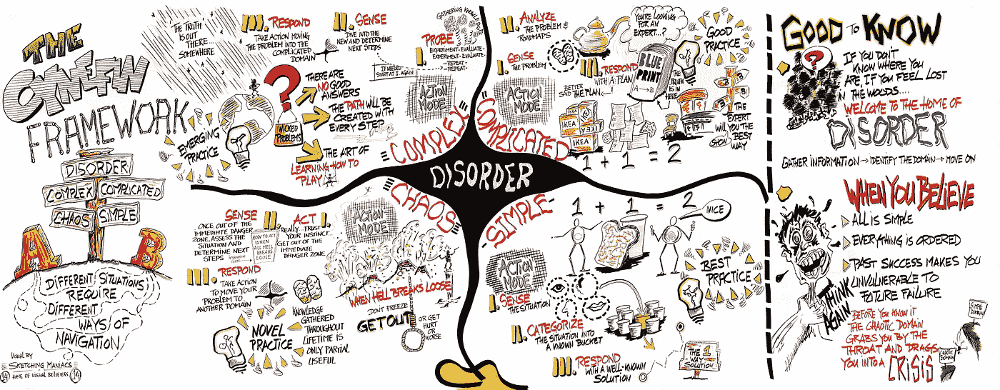

# 如果你想要更大的价值，你的框架需要复杂性吗？

> 原文：<https://towardsdatascience.com/do-frameworks-have-to-be-complicated-to-have-value-f2e72a6cc52b?source=collection_archive---------17----------------------->

## 简单性、复杂性和有效性的权衡

[埃德温·斯托普的 Cynefin 框架——维基共享资源](https://en.wikipedia.org/wiki/Cynefin_framework#/media/File:Cynefin_framework_by_Edwin_Stoop.jpg)

# 名称又能代表什么呢

什么是“框架”？按照韦氏词典的定义，它是“*(关于思想的)一个基本概念结构*”。基本的*和*概念性的。没有比这更模糊的了。然而，如果你从事数据或技术工作，你无疑会使用或参考数十或数百个框架。通常被发明来简化复杂的概念或问题领域，框架也提供指导方针或边界，并影响在其中开发和迭代的意识形态和模式。

框架是导航决策、教学和创建结构的有用工具。它们可能非常复杂或者非常明显，但是在这些框架的复杂性和通过实现或者意识到一个给定的框架可以实现的价值之间有直接的关联吗？

## 数据科学

在编程的上下文中，框架是一种抽象，其中提供通用功能的软件可以被附加的用户编写的代码选择性地改变，从而提供专用软件。它提供了一种构建和部署应用程序的标准方法，是一种通用的、可重用的软件环境，提供特定的功能作为更大软件平台的一部分，以促进软件应用程序、产品和解决方案的开发。”

作为一名日常工作中的数据科学家，您可能至少使用过其中一种软件框架，如 Scikit-Learn、TensorFlow、Pandas 或 PyTorch。从完整的端到端平台到 Python 等语言的抽象或扩展，所有这些都是为了使某些东西更容易访问、扩展或重复。

根据不同的用例，经验较少的数据科学家可能无法想象没有这些框架的工作。

复杂但有价值。

## 数据治理

如果数据治理属于您的权限范围，那么您要么继承了前任的框架，要么更有可能负责创建一个。您将考虑组织内的角色、流程或规则、数据观察或完整性检查，以及法规遵从性需求，作为该框架关注的许多领域中的一部分。

尽管这并不确定，但开发一个复杂而详细的数据治理框架通常是所有这些努力的结果。

毕竟，您的数据治理框架在确保与推动组织前进的数据相关联的质量、完整性、安全性和读写能力方面负有重大责任。

复杂但有价值。

## 决策和领导

自 1999 年由前 IBM'er Dave Snowden 创建以来，Cynefin 框架已经被应用于多个领域，包括高管培训、项目管理和软件开发等。如果你不熟悉，Cynefin 框架被描述为一个有意义的框架，其中给定的情况或挑战可以被分为五个领域之一。

简单或显而易见的领域包括没有辩论或提问余地的情况。有些人可能会将这些情况归类为已知、熟悉、可重复和可预测的“常识”情况。例如，产品 A 的销售下降，因此整体销售下降。

复杂领域虽然也是可预测的，但比简单领域的一对一因果关系更复杂。这些是已知但不熟悉的情况，专家可能会进行分析，然后确定因果关系。这里的例子是产品 A 的销售下降了。在额外分析前后看到这种模式后，数据团队确定了推动 80%负产品 A delta 的三个关键市场。

该框架的另外两个象限包括不可预测的情况。复杂的情况是不熟悉的，只有在事后才能感知。没有历史先例，因果关系也完全未知。例如，产品 A 的销售下降，数据团队在数据中看不到趋势。回顾我们的例子，我们可以确定网站上的产品页面有一个 bug，因此禁止了产品 A 的销售。第四象限，混乱的情况，需要在有限或没有范围的情况下立即采取行动。一些用户的网站关闭了。我们不知道为什么，针对什么用户，或者对销售会有什么影响。当务之急是让网站重新上线，把这种情况推回到复杂的领域。

Cynefin 框架象限都围绕着第五个领域，无序，在这一领域，情况要么在被分类之前，要么在四个象限之间移动。

此时，您可能已经对 Cynefin 有了清晰的理解，或者，您可能已经重读了几个段落，因为您想到了真实世界的应用程序。我们已经做了一个简单的分解，从根本上说，是一个模糊而简单的框架。然而，正是这种模糊性导致了普遍的应用，这也是 Cynefin 框架的实用性和复杂性的最终来源。

简单的，复杂的，复杂的，混乱的，有价值的。

# 只是简单有价值？

无论是在数据科学、数据治理还是领导力领域，正如这里所示，我们每天使用的大多数框架要么非常复杂，要么简单到足以变得复杂。但是，一个框架是否需要成为我们从中获取价值的工具？

例如，在“[每个新分析师应该关注的 4 个可怕的简单领域](/4-areas-every-new-analyst-should-focus-84020068baa4)”中，我描述了一个我创建的框架，以帮助分析师(或任何其他人)在加入新组织时快速获得他们的数据方位。它并不详细，但提供了如何通过“我如何理解数据？”进行思考的清晰理解

你发现哪些简单的框架最有价值？这里有一条走钢丝，将一个构造简化到标准化的程度，即“框架”，但不要创建过于精炼以至于在应用中变得复杂的东西。也许在我们开发下一套伟大的标准、流程或框架时，我们应该记住这一点？

简单又有价值。

[***请关注我或通过我的推荐链接注册媒体来支持我的写作。谢谢！***](https://datadfw.medium.com/membership)

## 参考

—框架—[https://www.merriam-webster.com/dictionary/framework](https://www.merriam-webster.com/dictionary/framework)

—软件框架—[https://en.wikipedia.org/wiki/Software_framework](https://en.wikipedia.org/wiki/Software_framework)