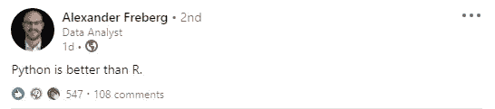

# 我需要一个学位才能在数据科学领域找到工作吗？

> 原文：<https://towardsdatascience.com/do-i-need-a-degree-to-land-a-job-in-data-science-3e50b9a1a5e9?source=collection_archive---------45----------------------->

## 探索数据科学求职时学位的必要性

[MD 杜兰](https://unsplash.com/@mdesign85?utm_source=medium&utm_medium=referral)在 [Unsplash](https://unsplash.com?utm_source=medium&utm_medium=referral) 上的照片

这个问题的简单答案是否定的！有许多从事数据科学工作的人没有学术证书来证明他们的角色——我就是其中之一。然而，随着时间的推移，我反对学士学位、硕士学位和博士学位计划的严格立场颇有意思地软化了。

嗯，算是吧。我现在并不觉得它们完全没有用……我仍然相信，在某种程度上，关注某人的实际工作经验胜过他们的教育，即使我们看看科技领域一些最伟大的成就者，他们中的许多人都是辍学生——马克·扎克伯格、比尔·盖茨和史蒂夫·乔布斯，仅举几例。

但我并不是建议所有希望在数据科学领域谋得一席之地的大学生都应该退学。获得学位有许多好处，例如，众所周知，大学毕业生一生中比未毕业的人挣得更多，此外，你还可以获得纪律等基本好处，如果你选择了技术学位(科学、技术、工程、数学)，你将在数据科学的一个关键领域拥有深厚的基础知识。

> “相反，把你在教育中的时间看作是建立一个有吸引力的网络的机会，这个网络将在你离开后为你做好适当的准备。”

本质上，成为一名数据科学家需要很好的编程、数学、统计和概率知识，以及对业务部门的理解。如果你能够有效地展示你有这些能力，那么它很可能会战胜你可以吹嘘的大多数证书。因此，要积极寻找作为数据科学家的第一份工作，请考虑发展以下领域:

## **编程技巧**

数据科学最常用的编程语言是 Python 和 r。为了开始探索数据，您必须至少学习其中一种工具。

我的 LinkedIn Feed 上一篇有争议的帖子(**来源** : [亚历山大·弗雷伯格帖子](https://www.linkedin.com/feed/update/urn:li:activity:6752637240578600960/?commentUrn=urn%3Ali%3Acomment%3A(activity%3A6752637240578600960%2C6752886514855768064)))

数据科学家在应该选择哪种编程语言的问题上意见不一——有些人对另一种语言的厌恶并不那么圆滑。我尝试了这两种语言，发现 Python 更容易学习，效率也更高。它还比数据科学有更多的用途，如果你打算在其他领域培养技能，数据科学会有所帮助。

## 数学、统计和概率

简单地说“图像有可能是一只猫”不如“图像有 80%的可能是一只猫”有说服力。这是一个相当枯燥的例子，但是你应该使用统计学和概率来分析和解释你得到的任何数据。

此外，许多用于数据建模的算法需要很好地理解数学中的不同主题，如线性代数和微积分(以及统计和概率)。它有助于理解在您的算法下发生了什么，以用于调试目的，以及在审计事件中或如果客户想知道他们为什么被拒绝贷款时的可解释性。

## 项目组合

数据被高度视为“新的石油”，地球上的每个人都在产生大量数据，这一观点在考虑数据科学时非常重要。数据科学家必须从生成的大量复杂数据中提取数据，并突出对业务有益的点，因此需要领域专业知识(这可以是数据科学家或团队中的某个人)。

无论如何，你必须能够证明你能够完成你所说的所有任务，所以有一个令人信服的投资组合来检查各种问题和这些问题的解决方案是有帮助的。

## 建立工作关系网

古老的格言“你的网络就是你的净值”在数据科学中比以往任何时候都更加突出。说到底，这个领域是新的，没有很多标准来区分优秀的从业者，除非你雇佣他们并发现——这意味着投资的巨大风险。因此，在获得第一个数据科学职位时，有人可以为你担保是非常有用的。

此外，将自己融入数据科学文化是开发和学习数据科学新知识的好地方，也能让你体验到找到第一份工作的感觉。

## 包裹

我个人认为，当你决定寻找数据科学家的角色时，你是否有学位并不重要。最终，招聘公司认为他们有一个包括数据在内的问题，他们需要一个精通数据的人来帮助他们更深入地研究这个问题，以便公司能够发展——这并没有说需要学位。然而，为了有效地完成数据科学家的工作，你必须具备一些必要的技能，但互联网已经使在线学习许多(如果不是全部)这些技能成为可能，而不必负债。

感谢阅读！

通过 [LinkedIn](https://www.linkedin.com/in/kurtispykes/) 和 [Twitter](https://twitter.com/KurtisPykes) 与我联系，了解最新动态。

## 其他最近帖子:

</data-scientists-get-comfortable-being-stressed-192dd974a848>  </data-science-i-wonder-if-its-still-sexy-in-2021-b68006c78f71> 