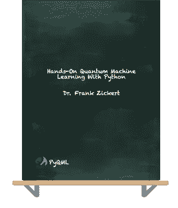

# 我需要博士学位才能在量子机器学习领域找到工作吗？

> 原文：<https://towardsdatascience.com/do-i-need-a-ph-d-to-land-a-job-in-quantum-machine-learning-328aeea4a0c6?source=collection_archive---------15----------------------->

## 我关于量子计算下一个挑战的两个量子

量子机器学习要不要入门？看看 [**动手量子机器学习用 Python**](https://www.pyqml.com/page?ref=medium_needphd&dest=/) **。**

作者图片

上周，我和量子机器学习的同学们进行了两次有趣的对话。有趣的是，他们都有一个主要的担忧:“ ***我在学习量子机器学习方面的努力会被认可吗？我需要一个正式的证书甚至是博士学位才能在量子机器学习领域找到工作吗？*** ”

当然，如果说我知道在量子机器学习领域找到一份工作需要什么样的正式资格，那就太冒昧了。毕竟我不是这方面的招聘人员。

所以，我能给的只有**我的两个量子。**

“我的两美分”是“我的两便士价值”的简写这是一种表达个人观点的方式，并表示它只值两便士。虽然我喜欢这种仅用两美分来评估观点的谦逊方式，但它在量子计算的背景下是不合适的。因为一个量子(复数量子)是任何物理属性的最小可能离散单位，我相信“我的两个量子”是对我的观点的更好的度量。

巧合的是，我最近读了一篇[文章](https://www.zdnet.com/article/quantum-computings-next-challenge-finding-quantum-developers-and-fast/)，揭示了量子计算公司难以找到合适的候选人，以及他们为什么要找博士。了解雇主真正想要的是什么是你在找工作时的优势。

注:引文格式的段落直接或间接取自那篇文章。

> “雇主需要拥有跨学科技能的量子员工:除了量子物理学背景之外，还必须具备数据分析、工程、建模或编程等方面的经验。这种专业化水平并不常见；事实上，它大多存在于博士阶段。”

如果我们仔细阅读这段引文，它澄清了一个普遍的误解。(好的)雇主不会为了一个正式的资格证书而去寻找它。他们需要一个能胜任这项工作的人。正式资格是一种手段，因为他们发现这与优秀的候选人相关。他们真正需要的是精通一套特定跨学科技能的候选人。

学士和硕士课程通常专注于某一学科，如物理、数学或计算机科学。但是我们还没有那些教授所需混合的项目。但是作为一个博士，你通常会定义自己的具体范围。雇主寻找的是你为自己设定的范围。它不是一张写有你名字的纸。

因此，重要的问题不是你是否有博士学位，而是你是否能在正确的技能组合中展示这种专长。

> “找到拥有合适技能组合的人是最大的挑战，”剑桥量子公司量子软件主管罗斯·邓肯告诉 ZDNet 。“在我们雇佣的人中，只有极少数人在进门时就准备好开始工作了。”

作为一个对进入这个领域感兴趣的人，你能做的最好的事情就是发展这些技能。所以，第一步是弄清楚[你需要的技能](/thinking-about-a-career-as-a-quantum-machine-learning-engineer-9b89bdf3d1e1)。然后，做一个自我评估。哪些技能你已经具备，哪些技能你还欠缺？最后，你需要填补空白。

这在理论上听起来很简单，但在实践中却非常棘手。而且，我甚至没有提到实际的学习。真正棘手的部分是如何证明你填补了空缺。这又回到了正规教育。现在不仅大学提供文凭。几乎所有在线课程都提供一些认证。

但是如果你更喜欢读一本好的旧书呢？也许，你甚至读了一大堆书。你可能在学习上投入了很多时间。但是你不会拿到毕业证或者证书。那么，这是否意味着你所有的努力对于找到一份工作来说毫无价值？

我完全能理解你渴望一个正式的证书来证明你的能力。但是如果我们仔细想想，我真的怀疑正式证书能证明什么。相信在没有真正掌握各自领域的情况下，你也能拿到很多证书。

所以，我们再从招聘者的角度来看一下。招聘人员正在寻找一个在跨学科领域具有非凡能力的人。她知道自己需求的特殊性。她要找的东西没有蓝图。因此，她必须单独评估每个候选人。当然，她可能会马上拒绝那些完全没有受过教育的候选人。但是如果你有大学的计算机科学学位，我认为你有资格被进一步考虑。

不要误解我。进一步考虑，我的意思不是你已经得到了那份工作。我都不说她会邀请你面试。但是，我想说她会检查你的简历，看看你能提供什么。

现在，你需要一些突出的东西。这是你展示自己专业技能的机会。但我怀疑一份证书清单能解决问题。

相反，我会遵循一个简单的规则:

> 秀，不要说。

最好，你能证明你不仅点击了在线课程，而且你能够应用你的知识。

拥有一份其他学科的作品集是很好的实践，比如软件开发或数据科学。它展示了你做过的项目。理想的是，这些都是真实的案例。但是量子机器学习是一个新的领域。所以，你应该可以展示你是如何在开源数据集和典型问题上应用你的知识的。

作品集是你可信地展示你如何填补了正规教育中的空白的机会。此外，除了正式的证书，它还提供了与招聘人员建立信任的途径。

请记住，量子机器学习是一个新兴领域。还没有典型的资质。这不仅是应聘者的问题，也是招聘人员的问题。作为唯一资格的替代，招聘人员要求候选人具备下一个最好的条件——博士

所以，我的建议是不要被过于具体的正式要求吓倒。还有，也不要沉迷于证书。相反，确保你掌握了要求的技能。以任何适合你个人学习方式的方式来做这件事。但是，一定要展示你所学到的东西。

> 据估计，到 2030 年，量子计算产业将成为一个 650 亿美元的市场

如果这一预测接近事实，对技能的需求将超过对正式头衔的需求。

> 随着企业在不久的将来开始争夺大量合格的求职者，现在可能是开始学习的好时机。

量子机器学习要不要入门？看看 [**动手量子机器学习用 Python**](https://www.pyqml.com/page?ref=medium_needphd&dest=/) **。**

在这里免费获得前三章。