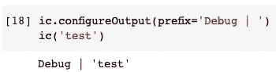

# 不要再在 Python 中使用 Print 进行调试了

> 原文：<https://towardsdatascience.com/do-not-use-print-for-debugging-in-python-anymore-6767b6f1866d?source=collection_archive---------0----------------------->


图片来自 [Pixabay](https://pixabay.com/?utm_source=link-attribution&utm_medium=referral&utm_campaign=image&utm_content=3611698) 的 [RitaE](https://pixabay.com/users/ritae-19628/?utm_source=link-attribution&utm_medium=referral&utm_campaign=image&utm_content=3611698)

## Python 中用于调试的改进的“打印”函数

Python 中最常用的函数是什么？嗯，可能在大多数编程语言中，它必须是`print()`函数。我相信大多数像我一样的开发人员会在开发过程中多次使用它将消息打印到控制台中。

当然，没有替代方案可以完全取代`print()`功能。然而，当我们出于调试目的想要输出一些东西时，肯定有更好的方法。在本文中，我将介绍一个非常有趣的 Python 第三方库，名为“Ice Cream”。它可以为快速简单的调试提供很多便利。

# 一个坏例子


图片来自[pix abay](https://pixabay.com/?utm_source=link-attribution&utm_medium=referral&utm_campaign=image&utm_content=350376)Krzysztof Pluta

先说一个相对不好的例子。假设我们已经定义了一个函数，我们想看看它是否像预期的那样工作。

```
def square_of(num):
    return num*num
```

这个函数只是返回作为参数传入的数字的平方。我们可能需要多次测试，如下所示。

```
print(square_of(2))
print(square_of(3))
print(square_of(4))
```


现在这样还可以。然而，在实践中我们会有更多的代码行。此外，可能有许多`print()`函数将不同的东西打印到输出区域。在这种情况下，有时我们可能会搞不清楚哪个输出是由哪个`print()`函数生成的。

因此，给`print()`函数的内容添加一些简短的描述来提醒我们它是关于什么的是一种很好的方式。

```
print('square of 2:', square_of(2))
print('square of 3:', square_of(3))
print('square of 4:', square_of(4))
```


现在好多了，但是每次都这样太累了。此外，当我们完成开发时，很可能不得不删除大多数调试打印。

# 基本用法—检查变量


图片由 [StockSnap](https://pixabay.com/users/stocksnap-894430/?utm_source=link-attribution&utm_medium=referral&utm_campaign=image&utm_content=926426) 来自 [Pixabay](https://pixabay.com/?utm_source=link-attribution&utm_medium=referral&utm_campaign=image&utm_content=926426)

让我们看看冰淇淋图书馆。它如何解决上面提到的问题？

首先，我们需要使用`pip`从 PyPI 存储库中安装它。

```
pip install icecream
```

然后，我们按如下方式导入库。

```
from icecream import ic
```

现在，我们可以用它来打印任何我们想打印的调试信息。

## 调用函数

我们可以直接使用冰淇淋打印功能，就像我们之前使用`print()`功能所做的一样。

```
ic(square_of(2))
ic(square_of(3))
ic(square_of(4))
```


太好了！我们从不在`ic()`函数中指定任何东西，但是它会自动输出函数名和参数以及结果。因此，我们不必再手动添加“简要描述”了。

## 查阅字典

不仅仅是调用一个函数，Ice Cream 还可以输出所有便于调试的详细内容，比如访问字典的键值对。

```
my_dict = {
    'name': 'Chris',
    'age': 33
}ic(my_dict['name'])
```


在这个例子中，我定义了一个字典，并试图从它的键中访问其中的一个值。冰淇淋输出了字典的变量名和我正在访问的键。

## 访问对象的属性

再举一个例子，让我们定义一个类并从中实例化一个对象。

```
class Dog():
    num_legs = 4
    tail = Truedog = Dog()
```

现在，让我们用冰淇淋来输出它的一个属性。

```
ic(dog.tail)
```


# 在 If 条件下调试


图片来自 [Pixabay](https://pixabay.com/?utm_source=link-attribution&utm_medium=referral&utm_campaign=image&utm_content=2239377) 的 [silviarita](https://pixabay.com/users/silviarita-3142410/?utm_source=link-attribution&utm_medium=referral&utm_campaign=image&utm_content=2239377)

冰激凌库不仅在检查变量时有用，在控制语句(如 if 条件)中也很有用。比如，我们写一个简单的 if-else 条件如下。

```
input = 'Chris'if input == 'Chris':
    ic()
else:
    ic()
```

我们只是把冰激凌函数放在 if 和 else 块中，看看会发生什么。


虽然 if-else 语句此刻什么都不做，但是`ic()`函数仍然告诉我们它在何时何地被调用过，以及行号。

顺便说一句，我用 Python 笔记本做这个演示。如果这是运行在一个”。py”文件，它还会告诉我们调用它的文件名。

让我们考虑一个更实际的用法如下。

```
def check_user(username):
    if username == 'Chris':
        # do something
        ic()
    else:
        # do something else
        ic()check_user('Chris')
check_user('Jade')
```

该功能将为不同的用户做一些事情。出于调试目的，我们总是想知道哪个是当前用户。然后，`ic()`函数会一直告诉我们。


# 插入到现有代码中


图片由 [StockSnap](https://pixabay.com/users/stocksnap-894430/?utm_source=link-attribution&utm_medium=referral&utm_campaign=image&utm_content=2576622) 从 [Pixabay](https://pixabay.com/?utm_source=link-attribution&utm_medium=referral&utm_campaign=image&utm_content=2576622) 获取

在我看来，冰淇淋图书馆的这一酷功能需要得到强调。也就是说，`ic()`函数不仅会输出详细信息，还会传递值，以便它可以是任何内容的包装。换句话说，我们可以把`ic()`函数放到代码中的任何地方，而不会影响它。

让我们继续使用我们在上一节中定义的`sqaure_of()`函数。

```
num = 2square_of_num = square_of(ic(num))
```


在这个例子中，假设我们有一个变量`num`，我们想计算它的平方。我把`ic()`函数放在变量`num`之外，而不是`square_of(num)`。因此，变量`num`的值被打印，分配给`square_of_num`的结果不会受到影响。

我们可以如下测试结果。

```
if ic(square_of_num) == pow(num, 2):
    ic('Correct!')
```


因此，`square_of_num`等于变量`num`的平方。还有，在这个 if-condition 中，我也在不影响用途的情况下使用了`ic()`函数，但是打印变量`square_of_num`是为了调试！

# 禁用冰淇淋


图片来自 [Pixabay](https://pixabay.com/?utm_source=link-attribution&utm_medium=referral&utm_campaign=image&utm_content=1245727) 的[免费照片](https://pixabay.com/photos/?utm_source=link-attribution&utm_medium=referral&utm_campaign=image&utm_content=1245727)

使用`print()`函数进行调试的最大问题之一是它们太多了。当我们完成开发时，到处都有它们是很常见的。那么，如果我们想清理代码来删除它们，那将是一场灾难。

如果我们正在使用冰淇淋库进行调试，我们需要做的就是简单地禁用它。

```
ic.disable()
```

之后，所有的`ic()`功能将停止输出任何东西。例如，下面的代码将不输出任何内容。


你可能会问，变量`square_of_num`呢？如果我们禁用了冰淇淋功能，它还会通过吗？别担心，禁用功能只会禁用输出，我们不需要担心任何其他功能。

```
if ic(square_of_num) == pow(num, 2):
    print('Correct!')
```

如果我们把输出变回`print()`函数，它仍然可以输出。这意味着`ic(square_of_num)`仍然相当于`square_of_num`。


当然，如果我们想回到调试模式，冰淇淋可以重新启用。

```
ic.enable()
```

# 定制冰淇淋输出


图片来自 [Pixabay](https://pixabay.com/?utm_source=link-attribution&utm_medium=referral&utm_campaign=image&utm_content=410330) 的[Jan vaek](https://pixabay.com/users/jeshoots-com-264599/?utm_source=link-attribution&utm_medium=referral&utm_campaign=image&utm_content=410330)

冰淇淋也可以根据产量进行定制。最常用的定制是改变前缀。您可能已经注意到，默认输出总是带有前缀`ic |` 。是的，我们可以定制。

例如，我们可以将其更改为`Debug |`，这对其调试目的更有意义。

```
ic.configureOutput(prefix='Debug | ')
ic('test')
```



事实上，前缀也可以设置为函数，而不是静态字符串。例如，让我们定义一个以格式化字符串返回当前时间戳的函数。

```
from datetime import datetimedef now():
    return f'[{datetime.now()}] '
```

然后，我们可以将该函数设置为冰淇淋前缀。

```
ic.configureOutput(prefix=now)
ic('test')
```


# 摘要


图片来自 [Pixabay](https://pixabay.com/?utm_source=link-attribution&utm_medium=referral&utm_campaign=image&utm_content=5928048) 的 [Seksak Kerdkanno](https://pixabay.com/users/kerdkanno-1334070/?utm_source=link-attribution&utm_medium=referral&utm_campaign=image&utm_content=5928048)

在本文中，我介绍了一个很棒的 Python 第三方库，叫做“冰激凌”。它用详细输出增强了 Python 的常规`print()`功能。因此，它使得调试非常方便。

冰激凌库永远不会取代`print()`函数，因为它是为调试目的而设计的。此外，这也不意味着要替换日志记录系统。在我看来，它介于这两者之间。快来看看，试试吧！

<https://medium.com/@qiuyujx/membership>  

如果你觉得我的文章有帮助，请考虑加入 Medium 会员来支持我和成千上万的其他作者！(点击上面的链接)