# 不要将 Python 列表用于任何目的

> 原文：<https://towardsdatascience.com/do-not-use-python-lists-for-all-purposes-8d52f7df5ab2?source=collection_archive---------13----------------------->


图片来自 [Pixabay](https://pixabay.com/?utm_source=link-attribution&utm_medium=referral&utm_campaign=image&utm_content=4567915)

## 用 itertools 实现 iterables 的 5 个 Python 技巧

列表类型无疑是 Python 中最流行的容器对象类型。在某种程度上，它甚至可以被认为是 Python 的“灵魂”,因为它有许多 Python 的标志性语法，比如切片和列表理解。

但是，它太方便了，很多开发者都习惯了。通常，除了 List，Python 中还有许多类型的 iterables 和容器类型。

在本文中，我将介绍 Python 内置的“Itertools”模块中的 5 个技巧。它使我们能够以 5 种奇特的方式操纵任何 Python 可迭代对象。

本文中的所有函数都来自 itertools 模块。因此，所有示例代码都假设函数已经从模块中导入，如下所示。

```
from itertools import *
```

# 1.链-组合任何容器


来自 [Pixabay](https://pixabay.com/?utm_source=link-attribution&utm_medium=referral&utm_campaign=image&utm_content=3481377) 的[模拟图像](https://pixabay.com/users/analogicus-8164369/?utm_source=link-attribution&utm_medium=referral&utm_campaign=image&utm_content=3481377)

假设你有两个列表，你想一个接一个的循环。最直观的解决方案可能是将它们组合成一个列表，并将该列表放入一个 for 循环中。

这里有两个带有名称的示例列表。假设我们想打印这些列表中的所有名字。

```
my_list_1 = ['Alice', 'Bob', 'Chris']
my_list_2 = ['David', 'Emily','Frank']for name in my_list_1 + my_list_2:
    print('Name: ', name)
```

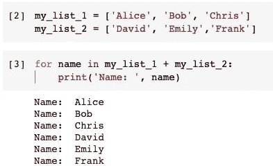

当然，这样做是没有问题的。它又快又简单。更重要的是，可读性很强。但是，如果我们在不同类型的容器中有这些名称，那该怎么办呢？Python 中典型的可重复项可能包括

*   **列表**

`my_list = [‘Alice’, ‘Bob’]`

*   **元组**

`my_tuple = (‘Chris’, ‘David’)`

*   **字典**

`my_dictionary = {‘name’: ‘Emily’}`

*   **设定**

`my_set = {‘Frank’, ‘Grace’}`

*   **发电机**

`my_generator = (name for name in [‘Helen’, ‘Isaac’])`

是不是应该把所有的“非列表”对象都转换成列表，然后再组合起来？答案当然是没有，没有必要。我们可以简单地使用 itertools 模块中的`chain()`函数。

```
my_chain = chain(
    my_list, 
    my_tuple, 
    my_dictionary.values(), 
    my_set, 
    my_generator
)for name in my_chain:
    print('Name: ', name)
```

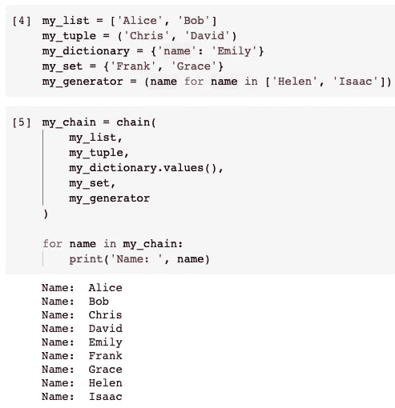

# 2.星图——对每个元素应用函数


图片来自 [Pixabay](https://pixabay.com/?utm_source=link-attribution&utm_medium=referral&utm_campaign=image&utm_content=828656) 的[免费照片](https://pixabay.com/photos/?utm_source=link-attribution&utm_medium=referral&utm_campaign=image&utm_content=828656)

你有没有想过将一个函数应用到一个容器中的所有对象，并在一个容器中得到结果？`starmap()`函数可以帮助我们实现这一点。

为了简化演示，让我们使用一个现有的函数`pow`，它只是计算一个数的幂。我们将函数名作为第一个参数，将 iterable 作为第二个参数。

```
result = starmap(pow, [(2,2), (3,2), (4,2), (5,2)])
```

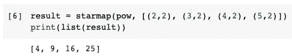

如果我们想使用定制功能呢？只需定义它并将函数名作为第一个参数传递。如果函数足够简单，您还可以定义一个匿名函数，如下所示。

```
result = starmap(
    lambda x, y: pow(x, y), 
    [(2,2), (3,2), (4,2), (5,2)]
)
```

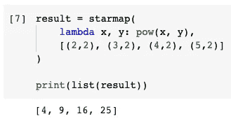

# 3.压缩—使用遮罩过滤可重复项


图片由 [Klittika Suwanjaruen](https://pixabay.com/users/yamsri-785809/?utm_source=link-attribution&utm_medium=referral&utm_campaign=image&utm_content=2422421) 从 [Pixabay](https://pixabay.com/?utm_source=link-attribution&utm_medium=referral&utm_campaign=image&utm_content=2422421) 拍摄

如果您曾经使用 Pandas 来转换一些数据帧，您一定知道我们可以传递一个具有真或假值的“系列”作为“掩码”来过滤另一个系列或数据帧。

事实上，我们可以使用`compress()`函数在任何 iterables 上复制这个特性。请参见下面的示例。

```
compress(
    ['Alice', 'Bob', 'Chris', 'David'], 
    [True, False, True, False]
)
```

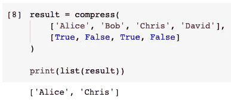

第一个列表包含 4 个名称，第二个列表包含 4 个布尔值。第二个列表将用于过滤第一个列表，以便只保留具有“真”值的位置。

我们可以一起使用多个 itertools 函数来实现一些更好的东西。假设我们有一些名字和句子。

```
names = ['Alice', 'Chris']
sentences = ['I am Chris', 'Alice and Chris', 'I am Alice']
```

现在，我们要找出句子包含名字的所有“名字，句子”对。

我们可以首先使用`product()`函数来生成所有的可能性。

```
product(names, sentences)
```

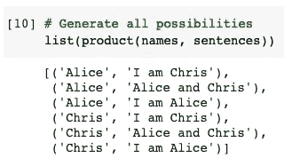

然后，我们可以为`compress()`函数生成“掩码”。我们想定义一个函数来测试每一对。所以，我们可以在这里使用`starmap()`函数。

```
matched_mask = starmap(
    lambda name, sentence: (name in sentence),
    product(names, sentences)
)
```

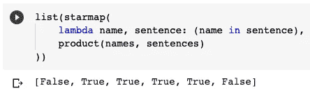

最后，我们可以使用`compress()`函数来过滤由`product()`函数生成的列表。

```
compress(product(names, sentences), matched_mask)
```

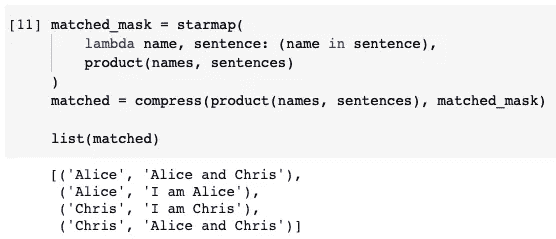

# 4.Dropwhile、Takewhile 和 Filterfalse —过滤具有特定行为的可重复项


图片来自 [Pixabay](https://pixabay.com/?utm_source=link-attribution&utm_medium=referral&utm_campaign=image&utm_content=471166)

基于某些条件进行筛选相对容易。但是，有时候条件并不是全部因素。例如，还需要考虑 iterable 中元素的位置和顺序。

假设我每天每 3 个小时检查一次自己的当前状态。

```
checkpoints = {
    '00:00': 'sleeping',
    '03:00': 'sleeping',
    '06:00': 'wake up',
    '09:00': 'working',
    '12:00': 'sleeping',
    '15:00': 'working',
    '18:00': 'eating',
    '21:00': 'entertaining',
    '23:00': 'sleeping'
}
```

现在，我想在这一天生成一个日历。包括我醒来之前的状态没有意义。所以，排除睡眠状态会更好。然而，我在午餐时间睡了一会儿，我不想排除它。

通常，要实现这一点需要多个条件。但是使用`dropwhile()`函数，我们可以简单地做以下事情。

```
my_calendar = dropwhile(
    lambda item: item[1] == 'sleeping',
    checkpoints.items()
)
```

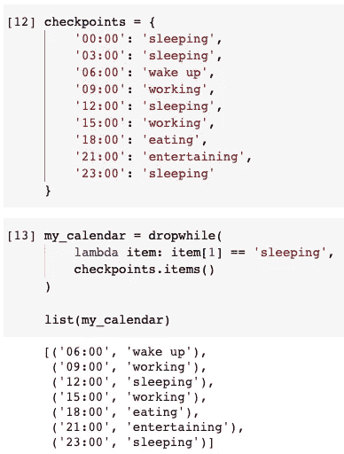

我们只需要一个条件，即测试状态是否为“睡眠”。如果是，就“放弃”它。函数`dropwhile()`的特点是，一旦它遇到第一个不满足条件的元素，它将停止在 iterable 中丢弃任何东西。换句话说，即使更多的元素满足条件，它们也不会被丢弃。

如果我们想放弃所有的“睡眠”状态呢？我们可以使用`filterfalse()`功能。

```
my_calendar = filterfalse(
    lambda item: item[1] == 'sleeping',
    checkpoints.items()
)
```

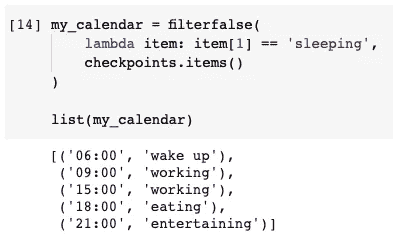

与`dropwhile()`函数相反，`takewhile()`函数将保留满足谓词的任何元素。然而，由于第一个元素不满足谓词，所有其余的都将被删除。

```
my_calendar = takewhile(
    lambda item: item[1] == 'sleeping',
    checkpoints.items()
)
```

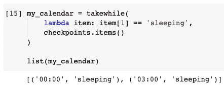

`takewhile()`功能可视为`dropwhile()`功能的反义词。

# 5.is lice——用步骤对可重复项切片


来自 [Pixabay](https://pixabay.com/?utm_source=link-attribution&utm_medium=referral&utm_campaign=image&utm_content=636562) 的[安全](https://pixabay.com/users/security-535773/?utm_source=link-attribution&utm_medium=referral&utm_campaign=image&utm_content=636562)图片

Python 列表可以很容易地切片。这是最 Pythonic 化的语法之一。假设我们有一个如下的列表。

```
my_list = ['a', 'b', 'c', 'd', 'e', 'f']
```

如果我们可以得到从第三个开始并在第五个停止的元素，我们可以做以下事情。

```
my_list[2:5]
```

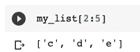

使用 Itertools 中的`islice()`函数，我们可以再实现一个特性，这就是步骤。

`islice()`函数有 4 个参数。第一个是 iterable，其余的是开始索引、停止索引和步骤。

如果我们想得到前两个元素:

```
islice(my_list, 2)  # equivalent to my_list[0:2]
```

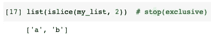

如果我们想得到 2 号到 5 号的商品:

```
islice(my_list, 2, 5)  # equivalent to my_list[2:5]
```

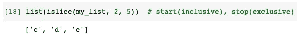

到目前为止，没有意外。但是，`islice()`功能也支持“步骤”。

```
islice(my_list, 0, None, 2)
```

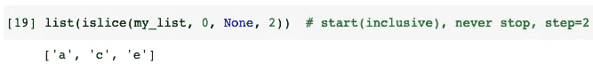

从头到尾每第二个项目得到**。**

# 摘要


Image by [二 盧](https://pixabay.com/users/uniquedesign52-816436/?utm_source=link-attribution&utm_medium=referral&utm_campaign=image&utm_content=656969) from [Pixabay](https://pixabay.com/?utm_source=link-attribution&utm_medium=referral&utm_campaign=image&utm_content=656969)

在本文中，我介绍了 Python 中 Itertools 模块的 5 个技巧。事实上，所有的 iterables 都非常方便，并且有它们有趣的行为。我们可能不需要一直使用 List。

itertools 帮助我们以许多奇特的方式操纵 Python 可迭代对象。本文不能包含 Itertools 模块的所有函数。

<https://medium.com/@qiuyujx/membership>  

**如果你觉得我的文章有帮助，请考虑加入灵媒会员来支持我和成千上万的其他作家！(点击上面的链接)**