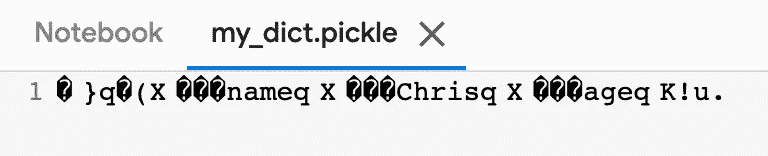
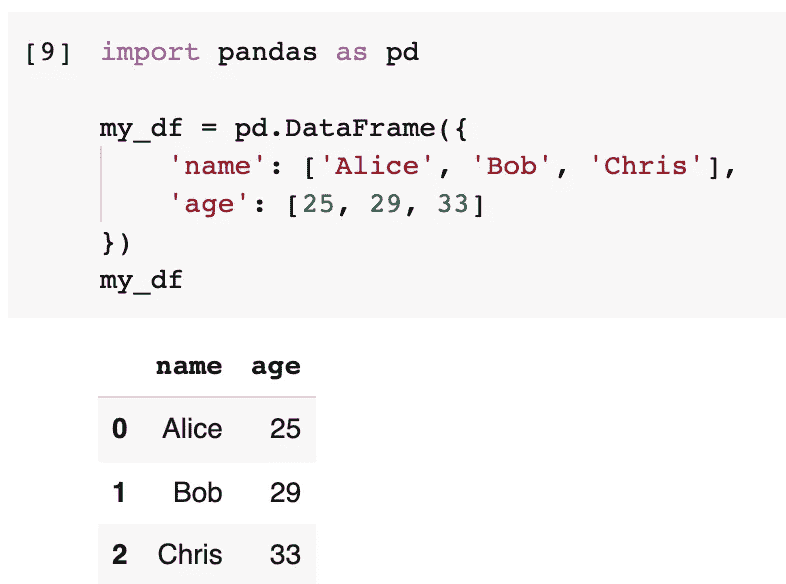

# 除非您知道所有这些要点，否则不要使用 Python Pickle

> 原文：<https://towardsdatascience.com/do-not-use-python-pickle-unless-you-know-all-these-facts-d9e8695b7d43?source=collection_archive---------0----------------------->


图片来自 [RitaE](https://pixabay.com/users/ritae-19628/?utm_source=link-attribution&utm_medium=referral&utm_campaign=image&utm_content=1561578) 来自 [Pixabay](https://pixabay.com/?utm_source=link-attribution&utm_medium=referral&utm_campaign=image&utm_content=1561578)

## 泡菜电子监管的利与弊，以及我们应该何时使用它

与大多数其他流行的编程语言相比，Python 可能拥有最灵活的对象序列化。在 Python 中，一切都是对象，所以我们可以说几乎一切都可以序列化。是的，我说的模块是泡菜。

然而，与 JSON 等其他“常规”序列化方法相比，Pickle 有更多方面需要我们在使用时小心谨慎。这就是标题所说的，除非你知道这些事实，否则不要用泡菜。

在这篇文章中，我将整理一些关于 Pickle 的重要笔记，希望能有所帮助。

# 1.基本用法


图片来自 [Pixabay](https://pixabay.com/?utm_source=link-attribution&utm_medium=referral&utm_campaign=image&utm_content=1520638) 的[照片混合](https://pixabay.com/users/photomix-company-1546875/?utm_source=link-attribution&utm_medium=referral&utm_campaign=image&utm_content=1520638)

通过使用 Python Pickle 模块，我们可以轻松地将几乎所有类型的对象序列化到一个文件中。在我们使用它之前，它需要被导入。

```
import pickle
```

让我们以字典为例。

```
my_dict = {
    'name': 'Chris',
    'age': 33
}
```


我们可以使用方法`pickle.dump()`将字典序列化并写入文件。

```
with open('my_dict.pickle', 'wb') as f:
    pickle.dump(my_dict, f)
```


然后，我们可以读取该文件并将其加载回一个变量。在那之后，我们就有了准确的字典。它们在内容上 100%相同。

```
with open('my_dict.pickle', 'rb') as f:
    my_dict_unpickled = pickle.load(f)my_dict == my_dict_unpickled
```


# 2.为什么是泡菜？有哪些利弊？


图片来自 [Pixabay](https://pixabay.com/?utm_source=link-attribution&utm_medium=referral&utm_campaign=image&utm_content=2834549) 的 [Christine Sponchia](https://pixabay.com/users/sponchia-443272/?utm_source=link-attribution&utm_medium=referral&utm_campaign=image&utm_content=2834549)

事实上，如果我们在上面的例子中使用 JSON 序列化 Python 字典，会有更多的好处。泡菜电子监管通常有三个主要缺点。

## 缺点 1:泡菜不安全

不像 JSON，它只是一段字符串，有可能构造恶意 pickle 数据，这些数据将在拆包期间执行任意代码。

因此，我们应该**永远不要**解开可能来自不可信来源的数据，或者可能已经被篡改的数据。

## 缺点 2:泡菜不可读

将 Python 字典序列化为 JSON 字符串最重要的一点是结果是人类可读的。然而，对于 Pickle 文件来说，这是不正确的。这是我们刚刚腌制的字典的腌制文件。如果我们试图打开它作为一个文本文件，这就是我们将得到的。



## 缺点-3: Pickle 在 Python 中是有限的

pickle 对象只能使用 Python 加载。其他语言也可以这样做，但需要第三方库的参与，可能仍不完全支持。

相比之下，JSON 字符串在编程领域非常常用，并且受到大多数编程语言的良好支持。

## 泡菜的优点

Pickle 通过调用任意函数来构造任意 Python 对象，这就是它不安全的原因。然而，这使得它能够序列化 JSON 和其他序列化方法不能序列化的几乎所有 Python 对象。

解包一个对象通常不需要“样板”。因此，它非常适合快速简便的电子监管。例如，您可以将所有变量转储到 pickle 文件中并终止您的程序。稍后，您可以启动另一个 Python 会话，从序列化文件中恢复所有内容。因此，这使我们能够以更灵活的方式运行程序的一部分。

另一个例子是多线程。当我们使用多进程模块在多线程中运行程序时，我们可以轻松地将任意 Python 对象发送到其他进程或计算节点。

在这些场景中，安全性问题通常不适用，人类也不必读取这些对象。我们只需要快速、简单和兼容性。在这种情况下，泡菜可以被完美地利用。

# 3.还有什么可以腌制的？


嗯，我一直在说几乎所有能被泡菜连载的东西。现在，让我给你看一些例子。

## 取消一项功能

第一个例子是一个函数。是的，我们可以在 Python 中序列化一个函数，因为函数在 Python 中也是一个对象。

```
def my_func(num):
    print(f'my function will add 1 to the number {num}')
    return num + 1
```


只需定义一个简单的函数用于演示。现在，让我们把它放到一个新的变量中。

```
with open('my_func.pickle', 'wb') as f:
    pickle.dump(my_func, f)with open('my_func.pickle', 'rb') as f:
    my_func_unpickled = pickle.load(f)my_func_unpickled(10)
```

新变量可以用作函数，函数将与原始变量相同。


## 泡菜熊猫数据框

另一个例子是熊猫数据框。让我们定义一个熊猫数据框。

```
import pandas as pdmy_df = pd.DataFrame({
    'name': ['Alice', 'Bob', 'Chris'],
    'age': [25, 29, 33]
})
```



现在，我们可以把它放到一个新的变量中。新的数据帧将是相同的。

```
with open('my_df.pickle', 'wb') as f:
    pickle.dump(my_df, f)with open('my_df.pickle', 'rb') as f:
    my_df_unpickled = pickle.load(f)
```


请注意，Pandas 有内置的方法可以处理和取消处理数据帧。他们会做和上面一样的工作，但是代码会更干净。性能也是一样的。

那么，可能会有一个问题，**为什么我们应该使用 Pickle 作为数据帧而不是 CSV？**

**第一个回答是速度**。CSV 是人类可读的，但它几乎是存储熊猫数据帧最慢的方式。

[这篇 SO 帖子](https://stackoverflow.com/a/37012035/3519273)对熊猫数据帧不同序列化方式的性能进行了基准测试。


酸洗 Pandas 数据帧的第二个好处是数据类型。当我们将数据框写入 CSV 文件时，所有内容都必须转换为文本。有时候，这样会给我们装回去带来一些不便或者麻烦。例如，如果我们将 datetime 列写入 CSV，我们可能需要在加载它时指定格式字符串。

然而，这个问题对于 pickle 对象来说并不存在。你腌制的东西，你保证装回去的时候会有完全一样的东西。不需要做其他任何事情。

# 4.Pickle 协议版本


图片由[阿内尔卡](https://pixabay.com/users/anelka-217857/?utm_source=link-attribution&utm_medium=referral&utm_campaign=image&utm_content=346997)从[皮克斯巴伊](https://pixabay.com/?utm_source=link-attribution&utm_medium=referral&utm_campaign=image&utm_content=346997)

像我在前面的例子中所做的那样使用 Pickle 是很常见的。他们没有错，但是如果能指定 Pickle 的协议版本(通常是最高的)就太好了。简单来说，泡菜系列有不同的版本。随着 Python 版本的迭代，Pickle 模块也在进化。

如果您对现有版本和改进之处感兴趣，这里有一个来自官方文档的列表。

> ***协议版本 0*** 是原始的“人类可读”协议，向后兼容早期版本的 Python。
> 
> ***协议版本 1*** 是一种旧的二进制格式，也兼容早期版本的 Python。
> 
> ***协议版本 2*** 在 Python 2.3 中推出。它提供了一个更有效的新型类的酸洗。
> 
> ***协议版本 3*** 在 Python 3.0 中新增。它对字节对象有明确的支持，并且不能被 Python 2.x 取消拾取。这是 Python 3.0–3.7 中的默认协议。
> 
> ***协议版本 4*** 在 Python 3.4 中新增。它增加了对非常大的对象的支持，支持更多种类的对象，以及一些数据格式优化。从 Python 3.8 开始，这是默认协议。
> 
> ***协议版本 5*** 新增于 Python 3.8。它增加了对带外数据的支持和对带内数据的加速。

一般来说，在以下方面，高版本总是比低版本好

*   腌制物品的大小
*   拆线的性能

如果我们使用不同版本的 Pandas 数据帧，我们可以看到大小的差异。

```
with open('my_df_p4.pickle', 'wb') as f:
    pickle.dump(my_df, f, protocol=4)with open('my_df_p3.pickle', 'wb') as f:
    pickle.dump(my_df, f, protocol=3)with open('my_df_p2.pickle', 'wb') as f:
    pickle.dump(my_df, f, protocol=2)with open('my_df_p1.pickle', 'wb') as f:
    pickle.dump(my_df, f, protocol=1) import osprint('P4:', os.path.getsize('my_df_p4.pickle'))print('P3:', os.path.getsize('my_df_p3.pickle'))print('P2:', os.path.getsize('my_df_p2.pickle'))print('P1:', os.path.getsize('my_df_p1.pickle'))
```


为什么 Python 仍然保留旧版本而新版本总是更好？这是因为协议并不总是向后兼容的。这意味着，如果我们想要更好的兼容性，我们必须选择更低的版本。

然而，如果我们使用 pickle 对象而不需要向后兼容，我们可以使用枚举来保证我们的程序使用最新的(最好的)。例子如下。

```
pickle.dump(my_df, f, protocol=pickle.**HIGHEST_PROTOCOL**)
```

# 5.Pickle 自定义类


图片来自 [Pixabay](https://pixabay.com/?utm_source=link-attribution&utm_medium=referral&utm_campaign=image&utm_content=1238247)

尽管 pickle 支持 Python 中几乎所有的对象，但是当我们 Pickle 一个从自定义类实例化的对象时，我们仍然需要小心。简而言之，当我们加载回 pickled 对象时，该类需要已经存在。

例如，让我们定义一个简单的类“Person ”,它有两个属性和一个方法。

```
class Person:
    def __init__(self, name, age):
        self.name = name
        self.age = agedef self_introduce(self):
        print(f'My name is {self.name} and my age is {self.age}')p = Person('Chris', 33)
p.self_introduce()
```


现在，让我们用 Pickle 序列化对象“p”。

```
with open('person.pickle', 'wb') as f:
    pickle.dump(p, f)
```


如果该类不存在，就会出现问题。如果我们试图在一个新的会话中加载 pickled 对象，并且没有定义该类，就会发生这种情况。我们可以通过删除类定义来模拟这个场景。

```
del Person
```

然后，如果我们试图加载回腌对象，将有一个异常。

```
with open('person.pickle', 'rb') as f:
    p_unpickled = pickle.load(f)
```


因此，当我们加载回对象时，我们需要确保该类是存在的。然而，如果类的定义略有不同，可能不会导致问题，但是对象的行为可能会根据新的类定义而改变。

```
class Person:
    def __init__(self, name, age):
        self.name = name
        self.age = agedef self_introduce(self):
        print(f'(Modified) My name is {self.name} and my age is {self.age}')
```

在新的类定义中，我修改了自我介绍方法的打印消息。


然后，如果我们把腌好的对象加载回去，不会有任何错误，但是自我介绍的方法会和原来不一样。

```
with open('person.pickle', 'rb') as f:
    p_unpickled = pickle.load(f)p_unpickled.self_introduce()
```


# 6.不是所有的物品都可以腌制


图片来自 [Pixabay](https://pixabay.com/?utm_source=link-attribution&utm_medium=referral&utm_campaign=image&utm_content=700131) 的[jenő·萨博](https://pixabay.com/users/szjeno09190-702158/?utm_source=link-attribution&utm_medium=referral&utm_campaign=image&utm_content=700131)

在这最后一节，我必须回到我最初的陈述“几乎所有的 Python 对象都可以被酸洗”。我使用“几乎所有”是因为还有一些类型的对象不能被 Pickle 序列化。

不能被酸洗的典型类型是活动连接对象，如网络或数据库连接。这是有道理的，因为 Pickle 关闭后将无法建立连接。这些对象只能使用正确的凭据和其他资源重新创建。

另一种需要提到的类型是模块。一个重要的模块也不能被酸洗。请参见下面的示例。

```
import datetimewith open('datetime.pickle', 'wb') as f:
    pickle.dump(datetime, f)
```


了解这一点很重要，因为这意味着我们不能在`global()`中处理所有的东西，因为导入的模块会在那里。

# 摘要


Image by [旭刚 史](https://pixabay.com/users/shixugang-640931/?utm_source=link-attribution&utm_medium=referral&utm_campaign=image&utm_content=563796) from [Pixabay](https://pixabay.com/?utm_source=link-attribution&utm_medium=referral&utm_campaign=image&utm_content=563796)

在本文中，我介绍了 Python 中的内置序列化方法——Pickle。它可用于快速简便的电子监管。它支持几乎所有类型的 Python 对象，例如函数，甚至熊猫数据框。当对不同版本的 Python 使用 Pickle 时，我们还需要记住，Pickle 的版本也可能不同。

<https://medium.com/@qiuyujx/membership>  

如果你觉得我的文章有帮助，请考虑加入 Medium 会员来支持我和其他成千上万的作者！(点击上面的链接)